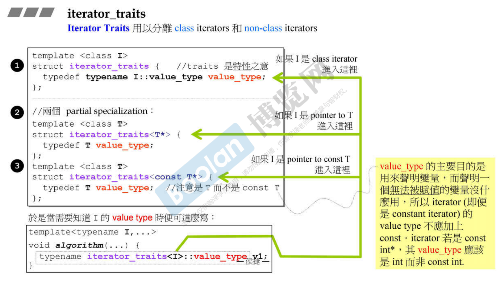
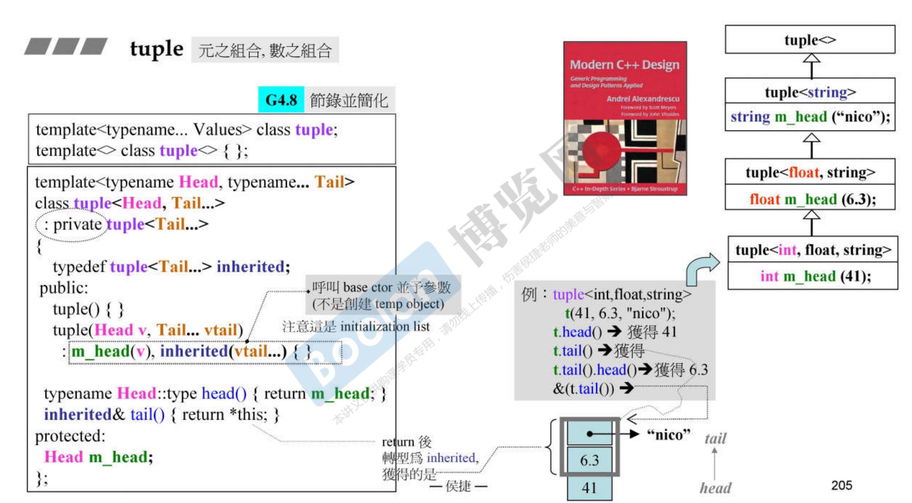

# 语言特性
## c++的运程序内存模型

内存分别分为：代码区，全局区，栈区，堆区。

* 代码区：存放可执行二进制码，具有共享特性和只读特性，共享方便了程序被调度执行。
* 全局区：存放全局变量，静态变量`static`，字符串常量如`cout << "hello" << endl;`，全局常量（注意只有全局的常量才会在这，局部常量在栈区）
* 栈区：内存在程序结束就释放地址，因此下面程序会出现问题
  ```c++
  int* func() {
    int a = 10;
    return &a;  
  }

  int main() {
    int* res = func();  //这之后就释放了内存，因此res指向的地址无法将正确数值传回
    cout << *res << endl;
    return 0; 
  }
  ```
* 堆区：注意堆区返回为指针，由程序员自己创建和释放。
  ```c++
  int* func() {
    int* a = new int(10);
    return a;  //返回了堆区的地址，但是堆区不会被自动优化掉，因此main中访问该地址中的值是正确的
  }
  ```
  关于堆区的释放：
  ```c++
  int main() {
    int* p = func();
    cout << *p << endl;
    delete p;
    return 0;
  }
  ```
  创建堆区数组：
  ```c++
  int* func() {
    int *a = new int[10];
    return a;
  }
  ```
  关于堆区数组的释放：
  ```c++
  int main() {
    int* p = func();
    cout << *p << endl;
    delete[] p;
    return 0;
  }
  ```

## 封装
### 基本
将属性和行为封装，并且设置访问权限，是封装的意义。一个class具有构造和析构函数，方便对象的创建和删除。其中浅拷贝深拷贝知识比较难理解。

### 静态成员
分为静态变量和静态函数。静态变量被保存在全局区，在**代码执行四步：预编译、编译、汇编、链接中处于编译阶段就分配内存。**所以在class中定义静态变量有**所有对象都共享一份数据**的属性。静态函数只能访问静态变量。

### this指针
**成员函数和成员变量是分开存储的。只有非静态成员变量才和类对象一起存储。**可以使用`Solution s; sizeof(s);`来验证。在对象或者还没创建对象的类中如果没有任何非静态变量时，对象只占有一个字节，占个坑而已。

那么多个同类型的对象会使用同一块代码，那么在调用这块代码时，怎么知道是哪个对象调用了代码呢？使用this指针，它指向了调用该成员函数的对象。在创建对象时，this就自动存在了。若传入形参与成员函数内参数同名，可以使用this区分。

  ```c++
  int val;
  void func(int val) {
    this->val = val;
  }
  ```

### 常函数常对象
指针（是）常量：指针指向的地址是不能变的。`Person * const this`

常量（的）指针：指针所指地址存的数值是不能变的。`const Person * this`

那么常函数的表达方式为：`void func() const {}` 表示函数内的值是不能修改的。

常对象：`const Solution s;`常对象只能调用常函数。


## 继承
### 友元
友元可以访问到该类中的private
```c++
class room{
  //全局函数作为友元
  friend void func();

  //类作为友元
  friend class gay();

  //类成员作为友元
  friend void gay::looklook();
};
```

### 继承
继承语法：
```c++
class A : pubilc class B{  //公有方式继承
  ...
}
```
关于继承的方式：


继承中调用构造函数的顺序为：先调用父类，再调用子类。

子类父类中具有同名变量或同名函数的情况：
```c++
//父类
class Base{
public:
  int m_a = 10;

  void func(){
    cout << "base fun" << endl;
  }

  void func(int a){
    cout << "base int fun" << endl;
  }
};

//子类
class Son : pubilc class Base{  
public:
  int m_a = 20;

  void func(){
    cout << "son fun" << endl;
  }
};

void test(){
  Son s;
  int a = s.m_a;  //10
  int a = s.Base::m_a;  //20，这里的意思是加入作用域

  s.func();  //会隐藏所有的父类同名函数，输出为子函数
  s.Base::func();  //这样调用父类的函数
  s.Base::func(a);
  int a = Son::m_a;  //通过类名调用子类参数
  int a = Son::Base::m_a;  //想要调用父类同名参数
}
```

```c++
class A : pubilc class B, pubilc class C{  //多继承
  
}

void test(){
  //调用继承的同名变量和函数时应当加作用域
  A a;
  a.B::val = 10;
  a.C::val = 20;
}
```

## 多态
### 基础
* 静态多态：函数重载，运算符重载，复用函数名叫静态多态。
* 动态多态：派生类和虚函数实现运行时多态。

静态多态地址在编译阶段确定，动态多态地址在运行阶段确定。

```c++
class Animal {  
public:
  void speak(){   //它被早绑定了
    cout << "动物在说话" << endl;
  }

  //如果想要执行猫函数的地址，那么就要在运行时再绑定函数
  virtual void speak(){   //注释上面那个再运行，就成猫说话了
    cout << "动物在说话" << endl;
  }
};

class Cat : public Animal {  
public:
  void speak(){
    cout << "猫在说话喵喵喵" << endl;
  }
};

void doSpeak(Animal& animal){
  animal.speak();  //因为函数地址早绑定，因此传入不管是猫狗，都调用animal
}

void test(){
  Cat cat;    //创建和传入的是子类对象
  doSpeak(cat);  //执行输出是"动物在说话"
}
```

动态多态的场景是：有继承，且子类重写父类函数（重写中函数返回类型，函数名，参数列表全部相同）。父类指针或引用，执行子类对象成员。

若加入了virtual后，sizeof(Animal)变成了4字节（32位系统），说明此时类中保存了一个指针。


该图是虚函数的原理，是由于虚函数表中的内容在调用doSpeak(cat)时发生了重写，那么指针指向的表的内容就替换成了猫的，最后调用的也是猫的。

```c++
#include<iostream>
#include<vector>
using namespace std;

//class Calculator {
//public:
//	int m_num1;
//	int m_num2;
//	int getResult(string oper) {
//		if (oper == "+") return m_num1 + m_num2;
//		if (oper == "-") return m_num1 - m_num2;
//		if (oper == "*") return m_num1 * m_num2;
//		
//		//可此时想要扩展程序...
//};
//
//void test01() {
//	Calculator c;
//	c.m_num1 = 10;
//	c.m_num2 = 20;
//	string oper = "+";
//	cout << c.m_num1 << oper << c.m_num2 << "=" << c.getResult(oper) << endl;
//}

class AbstractCalculator {
public:
	//AbstractCalculator(int a, int b) : m_Num1(a), m_Num2(b) {};
	virtual int getResult() {
		return 0;
	}
	int m_Num1;
	int m_Num2;
};

class AddCalculator : public AbstractCalculator {
public:
	int getResult() {
		return m_Num1 + m_Num2;
	}
};

class SubCalculator : public AbstractCalculator {
public:
	int getResult() {
		return m_Num1 - m_Num2;
	}
};

class MutiCalculator : public AbstractCalculator {
public:
	int getResult() {
		return m_Num1 * m_Num2;
	}
};


void test01() {
	AbstractCalculator* val = new AddCalculator; //一定记得创建一个父类的指针，指向子类对象
	val->m_Num1 = 10;
	val->m_Num2 = 20;
	cout << val->m_Num1 << "+" << val->m_Num2 << "=" << val->getResult() << endl;
	delete val;   //记得移除堆区

	val = new SubCalculator; //一定记得创建一个父类的指针，指向子类对象，定义一次后不用再定义一次类型，即使delete了也只是移除了堆区没有修改栈区
	val->m_Num1 = 10;
	val->m_Num2 = 20;
	cout << val->m_Num1 << "-" << val->m_Num2 << "=" << val->getResult() << endl;
	delete val;
}

int main() {
	test01();
	return 0;
}
```

上面的父类中的方法等于没有作用，全部依靠子类重写，叫纯虚函数。当父类中有虚函数时，父类也叫抽象类，抽象类是无法实例化对象的。纯虚函数语法：`virtual void func() = 0;`

```c++
#include<iostream>
#include<vector>
using namespace std;

class AbstractDrinking {
public:
	virtual void Boil() = 0;
	virtual void Berw() = 0;
	virtual void Pourincup() = 0;
	virtual void Putotherthing() = 0;

	void makeDrink() {
		Boil();
		Berw();
		Pourincup();
		Putotherthing();
	}
};

class Coffee : public AbstractDrinking {
public:
	void Boil() {
		cout << "开水" << endl;
	}

	void Berw() {
		cout << "倒咖啡" << endl;
	}

	void Pourincup() {
		cout << "装杯" << endl;
	}

	void Putotherthing() {
		cout << "加奶" << endl;
	}
};

void doWork(AbstractDrinking* abs) {
	abs->makeDrink();
	delete abs;
}

int main() {
	doWork(new Coffee);
	return 0;
}
```

析构函数的知识点：
```c++
#include<iostream>
#include<vector>
using namespace std;

class Animal {
public:
    Animal() {
        cout << "动物构造函数" << endl;
    }

    virtual ~Animal() {   //父类析构函数使用virtual，可以实现子类的析构函数调用，你看看不加试试
        cout << "动物析构函数" << endl;
    }

    virtual void speak() {   
        cout << "动物在说话" << endl;
    }
};

class Cat : public Animal {
public:
    Cat(string name) {
        cout << "猫构造函数" << endl;
        m_Name = new string(name);  //在子类中开辟堆区
    }

    ~Cat() {
        cout << "猫析构函数" << endl;
        if (m_Name != NULL) {    //使用子类析构函数释放内存
            delete m_Name;
        }
    }

    void speak() {
        cout<< *m_Name << "猫在说话喵喵喵" << endl;
    }

    string* m_Name;
};

int main() {
    Animal* cat = new Cat("Tom");
    cat->speak();
    delete cat;     //这里delete的是父类指针，不会调用子类的析构函数，子类有创建堆区，即便在子类中写了析构函数delete堆区也没有用，导致内存泄漏，怎么办看上面
    return 0;
}
```

可以看到我多态也好，抽象类也好，其目的就是：搭建一个父类的样板，然后不同属性的子类分别继承并重写这些特定的成员，以达到实现不同功能的一类物品。最后采用封装使用的思想，通过其成员函数提供的功能一个个的使用这些物品。

## 运算符重载
```c++
template<typename T>
class Person {
public:
    Person(string name, T age) : m_name(name), m_age(age) {}

    bool operator < (const Person& person) const {  //在第一次编写时这里传入参数没有使用const，导致在Min调用时传入参数为const而无法由这个运算符重载接收。
        return this->m_age < person.m_age;
    }

    string getName() const {
        return m_name;
    }

    T getAge() const {
        return m_age;
    }
private:
    string m_name;
    T m_age;
};

template<class class_type>
inline
const class_type& Min(const class_type& A, const class_type& B) {
    return A < B ? A : B;
}

int main() {
    Person<int> p1("xx", 24);
    Person<int> p2("ty", 23);
    cout << (p1 < p2) << endl;
    cout << Min(p1, p2).getName() << endl;
    return 0;
}
```

new和delete的重载：


这个重载的目的是cout出来我创建的大小，可以用于观察。

## 实战问题散记
### 为什么传递引用
引用可以改变传递的参数，实现指针的功能。同时，如果我写了一个函数，当陌生人调用时，调用的写法传递值和传递引用时是一模一样的，方便书写：`min(a, b)`我不需要知道传递进去的是通过引用传递还是值传递，都可以这么书写，至于采用哪种传递就是看设计者的事情了。

### const用法
代码double real () const {return val;}中，const位于函数签名的末尾，表示该方法是一个常量成员函数，这意味着这个成员函数不能修改它所属的对象。因此，这个函数可以被一个const对象调用，而且在函数体内不能修改任何非静态成员变量。这对于保证数据的安全性和一致性非常有用。


像下面这样调用对象的成员函数，如果设计时没有写`void print() const {..}`中的const的话，就会出现报错，报错原因是常量调用了非常函数，函数说我可变你这个对象，对象说我不可变。这说明我设计函数时不够好。

### Singleton设计模式
将构造函数放入private中：
```c++
class A {
public:
  static A& getInstance();
  setup(){...}

private:
  A();
  A(const A& rhs);
  ...

  A& A::getInstance() {
    static A a;
    return a;
  }
};
```

首先getInstance函数的返回类型是通过reference来接收的，通常提倡使用引用传递参数或接收返回参数。

### 运算符重载的本质
```c++
//一般理解的写法
class Complex{
public:
  Complex Addfunc(const Complex& p){
    Complex res;
    res.real = this->real + p.real;
    res.imaginary = this->imaginary + p.imaginary;
    return res;
  }

private:
  int real;
  int imaginary;
};

void test(){
  ...
  Complex p3 = p1.Addfunc(p2);
}


//调用库给出的operator的写法
class complex
{
public:
  complex (double r = 0, double i = 0): re (r), im (i) { }
  complex& operator += (const complex&);
  private:
  double re, im;

  friend complex& __doapl (complex *, const complex&);  //只有friend后，才能直接访问complex中的参数
};

inline complex   //这里的返回参数不是引用而是对象，是因为返回对象在函数内创建，调用完函数后函数结束回收变量，那么如果调用引用指向函数内分配的那个地址就是个bad值
operator + (const complex& x, const complex& y)
{
  return complex (real (x) + real (y), imag (x) + imag (y));
}

void test(){
  complex p3 = p1 + p2; 
}


//更明显的例子
inline complex&  //返回引用是因为对象在函数外被创建的，因此使用引用传递快，且可以直接改变对象值
__doapl (complex* ths, const complex& r)  //注意这里加入const的原因应当提前考虑，不希望改变被加数，那么就养成良好的习惯
{
  ths->re += r.re;
  ths->im += r.im;
  return *ths;
}
 
inline complex&
complex::operator += (const complex& r)
{
  return __doapl (this, r);
  //this->re += r.re;
  //this->im += r.im;
  //return *this;
}

void test(){
  complex p2 += p1; //p2调用+=成员，p2在operator += 中是this
}
```

可以重载的格式：


### 链式编程
同样举例为上面的例子：
```c++
inline complex&  
__doapl (complex* ths, const complex& r)  被加数，那么就养成良好的习惯
{
  ths->re += r.re;  //因为传入指针，所以操作是在原地址上操作的。
  ths->im += r.im;
  return *ths;
}
 
inline complex&  //这里返回类型为void可以不？可以！因为this中的参数在上面的函数中已经被改变了，那为什么要返回complex&类型呢？
complex::operator += (const complex& r)
{
  return __doapl (this, r);
}

void test(){
  complex p2 += p1; 
  //考虑下面一行代码
  complex p3 += p2 += p1;  //如果p2+=p1返回的是void，那么p3就无法继续进行了，返回complex&，那么p2+=p1又可以看成一个complex类型的值，继续参与p3的计算
}
```

### new malloc和实际物理分配地址
new时会在堆区分配所需大小的内存空间，在这片空间的前后还要分别加入四个字节的名为cookie的空间，用于标志这片内存空间的大小，以便在free的时候可以分辨出删除的大小。

同时在分配地址不足16字节倍数大小时，会添加pad以达到16字节的倍数，因为地址指针指定的地址的物理间隔是那么多。


### 静态变量和静态函数的讨论
在一般非静态成员函数中系统会自动分配this指针，每次一个新的对象调用该函数时，创建的this指针指向都是不一样的，都是创建了新的地址和空间（浅拷贝除外）。

但static变量是存在全局区的，所有调用都指向同一个地址，一个对象对它做的改变，在其他对象中也会受到影响。

静态函数没有this指针，调用它的对象是指不到自己的，所以静态函数只能用于处理静态变量。

回到singleton的例子：

```c++
class A {
public:
  static A& getInstance();  //该函数由于static，只能用于处理全局区的static
  setup(){...}

private:
  A();   //构造函数在private中，无法被外界用于创建对象，只能自己创建
  A(const A& rhs);
  ...

  A& A::getInstance() {   //通过类名调用成员函数
    static A a;    //创建全局区唯一一个对象，使用static，由类自己创建
    return a;
  }
};

void test(){
  A::getInstance().setup();  //在使用时，通过类名创建那个唯一的对象，并使用其中的功能
}
```
### 类模板，函数模板和成员模板
类模板：对于一个类，其里面的参数类型可以后面指定，调用时就是类名加<...>

```c++
template<typename T>  //T在下面的类中就是一个类型名的标志，不指定是int，double或float
class complex
{
public:
  complex (T r = 0, T i = 0) : re (r), im (i) { }
  complex& operator += (const complex&);
  T real () const { return re; }
  T imag () const { return im; }

private:
  T re, im;
  friend complex& __doapl (complex*, const complex&); 
};

//调用
complex<double> c1(2.5,1.5);  //这时再指定变量类型
complex<int> c2(2,6);
```

函数模板：函数只是一个半成品，只定义功能，而不需要管进来和返回的是什么类，之后再指定。使用时函数只用传递进相应的类型就可以实现功能输出。


成员模板：在类中的成员函数接收不同于类模板类型的模板，其在标准库中的构造函数中比较常见，主要是增加弹性，如下面代码可以实现子对象拷贝构造一个父对象。


模板的组合起名：
```c++
template<typename T, class xxx = deque<T>>
class queue {
  ...
  xxx c; //即为deque<T>类型的c
}
```

### 委托和复合
* 委托：我类中有一个指针指向另一个类，但是这个类什么时候创建，里面有什么和我关系不大。
* 复合：在我这个类里创建了一个另一个类的对象，并调用这个对象中的功能来实现我的一些功能。
* 委托是虚的，提供了一个指针接口，只有当另一个类实例化了对象，来调用我的函数实现我内部的操作（两个类的对象创建没有直接的依赖关系，可以不同时出现）。复合是实的，先创建被复合的对象，再创建我的对象（一个嵌套关系，queue和deque的关系）；

### 一份数据多份访问的代码（委托）


### win下的文件系统


### 转换函数
```c++
class Fraction{
public:
  Fraction(int a, int b) : m_a(a), m_b(b) {}
  operator double() const {
    return (double) (a/b);
  }
private:
  int m_a;
  int m_b;
}

Fraction f(3, 5);
double d = 4 + f; //其含义为：编译器寻找上面的f的定义，发现返回double类型，4也可以是double，因此将double类型的f和double的4相加。
```

关于该知识点可以看侯捷pdf这里：


### 迭代器和仿函数


```c++
//考虑上图中的使用方法：
list<Foo>::iterator tie;  
*tie;  //需要返回节点的data
tie->method();  //需要返回节点的指针
```

仿函数就是重载（）符号，在使用时看起来像对象是一个函数的样子：class A（），所以叫仿函数。仿函数与构造函数不同，前面是需要加入返回参数类型的。

仿函数的优点在于：可以使用模板使得函数非常灵活，能被不同的类调用。如果是使用class构造函数来定义，那结果返回还要多出定义一个方法来返回值，而仿函数可以直接名称加括号使用，仿函数速度快，效率高。


### 模板特化
```c++
template<class T>
class Person{  //没有特化
  ...
};


class Person<T*>{  //这里指明了传入参数要是一个指针，偏特化
  ...
};

template<>
class Person<string>{    //特化
  ...
}


//使用时
Person<string> person;
Person<string*> person;  //类模板和函数模板的区别：类模板使用时要自己声明类型，而函数模板一般是编译器自动推理
```


### 继承中调用虚函数
在继承中，如果是普通函数，那么子类和父类指向的函数的地址是一样的，但是如果父类定义的是虚函数，虚函数只是一个指针指向函数表。


## STL标准模板库编程
### 基础


### 分配器
为容器分配内存。关于new和malloc以及delete和free：
```c++
void* operator new (size_t size, ..) {  //第一个参数必定是size_t类型
  void* p;
  p = malloc(size);  //new就是在调用malloc
  return p;
}
```
在前例中可以得知，malloc其实在物理上不止分配size，还有分配头尾等其他的存储空间。

allocator直接使用了new和delete，但是我们不必要去使用它，因为容器使用它的方法已经在标准库写好了。

### OOC和GP的区别
一般我们设计一个class，其成员函数和数据都在这个class中定义，这种一起设计的概念就是OOC，但是GP设计将其分开，并使用iterator连接起来，可以实现容器和算法分开开发而不用一块开发。


该图中的sort作为全局函数，可以被这些容器调用，这个函数只用写一次就能被vector和deque调用，但是注意：**list不能使用该全局函数，还是要在list class中自己写sort，因为list不支持随机访问，在全局sort中有随机访问特性的逻辑**


### 容器之间的复合关系


重要的是那几个常用的容器。


## 容器
### 迭代器设计标准
为了算法能够知道迭代器的一些性质（迭代器类型：双向链表or随机访问，迭代器指向的值类型，迭代器的间距最大范围等等5个特性），这名称不可以乱取，也是迭代器中进来就使用typedef取名的原因。


但在中间容易出现一个问题，万一我调用该算法时传入的参数不是一个迭代器，仅仅只是一个指针，那么指针又没有定义这5个特性，所以出现了trait，用于转化一下指针，使其符合算法时设计的标准。


其实现方法如下：



### list
在list中关注迭代器的实现：（也包含了list的基本构成）
```c++
class list{
public:
  typedef __list_iterator<T, T&, T*> iterator; //那么去找这个__list_iterator定义
};
```


相当于在这迭代器里创建了一个节点的指针，并对这个指针进行相应的操作，对外展现时通过重载*，++等使得iterator看起来可以像一个指针一样使用。


* 注意*重载在其他的符号重载函数中调用*this时为什么没有唤起*重载。
* operator++()代表前++，即++i。operator++(int)中int不必传入参数，只是用于区分前++和后++，这里代表的是后++。


### vector
* 容器的iterator的类型就是单纯的指针，经过了trait处理。++--全部都是原本指针所带的操作。
* vector类中定义了三个基本指针，指向开头begin，数据的结尾finish（end），以及分配的存储空间的结尾end_of_storage。size = finish-begin，capacity = end_of_storage-begin。由此可以看出差别。
* 当容量不够时（finish==end_of_storage），将进行二倍扩容并拷贝原所有数据到新内存中，耗时。

### deque


一个deque iterator中包含了四个变量

```c++
T* cur;
T* first;
T* last;
T** node;
```

四个变量的原理如图所示，如果push_front，那么首先对比cur有没有到(*node)，如果到了就添加node，没有就直接添加在cur的地址前面。

对于deque iterator的指针移动，我们使用了运算符重载使得它看起来像是连续的。就比如重载++

```c++
self& operator ++ () {
  ++cur;
  if(cur == last){
    set_node(node + 1);
    cur = first;
  }
  return *this;
}

self& operator ++ (int) { //后++
  self tmp = *this;
  ++tmp;    //使用已有的++重载
  return tmp;
}

void set_node(T** newnode){
  node = newonde;
  first = *node;
  last = first + difference_type(buffer_size); //加上一个内存小段的距离
}
```

queue和stack完全使用了deque提供的成员函数，在有queue和stack以前都会创建一个deque对象，但是不同的地方在于这两个容器不能有iterator，以及没有完全使用deque的成员函数。

### 红黑树
红黑树是一个“平衡”二元“搜索”树，平衡保证不会有太长的枝，搜索保证查找速率。


在RB tree中有个输入的类型，其中value为节点里存储的class，key包含在value内，所以要制指定keyofvalue，compare为比较方式，由外部指定，内部只做算法的事情。一个value中包含的一般是一个key和一个data。

### set, multiset, map, multimap
set中的value就是key，没有data。

都是直接使用了红黑树提供的方法，set和map只是对其进行一些调用和用法方面的设计。其中map的重载[]比较有意思，会有先判断传入的key是否存在，不存在的话会有一个insert的过程。

### 哈希表
哈希表的原理：

我们希望通过标签直接寻找到一个东西，那么我们可以考虑设置一系列的篮子（内存），按照某种规律排列。打比方，如果一个标签为三个英文字符，那么我设计一个26\*26\*26大小的内存，aaa放在第一个，aab放第二个，以此类推，以一定规律或映射算法来实现存储。

但是这有所不好，因为我的内存分配大小等于所有的组合的数量，太消耗了，如果我只存一两个元素，那太浪费了。

所以设置了一个较小的空间，那么存储方式如下：


那万一两个元素被分配到同一个位置怎么办，比如M=100，105和5都会被分配到同一个位置，这叫**哈希碰撞**，碰到哈希碰撞就长链条呗。


当链条过长时，就需要两倍（选择一个将近两倍大小的质数个数的篮子）扩容bucket，然后全部重新计算，这个阶段比较耗时。目前哈希表的STL使用是通过unordered_set和map来使用。


## 迭代器
### 第一参数：iterator_category
创建一个临时对象的方法：
```c++
vector<int>::iterator() //在方法后面加个小括号
```
之前这个参数在介绍是：表示这个迭代器的类型。类型如下：


在定义容器时会创建iterator，这时会指定这个迭代器的类型，方便函数在使用容器时（算法只能看到输入的迭代器，而看不到容器），可以询问到迭代器的类型，不同类型的迭代器，在算法中的使用方法是不同的，如下，有一个计算两个迭代器距离的算法，算法传入两个迭代器后，查询迭代器的类型，并根据类型选择了不同的：


再举个例子，为了拷贝效率更高，我们不会使用一个通用的拷贝算法来实现，而是通过判断迭代器类型来具体的设计拷贝算法：


## 算法
### 各种算法例子
首先注意：**标准库中提供的函数传入参数是迭代器或指针**，注意下面例子。


在上面的图中注意该算法的实现，传入class binary_op可以是一个函数，也可以是一个仿函数，学习这种写法。

自行尝试书写：
```c++
//计数算法
template<class InputIterator, class T>
typename iterator_traits<InputIterator>::difference_type count(InputIterator first, InputIterator last, const T& value) {
  typename iterator_traits<InputIterator>::difference_type n = 0;
  for (; first != last; ++first) {
    if (*first == value) ++n;
  }
  return n;
}

//自定义比较方法的计数算法
template<class InputIterator, class Predicate>
typename iterator_traits<InputIterator>::difference_type count(InputIterator first, InputIterator last, Predicate pred) {
  typename iterator_traits<InputIterator>::difference_type n = 0;
  for (; first != last; ++first) {
    if (pred(*first)) ++n;
  }
  return n;
}

template<typename T>   //函数
bool Predicate(const T& value) {
  return (value == ..);
}

template<typename T>   //仿函数
class Predicate {
  bool operator() (const T& value) {
    return (value == ..);
  }
};
```

算法和仿函数的灵活使用：


可以想象在sort中，myfunc被调用的方式：`myfunc(*first, *last)`，如果定义vector不是<int>的话，那么传入的iterator first就无法被函数接收，从而导致错误，因此传入vec应当与我自己写的函数输入参数类型一致。

算法和仿函数这两个模块连在一起，仿函数实现一些基本的算法功能。

## 适配器


### 仿函数适配器（函数适配器）
上上张图中less函数继承了父类binary_function<T, T, bool>。我们看一下这个父类：


binary_function意为包含两个参数的运算函数。将传入的参数类型重新起名，在标准库中调用这个函数或进行调整时会询问这三个参数，与iterator中的五个参数非常类似，所以在标准库中会继承该父类，如果自己写的仿函数没有继承这个父类那么放进标准库中就可能在使用中出现错误。**下面就是使用second_argument_type的地方**。count_if表示如果满足条件计数。下面例子中是算法调用仿函数的方法：


bind2nd的作用就是：将一个仿函数包装，包装出来的结果是返回小于40的结果，将less换为greater，就可以立即变成返回是否大于40，十分方便。bind2nd本身为一个函数模板，专用于推理出传入参数的type，并传给class binder2nd使用（因为class调用时要指明typename）。最后调用op(x, value)时才是调用的less(x, value)，而在最后pred在使用时将值通过x传递到less，并于value = 40进行比较，非常精巧。

而后加上的not1和上面的写法一模一样：


那么这个代码就可以像搭积木一样一层层的将逻辑表达出来了。就是选出不小于40的数。

### 迭代器适配器


在调用return reverse_iterator(end())时返回的就是class reverse_iterator，并调用构造函数初始化了该类，这个类重写了operator，使得所有操作都是反向的，当调用`sort(vec.rbegin(), vec.rend())`时，sort中所有调用++都会调用class reverse_iterator中的++。
```c++
class vector {
  ...
  typedef _it...<T> iterator;
  ...
  iterator end() {...}
  ...
  reverse_iterator<iterator> rbegin() {return reverse_iterator(end())}
}
```

迭代器适配器做的就是自己里面定义一个该类型的迭代器，然后继承五个参数，复写那些操作。


这张图中的等号重载相当有趣，copy函数已经写好的情况下，通过传入insert_iterator对象，这个对象重载=后，改变了copy的功能。

有趣的tuple，可以接收任意数量任意类型的对象作为容器元素，其实现方法是：递归继承




## c++设计模式
软件设计的目标最重要的事情就是：**复用**，当新的需求到来时，不是满工程的到处改东西，最希望就是放入就能用。

面向对象设计原则：
* 依赖倒置原则，高层不应该依赖于底层的变化而变换。
* 开放封闭原则，类可扩展，但不可被修改。
* 有先使用对象组合，而不是类继承。继承有破坏封装性质。
* 面向接口编程而不是具体的类


一个面向对象的程序必定有稳定的部分和变化的部分


下图中的流程由lib中写好，这是稳定的部分，但是它同时留下了2，4作为虚函数，这是变化的部分，在看一个程序的时候要养成这样的思路，在变化的部分合理运用设计模式。不能全设计不稳定和全稳定。上面这张图就是模板模式，即虚函数加继承。

### 策略模式
如果代码中想要写if else时，策略模式是个好选择。策略模式通过继承父类，利用成员函数多态，当调用时通过子类定义的多态实现选择不同模式。

### 观察者模式
在类中委托一个虚类。样例为：当前有个文件分割器，可以分割大文件为一个个小文件，现在我忽然想加入一个进度条功能，但是进度条可能是条形的，也可以是圆形的，还可能多个进度条同时出现。文件分割器类为观察者，进度条类为目标对象，当进度条变化时，希望文件分割器不受到影响。（委托其的类不受到影响）
```c++
//传统做法
class FileSplitter
{
	string m_filePath;
	int m_fileNumber;
	ProgressBar* m_progressBar;

  FileSplitter(const string& filePath, int number, ProgressBar* progressBar) : m_filePath(filePath)...
  ..

  void split() {..}
}

//使用时
FileSplitter splitter(filePath, number, progressBar);
splitter.split();
```
传统做法弊端在于，引入的进度条是具体的一个对象，不灵活。
```c++
//创建一个进度条虚类
class IProgress{
public:
	virtual void DoProgress(float value)=0;
	virtual ~IProgress(){}
};

//观察者设计模式
class FileSplitter
{
	string m_filePath;
	int m_fileNumber;
	List<IProgress*>  m_iprogressList;  //委托的是一个纯虚类IProgress，list是为了可以同时多个进度条

public:
	FileSplitter(const string& filePath, int fileNumber) :
	  m_filePath(filePath), 
		m_fileNumber(fileNumber){}  //构造时先指定两个

  void split() {
    ...
    onProgress(num)  //将进度值赋予m_iprogressList里的对象
  }

  void onProgress(int num) {..}

  void addIProgress(IProgress* iprogress){  //提供操作的方法
    m_iprogressList.push_back(iprogress);
  }  
}

//使用时
class ConsoleNotifier : public IProgress {    //继承复写进度条虚类
public:
	virtual void DoProgress(float value){
		cout << ".";
	}
};

ConsoleNotifier cn;     //创建进度条子类对象，有具体的进度条样式
FileSplitter splitter(filePath, number);
splitter.addIProgress(&cn);   //加进度条到观察者类中
splitter.split();     //执行
```


### 装饰模式
将继承实现功能扩展，变成通过组合对象实现功能扩展。使用时机就是功能扩展时，在扩展的类上首先考虑的是组合，而不是直接继承上一层的父类。
```c++
//通过继承实现功能扩展
//业务操作
class Stream{    //基类，对什么流的操作都有读，选，写三个基本操作
public：
    virtual char Read(int number)=0;
    virtual void Seek(int position)=0;
    virtual void Write(char data)=0;
    
    virtual ~Stream(){}
};

//主体类
class FileStream: public Stream{    //文件流的操作，这些只是复写基类中的功能，还没有附加功能
public:
    virtual char Read(int number){
        //读文件流
    }
    virtual void Seek(int position){
        //定位文件流
    }
    virtual void Write(char data){
        //写文件流
    }

};

class NetworkStream :public Stream{    //网络流的操作
public:
    virtual char Read(int number){
        //读网络流
    }
    virtual void Seek(int position){
        //定位网络流
    }
    virtual void Write(char data){
        //写网络流
    }
    
};
//###################################################################
//扩展操作，多出加密的功能，则分别为文件流和网络流都加上这操作，分别继承文件流和网络流
class CryptoFileStream :public FileStream{
public:
    virtual char Read(int number){
       
        //额外的加密操作...
        FileStream::Read(number);//读文件流
        
    }
    virtual void Seek(int position){
        //额外的加密操作...
        FileStream::Seek(position);//定位文件流
        //额外的加密操作...
    }
    virtual void Write(byte data){
        //额外的加密操作...
        FileStream::Write(data);//写文件流
        //额外的加密操作...
    }
};

class CryptoNetworkStream : :public NetworkStream{
public:
    virtual char Read(int number){
        
        //额外的加密操作...
        NetworkStream::Read(number);//读网络流
    }
    virtual void Seek(int position){
        //额外的加密操作...
        NetworkStream::Seek(position);//定位网络流
        //额外的加密操作...
    }
    virtual void Write(byte data){
        //额外的加密操作...
        NetworkStream::Write(data);//写网络流
        //额外的加密操作...
    }
};
```

```c++
//前面不变，也是有基类，以及基类引申出来的文件流和网络流
//扩展操作
class CryptoStream: public Stream {
    
    Stream* stream;     //直接继承基类，再在类里面定义基类对象以便于传入文件流和网络流的多态对象

public:
    CryptoStream(Stream* stm):stream(stm){   //在这里传入基类的子类对象
    
    }
    
    
    virtual char Read(int number){  //注意此时要重新复写基类功能，并复用文件流内的read功能，以达到文件流和加密功能都有
       
        //额外的加密操作...
        stream->Read(number);//读文件流  
    }
    virtual void Seek(int position){
        //额外的加密操作...
        stream::Seek(position);//定位文件流
        //额外的加密操作...
    }
    virtual void Write(byte data){
        //额外的加密操作...
        stream::Write(data);//写文件流
        //额外的加密操作...
    }
};

//使用时
//运行时装配
FileStream* s1=new FileStream();
CryptoStream* s2=new CryptoStream(s1);
```

### 桥模式
与装饰模式相似，但是也有所不同，中心思想是通过对象组合。装饰模式是在原有的类上添加功能，桥模式是对基类里的虚成员功能进行不同组合的复写。
```c++
//一般实现：继承
class Messager{
public:
    virtual void Login(string username, string password)=0;
    virtual void SendMessage(string message)=0;
    virtual void SendPicture(Image image)=0;

    virtual void PlaySound()=0;
    virtual void DrawShape()=0;
    virtual void WriteText()=0;
    virtual void Connect()=0;
    
    virtual ~Messager(){}
};

//平台实现，只复写了平台功能，分成不同的种类
class PCMessagerBase : public Messager{
public:
    
    virtual void PlaySound(){
        //**********
    }
    virtual void DrawShape(){
        //**********
    }
    virtual void WriteText(){
        //**********
    }
    virtual void Connect(){
        //**********
    }
};

class MobileMessagerBase : public Messager{
public:
    
    virtual void PlaySound(){
        //==========
    }
    virtual void DrawShape(){
        //==========
    }
    virtual void WriteText(){
        //==========
    }
    virtual void Connect(){
        //==========
    }
};


//业务抽象，复写了平台操作，分别继承不同的功能
class PCMessagerLite : public PCMessagerBase {
public:
    
    virtual void Login(string username, string password){
        
        PCMessagerBase::Connect();
        //........
    }
    virtual void SendMessage(string message){
        
        PCMessagerBase::WriteText();
        //........
    }
    virtual void SendPicture(Image image){
        
        PCMessagerBase::DrawShape();
        //........
    }
};

class MobileMessagerLite : public MobileMessagerBase {
public:
    
    virtual void Login(string username, string password){
        
        MobileMessagerBase::Connect();
        //........
    }
    virtual void SendMessage(string message){
        
        MobileMessagerBase::WriteText();
        //........
    }
    virtual void SendPicture(Image image){
        
        MobileMessagerBase::DrawShape();
        //........
    }
};
```

```c++
//请注意这里为什么要分开两部分Messager和MessagerImp，因为如果不分开，而如PCMessagerImp只复写了部分成员函数，那么是无法创建成对象的，因为有纯虚函数没有得到复写。但现在分开来，PCMessagerImp可以独立创建为对象，并传递给后面平台实现。
class Messager{
protected:
     MessagerImp* messagerImp;//...
public:
    virtual void Login(string username, string password)=0;
    virtual void SendMessage(string message)=0;
    virtual void SendPicture(Image image)=0;
    
    virtual ~Messager(){}
};

class MessagerImp{
public:
    virtual void PlaySound()=0;
    virtual void DrawShape()=0;
    virtual void WriteText()=0;
    virtual void Connect()=0;
    
    virtual MessagerImp(){}
};


//平台实现 n
class PCMessagerImp : public MessagerImp{
public:
    virtual void PlaySound(){
        //**********
    }
    virtual void DrawShape(){
        //**********
    }
    virtual void WriteText(){
        //**********
    }
    virtual void Connect(){
        //**********
    }
};

class MobileMessagerImp : public MessagerImp{
public:
    virtual void PlaySound(){
        //==========
    }
    virtual void DrawShape(){
        //==========
    }
    virtual void WriteText(){
        //==========
    }
    virtual void Connect(){
        //==========
    }
};


//业务抽象 m

//类的数目：1+n+m

class MessagerLite :public Messager {
public:
    virtual void Login(string username, string password){
        
        messagerImp->Connect();
        //........
    }
    virtual void SendMessage(string message){
        
        messagerImp->WriteText();
        //........
    }
    virtual void SendPicture(Image image){
        
        messagerImp->DrawShape();
        //........
    }
};

void Process(){
    //运行时装配
    MessagerImp* mImp=new PCMessagerImp();
    Messager *m =new Messager(mImp);
}
```


### 工厂模式
工厂方法、抽象工厂和原型模式。工厂方法解决问题为：我主函数mainform希望创建一个对象，使用了new XXX，如`ISplitter * splitter=new BinarySplitter();`，等式右边依然是一个具体的类名，现在希望创建的这个类是什么由外部决定而不是在mainform中定死了，因此采用工厂模式。
```c++
//延续之前的例子，一个分割大文件的类
//首先是两个基类

//分割器抽象类
class ISplitter{
public:
    virtual void split()=0;
    virtual ~ISplitter(){}
};

//工厂基类，工厂就是形象的类比，这个工厂的功能就是生产以ISplitter为基类的对象，它也是虚类，什么工厂就生产什么对象
class SplitterFactory{
public:
    virtual ISplitter* CreateSplitter()=0;
    virtual ~SplitterFactory(){}
};


//现在这里有创建一些具体的类和对应的工厂
//具体类
class BinarySplitter : public ISplitter{
    
};

class TxtSplitter: public ISplitter{
    
};

//具体工厂，什么工厂就生产什么对象
class BinarySplitterFactory: public SplitterFactory{
public:
    virtual ISplitter* CreateSplitter(){
        return new BinarySplitter();
    }
};

class TetSplitterFactory : public SplitterFactory{
public:
    virtual ISplitter* CreateSplitter(){
        return new TxtSplitter();
    }
}


//工厂模式的使用
class MainForm : public Form {
    SplitterFactory* factory;   //委托对象为工厂

public:
    MainForm(SplitterFactory* factory) : factory(factory) {}  //此处传入的对象可以是多态的，传入对象为工厂
    ISplitter* splitter = factory->CreateSplitter();   //在创建splitter时，就不必要在MainForm内指定具体的对象
    //换句话说，就是将等式的右边new的部分也变成一个多态

    splitter->split();
}；
```

上面的例子中，一个工厂中就只生产一种对象，但是如果有几个对象是有关联的，那么一个工厂可以一次性生产几个相关联的对象，可以说工厂方法就是抽象工厂的一个特例。

```c++
//数据库访问有关的基类
class IDBConnection{
    
};

class IDBCommand{
    
};

class IDataReader{
    
};

//工厂基类，同时生产几个相关联的基类
class IDBFactory{
public:
    virtual IDBConnection* CreateDBConnection()=0;
    virtual IDBCommand* CreateDBCommand()=0;
    virtual IDataReader* CreateDataReader()=0;
};


//支持SQL Server
class SqlConnection: public IDBConnection{
    
};
class SqlCommand: public IDBCommand{
    
};
class SqlDataReader: public IDataReader{
    
};

//工厂具体类，sql
class SqlDBFactory:public IDBFactory{
public:
    virtual IDBConnection* CreateDBConnection() {
      return new SqlConnection();
    }
    virtual IDBCommand* CreateDBCommand() {
      return new SqlCommand();
    }
    virtual IDataReader* CreateDataReader() {
      return new SqlDataReader();
    }
 
};

//支持Oracle
class OracleConnection: public IDBConnection{
    
};

class OracleCommand: public IDBCommand{
    
};

class OracleDataReader: public IDataReader{
    
};

//工厂具体类，Oracle
class OracleDBFactory:public IDBFactory{
public:
    virtual IDBConnection* CreateDBConnection() {
      return new OracleConnection();
    }
    virtual IDBCommand* CreateDBCommand() {
      return new OracleCommand();
    }
    virtual IDataReader* CreateDataReader() {
      return new OracleDataReader();
    }
 
};


//实现
class EmployeeDAO{
    IDBFactory* dbFactory;
    
public:
    vector<EmployeeDO> GetEmployees(){
        IDBConnection* connection =
            dbFactory->CreateDBConnection();   //创建第一个对象
        connection->ConnectionString("...");

        IDBCommand* command =
            dbFactory->CreateDBCommand();    //创建第二个对象，与第一个关联，第一个为sql第二个也是，而不是oracle
        command->CommandText("...");
        command->SetConnection(connection); //关联性

        IDBDataReader* reader = command->ExecuteReader(); //关联性
        while (reader->Read()){

        }

    }
};
```

原型模式即通过浅拷贝，将已有对象复制一个出来，通常用于对象创建new时比较复杂，但是已经有配置好的对象，则使用。
```c++
//抽象类
class ISplitter{
public:
    virtual void split()=0;
    virtual ISplitter* clone()=0; //通过克隆自己来创建对象，实际上也是把工厂搬到对象基类里来了，但该工厂是复制产生对象
    
    virtual ~ISplitter(){}

};

//具体类
class BinarySplitter : public ISplitter{
public:
    virtual void split() {}
    virtual ISplitter* clone(){
        return new BinarySplitter(*this);
    }
};

class TxtSplitter: public ISplitter{
public:
    virtual void split() {}
    virtual ISplitter* clone(){
        return new TxtSplitter(*this);
    }
};


//使用
class MainForm : public Form {
  ISplitter* prototype;  //委托对象为工厂

public:
  MainForm(ISplitter* prototype) {
    this->prototype = prototype;
  }

  ISplitter* splitter = prototype->clone();
  splitter->split();
}
```

### 构建器
当类比较复杂时，分离对象中变化较多的部分和变化较少的部分。现在考虑建造一个房子的类。这节与桥模式十分相近，都是把**变化的功能**当作一个类单独用于多态继承。但不同在于桥模式注重点在创建一个类时，打包进去不同的具体细节。而构建器重点在于构建器类是个相对稳定的类，而后将构建好的house返回传递给House类。
```c++
class House{
public:
  void Init(){
    
        pHouseBuilder->BuildPart1();
        
        for (int i = 0; i < 4; i++){
            pHouseBuilder->BuildPart2();
        }
        
        bool flag=pHouseBuilder->BuildPart3();
        
        if(flag){
            pHouseBuilder->BuildPart4();
        }
        
        pHouseBuilder->BuildPart5();
  }

private:
  virtual void BuildPart1()=0;  //变化部分，到未来重写子类要继承整个House来写变化内容，是缺点
  virtual void BuildPart2()=0;
  virtual void BuildPart3()=0;
  virtual void BuildPart4()=0;
  virtual void BuildPart5()=0;
}
```

下面的代码主要关注点为：创建了HouseBuilder对象方便动态的改变。HouseDirector是静态的流程，其中中使用HouseBuilder指针。
```c++
class House{
    //具有很多复杂的房子属性
};

//建造具体步骤的基类
class HouseBuilder {
public:
    House* GetResult(){
        return pHouse;
    }
    virtual ~HouseBuilder(){}
protected:
    
    House* pHouse;
	  virtual void BuildPart1()=0;
    virtual void BuildPart2()=0;
    virtual void BuildPart3()=0;
    virtual void BuildPart4()=0;
    virtual void BuildPart5()=0;
	
};

//具体房子
class StoneHouse: public House{
    
};

//具体步骤内容
class StoneHouseBuilder: public HouseBuilder{
protected:
    
    virtual void BuildPart1(){
        //pHouse->Part1 = ...;
    }
    virtual void BuildPart2(){
        
    }
    virtual void BuildPart3(){
        
    }
    virtual void BuildPart4(){
        
    }
    virtual void BuildPart5(){
        
    }
    
};

//固定的构建方法，对于不同的房子有相同的建造步骤
class HouseDirector{
public:
    HouseBuilder* pHouseBuilder;
    
    HouseDirector(HouseBuilder* pHouseBuilder){
        this->pHouseBuilder=pHouseBuilder;
    }
    
    House* Construct(){
        
        pHouseBuilder->BuildPart1();
        
        for (int i = 0; i < 4; i++){
            pHouseBuilder->BuildPart2();
        }
        
        bool flag=pHouseBuilder->BuildPart3();
        
        if(flag){
            pHouseBuilder->BuildPart4();
        }
        
        pHouseBuilder->BuildPart5();
        
        return pHouseBuilder->GetResult();
    }
};


//使用方法
//House* stoneHouse = new StoneHouse();
HouseBuilder* stoneHouseBulider = new StoneHouseBuilder();   //创建石头房子建造方法
HouseDirector* houseDirector = HouseDirector(stoneHouseBulider); 
House* stoneHonuse = houseDirector->Construct();  //认真思考该房子对象是怎么返回的
```

### 单件模式
创建一个对象，其实例在整个程序中只允许有一个实例。实现起来比较简单，就是将构造函数放在private中。由于在多线程中调用会有一些问题，因此讨论了其设计方法的具体细节。
```c++
class Singleton{
private:
    Singleton();
    Singleton(const Singleton& other);   //拷贝构造是用于重新创建对象
public:
    static Singleton* getInstance();  //外部创建和访问都通过这个函数
    static Singleton* m_instance;  //注意哦，使用static，在全局区，只有一个
};

Singleton* Singleton::m_instance=nullptr;

//线程非安全版本
Singleton* Singleton::getInstance() {
    if (m_instance == nullptr) {     //但在多线程会导致多个线程进入该函数，创建了多个对象
        m_instance = new Singleton();
    }
    return m_instance;
}


//线程安全版本，但锁的代价过高
Singleton* Singleton::getInstance() {
    Lock lock;        //不管三七二十一直接加锁，但是在高并发场景每个用户想要读取时都得等其他用户先读完判断是不是唯一一个对象，代价大
    if (m_instance == nullptr) {
        m_instance = new Singleton();
    }
    return m_instance;
}


//双检查锁，但由于内存读写reorder不安全
Singleton* Singleton::getInstance() {
    
    if(m_instance==nullptr){    //这样读取的就可以不被阻塞
        Lock lock;
        if (m_instance == nullptr) {   //防止同时两个进入
            m_instance = new Singleton();   //但由于cpu内部会打乱分配指针地址的顺序时机，下面return可能会被别的线程抢先返回尚未创建对象完成的地址。
        }
    }
    return m_instance;   
}


//C++ 11版本之后的跨平台实现 (volatile)
std::atomic<Singleton*> Singleton::m_instance;
std::mutex Singleton::m_mutex;

Singleton* Singleton::getInstance() {
    Singleton* tmp = m_instance.load(std::memory_order_relaxed);
    std::atomic_thread_fence(std::memory_order_acquire);//获取内存fence
    if (tmp == nullptr) {
        std::lock_guard<std::mutex> lock(m_mutex);
        tmp = m_instance.load(std::memory_order_relaxed);
        if (tmp == nullptr) {
            tmp = new Singleton;
            std::atomic_thread_fence(std::memory_order_release);//释放内存fence
            m_instance.store(tmp, std::memory_order_relaxed);
        }
    }
    return tmp;
}
```


### 享元模式
应对小对象常使用的情况，就比如int，double，string，通常本不考虑使用对象模式来占用内存空间，但万一有呢？
```c++
class Font {
private:

    //unique object key
    string key;
    
    //object state
    //....
    
public:
    Font(const string& key){
        //...
    }
};
ß

class FontFactory{
private:
    map<string,Font* > fontPool;
    
public:
    Font* GetFont(const string& key){

        map<string,Font*>::iterator item=fontPool.find(key);
        
        if(item!=footPool.end()){
            return fontPool[key];
        }
        else{
            Font* font = new Font(key);
            fontPool[key]= font;
            return font;
        }

    }
    
    void clear(){
        //...
    }
};
```