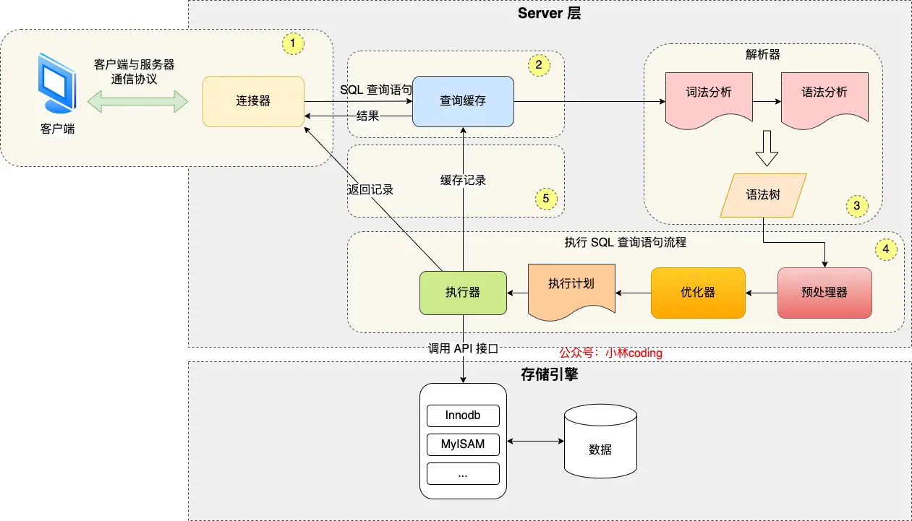

# 基础


## 连接
通过TCP连接，有长连接的选项，但是长连接也会带来内存占用。
```
mysql -h$ip -u$user -p  // 连接

show processlist  // 查看连接

kill 连接id  // 断开连接
```

## 查询缓存
对于更新比较频繁的表，查询缓存的命中率很低的，因为只要一个表有更新操作，那么这个表的查询缓存就会被清空。如果刚缓存了一个查询结果很大的数据，还没被使用的时候，刚好这个表有更新操作，查询缓冲就被清空了，相当于缓存了个寂寞。因此8.0后被删除。

## 解析SQL语句
表不存在或者字段不存在，并不是在解析器里做的，解析器只负责检查语法和构建语法树


## 执行
### 预处理
检查 SQL 查询语句中的表或者字段是否存在

### 优化
优化器主要负责将 SQL 查询语句的执行方案确定下来，比如在表里面有多个索引的时候，优化器会基于查询成本的考虑，来决定选择使用哪个索引。

`select * from product where id = 1`语句使用的索引为主键索引

### 执行
分为三种：
* 主键索引查询，`select * from product where id = 1;` 让存储引擎定位符合条件的第一条记录。(主键唯一)
* 全表扫描，`select * from product where name = 'iphone';`读多个
* 索引下推


`select * from t_user  where age > 20 and reward = 100000;`执行时，找到age > 20后暂不回表，再在数据层判断reward，提高效率。

## 存储结构


对于行的索引的查找和页的查找方式，都是通过B+树构建的

B+树相较于B树有层数少（读取IO次数少），删改不动结构，可以顺序读取等优点。相较于二叉树也是。哈希表适合等值查找但是不适合范围查找和顺序读取。

## 行格式


关于所有的列（不包括隐藏列和记录头信息）占用的字节长度加起来不能超过 65535 个字节。其中包含变长字段长度列表和NULL值列表。因此应该实际最大能存65535-2-1=65532字节。采用ascii编码每字符占用一字节，则可以最大存65532个字符，而UTF-8就要少很多。 65532/3 = 21844

一个页的大小一般是 16KB，也就是 16384字节，而一个 varchar(n) 类型的列最多可以存储 65532字节，一些大对象如 TEXT、BLOB 可能存储更多的数据，这时一个页可能就存不了一条记录。这个时候就会发生行溢出，多的数据就会存到另外的「溢出页」中。

# 索引
## 索引分类
索引是一个目录，创建什么样的索引就可以怎么样的搜索，如果没有相应索引是无法进行合适的搜索的（最佳例子为联合索引中的最左匹配原则会因为搜索没有使用最左键而无法索引）

* 按「数据结构」分类：B+tree索引、Hash索引、Full-text索引。
* 按「物理存储」分类：聚簇索引（主键索引）、二级索引（辅助索引）。
* 按「字段特性」分类：主键索引、唯一索引、普通索引、前缀索引。
* 按「字段个数」分类：单列索引、联合索引。

在创建表时，InnoDB 存储引擎会根据不同的场景选择不同的列作为索引：

如果有主键，默认会使用主键作为聚簇索引的索引键（key）；
如果没有主键，就选择第一个不包含 NULL 值的唯一列作为聚簇索引的索引键（key）；
在上面两个都没有的情况下，InnoDB 将自动生成一个隐式自增 id 列作为聚簇索引的索引键（key）；
其它索引都属于辅助索引（Secondary Index），也被称为二级索引或非聚簇索引。**创建的主键索引和二级索引默认使用的是 B+Tree 索引。**

主索引树：


二级索引树：


若执行：`select * from product where product_no = '0002'`，则会在二级索引树中找到对应的主索引即id，然后再从主索引表中找到对应行，该过程称为“回表”。不过，当查询的数据是能在二级索引的 B+Tree 的叶子节点里查询到，这时就不用再查主键索引查：`select id from product where product_no = '0002';`二级索引的 B+Tree 的叶子节点存放的是主键值，而不是实际数据。

在联合索引中，左值是有序的，但是后面的不一定有序，因此执行`select * from t_table where a > 1 and b = 2`中：
a 字段值为 5 的记录，该记录的 b 字段值为 8；
a 字段值为 6 的记录，该记录的 b 字段值为 10；
a 字段值为 7 的记录，该记录的 b 字段值为 5；
因此，我们不能根据查询条件 b = 2 来进一步减少需要扫描的记录数量（b 字段无法利用联合索引进行索引查询的意思）。b需要被全部扫描，也就是**这条查询语句只有 a 字段用到了联合索引进行索引查询，而 b 字段并没有使用到联合索引。**

但`select * from t_table where a >= 1 and b = 2`在a=1时，b使用到了联合索引。


通过之前的联合索引知识也可以明白，索引下推实现是根据联合索引实现的，否则普通索引就会回表并在主键索引后比较后面的参数。联合索引可以在二级索引时就进行了判断。这也叫覆盖索引，如果通常使用联合的查表的话，可以通过建立联合索引，可以优化使得减少回表。

## 什么时候不需要创建索引？
* WHERE 条件，GROUP BY，ORDER BY 里用不到的字段，索引的价值是快速定位，如果起不到定位的字段通常是不需要创建索引的，因为索引是会占用物理空间的。
* 字段中存在大量重复数据，不需要创建索引，比如性别字段，只有男女，如果数据库表中，男女的记录分布均匀，那么无论搜索哪个值都可能得到一半的数据。在这些情况下，还不如不要索引，因为 MySQL 还有一个查询优化器，查询优化器发现某个值出现在表的数据行中的百分比很高的时候，它一般会忽略索引，进行全表扫描。
* 表数据太少的时候，不需要创建索引；
* 经常更新的字段不用创建索引，比如不要对电商项目的用户余额建立索引，因为索引字段频繁修改，由于要维护 B+Tree的有序性，那么就需要频繁的重建索引，这个过程是会影响数据库性能的。

## 索引优化之防止索引失效
发生索引失效的情况：

* 当我们使用左或者左右模糊匹配的时候，也就是 like %xx 或者 like %xx%这两种方式都会造成索引失效；
* 当我们在查询条件中对索引列做了计算、函数、类型转换操作，这些情况下都会造成索引失效；
* 联合索引要能正确使用需要遵循最左匹配原则，也就是按照最左优先的方式进行索引的匹配，否则就会导致索引失效。
* 在 WHERE 子句中，如果在 OR 前的条件列是索引列，而在 OR 后的条件列不是索引列，那么索引会失效。

查看：

对于执行计划，参数有：

* possible_keys 字段表示可能用到的索引；
* key 字段表示实际用的索引，如果这一项为 NULL，说明没有使用索引；
* key_len 表示索引的长度；
* rows 表示扫描的数据行数。
* type 表示数据扫描类型，我们需要重点看这个。

type 字段就是描述了找到所需数据时使用的扫描方式是什么，常见扫描类型的执行效率从低到高的顺序为：

* All（全表扫描）；
* index（全索引扫描）；
* range（索引范围扫描）；在 where 子句中使用 < 、>、in、between 等关键词，只检索给定范围的行，属于范围查找。从这一级别开始，索引的作用会越来越明显，因此我们需要尽量让 SQL 查询可以使用到 range 这一级别及以上的 type 访问方式。
* ref（非唯一索引扫描）；
* eq_ref（唯一索引扫描）；
* const（结果只有一条的主键或唯一索引扫描）。


除了关注 type，我们也要关注 extra 显示的结果。这里说几个重要的参考指标：
* Using filesort ：当查询语句中包含 group by 操作，而且无法利用索引完成排序操作的时候， 这时不得不选择相应的排序算法进行，甚至可能会通过文件排序，效率是很低的，所以要避免这种问题的出现。
* Using temporary：使了用临时表保存中间结果，MySQL 在对查询结果排序时使用临时表，常见于排序 order by 和分组查询 group by。效率低，要避免这种问题的出现。
* Using index：所需数据只需在索引即可全部获得，不须要再到表中取数据，也就是使用了覆盖索引，避免了回表操作，效率不错。