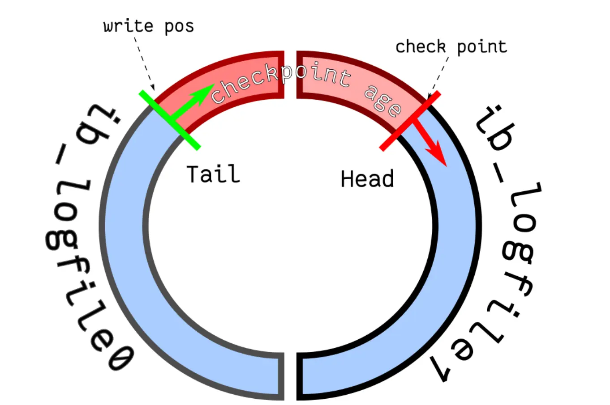
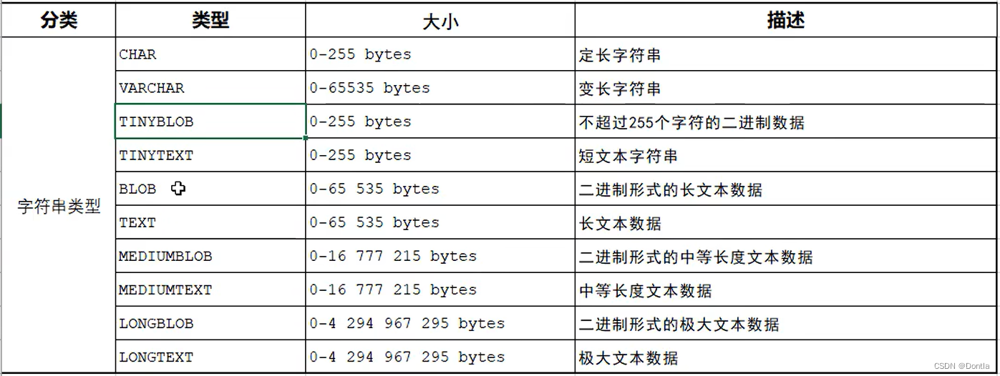
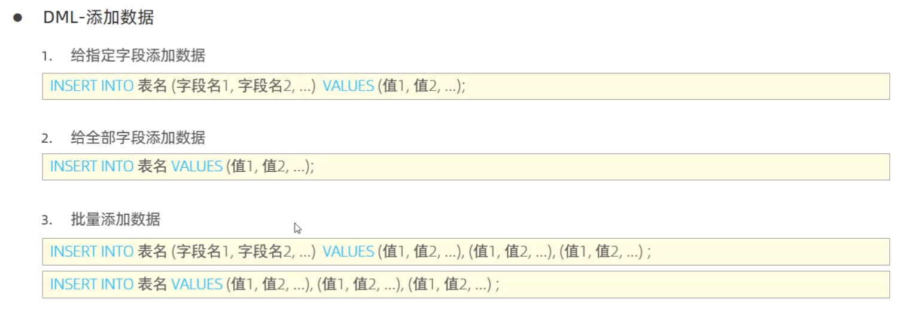

# 基础


## 连接
通过TCP连接，有长连接的选项，但是长连接也会带来内存占用。
```
mysql -h$ip -u$user -p  // 连接

show processlist  // 查看连接

kill 连接id  // 断开连接
```

## 查询缓存
对于更新比较频繁的表，查询缓存的命中率很低的，因为只要一个表有更新操作，那么这个表的查询缓存就会被清空。如果刚缓存了一个查询结果很大的数据，还没被使用的时候，刚好这个表有更新操作，查询缓冲就被清空了，相当于缓存了个寂寞。因此8.0后被删除。

## 解析SQL语句
表不存在或者字段不存在，并不是在解析器里做的，解析器只负责检查语法和构建语法树


## 执行
### 预处理
检查 SQL 查询语句中的表或者字段是否存在

### 优化
优化器主要负责将 SQL 查询语句的执行方案确定下来，比如在表里面有多个索引的时候，优化器会基于查询成本的考虑，来决定选择使用哪个索引。

`select * from product where id = 1`语句使用的索引为主键索引

### 执行
分为三种：
* 主键索引查询，`select * from product where id = 1;` 让存储引擎定位符合条件的第一条记录。(主键唯一)
* 全表扫描，`select * from product where name = 'iphone';`读多个
* 索引下推


`select * from t_user  where age > 20 and reward = 100000;`执行时，找到age > 20后暂不回表，再在数据层判断reward，提高效率。

## 存储结构


对于行的索引的查找和页的查找方式，都是通过B+树构建的**注意：索引是索引，只有聚簇索引（主键索引）才是数据存储的方式，其余的二级索引是我自己创造的，索引到的内容只有主键，页索引是页查找，页查找中的指向信息为该页索引中最小id号和最大id号用于主键对比**


页中查找一个行

B+树相较于B树有层数少（读取IO次数少），删改不动结构，可以顺序读取等优点。相较于二叉树也是。哈希表适合等值查找但是不适合范围查找和顺序读取。

## 行格式


关于所有的列（不包括隐藏列和记录头信息）占用的字节长度加起来不能超过 65535 个字节。其中包含变长字段长度列表和NULL值列表。因此应该实际最大能存65535-2-1=65532字节。采用ascii编码每字符占用一字节，则可以最大存65532个字符，而UTF-8就要少很多。 65532/3 = 21844

一个页的大小一般是 16KB，也就是 16384字节，而一个 varchar(n) 类型的列最多可以存储 65532字节，一些大对象如 TEXT、BLOB 可能存储更多的数据，这时一个页可能就存不了一条记录。这个时候就会发生行溢出，多的数据就会存到另外的「溢出页」中。

# 索引
## 索引分类
索引是一个目录，创建什么样的索引就可以怎么样的搜索，如果没有相应索引是无法进行合适的搜索的（最佳例子为联合索引中的最左匹配原则会因为搜索没有使用最左键而无法索引）

* 按「数据结构」分类：B+tree索引、Hash索引、Full-text索引。
* 按「物理存储」分类：聚簇索引（主键索引）、二级索引（辅助索引）。
* 按「字段特性」分类：主键索引、唯一索引、普通索引、前缀索引。
* 按「字段个数」分类：单列索引、联合索引。

在创建表时，InnoDB 存储引擎会根据不同的场景选择不同的列作为索引：

如果有主键，默认会使用主键作为聚簇索引的索引键（key）；
如果没有主键，就选择第一个不包含 NULL 值的唯一列作为聚簇索引的索引键（key）；
在上面两个都没有的情况下，InnoDB 将自动生成一个隐式自增 id 列作为聚簇索引的索引键（key）；
其它索引都属于辅助索引（Secondary Index），也被称为二级索引或非聚簇索引。**创建的主键索引和二级索引默认使用的是 B+Tree 索引。**

主索引树：


二级索引树：


若执行：`select * from product where product_no = '0002'`，则会在二级索引树中找到对应的主索引即id，然后再从主索引表中找到对应行，该过程称为“回表”。不过，当查询的数据是能在二级索引的 B+Tree 的叶子节点里查询到，这时就不用再查主键索引查：`select id from product where product_no = '0002';`二级索引的 B+Tree 的叶子节点存放的是主键值，而不是实际数据。

在联合索引中，左值是有序的，但是后面的不一定有序，因此执行`select * from t_table where a > 1 and b = 2`中：
a 字段值为 5 的记录，该记录的 b 字段值为 8；
a 字段值为 6 的记录，该记录的 b 字段值为 10；
a 字段值为 7 的记录，该记录的 b 字段值为 5；
因此，我们不能根据查询条件 b = 2 来进一步减少需要扫描的记录数量（b 字段无法利用联合索引进行索引查询的意思）。b需要被全部扫描，也就是**这条查询语句只有 a 字段用到了联合索引进行索引查询，而 b 字段并没有使用到联合索引。**

但`select * from t_table where a >= 1 and b = 2`在a=1时，b使用到了联合索引。


通过之前的联合索引知识也可以明白，索引下推实现是根据联合索引实现的，否则普通索引就会回表并在主键索引后比较后面的参数。联合索引可以在二级索引时就进行了判断。这也叫覆盖索引，如果通常使用联合的查表的话，可以通过建立联合索引，可以优化使得减少回表。

## 什么时候不需要创建索引？
* WHERE 条件，GROUP BY，ORDER BY 里用不到的字段，索引的价值是快速定位，如果起不到定位的字段通常是不需要创建索引的，因为索引是会占用物理空间的。
* 字段中存在大量重复数据，不需要创建索引，比如性别字段，只有男女，如果数据库表中，男女的记录分布均匀，那么无论搜索哪个值都可能得到一半的数据。在这些情况下，还不如不要索引，因为 MySQL 还有一个查询优化器，查询优化器发现某个值出现在表的数据行中的百分比很高的时候，它一般会忽略索引，进行全表扫描。
* 表数据太少的时候，不需要创建索引；
* 经常更新的字段不用创建索引，比如不要对电商项目的用户余额建立索引，因为索引字段频繁修改，由于要维护 B+Tree的有序性，那么就需要频繁的重建索引，这个过程是会影响数据库性能的。

## 索引优化之防止索引失效
发生索引失效的情况：

* 当我们使用左或者左右模糊匹配的时候，也就是 like %xx 或者 like %xx%这两种方式都会造成索引失效；
* 当我们在查询条件中对索引列做了计算、函数、类型转换操作，这些情况下都会造成索引失效；
* 联合索引要能正确使用需要遵循最左匹配原则，也就是按照最左优先的方式进行索引的匹配，否则就会导致索引失效。
* 在 WHERE 子句中，如果在 OR 前的条件列是索引列，而在 OR 后的条件列不是索引列，那么索引会失效。

查看：

对于执行计划，参数有：

* possible_keys 字段表示可能用到的索引；
* key 字段表示实际用的索引，如果这一项为 NULL，说明没有使用索引；
* key_len 表示索引的长度；
* rows 表示扫描的数据行数。
* type 表示数据扫描类型，我们需要重点看这个。

type 字段就是描述了找到所需数据时使用的扫描方式是什么，常见扫描类型的执行效率从低到高的顺序为：

* All（全表扫描）；
* index（全索引扫描）；
* range（索引范围扫描）；在 where 子句中使用 < 、>、in、between 等关键词，只检索给定范围的行，属于范围查找。从这一级别开始，索引的作用会越来越明显，因此我们需要尽量让 SQL 查询可以使用到 range 这一级别及以上的 type 访问方式。
* ref（非唯一索引扫描）；
* eq_ref（唯一索引扫描）；
* const（结果只有一条的主键或唯一索引扫描）。


除了关注 type，我们也要关注 extra 显示的结果。这里说几个重要的参考指标：
* Using filesort ：当查询语句中包含 group by 操作，而且无法利用索引完成排序操作的时候， 这时不得不选择相应的排序算法进行，甚至可能会通过文件排序，效率是很低的，所以要避免这种问题的出现。
* Using temporary：使了用临时表保存中间结果，MySQL 在对查询结果排序时使用临时表，常见于排序 order by 和分组查询 group by。效率低，要避免这种问题的出现。
* Using index：所需数据只需在索引即可全部获得，不须要再到表中取数据，也就是使用了覆盖索引，避免了回表操作，效率不错。


# 事务
## 事务特性
* 原子性（Atomicity）原子性是通过 undo log（回滚日志） 来保证的；未完成的原子操作回滚
* 一致性（Consistency）一致性则是通过持久性+原子性+隔离性来保证；
* 隔离性（Isolation）隔离性是通过 MVCC（多版本并发控制） 或锁机制来保证的；
* 持久性（Durability）持久性是通过 redo log （重做日志）来保证的；

## 并发事务可能的问题
* 脏读，在其他事务处理期间读取，但是其他事务回滚了
* 不可重复读，在其他事务处理期间读取，但是其他事务修改了数据，导致读取的数据不一致
* 幻读，在其他事务处理期间多次读取，每次查询数量不一致

四周串行化隔离级别：
* 读未提交（read uncommitted），指一个事务还没提交时，它做的变更就能被其他事务看到；
* 读提交（read committed），指一个事务提交之后，它做的变更才能被其他事务看到；
* 可重复读（repeatable read），指一个事务执行过程中看到的数据，一直跟这个事务启动时看到的数据是一致的，MySQL InnoDB 引擎的默认隔离级别；
* 串行化（serializable ）；会对记录加上读写锁，在多个事务对这条记录进行读写操作时，如果发生了读写冲突的时候，后访问的事务必须等前一个事务执行完成，才能继续执行；


## read view


### 可重复读
首先要理解版本链的概念，对于可重复读，每次出现了事务时，会多出一个行，并且尾部指针指向上一个版本。在事务读取时，会根据比较找到相应版本进行读取。


如果记录的 trx_id 值在 Read View 的 min_trx_id 和 max_trx_id 之间，需要判断 trx_id 是否在 m_ids 列表中：
如果记录的 trx_id 在 m_ids 列表中，表示生成该版本记录的活跃事务依然活跃着（还没提交事务），所以该版本的记录对当前事务不可见。
如果记录的 trx_id 不在 m_ids列表中，表示生成该版本记录的活跃事务已经被提交，所以该版本的记录对当前事务可见。

注意：实现可重复读时，一个A事务会保证在提交以前都使用旧的指针，是因为其他的事务B在开启时就记录下了该行在改，并且B的字段会一直保留到B事务结束，即使中间A进行了提交，但B仍然记录的是该行在被某个改中。从而保证B在运行中多次读同样的数据。

同时通过上面的机制也可以知道，如果有新增行，是没有记录在B的字段中，因此无法防止幻读。

### 读提交
和上面最大不同在于，可重复读是每次事务开始时产生版本。而读提交在每次读取时产生版本，因此多次读会有不同结果。

## 读方式
* 针对快照读（普通 select 语句），是通过 MVCC 方式解决了幻读，因为可重复读隔离级别下，事务执行过程中看到的数据，一直跟这个事务启动时看到的数据是一致的，即使中途有其他事务插入了一条数据，是查询不出来这条数据的，所以就很好了避免幻读问题。
* 针对当前读（select ... for update 等语句），是通过 next-key lock（记录锁+间隙锁）方式解决了幻读，因为当执行 select ... for update 语句的时候，会加上 next-key lock，如果有其他事务在 next-key lock 锁范围内插入了一条记录，那么这个插入语句就会被阻塞，无法成功插入，所以就很好了避免幻读问题。

select ... for update 这种查询语句是当前读，每次执行的时候都是读取最新的数据。Innodb 引擎为了解决「可重复读」隔离级别使用「当前读」而造成的幻读问题，就引出了间隙锁。


正常情况可以防止幻读，但是有情况会发生幻读。但以下情况会出现幻读：


所以，MySQL 可重复读隔离级别并没有彻底解决幻读，只是很大程度上避免了幻读现象的发生。

# 锁


## 表级别锁
表锁是读写锁，少用

元数据锁是在读或改锁结构时上锁，MDL 是为了保证当用户对表执行 CRUD 操作时，防止其他线程对这个表结构做了变更。MDL 是在事务提交后才会释放，这意味着事务执行期间，MDL 是一直持有的。

意向共享锁和意向独占锁是表级锁，不会和行级的共享锁和独占锁发生冲突，而且意向锁之间也不会发生冲突，只会和共享表锁（lock tables ... read）和独占表锁（lock tables ... write）发生冲突。有了「意向锁」，由于在对记录加独占锁前，先会加上表级别的意向独占锁，那么在加「独占表锁」时，直接查该表是否有意向独占锁，如果有就意味着表里已经有记录被加了独占锁，这样就不用去遍历表里的记录
所以，意向锁的目的是为了快速判断表里是否有记录被加锁。

## 行级别锁
共享锁（S锁）满足读读共享，读写互斥。`select ... lock in share mode;`
独占锁（X锁）满足写写互斥、读写互斥。`select ... for update;`


在可重复读隔离级别下，行级锁的种类除了有记录锁，还有间隙锁（目的是为了避免幻读），所以行级锁的种类主要有三类：

* Record Lock，记录锁，也就是仅仅把一条记录锁上；
* Gap Lock，间隙锁，锁定一个范围，但是不包含记录本身；
* Next-Key Lock：Record Lock + Gap Lock 的组合，锁定一个范围，并且锁定记录本身。

update会导致锁，其余select会使用MVCC解决。因为update是直接取到当前最新完成事务的数据记录，如果还有不停的写就会乱。

## 什么情况加锁
### 唯一索引等值查询
加记录锁`select * from user where id = 1 for update;`该事务会加上X型锁，后面删改都会阻塞。

`select * from user where id = 2 for update;`但是2不存在于记录，加间隙锁。


使用`select * from performance_schema.data_locks\G;`查看是用了什么锁。

### 唯一索引范围查询
根据Next-Key Lock的左开右闭的形态，可以分析出各种上锁情况。只要记得锁是为了防止查询的数据不会改变就行。
。。。

继续考虑，如果在update没有加where或者没有索引会怎样：

会全表X锁，全表扫描时间长，其他删改和update全部阻塞，update后的select也会锁住。

### 插入S锁的情况
如果在插入新记录时`Insert into t_order (order_no, create_date) values (1008, now());`，插入了一个与「已有的记录的主键或者唯一二级索引列值相同」的记录（不过可以有多条记录的唯一二级索引列的值同时为NULL，这里不考虑这种情况），此时插入就会失败，然后对于这条记录加上了 S 型的锁。

* 如果主键索引重复，插入新记录的事务会给已存在的主键值重复的聚簇索引记录添加 S 型记录锁。

* 如果唯一二级索引重复，插入新记录的事务都会给已存在的二级索引列值重复的二级索引记录添加 S 型 next-key 锁。

这说明并发多个事务的时候，第一个事务插入的记录，并不会加锁，而是会用隐式锁（S锁）保护唯一二级索引的记录。

## 死锁


这里在查询记录是否存在的时候，使用了 select ... for update 语句，目的为了防止事务执行的过程中，有其他事务插入了记录，而出现幻读的问题。

如果没有使用 select ... for update 语句，而使用了单纯的 select 语句，如果是两个订单号一样的请求同时进来，就会出现两个重复的订单，有可能出现幻读，如下图：


这里发生幻读的原因是两条操作并非原子操作，如果一个select多次读可以通过MVCC解决，但是这种不行（有写存在，使用快照无法避免自己写入和其他写入的冲突）。

此时事务 A 在二级索引（INDEX_NAME : index_order）上加的是 X 型的 next-key 锁，锁范围是(1006, +∞]。因为当我们执行以下插入语句时，会在插入间隙上获取插入意向锁，而插入意向锁与间隙锁是冲突的，所以当其它事务持有该间隙的间隙锁时，需要等待其它事务释放间隙锁之后，才能获取到插入意向锁。而**间隙锁与间隙锁之间是兼容的，所以所以两个事务中 select ... for update 语句并不会相互影响。**

每插入一条新记录，都需要看一下待插入记录的下一条记录上是否已经被加了间隙锁，如果已加间隙锁，此时会生成一个插入意向锁，然后锁的状态设置为等待状态（PS：MySQL 加锁时，是先生成锁结构，然后设置锁的状态，如果锁状态是等待状态，并不是意味着事务成功获取到了锁，只有当锁状态为正常状态时，才代表事务成功获取到了锁），现象就是 Insert 语句会被阻塞。


# 日志
## 日志分类
* undo log（回滚日志）：是 Innodb 存储引擎层生成的日志，实现了事务中的原子性，主要用于事务回滚和 MVCC。
* redo log（重做日志）：是 Innodb 存储引擎层生成的日志，实现了事务中的持久性，主要用于掉电等故障恢复；
* binlog （归档日志）：是 Server 层生成的日志，主要用于数据备份和主从复制；

### undo log
在事务开启以前记录执行事务前的状态。（说白了就是版本链，通过指针可以回到事务发生以前的版本）

### buffer pool
为了不每次执行事务都进行磁盘IO操作，有些数据会读到内存里


读取的粒度为页。可以看到无论是数据还是undo页都在内存中，如果内存丢失则导致刚才所做的一切内容无效。

### redo log 
WAL （Write-Ahead Logging）技术。
WAL 技术指的是， MySQL 的写操作并不是立刻写到磁盘上，而是先写日志，然后在合适的时间再写到磁盘上。redo log 是物理日志，记录了某个数据页做了什么修改，**比如对 XXX 表空间中的 YYY 数据页 ZZZ 偏移量的地方做了AAA 更新**，每当执行一个事务就会产生这样的一条或者多条物理日志。**写日志是写到磁盘，不然内存丢失等于无效**

这两种日志是属于 InnoDB 存储引擎的日志，它们的区别在于：

* redo log 记录了此次事务「完成后」的数据状态，记录的是更新之后的值；用于保证每次持久化区间
* undo log 记录了此次事务「开始前」的数据状态，记录的是更新之前的值；用于保证每次事务区间

但是，你会问，既然都保存日志进行IO操作了，不如直接存数据？答：写入 redo log 的方式使用了追加操作， 所以磁盘操作是顺序写，而写入数据需要先找到写入位置，然后才写到磁盘，所以磁盘操作是随机写。实际上， 执行一个事务的过程中，产生的 redo log 也不是直接写入磁盘的，因为这样会产生大量的 I/O 操作，而且磁盘的运行速度远慢于内存。**所以，redo log 也有自己的缓存—— redo log buffer**，每当产生一条 redo log 时，会先写入到 redo log buffer，后续在持久化到磁盘

缓存在 redo log buffer 里的 redo log 还是在内存中，它什么时候刷新到磁盘？主要有下面几个时机：

* MySQL 正常关闭时；
* 当 redo log buffer 中记录的写入量大于 redo log buffer 内存空间的一半时，会触发落盘；
* InnoDB 的后台线程每隔 1 秒，将 redo log buffer 持久化到磁盘。
* 每次事务提交时都将缓存在 redo log buffer 里的 redo log 直接持久化到磁盘（这个策略可由 innodb_flush_log_at_trx_commit 参数控制）。




### binlog
binlog 文件是记录了所有数据库表结构变更和表数据修改的日志，不会记录查询类的操作，比如 SELECT 和 SHOW 操作。

为什么有了redo还有binlog：

* binlog 是 MySQL 的 Server 层实现的日志，所有存储引擎都可以使用；
* redo log 是 Innodb 存储引擎实现的日志；

* binlog 是追加写，写满一个文件，就创建一个新的文件继续写，不会覆盖以前的日志，保存的是全量的日志。
* redo log 是循环写，日志空间大小是固定，全部写满就从头开始，保存未被刷入磁盘的脏页日志。

* binlog 用于备份恢复、主从复制；
* redo log 用于掉电等故障恢复。

如果发生不小心删除磁盘上的整个数据库，那就需要使用binlog来恢复了。

binlog在服务层中有一个概念叫主从复制


和redo log有点相似，也是先执行写binlog再提交事务。从库是在磁盘上的，可以持久化，写入是异步的（如果完全异步会导致主库中执行且写了binlog，但是发生崩溃，从库中都不是新的数据）：

**半同步复制**：MySQL 5.7 版本之后增加的一种复制方式，介于两者之间，事务线程不用等待所有的从库复制成功响应，只要一部分复制成功响应回来就行，比如一主二从的集群，只要数据成功复制到任意一个从库上，主库的事务线程就可以返回给客户端。这种半同步复制的方式，兼顾了异步复制和同步复制的优点，即使出现主库宕机，至少还有一个从库有最新的数据，不存在数据丢失的风险。

MySQL提供一个 sync_binlog 参数来控制数据库的 binlog 刷到磁盘上的频率（事务完成后，该binlog就交给内核去写入磁盘）：
* sync_binlog = 0 的时候，表示每次提交事务都只 write，不 fsync，后续交由操作系统决定何时将数据持久化到磁盘；
* sync_binlog = 1 的时候，表示每次提交事务都会 write，然后马上执行 fsync；
* sync_binlog =N(N>1) 的时候，表示每次提交事务都 write，但累积 N 个事务后才 fsync。


**具体更新一条记录 UPDATE t_user SET name = 'xiaolin' WHERE id = 1; 的流程如下**:

1. 执行器负责具体执行，会调用存储引擎的接口，通过主键索引树搜索获取 id = 1 这一行记录：
如果 id=1 这一行所在的数据页本来就在 buffer pool 中，就直接返回给执行器更新；
如果记录不在 buffer pool，将数据页从磁盘读入到 buffer pool，返回记录给执行器。
2. 执行器得到聚簇索引记录后，会看一下更新前的记录和更新后的记录是否一样：
如果一样的话就不进行后续更新流程；
如果不一样的话就把更新前的记录和更新后的记录都当作参数传给 InnoDB 层，让 InnoDB 真正的执行更新记录的操作；
3. 开启事务， InnoDB 层更新记录前，首先要记录相应的 undo log，因为这是更新操作，需要把被更新的列的旧值记下来，也就是要生成一条 undo log，undo log 会写入 Buffer Pool 中的 Undo 页面，不过在内存修改该 Undo 页面后，需要记录对应的 redo log。
4. InnoDB 层开始更新记录，会先更新内存（同时标记为脏页），然后将记录写到 redo log 里面，这个时候更新就算完成了。为了减少磁盘I/O，不会立即将脏页写入磁盘，后续由后台线程选择一个合适的时机将脏页写入到磁盘。这就是 WAL 技术，MySQL 的写操作并不是立刻写到磁盘上，而是先写 redo 日志，然后在合适的时间再将修改的行数据写到磁盘上。
至此，一条记录更新完了。
5. 在一条更新语句执行完成后，然后开始记录该语句对应的 binlog，此时记录的 binlog 会被保存到 binlog cache，并没有刷新到硬盘上的 binlog 文件，在事务提交时才会统一将该事务运行过程中的所有 binlog 刷新到硬盘。
6. 事务提交，剩下的就是「两阶段提交」的事情了，事务提交后，redo log 和 binlog 都要持久化到磁盘，但是这两个是独立的逻辑，可能出现半成功的状态，这样就造成两份日志之间的逻辑不一致。

# 内存
就是buffer pool，用于加速数据访问

innodb 通过三种链表来管理缓页：

* Free List （空闲页链表），管理空闲页；
* Flush List （脏页链表），管理脏页；
* LRU List，管理脏页+干净页，将最近且经常查询的数据缓存在其中，而不常查询的数据就淘汰出去。；

InnoDB 对 LRU 做了一些优化，我们熟悉的 LRU 算法通常是将最近查询的数据放到 LRU 链表的头部，而 InnoDB 做 2 点优化：

将 LRU 链表 分为young 和 old 两个区域，加入缓冲池的页，优先插入 old 区域；页被访问时，才进入 young 区域，目的是为了解决预读失效的问题。
当**「页被访问」且「 old 区域停留时间超过 innodb_old_blocks_time 阈值（默认为1秒）」**时，才会将页插入到 young 区域，否则还是插入到 old 区域，目的是为了解决批量数据访问，大量热数据淘汰的问题。


# SQL语言
## 数据库、表与项的查看创建和删除操作DDL
开启可以使用终端
```shell
net start mysql80  #开启服务
mysql -u root -p  #连接客户端
```


```sql
SHOW databases;  --看数据库
create database if not exists my_test;  --创建数据库
SHOW databases;
USE my_test;   --使用数据库
select database();   --切换数据库


/*
create table tb_user(
	id int comment '编号',
	name varchar(50) comment '姓名',
	age int comment '年龄',
	gender varchar(1) comment '性别'
	) comment '用户表';
    */
show TABLES;   --显示库中有的表
DESC tb_user   --显示具体的表
```

类型：




定长字符串性能较好，变长字符串性能较差。

示例：

用户名：username varchar(50)

性别：gender char(1)


示例：

生日：birthday date

```sql
ALTER TABLE tb_user ADD nickname varchar(20) COMMENT '昵称';  --添加表项

ALTER TABLE tb_user CHANGE nickname username varchar(30) COMMENT '昵称';  --改变项的类型和名称

ALTER TABLE tb_user DROP username; --删除项

ALTER TABLE tb_user RENAME TO emp; --改表名

DROP TABLE IF EXISTS emp;  --删除表

TRUNCATE TABLE emp;  --删除并重建该表

```

## DML数据操作语言
```sql
INSERT
UPDATE
DELETE
```



```sql
INSERT INTO employee(id,workno,name,gender,age,idcard,entrydate) values(1,'1','Itcast','男',10,'123456789012345678','2000-01-01');

insert into emp values(3,'3','Itcast','男',10,'12345','2000-01-01');  --另外一种方法


UPDATE emp SET name = 'ty', gender = '男' where id = 1;

DELETE FROM emp WHERE gender = '女';
```


## DQL数据查询语言
```sql
SELECT
	字段列表
FROM
	表名字段
WHERE
	条件列表
GROUP BY
	分组字段列表
HAVING
	分组后的条件列表
ORDER BY
	排序字段列表
LIMIT
	分页参数

--前期工作
create table emp (
    id int comment '编号',
    workno varchar(10) comment '工号',
    name varchar(10) comment '姓名',
    gender char(1) comment '性别',
    age tinyint unsigned comment '年龄',
    idcard char(18) comment '身份证号',
    workaddress varchar(50) comment '工作地址',
    entrydate date comment '入职时间'
) comment '员工表';

INSERT INTO emp (id, workno, name, gender, age, idcard,workaddress, entrydate)
VALUES 
(1,'1','柳岩','女',20,'123456789012345678' ,'北京','2000-01-01'),
(2,'2','张无忌','男',18,'123456789012345670' ,'北京' ,'2005-09-01'),
(3,'3','韦一笑','男',38,'123456789712345670' ,'上海' ,'2005-08-01'),
(4,'4','赵敏','女',18,'123456757123845670' ,'北京' ,'2009-12-01'),
(5,'5','小昭','女',16,'123456769012345678' ,'上海' ,'2007-07-01'),
(6,'6','杨道','男',28,'12345678931234567X' ,'北京' ,'2006-01-01'),
(7,'7','范瑶','男',40,'123456789212345670' ,'北京' ,'2005-05-01'),
(8,'8','黛绮丝','女',38,'123456157123645670' ,'天津' ,'2015-05-01'),
(9,'9','范凉凉','女',45,'123156789012345678' ,'北京' ,'2010-04-01'),
(10,'10','陈友谅','男',53,'123456789012345670' ,'上海' ,'2011-01-01'),
(11,'11','张士诚','男',55,'123567897123465670' ,'江苏' ,'2015-05-01'),
(12,'12','常遇春','男',32,'123446757152345670' ,'北京' ,'2004-02-01'),
(13,'13','张三丰','男',88,'123656789012345678' ,'江苏' ,'2020-11-01'),
(14,'14','灭绝','女',65,'123456719012345670' ,'西安' ,'2019-05-01'),
(15,'15','胡青牛','男',70,'12345674971234567X' ,'西安' ,'2018-04-01'),
(16,'16','周芷若','女',18,null ,'北京' ,'2012-06-01');

```

```sql
SELECT name, workno, age FROM emp;
SELECT DISTINCT workaddress as '工作地址' from emp;
```


```sql
# 查找年龄等于20的员工信息
select * from emp where age = 20;

# 查找年龄等于20的员工信息
select * from emp where age < 20;

# 查找身份证号为null的员工信息
select * from emp where idcard is null;

# 查找身份证号不是null的员工信息
select * from emp where idcard is not null;

# 查找年龄不等于88的员工信息
select * from emp where age != 88;
select * from emp where age <> 88;

# 查询年龄在15到20岁之间的员工信息
select * from emp where age > 15 and age < 20;
select * from emp where age > 15 && age < 20;
# 注意between为闭区间
select * from emp where age between 15 and 20;

# 查询性别为女且年龄小于25岁的员工
select * from emp where gender = '女' and age < 25;
select * from emp where age in(18,19,40);

# 查询姓名为两个字的员工信息
select * from emp where name like '__';

# 查询身份证号最后一位为X的员工信息
select * from emp where emp.idcard like '%X';
select * from emp where emp.idcard like '_________________X';

```