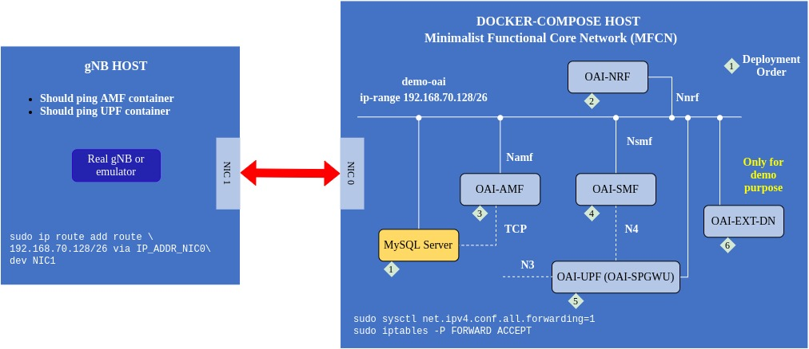

# 核心网
## docker查询相关命令
```shell
docker ps   #查询所有docker id号

docker exec <docker_id> ifconfig  #查看对应docker的ip地址

docker exec -it <docker_id> bash  #exec 命令用于在容器内部执行命令，-it 参数用于交互式地进入容器，bash 是要执行的命令（在这里我们使用的是 Bash Shell）

docker logs oai-amf  #查询连接UE的注册情况

docker network inspect demo-oai-public-net #查看所有oai docker网桥信息
```



在OAI CN中主要模块的地址：

* AMF 192.168.70.132
* UPF(SPGWU) 192.168.70.134
* SMF 192.168.70.133
* NRF 192.168.70.130