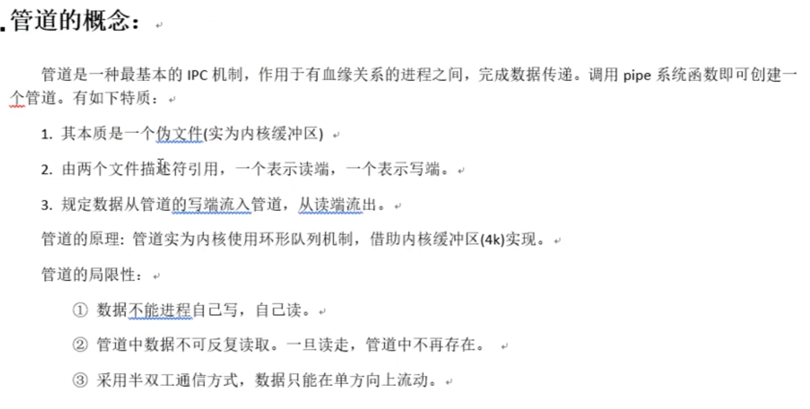
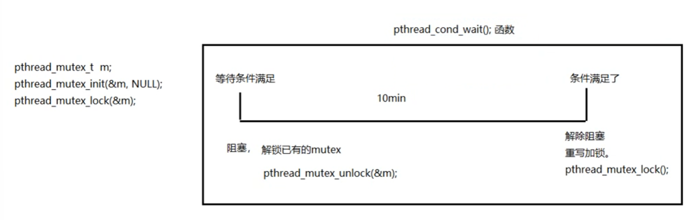

# Linux学习

## 指令

### 基本指令
```c++
df -h //查看磁盘空间和挂载情况

free -m  //查看内存，其中标识为swap的为虚拟内存，用磁盘的

tree  //显示目录结构用树形展示

find ./ -name '*.txt'  //寻找文件的一个例子

grep -r 'copy' ./  //寻找文件中的内容的例子

ps -aux  //进程查询，a为查看当前系统所有用户进程，u为详细信息，x为显示没有终端控制的进程

find /sbin -perm +700 |xargs ls -l  //xargs捕获输出并管道操作
```

```c++
//vim命令模式
dd //删除单行
ndd //删除多行

yy //复制单行

/  //查找内容 从光标所在行向下查找
?  //查找内容 从光标所在行向上查找
n  //下一个
N  //上一个

:1,10s/old/new/g   //替换 1 到 10 行所有 old 为 new（s 表示替换）
:%s/old/new/g      //替换整个文件的 old 为 new（% 是一个变量，在这里代表整篇文档）
```

```c++
//查看网络相关信息
ifconfig

netstat -nlp   //查看TCP连接情况
ss -ltnp

ip route   //查看网络地址转发

sar -n DEV  //显示网口的统计数据；
sar -n EDEV  //显示关于网络错误的统计数据；
sar -n TCP   //显示 TCP 的统计数据
```

```c++
//输出重定向
command > file	//将输出重定向到 file。
command < file	//将输入重定向到 file。
command >> file	//将输出以追加的方式重定向到 file。
ls | tee -a ls.txt   //保留ls.txt文件中原来的内容，并把ls命令的执行结果添加到ls.txt文件的后面。
```

```c++
//快捷键
ctrl + a  //光标移动到最前
ctrl + e  //光标移动到最后
```

```c++
//文件功能
bin //放二进制可执行文件
boot  //放开机启动程序
dev  //设备文件
home  //放用户
etc  //用户信息和系统配置文件
lib  //库文件
root  //管理员
usr  //用户资源管理目录
```

```c++
//用户和用户组
whoami  //查看当前用户
exit  //退出root
-rwxrw-r-- core core 。。。 //数值为4，2，1。三个权限集分别为用户、组、root。后面表示文件所属用户和用户组，使用chown来改变
```


```c++
//gcc编译
//上面我们经常使用的-o参数实际上是指定输出文件名
gcc hello.c -I ./inc -o hello  //当头文件放在inc中时，使用-I参数指定.h文件所在路径 
```
## 建立库
程序库（lib）分为动态库（共享库）和静态库，动态库在程序调用时加载，具有灵活的优点，静态库有加载快的优点。静态库会在链接的时候将库里函数复制到执行文件中，但共享库会使用原库函数中的地址，所以多个程序都可以同时去读取库中的函数，叫共享。

注意库是作用于可执行文件的可执行文件的，即汇编后的链接阶段。

```c++
//静态库制作
//1，编译c文件
gcc -c add.c -o add.o
gcc -c sub.c -o sub.o

/*
//add.c，执行加操作
int add(int a, int b){
    return a + b;
}
*/

//创建和加入静态库
ar rcs libmylib.a add.o sub.o  //libmylib.a是我为静态库起的名字，起名规范是前面带lib

//使用静态库，若add.c被移动到了别处，使用gcc test.c -o test将无法完成上面的链接步骤
gcc test.c libmylib.a -o test  //其中test.c调用了add函数

/*
//test.c
include "mymath.h"  //即使有静态库一起编译，但没有这行声明，编译器会隐式声明并在编译时有wraning
include "mymath.h"  //.h中的ifndef是防止重复的引用

int main(){
    int a = 4;
    int b = 6;
    printf("add res = %d", add(a, b));
    return 0;
}


//mymath.h
#ifndef _MYMATH_H_
#define _MYMATH_H_

int add(int, int);
int sub(int, int);

#endif
*/

//结合以上知识，此时使用以下代码可以创建一个目录的结构
mkdir inc
mv mymath.h ./inc
mkdir lib
mv libmtlib.a lib
gcc test.c ./lib/libmylib.a -o test -I ./inc
```

```c++
//动态库制作
//根据理论，动态库的文件应当生成与位置无关的代码，记结论，即在生成时加上-fPIC
gcc add.c -o add.o -fPIC

//制作库
gcc -sharded -o libmymath.so add.o sub.o
mv libmaymath.so ./lib

//编译, -l so文件名 -L 库文件路径
export LD_LIBRARY_PATH=./lib  //添加动态库路径，临时生效
vim `/.bashrc //写入LD_LIBRARY_PATH=./lib  ， source .bashrc
gcc test.c -o test -l mymath -L ./lib -I ./inc
```


## gdb调试
gdb是用于程序调试的工具，功能强大。gdb使用也是作用于可执行文件。
```c++
//调试以前编译时要加-g
gcc gdbtest.c -o gdbtest -g

//进入调试模式
gdb ...  //...代表可执行文件的文件名

//打印原代码
list 1 //从第一行开始，简写l

//设置断点
break 52  //在52行断点，简写b
delete 5   //删除断点，断点号
clear 52   //删除断点，行号

//调试运行
run  //简写r，停在断点处，出错调试直接查找到出错位置

//下一步
next //n，执行完下一行，如果是函数则也执行完函数
step //s，如果是函数则进去

//查看值
print i //p

//运行到结束
cotinue

//退出调试
quit

//设置main函数输入参数
set args ...  //也可以run ...

//条件断点
b 41 if i=5

//查看所有断点
info b
```

### gdb其他命令
实例：如果程序出现错误，则直接run，可以停顿在出错行。

```c++
//gdb模式下想直接运行代码
start

//结束当前函数调用返回到函数调用点
finish

//查看变量类型
ptype i  //i为变量名

//切换栈区作用域
bt  //查看栈区编号
frame ..  //..表示栈区的编号，换到该栈区
ptype ..  //查看不同函数栈区的存储变量

//一直跟踪一个值，我每次next时，它都会输出当前i的值
display i
undisplay i
```

## makefile
### 一个规则
makefile只能在文件中命名为makefile或Makefile，makefile的规则：
```c++
目标：依赖条件
    命令

//举例，如果希望执行命令gcc hello.c -o hello，makefile文件中应该如下写法
hello:hello.c
    gcc hello.c -o hello


//换分步骤的方式，注意这个规则，目标：依赖条件
hello:hello.o  //hello.o暂时不存在，则去找如何生成该条件
    gcc hello.o -o hello

hello.o:hello.c
    gcc -c hello.c -o hello.o
```

```c++
//另外一个例子
//使用之前制作库的例子有main.c，add.c，sub.c，div1.c
//命令
gcc hello.c add.c sub.c div.c -o a.out

//makefile书写
a.out:hello.c add.c sub.c div.c
    gcc hello.c add.c sub.c div.c -o a.out

//但此时忽然改正了add.c文件，那么之前的a.out不能用了，只能再次执行make，把全部都编译了，这在合作中并不好。
//在单独改add最后一步其实就只有一个链接需要做，因此
//这时候改正某个c文件后再make，就只执行非常小部分更改的位置
a.out:hello.o add.o sub.o div.o   //重执行链接
    gcc hello.o add.o sub.o div.o -o a.out

hello.o:hello.c
    gcc -c hello.c -o hello.o

add.o:add.c    //重执行编译
    gcc -c add.c -o add.o

sub.o:sub.c
    gcc -c sub.c -o sub.o

div.o:div.c
    gcc -c div.c -o div.o


//但如果我这么写，把第一行放到最后
hello.o:hello.c
    gcc -c hello.c -o hello.o

add.o:add.c    
    gcc -c add.c -o add.o

sub.o:sub.c
    gcc -c sub.c -o sub.o

div.o:div.c
    gcc -c div.c -o div.o

a.out:hello.o add.o sub.o div.o  
    gcc hello.o add.o sub.o div.o -o a.out
//出错！只执行hello那一行，因为它把第一行当成默认的终极目标执行完就走了

//加入一行，指定终极目标
ALL:a.out

```

### 两个函数
```c++
//找到当前目录下所有后缀为.c的文件，赋值给src
src = $(wildcard *.c) 

//把src变量中所有后缀为.c的文件替换成.o
obj = $(patsubst %.c, %.o, $(src))

a.out:$(obj)   
    gcc $(obj) -o a.out

hello.o:hello.c
    gcc -c hello.c -o hello.o

add.o:add.c    
    gcc -c add.c -o add.o

sub.o:sub.c
    gcc -c sub.c -o sub.o

div.o:div.c
    gcc -c div.c -o div.o

clean:  //清除指令，使用方法为make clean -n, -n是先打出来看一下是不是删除正确的东西，“-”删除不存在东西也不报错
    -rm -rf $(obj) a.out
```

### 三个变量
```c++
$@  //在规则命令中，表示规则的目标
$^  //在命令中，表示所有依赖条件
$<  //在命令中表示第一个依赖条件

//举例
src = $(wildcard *.c)
obj = $(patsubst %.c, %.o, $(src))

ALL:a.out

a.out:$(obj)   
    gcc $(obj) -o a.out

hello.o:hello.c
    gcc -c $< -o $@

add.o:add.c    
    gcc -c $< -o $@

sub.o:sub.c
    gcc -c $< -o $@

div.o:div.c
    gcc -c $< -o $@

clean:
    -rm -rf $(obj) a.out


//模式规则，上面的代码可以写成如下
src = $(wildcard *.c)
obj = $(patsubst %.c, %.o, $(src))

ALL:a.out

a.out:$(obj)   
    gcc $(obj) -o a.out

%.o:%.c      //如果将$<用在模式规则中，可以将列表中的依赖依次取出，并套用模式规则
    gcc -c $< -o $@

clean:
    -rm -rf $(obj) a.out

//伪目标
.PHONY: clean ALL

```
该模式规则应用后，我即便添加一个.c文件，也不用更改makefile文件。

```c++
//现在有一个要求
//所有.h文件放在inc目录下
//所有.c文件放在src目录下
//所有.o文件放在obj目录下
src = $(wildcard ./src/ *.c)
obj = $(patsubst ./src/%.c, ./obj/%.o, $(src))  //注意%，此时obj代表了./obj/*.o

ALL:a.out

inc_path = ./inc
myArgs = -I
myArgs_1 = -Wall -g

a.out:$(obj)
    gcc $< -o $@ $(myArgs_1)

./obj/%.o:./src/%.c   //注意%
    gcc -c $< -o $@ $(myArgs) $(inc_path) $(myArgs_1)

clean:
    -rm -rf $(obj) a.out

.PHONY: clean ALL
```

最后是make的指令
```c++
make -n //模拟运行make
make -f .. //指定文件执行make
```

# 系统编程
## 文件操作
使用man查看指令的用法


```c++
man 2 open  //查看open的用法
```

### open
```c
#include<unistd.h>  //open的头
#include<fcntl.h>  //flags的头
#include<stdio.h>   //printf头

int open(const char* pathname, int flags);
int open(const char* pathname, int flags, mode_t mode);

fd = open("./xx.txt", O_RDONLY | O_CREAT, 0644);  //rw-r--r--权限mode，读或创建（若不存在）
```

### read和write
```c++
ssize_t read(int fd, void *buf, size_t count);  //返回读到的字节数，存在buf中，conut是max ssize

ssize_t write(int fd, const void *buf, size_t count);   //只不过buf是写入内容，count是要写入的大小

//读写例子
int main(int argc, char* argv[]){
    char buf[1024];
    int n = 0;

    int fd1 = open(argv[1], O_RDONLY);
    int fd2 = open(argv[2], O_RDWR|O_CREAT|O_TRUNC, 0664);
    //if(fd < 0) perror("...");

    while(n = read(fd1, buf, 1024)){
        write(fd2, buf, n); //读多少n写多少
    }

    close(fd1);
    close(fd2);
}
```

那么对比系统函数与库函数fopen(),fgetc(),fputc()区别


但是了解了系统函数，还是推荐优先使用库函数。

### fcntl控制文件属性
```c++
int fcntl(int fd, int cmd, .../* arg */);

//获取文件状态F_GETFL，设置文件状态F_SETFL

flags = fcntl(STDIN_FILENO, F_GETFL);  //获取stdin的属性
flags |= O_NOBLOCK;  //或等于添加该属性，属于位运算

int ref = fcntl(STDIN_FILENO, F_SETFL, flags);  
```

### lseek调整读写指针位置，获取文件大小
```c++
off_t lseek(int fd, off_t offset, int whence);
//offset 偏移量
//whence 起始偏移位置

int fseek(FILE *stream, long offset, int whence);  //库函数

//例子
char buf[1024];
char msg[] = "hello i am ty";
fd = open("s.txt", o_RDWR|O_CREAT, 0644);
write(fd, msg, strlen(msg));
//因此在这以前要加上以下代码
lseek(fd, 0, SEEK_SET);
while((n = read(fd, buf, 1))){
    if(n < 0){
        perror("read error");
        exit(1);
    }
    write(STDOUT_FILENO, buf, n);  //该处输出没有，为什么？因为读写的指针位置一样，写完时指向的是文本末尾
}
close(fd);


//获取文件大小
int lenth = lseek(fd, 0, SEEK_END);
```

### inode结构体
放文件的权限，类型，大小，时间，用户，磁盘盘号等信息。dentry为目录项。


硬连接就是通过这种方式实现的，但是硬连接无法连接目录和跨分区，因此少用。

软连接是记录的源文件的路径，可以是绝对路径和相对路径，较为灵活。

不同目录项创建文件有相同的inode号，那么就是读取的同一个地址，那么删除其中一个文件，inode记录减一，直到减到0，就没有文件用那个空间了。


### 输入输出函数和stat
```c++
int stat(const char *path, struct stat *buf);  //其中传入参数为path，传出的参数stat通过指针返回到buf，存放文件属性，因此也叫输入输出函数。

struct stat buf;
int ret = stat("s.txt", &buf);
if(ret < 0) ...
printf("file size: %ld\n", buf.st_size);

//通过man可以看到有几个函数可以通过buf.mode判断文件是什么类型的

//stat会穿透符号连接，链接文件会输出指向的那个文件的类型，而不会判断该文件为链接文件,lstat不会符号穿透。
```

### link函数
```c++
//就是用于创建目录项的函数，硬连接
int link(const char *oldpath, const char *newpath);

link(argv[1], argv[2]);

//重点unlink，硬连接数减到0并不会马上删除文件，而是等到所有使用该文件的进程结束后再删除
先unlink ，后write，那么会write到缓存，然后在结束时释放文件
```

### 目录操作
```c++
DIR opendir(const char* name);
int closedir(DIR *dirp);
struct dirent *readdir(DIR *dirp);

//重要
struct dirent {
    inode
    char dname[]
}
```


### 递归目录小程序
```c++
#include<stdio.h>
#include<stdlib.h>
#include<string.h>
#include<unistd.h>
#include<sysy/stat.h>
#include<pthread.h>
#include<dirent.h>

void fetchdir(const char *dir){
    char path[256];
    DIR *dp;
    struct dirent *sdp;

    dp = opendir(dir);
    if(dp == NULL){
        perror("opendir error");
        exit(1);
    }

    while((sdp = readdir(dp)) ! NULL){
        if(strcmp(sdp->d_name, ".") || strcmp(sdp->d_name, "..") == 0){
            continue;
        }
        sprintf(path, "%s/%s", dir, sdp->d_name);  //拼接绝对路径
        isFile(path);  //递归
    }

    closedir(dp);
}

void isFile(const char* name){
    struct stat sbuf;
    if(stat(name, &sbuf) == -1){
        fprintf(stderr, "isfile: can't access %s\n", name);
        exit(1);
    }
    if((buf.st_mode & S_IFMT) == S_IFDIR){
        fetchdir(name);  
    }else{
        printf("%ld %s\n", sbuf.st_size, name); //输出非目录文件的大小和名字
    }
}

int main(int argc, char *argv){
    if(argc == 1){
        isFile(".");
    }else{
        isFile(argv[1]);
    }

    return 0;
}
```

### 重定向
```c++
//cat myls.c > out重定向输出

//使用dup或dup2复制文件描述符后，新文件描述符和旧文件描述符指向同一个文件，管道或网络连接，共享文件的锁定、读写位置和各项权限。
//当关闭新的文件描述符时，通过旧文件描述符仍可操作文件。
//当关闭旧的文件描述符时，通过新的文件描述符仍可操作文件。

int dup(int oldfd); //返回新的文件符或-1
int dup2(int oldfd, int newfd);


int fd = open(argv[1], O_RDONLY);
int newfd = dup(fd);
write(newfd, "123456", 6);
printf("newfd=%d", newfd);

int fd1 = open(argv[1], O_RDWR);
int fd2 = open(argv[2], O_RDWR);
int fdret = dup2(fd1, fd2);
if(fdret == -1) ...
int ret = write(fd2, "12345", 5); //此时写入的是fd1指向的文件
if(ret == -1) ...
dup2(fd1, STDOUT_FILEON);
printf("...........")  //输出到fd1中去了
```


## 进程学习

### PCB进程控制块


文件描述符表中记录了文件结构体FILE，这个对用户是不可见的。一个进程最多能打开1024个文件。

MMU负责将虚拟内存映射到物理内存上去。


MMU可以将虚拟内存看起来连续的内存映射到实际离散的物理内存中。为了安全，MMU会有个内存分级，分级时内核内容分配在0级，其他用户数据分配在3级。

对于操作系统，进程就是一个数据结构，我们直接来看 Linux 的源码：进程控制块结构体`struct task_struct`：
```c++
struct task_struct {
    // 进程状态
    long              state;
    // 虚拟内存结构体
    struct mm_struct  *mm;
    // 进程号
    pid_t             pid;
    // 指向父进程的指针
    struct task_struct __rcu  *parent;
    // 子进程列表
    struct list_head        children;
    // 存放文件系统信息的指针
    struct fs_struct        *fs;
    // 一个数组，包含该进程打开的文件指针
    struct files_struct     *files;
};
//进程工作目录，即shell运行时的目录
//信号相关信息
```
注意pdb中的文件描述符就是下面例子中返回的int fd，文件描述符父子进程共享这个非常关键，父进程open时fd=1，那子进程再打开，fd也是1，但是这种复制只会出现一次。


进程和线程在linux内核看来其实差别不大，但是共享的内容有所区别。


### 环境变量
```c++
echo $PATH   //全局路径
echo $SHELL  //当前目录
```

### 阻塞非阻塞
常规读文件不会阻塞。产生阻塞的场景：
* 读设备文件，例如：/dev/tty  终端文件
* 读网络文件

```c++
//阻塞
int main(){
    char buf[10];
    int n = 0;

    n = read(STDIN_FILENO, buf, 10);  //读标准输入，是设备文件属性，默认阻塞
    if(n < 0) {
        perror("read error");
        exit(1);
    }

    write(STDIN_FILENO, buf, 10);
    return 0;
}

//希望改变文件的是否阻塞属性
    fd = open("/dev/tty", O_RDONLY|O_NONBLOCK);

//注意非阻塞文件读取为空也会返回-1，但是erno会置为EAGAIN
trygain:
    n = read(fd, buf, 10);
    if(n < 0){
        if(errno != EAGAIN){
            perror(..)
            exit(1);
        }
        else{
            write(STDOUT_FILENO, "try again!\n", strlen("try again!\n"));
            sleep(2);
            goto tryagain;
        }
    
    write(STDOUT_FILENO, buf, n);
    close(fd);
    }
```
该代码将输入终端设置为非阻塞，并不停的访问是否有读到，是一种轮询的方式。不是一个好设计，好设计是中断。


### 进程终止
基本的文件操作方法和进程的终止：
```c
#include <unistd.h>
#include <string.h>
#include <stdio.h>
#include <stdlib.h>
#include <fcntl.h>

void func1() {
    printf("func is exit!\n");
}

int main(int argc, char* argv[]) {
    if (argc < 2) {
        fprintf(stderr, "usage: %s file ...\n", argv[0]);
        exit(1);
    }

    axexit(func1);  //向内核登记终止函数，最后进程结束时会调用该函数。（自己登记的）

    FILE* fp = fopen(argv[1], "w");  //w代表写
    fprintf(fp, "hello ty");
    fclose(fp);
    return 0;
    //exit(0);   标准c库函数
    //_exit(0);  系统调用，不支持标准IO缓存，不自动调用终止函数
}
```


### 进程信息查看
```shell
ps   #直接查看当前终端中的进程，具有PID，运行时间和进程运行的命令
ps -ef  #看到后台的进程，0号进程为系统内核
```
进程状态：

* 运行态，R
* 等待状态，S，分为可中断等待和不可中断等待，可中断可以接收信号并中断。
* 停止状态，T
* 僵尸状态，Z，进程已经结束，但内核还记录了进程的相关信息。


### 进程调用函数
```c
#include <unistd.h>
#include <sys/types.h>
pid_t getpid(void);
uid_t getuid(void); //当前进程的实际用户，就我进入系统时，我自己就是实际用户，但是我可以使用root的身份来运行，那么此时root为有效用户
uid_t geteuid(void); //当前进程的有效用户，以有效用户的身份运行进程
gid_t getgid(void); //进程用户组
pid_t getppid(void);
pid_t getpgrp(void); //所在进程组ID
pid_t getpgid(pid_t pid); //进程id为pid的进程所在的进程组ID
```
**在shell上执行的命令都是shell的子进程**，因此查看一个c执行时看它父进程号是shell进程号。

### 子进程创建
pid_t pid = fork(void);创建子进程。在这行命令后会出现两个进程，父进程中pid的值为非负数，子进程中pid为0。父进程可以根据返回的pid控制子进程启停。
```c
int main(int argc, char* argv[]) {
    printf("pid: %d\n", getpid());

    pid_t pid;
    pid = fork();
    if (pid < 0) {
        perror("fork error");
    } else if (pid > 0) {   //处于父进程
        printf("i am parent, my pid is %d, my child pid is %d, fork return is %d\n", getpid(), pid, pid);
    } else {      //子进程
        printf("i am child, my pid is %d, my parent pid is %d, fork return is %d\n", getpid(), getppid(), pid);
    }
    
    return 0;
}
```
vfork()先运行且不复制父进程的内存空间。

父进程和子进程共享代码，但是堆栈区都是独立分配的。在fork()时会将已经赋值的变量和一堆东西一起复制到子进程中。

请关注一个问题，无论是goble变量还是static父进程子进程都是使用的不同物理地址，可以各自修改。
```c
int g_v = 30;

int main(int argc, char* argv[]) {
    int a_v = 30;
    static s_v = 30;
    char* s = "hello ty";
    ssize_t size = strlen(s) * sizeof(char);
    
    FILE* fp = fopen("file_1.txt", "w");  //标准IO操作
    int fd = open("file_2.txt", O_WRONLY|O_CREAT|O_TRUNC, S_IRWXU|S_IRWXG); //系统调用直接操作，不通过缓存直接写

    fprintf(fp, "%s, pid:%d", s, getpid());  //通过缓存（意味着内容会被子进程复制到缓存，到下面调用fprintf时会出现在子进程打印的行中）
    write(fd, s, size);  //直接写入不通过缓存，不会复制到子进程

    pid_t pid;
    pid = fork();

    if (pid < 0) {    //分开进程赋值
        perror("fork error");
    } else if (pid > 0) {   //处于父进程
        a_v = 40; g_v = 40; s_v = 40;
    } else {      //子进程
        a_v = 50; g_v = 50; s_v = 50;
    }
    
    //父子进程都会运行，fp指向同一个文件
    fprintf(fp, "pid:%d, g_v:%d, a_v:%d, s_v:%d\n", getpid(), g_v, a_v, s_v);
    //这里打出两行结果
    //hello ty, pid:2863 pid:2863, g_v:40, a_v:40, s_v:40
    //hello ty, pid:2863 pid:2864, g_v:50, a_v:50, s_v:50  //子进程复制了父进程中上面的缓存，因此前面也会打出hello和2863
    sleep(1);

    fclose(fp);  //父子进程都会调用，只有当父子进程都执行了这个操作后才会真正的close这个文件
    close(fd);
    return 0;
}
```
上面的程序关于到了fprintf和子进程复制父进程参数和缓存，以及独立的部分，看懂了就可以明白子进程对父进程的继承关系。

**重点：**父子进程共享：文件描述符，mmap建立的映射区

### 僵尸进程
子进程结束了，父进程还没结束，僵尸进程避免方法为：
* 父进程隔一段时间查询子进程是否结束，调用wait()和waitid()通知内核释放僵尸进程。
* 信号SIGCHLD通知处理，并在信号中调用wait
* 使子进程变成孤儿进程，然后用init回收。


### 守护进程和孤儿进程
守护进程在系统开始是就出现了，父进程为1号进程（init进程）。

孤儿进程是：父进程结束了子进程继续，成为孤儿进程，则会由init进程接管。
```c
int main(int argc, char* argv[]) {
    printf("pid: %d\n", getpid());

    pid_t pid;
    pid = fork();
    if (pid < 0) {
        perror("fork error");
    } else if (pid > 0) {   //处于父进程
        printf("%d deaded", getpid());
        exit(0);
    } else {      //子进程
        sleep(4);
        printf("pid: %d, ppid: %d", getpid(), getppid());  //输出这个时候的父进程（原来的父进程已经终止了），此时输出父进程为1。（与理论相同）
    }
    
    return 0;
}
```

### wait函数
两个函数：
* pid_t wait(int *status);等待所有子进程。返回可能是任何一个子进程的ID。
* pid_t waitpid(pid_t pid, int *status, int options);等待特定的子进程。

这两个函数都是成功调用就返回等待的子进程，失败返回-1。statue指等待的子进程是以什么状态结束的，可以使用以下代码打出退出状态。使用man查询各种用法。


```c
//wait不好的地方就在，下面例子中的进程树中只能随机回收其中一个子进程，其余可能成为孤儿进程
int status;
wait(&status);
out_status(status);

void out_status(int status) {
    if(WIFEXITED(status)){
        printf("normal exit,stop sig is %d\n", WIFEXITED(status));
    }
    ...
}

WIFEXITED(status)   //ture子进程正常终止
WEXITSTATUS(status)    //退出状态

WIFSIGNALED(status)   //true子进程被信号终止，所有异常都是因为信号终止
WTERMSIG(status)    //检查是哪种信号  kill -l 可以查询哪种信号
//之后还有暂停和继续的判断
```

```c++
pid1 = waitpid(pid, &status, WHNOHANG);
if(pid == 0)  //第三参数指定了WHNOHANG，指没回收掉也直接返回，且子进程没有结束
if(pid1 < 0) //失败


waitpid(0, &status, option)  //回收所有子进程，阻塞回收，第一参数-1指回收任意一个子进程
while(waitpid(-1, NULL, WHNOHANG) != -1){...}  //非阻塞回收所有
```
kill -l 命令可以看到每种信号的编号。比如某些终止信号和中断信号。

理解了wait之后，知道了一件事，如果没有指定子进程结束，那么子进程就会一直在保存着，直到父进程结束，僵尸由init回收。而如果父进程调用wait，则在父进程中wait时会回收僵尸。

### exec函数
fork后常常要使用exec函数以执行另一个可执行程序（第三方写好的程序或系统中自带的函数），就比如我写了一个脚本，希望在子进程中启动一个wireshark抓包，则会用到exec。

调用exec不会创建新的子进程，只是用新的程序替换了子进程的代码段，堆和栈。


注意不返回原来的代码是指这条命令之后就不再执行下面的代码了。

### system函数
简化exec的使用，system在内部构建一个子进程，并在子进程中调用exec。system输入参数为char*类型。

### 进程状态


### 进程树
```c++
int main(){
    int i;

    for (i = 0; i < 5; i++) {
        if (fork() == 0) {
            break;
        }
    }
    
    if (i == 5){
        printf("parent\n");
        int status;
        wait(&status);
    } else {
        printf("child %d\n", i+1);
    }
    return 0;
}
```

### 多进程下的gdb
当运行到fork时，gdb该进入子进程还是父进程

```c++
gdb hello_fork
b 12
r
p i
n
set follow-fork-mode child  //选择进入父进程
n
```

## 进程通信
内核中有一个缓冲区，用作进程通信。


管道运用需要进程有一定关系，父子，兄弟才能用上。信号功能简单，但是可以无限制使用。套接字稳定但是复杂。

### 管道


```c++
int pipe(int pipefd[2]);  //一边是读一边是写

int main(){
    int ret;
    int fd[2];  //会同时被父进程和子进程继承，而父子进程共享文件描述符，因此pipe将缓存伪装成文件，就形成了管道，为父子共享
    pid_t pid;
    char buf[1024];

    ret = pipe(fd);
    if (ret == -1){
        perror("pipe fail");
        exit(1);
    }

    pid = fork();
    if(pid < 0){
        perror("fork fail");
    } else if (pid > 0) {
        close(fd[0]);  //关闭父进程读端
        write(fd[1], "hello pipe", strlen("hello pipe"));  //向写端写入
        close(fd[1]);
        wait();
    } else {
        close(fd[1]);  //子进程关闭写端
        ret = read(fd[0], buf, sizeof(buf));
        write(STDOUT_FILENO, buf, ret);
        close(fd[0]);
    } 
    return 0;
}  
```


```c++
//实现ls | wc -l

#include<stdlib.h>
#include<string.h>
#include<unistd.h>
#include<errno.h>
#include<pthread.h>

int main(){
    int ret;
    int fd[2];
    pid_t pid;
    char buf[1024];

    ret = pipe(fd);
    if (ret == -1){
        perror("pipe fail");
        exit(1);
    }

    pid = fork();
    if(pid < 0){
        perror("fork fail");
    } else if (pid > 0) {
        close(fd[0]);   //关父读端
        dup2(fd[1], STDOUT_FILENO);  //ls输出重定向到管道写
        execlp("ls", "ls", NULL);
        wait(NULL);
    } else {
        close(fd[1]);
        dup2(fd[0], STDIN_FILENO);  //输入重定向到读
        execlp("wc", "wc", "-l", NULL);  //显示行数
    }   
    return 0;
}
```

```c++
//兄弟进程实现ls | wc -l，以后自己写写
```

```c++
ulimit -a  //查询pipe size，stack size等各种数据
```


### 命名管道FIFO
解决没有关系的进程中的通信。
```c++
int mkfifo(const char *pathname, mode_t mode);  //成功返回0，错-1

int ret = mkfifo("mytestfifo", 0644);  //和maakefifo命令一样的作用，此时目录中多出一个mytestfifo文件

//进程1
int fd, i;
char buf[1024];

fd = open(argv[1], O_WRONLY);
while(1){
    sprintf(buf, "hello%d\n", i++);
    write(fd, buf, sizeof(buf));
}
close(fd);


//进程2
fd = open(argv[1], O_RDONLY);
while(1){
    int len = read(fd, buf, sizeof(buf));
    write(STDOUT_FILEON, buf, len);
    sleep(3);
}
close(fd);
```
支持多写入，单读出。


### 文件完成进程通信
就是文件操作，打开文件写入，然后打开文件读取。


### 存储映射I/O


```c++
void *mmap(void *addr, size_t length, int prot, int flags, int fd, off_t offset);  //建立映射区

int munmap(void* addr, size_t length);  //释放映射区
```


```c++
int main(int argc, char* argv[]){
    char *p = NULL;
    int fd;
    fd = open(argv[1], O_RDONLY|O_CREAT|O_TRUNC, 0644);
    //lseek(fd, 10, SEEK_END);
    //write(fd, "\0", 1);
    ftruncate(fd, 10);

    int len = lseek(fd, 0, SEEK_END);
    p = mmap(NULL, len, PROT_READ|PROT_WRITE, MAP_SHARED, fd, 0);
    if(p == MAP_FAILED) {
        perror("error mmap");
        exit(1);
    }

    //通过p对文件读写
    strcpy(p, "hello mmap");  //写操作
    printf(p);   //读操作

    //释放映射区
    int ret = munmap(p, len);
    if(ret == -1){
        
    }

    return 0;
}
```

**重点**：注意事项


```c++
//保险写法
open(_RDWR);

mmap(NULL, 有效大小，PROT_READ|PROT_WRITE, MAP_SHARED, fd, 0);
```


## 信号
每个进程收到的所有信号都是由内核负责发送的，内核处理。


信号处理的方式：
* 执行默认动作
* 忽略（丢弃）
* 捕捉（调用用户处理函数）


本质就是位图，需要等到阻塞变为0，未决才会立即执行并转回0.


信号四要素是认识一个信号的关键。信号使用之前先确定四要素。

```c++
kill -l  //查看所有信号
man 7 signal  //查看信号用法
```


1号，9号，19号进程，9和19号是无敌的，无条件。

10号，12号是用户可定义信号。

17号默认为忽略


### kill
```c++
//kill 命令不再累述
//kill函数
int kill(pid_t pid, int sig);  //sig建议使用宏名，不同系统的编号可能不同
//pid = -10351表示kill进程组编号为10351的进程组
```


### alarm函数
```c++
//每个进程有且只有一个计时器，且与进程状态没有关系，使用自然计时法，时间到发SIGNALRM给进程
unsigned int alarm(unsigned int seconds);

//取消定时，返回旧的闹钟剩余时间
alarm(0);

time ./alarm //运行程序的实际时间，实际执行时间 = 系统时间 + 用户时间 + 等待时间。其中等待时间往往最长

//高配版计时函数
int setitimer(...)
```


### 信号集操作函数
* 阻塞信号集
* 未决信号集

操作方法是：首先创建一个自定义信号集set，然后设置它，最后将其设置到信号集中。


```c++
void  print_set(sigset_t *set){
    int i;
    for(i = 1; i < 32; i++){
        if(sigismember(set, i)){
            putchar('1');
        }
        else{
            putchar('0');
        }
    }
    printf("/n");
}

int main(int argc, char* argv[]){
    sigset_t set, oldset, pedset;
    int ret = 0;

    sigemptyset(&set);
    sigeaddset(&set, SIGINT);   //加入一个信号

    ret = sigprocmask(SIG_BLOCK, &set, &oldset);
    if(ret == -1){
        perror("..");
        exit(1);
    }

    ret = sigpending(&pedset);  //查看现在的设置
    if(ret == -1){
        perror("..");
        exit(1);
    }

    print_set(&pedset);
    sleep(1);
    return 0;
}
```

### 函数注册一个捕捉信号
signal,只做注册，内核等到有该信号就捕捉，但不是该函数捕捉，而是内核把信号抓住了。
```c++
#include<stdlib.h>
#include<string.h>
#include<unistd.h>
#include<errno.h>
#include<pthread.h>
#include<stdio.h>
#include<signal.h>


void  sig_catch(int sigo){   //回调函数，内核是调用者
    printf("catch you %d/n", sigo);
}

int main(int argc, char* argv[]){
    struct sigaction act, oldact;
    act.sa_handler = sig_catch;   //设置调用函数名
    sigemptyset(&(act.sa_mask));  //在运行时mask屏蔽字，会屏蔽所选的信号，在捕捉调用回调函数时，不会重复捕捉和对该信号产生反应，但其他信号可以正常执行
    sigaddset(act.sa_mask, SIGQUIT);  //执行回调函数时增加一个屏蔽信号
    act.sa_flags = 0;             //通常设置为0

    int ret = sigaction(SIGINT, &act, &oldact);   //注册信号捕捉函数
    if(ret == -1){
        perror(".");
    }

    while(1);
    return 0;
}
```

### SIGCHLD信号
实现信号回收子进程。SIGCHLD信号在子进程终止时会发出。
```c++
void sys_err(const char *str){
    perror(str);
    exit(1);
}

void catch_child(int signo){
    pid_t pid;
    int status;
    /*pid = wait(NULL);
    if(pid == -1){
        sys_err("..")
    }*/

    while((pid = waitpid(-1, &status, 0)) != -1){  //循环回收防止僵尸进程
        if (WIFEXITED(status)){
            printf("catch child %d, ret = %d\n", pid, WEXITSTATUS(status));
        }
    }
}

int main(int argc, char* argv[]){
    pid_t pid;

    int i;
    for(i = 0; i < 5; i++){
        if(fork() == 0){
            sys_err("fork err");
        }
        if(i == 5){
            struct sigaction act;
            act.sa_handler = catch_child;
            sigemptyset(&(act.sa_mask));
            act.sa_flags = 0;

            sigaction(SIGCHLD, &act, NULL);

            printf("i am parent, pid = %d\n", getpid());
            while(1);
        }else{
            printf("i am child pid = %d\n", getpid());
        }
    }


    return 0;
}
```

### 创建会话


执行后三个ID合一，pid, pgid, sid.
```c++
pid_t getsid(pid_t pid);  //成功返回进程的会话ID

pid_t setsid(void);  //创建会话，并且以自己的ID为进程组ID，也是新会话ID

//例子
int main(int argc, char* argv[]){
    pid_t pid;
    if((pid = fork()) == -1){
        sys_err("..");
    } else if (pid == 0) {
        printf(...);

        setsid();

        printf();
    }

    return 0;
}
```


### 守护进程
后台服务程序，周期的执行某些任务或等待处理发生的事件，一般以d结尾。没有终端，一直执行。终止守护进程只能通过命令kill来终止。


```c++
void sys_err(const char *str){
    perror(str);
    exit(1);
}


int main(int argc, char* argv[]){
    pid_t pid;
    int ret, fd;

    if((pid = fork()) == -1){
        sys_err("..");
    } else if (pid == 0) {
        pid = setsid();   //创建一个会话
        if(pid == -1){
            sys_err("set err");
        }

        ret = chdir("/home");  //改变工作目录位置
        if(ret == -1){
            sys_err("chdir err");
        }

        umask(0022);    //改变访问权限掩码，用户权限不变，群组权限减掉 2，也就是去掉写（w）权限，其他用户减 2，也就是去掉写权限（w）

        close(STDERR_FILENO);   //关闭文件描述符0
        fd = open("/dev/null", O_RDWR);  //此时fd就是0
        if(fd == -1){
            sys_err("open err");
        }
        dup2(fd, STDOUT_FILENO);   //重定向输出和错误输出
        dup2(fd, STDERR_FILENO);

        
    } else {
        exit(0);
    }

    return 0;
}
```


## 线程
linux中线程是LWP，轻量级进程。

进程PCB拥有独立的空间，而线程中也有自己的PCB，但不是独立的地址空间，而是大家放一块。


查看一个进程下的线程的命令：
```c++
ps -Lf pid  //pid为进程号
```

对于linux而言最小执行单位为线程，也就是一个LWP，当一个进程创建了好几个线程，那么在内核侧可能分配到该进程的概率就会增大，因为内核看到用户侧的线程其实也是一个个小进程。


重点：**线程共享文件描述符和数据段，因此全局数据是共享的，通信不用像进程那样麻烦，又用管道又用文件的**

线程不共享的就是栈区，函数有自己的栈区，而其他部分是共享的，因此，线程的独立性也是面对函数的，在下面可以看到创建线程后就是独立出来回调函数，回调函数独立执行，并可以设置执行完毕后自行回收（通过）

### 线程创建
```c++
//获取线程ID
pthread_t pthread_self(void);

//创建线程
int pthread_create(pthread_t *thread, const pthread_attr_t *attr, void *(*start_routine)(void *), void *arg);  //参数2：配置参数，参数3：回调函数，参数4：传给回调函数的参数。


//例子
void *tfn(void* arg){
    printf("thread: pid = %d, tid = %lu\n", getpid(), pthread_self());
    
}

int main(int argc, char* argv[]){
    pthread_t tid;

    tid = pthread_self();

    int ret = pthread_create(&tid, NULL, tfn, NULL);  //使用默认参数创建线程
    if(ret != 0) {
        sys_err("..");
    }

    printf("main: pthread = %lu\n", tid);  //注意是lu long unsign

    sleep(1);   //防止主线程立即退出导致子线程还没执行就销毁了空间
    return 0;
}


//创建多个线程的例子
for(i = 0; i < 5; i++){
    pthread_create(&tid, NULL, tfn, (void*)i);  //注意传入参数
}

void *tfn(void* arg){
    int i = (int)arg;  //注意这里的转型

    printf("%dthread: pid = %d, tid = %lu\n", i+1, getpid(), pthread_self());
    
}
```

### pthread_exit线程退出
相当于exit
```c++
void pthread_exit(void *retval);  //退出当前的线程，退出值，无退出值时为NULL

//例子
if(i == 2) pthread_exit(NULL);  //在上面的循环代码中可以将第3个线程直接退出而不打印
```

### pthread_join阻塞等待
相当于waitpid
```c++
int pthread_join(pthread_t tid, void **retval); //区分tid和create不一样，是传值不是传指针，且传出参数为**

//例子
struct thrd
{
    int var;
    char str[256];
};

void *tfn(void* arf){
    struct thrd *tval;

    tval = malloc(sizeof(tval));  //必须创建到堆区，如果不是，那么局部变量的地址不能作为返回值
    tval->var = 100;
    strcpy(tval->str, "hello thread");
    
    return (void *)tval;  //返回结构体指针
}

int main(int argc, char* argv[]){
    pthread_t tid;
    struct thrd *retval;

    int ret = pthread_create(&tid, NULL, tfn, NULL);  //使用默认参数创建线程
    if(ret != 0) {
        sys_err("..");
    }

    ret = pthread_join(tid, (void **)&retval);
    if(ret != 0) {
        sys_err("..");
    }

    printf("child thread var=%d, str=%s\n", retval->var, retval->str);

    pthread_exit(NULL);
}
```

线程不回收和进程一样也可以称为僵尸。


### pthread_cancel杀死线程
相当于kill
```c++
int pthread_cancel(pthread_t thread);  //该函数应当有进入系统调用的契机，即需要取消点

//在调用线程的回调函数中加入一个手动的取消点
pthread_testcancel();
```

### pthread_detach线程分离
```c++
int pthread_detach(pthread_t pthread);  

//例子
void *tfn(void* arg){
    printf("thread: pid = %d, tid = %lu\n", getpid(), pthread_self());
    
}

int main(int argc, char* argv[]){
    pthread_t tid;

    tid = pthread_self();

    int ret = pthread_create(&tid, NULL, tfn, NULL);  //使用默认参数创建线程
    if(ret != 0) {
        sys_err("..");
    }

    printf("main: pthread = %lu\n", tid);  //注意是lu long unsign

    sleep(1);   //防止主线程立即退出导致子线程还没执行就销毁了空间
    return 0;
}
```

### pthread_detach线程分离
就是等线程执行完毕就直接回收，和join功能类似
```c++
void *tfn(void* arg){
    printf("thread: pid = %d, tid = %lu\n", getpid(), pthread_self());
    
}

int main(int argc, char* argv[]){
    pthread_t tid;

    //创建子线程
    int ret = pthread_create(&tid, NULL, tfn, NULL);  
    if(ret != 0) {
        fprintf(stderr, "create error: %s\n", strerror(ret)); //对于线程的错误推荐使用这种方法
        exit(1);
    }

    //设置线程分离
    ret = pthread_detach(tid);
    if(ret != 0){
        fprintf(stderr, "detach error: %s\n", strerror(ret)); //对于线程的错误推荐使用这种方法
        exit(1);
    }

    sleep(1);  //保证上面执行完毕

    //回收线程
    /*ret = pthread_join(tid, NULL);   //报错线程id无效，因为线程分离相当于回收线程，即运行完了就回收，所以不用再次回收
    if(ret != 0){
        fprintf(stderr, "join error: %s\n", strerror(ret)); //对于线程的错误推荐使用这种方法
        exit(1);
    }*/

    printf("main: pthread = %lu\n", tid);  //注意是lu long unsign

    sleep(1);   //防止主线程立即退出导致子线程还没执行就销毁了空间
    return 0;
}
```

### 线程属性


```c++
void *tfn(void* arg){
    printf("thread: pid = %d, tid = %lu\n", getpid(), pthread_self());
    
}

int main(int argc, char* argv[]){
    pthread_t tid;
    pthread_attr_t attr;

    //创建属性结构体
    int ret = pthread_attr_init(&attr);
    if(ret != 0) {
        fprintf(stderr, "attr_init error: %s\n", strerror(ret)); //对于线程的错误推荐使用这种方法
        exit(1);
    }

    //设置为分离属性
    ret = pthread_attr_setdetachstate(&attr, PTHREAD_CREATE_DETACHED); 
    if(ret != 0) {
        fprintf(stderr, "attr_setdetach error: %s\n", strerror(ret)); //对于线程的错误推荐使用这种方法
        exit(1);
    }

    //创建子线程
    int ret = pthread_create(&tid, &attr, tfn, NULL);  
    if(ret != 0) {
        fprintf(stderr, "create error: %s\n", strerror(ret)); //对于线程的错误推荐使用这种方法
        exit(1);
    }

    //销毁属性结构体
    int ret = pthread_attr_destroy(&attr);
    if(ret != 0) {
        fprintf(stderr, "attr_destory error: %s\n", strerror(ret)); //对于线程的错误推荐使用这种方法
        exit(1);
    }

    sleep(1);  //保证上面执行完毕

    //已经设置了自动的detach，后面就不用一个个的加join了
    //设置阻塞回收
    /*ret = pthread_join(tid, NULL);
    if(ret != 0){
        fprintf(stderr, "join error: %s\n", strerror(ret)); //对于线程的错误推荐使用这种方法
        exit(1);
    }*/

    printf("main: pthread = %lu\n", tid);  //注意是lu long unsign

    sleep(1);   //防止主线程立即退出导致子线程还没执行就销毁了空间
    return 0;
}
```

当系统线程较少的时候没有什么问题，但是当线程数量非常多的时候，却产生了问题。一是系统线程会占用非常多的内存空间，二是过多的线程切换会占用大量的系统时间。

#### 协程
协程刚好可以解决上述2个问题。协程运行在线程之上，当一个协程执行完成后，可以选择主动让出，让另一个协程运行在当前线程之上。协程并没有增加线程数量，只是在线程的基础之上通过分时复用的方式运行多个协程，而且协程的切换在用户态完成，切换的代价比线程从用户态到内核态的代价小很多。

实际上协程并不是什么银弹，协程只有在等待IO的过程中才能重复利用线程，上面我们已经讲过了，线程在等待IO的过程中会陷入阻塞状态，意识到问题没有？

假设协程运行在线程之上，并且协程调用了一个阻塞IO操作，这时候会发生什么？实际上操作系统并不知道协程的存在，它只知道线程，因此在协程调用阻塞IO操作的时候，操作系统会让线程进入阻塞状态，当前的协程和其它绑定在该线程之上的协程都会陷入阻塞而得不到调度，这往往是不能接受的。

因此在协程中不能调用导致线程阻塞的操作。也就是说，协程只有和异步IO结合起来，才能发挥最大的威力。

那么如何处理在协程中调用阻塞IO的操作呢？一般有2种处理方式：

* 在调用阻塞IO操作的时候，重新启动一个线程去执行这个操作，等执行完成后，协程再去读取结果。这其实和多线程没有太大区别。
* 对系统的IO进行封装，改成异步调用的方式，这需要大量的工作，最好寄希望于编程语言原生支持。

### 线程同步


实现方法就是为线程操作加锁。就是被访问文件身上有个锁，线程被切换时，去拿文件的锁就是拿不到的。线程的锁是建议锁，按正常规则是是有锁控制的，但是如果有线程希望直接访问文件，也是可以在有锁的情况下访问得到的。因此锁不是强制，但是建议使用规则，先拿锁再操作。

### 互斥锁

```c++
//该程序会不规律交替输出，应当加锁
//子线程小写输出
void *tfn(void* arg){
    whiel(1){
        printf("hello");
        sleep(rand() % 3);
        printf("world\n");
        sleep(rand() % 3);
    }
    
}

int main(int argc, char* argv[]){
    pthread_t tid;

    srand(time(NULL));

    //创建子线程
    int ret = pthread_create(&tid, NULL, tfn, NULL);  
    if(ret != 0) {
        fprintf(stderr, "create error: %s\n", strerror(ret)); //对于线程的错误推荐使用这种方法
        exit(1);
    }

    //父线程大写输出
    while(1){     
        printf("HELLO");
        sleep(rand() % 3);
        printf("WORLD\n");
        sleep(rand() % 3);
    }

    return 0;
    
}
```

```c++
pthread_mutex_t lock;  //定义一个全局的互斥锁

//子线程小写输出
void *tfn(void* arg){
    whiel(1){
        pthread_mutex_lock(&lock);  //加锁
        printf("hello");
        sleep(rand() % 3);
        printf("world\n");
        sleep(rand() % 3);
        pthread_mutex_unlock(&lock);  //解锁
    }
    
}

int main(int argc, char* argv[]){
    pthread_t tid;

    //初始化锁
    int ret = pthread_mutex_init(&lock, NULL);  //一参数锁结构体，二参数配置结构体attr，返回int 0为成功
    if(ret != 0) {
        fprintf(stderr, "create error: %s\n", strerror(ret)); //对于线程的错误推荐使用这种方法
        exit(1);
    }

    srand(time(NULL));

    //创建子线程
    int ret = pthread_create(&tid, NULL, tfn, NULL);  
    if(ret != 0) {
        fprintf(stderr, "create error: %s\n", strerror(ret)); //对于线程的错误推荐使用这种方法
        exit(1);
    }

    //父线程大写输出
    while(1){     
        pthread_mutex_lock(&lock);  //加锁
        printf("HELLO");
        sleep(rand() % 3);
        printf("WORLD\n");
        sleep(rand() % 3);
        pthread_mutex_unlock(&lock);  //解锁
    }

    return 0;
    
}
```

加锁粒度要小，即用完就立即放开，不要一直占用。

互斥锁可以看成初值为1，加锁是减减操作，解锁是加加操作，后面还会介绍信号量。

try锁，就是尝试加锁，不成功返回信号。


### 死锁
* 对一个锁反复lock
* 线程1拥有A锁请求B锁，线程2拥有B锁请求A锁。


### 读写锁
* 读共享，写独占
* 写锁优先级高
* 锁只有一把（读写共用，写就不能读）

```c++
int pthread_rwlock_init(pthread_rwlock_t *restrict rwlock, const pthread_rwlockattr_t *restrict attr);

int pthread_rwlock_rdlock(pthread_rwlock_t *rwlock);  //读锁

int pthread_rwlock_wrlock(pthread_rwlock_t *rwlock);   //写锁，注意虽然分读写锁，但是它是用于区分优先级，加上的锁只有一个，因此下面unlock只有一个函数不分读写。

int pthread_rwlock_unlock(pthread_rwlock_t *rwlock);

int pthread_rwlock_destory(pthread_rwlock_t *rwlock);


//例子
int counter;
pthread_rwlock_t rwlock;  //定义一个全局的读写

void *th_write(void *arg){
    int i = (int)arg;
    int t;
    
    while(1){
        pthread_rwlock_wrlock(&rwlock);
        t = counter;
        usleep(1000);
        printf("===write %d: %lu: counter=%d, counter++=%d", i, pthread_self(), t, ++counter);
        pthread_rwlock_unlock(&rwlock);
        usleep(10000);
    }
    return NULL;
}

void *th_read(void *arg){
    int i = (int)arg;

    while(1){
        pthread_rwlock_rdlock(&rwlock);
        printf("............read %d: %lu %d\n", i, pthread_self(), counter);
        pthread_rwlock_unlock(&rwlock);
        usleep(2000);
    }

    return NULL;
}
    
int main(void){
    int i;
    pthread_t tid[8];

    //读写锁初始化
    pthread_rwlock_init(&rwlock, NULL);

    for(i = 0; i < 3; i++){
        pthread_create(&tid[i], NULL, th_write, (void*)i);
    }

    for(i = 3; i < 8; i++){
        pthread_create(&tid[i], NULL, th_read, (void*)i);
    }

    for(i = 0, i < 8; i++){
        pthread_join(&tid[i], NULL);
    }

    pthread_rwlock_destroy(&rwlock);

}
```

### 条件变量


wait会阻塞线程并使线程在等待lock的状态，可以想象成在饭堂排队等别人打饭，别人打完了叫下一个，我就上去占着窗口打饭，最后我打完饭了要记得手动让开窗口（unlock）让下一个来打。

cond_wait函数当条件满足时，就会加锁并开始后面的操作。什么时候得知条件满足呢？当收到信号pthread_cond_signal()时，就可以不阻塞在pthread_cond_wait()上了。

生产者消费者模式：


```c++
#include<stdlib.h>
#include<string.h>
#include<unistd.h>
#include<errno.h>
#include<pthread.h>
#include<stdio.h>
#include<signal.h>
#include<sys/types.h>

//信息的链表
struct msg{
    struct msg* next;
    int num;
};

//创建一个实例
struct msg* head = NULL;

//静态初始化互斥锁和条件变量
pthread_mutex_t lock = PTHREAD_MUTEX_INITIALIZER;
pthread_cond_t has_product = PTHREAD_COND_INITIALIZER;
    
void* consumer(void* p){
    struct msg* mp;
    
    while (1){  //这里面是重点
        pthread_mutex_lock(&lock);
        while(head == NULL){   //单个消费者可以用if，但是如果消费者多了，有可能有其他消费者因lock被卡在这里，等其他lock完了，下面mp会读NULL进去，出错。
            pthread_cond_wait(&has_product, &lock);
        }
        mp = head;
        head = head->next;
        pthread_mutex_unlock(&lock);

        printf("consume %lu---%d\n", pthread_self(), mp->num);
        free(mp);
        sleep(rand() % 5);
    }
    
    
}

void* producer(void* p){
    struct msg* mp;

    while(1){
        mp = malloc(sizeof(struct msg));
        mp->num = rand() % 1000 + 1;

        pthread_mutex_lock(&lock);
        mp->next = head;
        head = mp;
        pthread_mutex_unlock(&lock);

        pthread_cond_signal(&has_product);  //唤醒wait中的线程
        sleep(rand() % 5);
    }
    
}

int main(void){
    pthread_t pid, cid;
    srand(time(NULL));

    pthread_create(&pid, NULL, producer, NULL);
    pthread_create(&cid, NULL, consumer, NULL);

    pthread_join(&pid, NULL);
    pthread_join(&cid, NULL);

    return 0;
}
```


### 信号量
信号量相当于初始化值为n的互斥量（互斥量初始化为1，决定了同一时刻只有一个线程可以在锁中的代码里操作），而表示可以有n个同时在里面。

该函数还可以用于进程间的同步（不止线程可以用）
```c++
sem_t sem;
sem_init(sem_t* sem, int pshared, unsigned int n);  //第二个参数0用于线程间同步，1用于进程间同步，第三参数为初始值n，最大为8
sem_destory()
sem_wait(sem_t* sem) //加锁，--操作
sem_post()  //解锁，++操作
```