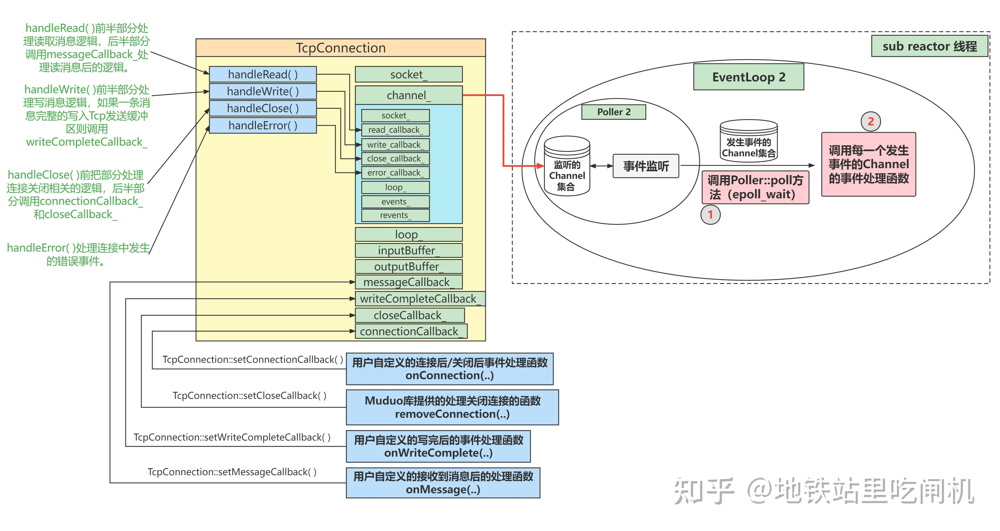

# 整体分析
服务器性能杀手：
* 数据拷贝
* 缓存
* 线程切换开销
* 环境切换
* 多核服务器性能
* 内存分配
* 锁竞争


为了业务负载均衡，使用任务服务器。

缓存选择分布式缓存Redis，服务器使用分布式设计的APP部署。缓存减少对数据库的频繁访问。

DAL指任务队列+线程池，将数据访问任务进行整理并访问数据库

数据库采用分布式主从部署，数据表分为用户，业务和基础，可以采用水平分割。优化：一致性要求比较高的数据不用关系型数据库存储，并发性没有要求较高的也可以使用nosql等数据库。nosql支持分布式文件系统DFS，以及分布式计算mapreduce。

服务器请求分离：


# muduo
## 自己理解
### 模块分析
#### class Channel : noncopyable
继承的noncopyable类：
```c++
#ifndef MUDUO_BASE_NONCOPYABLE_H
#define MUDUO_BASE_NONCOPYABLE_H

namespace muduo
{

class noncopyable{
public:
    noncopyable(const noncopyable&) = delete;
    void operator=(const noncopyable&) = delete;

protected:
    noncopyable() = default;
    ~noncopyable() = default;
};

}

#endif
```

如果子类的构造函数没有显式地调用父类的构造，则将会调用父类的无参构造函数。也就是说，父类的无参构造函数将会被隐式地调用。

父类只声明了带参构造函数，要特别注意。因为父类只有带参的构造函数，所以如果子类中的构造函数没有显示地调用父类的带参构造函数，则会报错，所以必需显示地调用。这样，在子类的构造函数被调用时，系统就会去调用父类的带参构造函数，从而实现初始化父类的成员变量。

父类同时声明了无参和带参构造函数，子类只需要实现父类的一个构造函数即可，不管是无参的还是带参的构造函数。如果子类的构造函数没有显示地调用父类的构造函数(无参或带参)，则默认调用父类的无参构造函数。

上面代码通过继承父类noncopyable会同样将子类拷贝构造函数禁止。但是子类依然可以任意的书写带参数的自己的构造函数，无参构造函数则和父类一样使用默认构造方法。

上面代码也可以拓展到copyable类。


#### log日志记录
```c++
//级别
class Logger  //该类中只有一个供外部访问的enum，定义了log记录级别
{
 public:
  enum LogLevel
  {
    TRACE,
    DEBUG,
    INFO,
    WARN,
    ERROR,
    FATAL,
    NUM_LOG_LEVELS,
  };
} 

//定义错误输入流
#define LOG_TRACE if (muduo::Logger::logLevel() <= muduo::Logger::TRACE) \
  muduo::Logger(__FILE__, __LINE__, muduo::Logger::TRACE, __func__).stream()
#define LOG_DEBUG if (muduo::Logger::logLevel() <= muduo::Logger::DEBUG) \
  muduo::Logger(__FILE__, __LINE__, muduo::Logger::DEBUG, __func__).stream()
#define LOG_INFO if (muduo::Logger::logLevel() <= muduo::Logger::INFO) \
  muduo::Logger(__FILE__, __LINE__).stream()
#define LOG_WARN muduo::Logger(__FILE__, __LINE__, muduo::Logger::WARN).stream()
#define LOG_ERROR muduo::Logger(__FILE__, __LINE__, muduo::Logger::ERROR).stream()
#define LOG_FATAL muduo::Logger(__FILE__, __LINE__, muduo::Logger::FATAL).stream()
#define LOG_SYSERR muduo::Logger(__FILE__, __LINE__, false).stream()
#define LOG_SYSFATAL muduo::Logger(__FILE__, __LINE__, true).stream()

//使用，顺路观看一下eventloop调用epollloop的update行为
void EPollPoller::updateChannel(Channel* channel)
{
  Poller::assertInLoopThread();
  const int index = channel->index();
  LOG_TRACE << "fd = " << channel->fd()     //该处使用日志
    << " events = " << channel->events() << " index = " << index;
  if (index == kNew || index == kDeleted)
  {
    // a new one, add with EPOLL_CTL_ADD
    int fd = channel->fd();
    if (index == kNew)
    {
      assert(channels_.find(fd) == channels_.end());
      channels_[fd] = channel;    //在map中加入channel记录
    }
    else // index == kDeleted
    {
      assert(channels_.find(fd) != channels_.end());
      assert(channels_[fd] == channel);
    }

    channel->set_index(kAdded);
    update(EPOLL_CTL_ADD, channel);   //并将channel中的fd和事件挂到epoll上
  }
  else
  {
    // update existing one with EPOLL_CTL_MOD/DEL
    int fd = channel->fd();
    (void)fd;
    assert(channels_.find(fd) != channels_.end());
    assert(channels_[fd] == channel);
    assert(index == kAdded);
    if (channel->isNoneEvent())
    {
      update(EPOLL_CTL_DEL, channel);     
      channel->set_index(kDeleted);
    }
    else
    {
      update(EPOLL_CTL_MOD, channel);
    }
  }
}
```

#### 核心之reactor循环和事件响应
```c++
//reactor循环
void EventLoop::loop()
{
  assert(!looping_);
  assertInLoopThread();
  looping_ = true;
  quit_ = false;  // FIXME: what if someone calls quit() before loop() ?
  LOG_TRACE << "EventLoop " << this << " start looping";

  while (!quit_)
  {
    activeChannels_.clear();
    pollReturnTime_ = poller_->poll(kPollTimeMs, &activeChannels_);  //输入输出函数，将activechannel返回
    ++iteration_;
    if (Logger::logLevel() <= Logger::TRACE)
    {
      printActiveChannels();
    }
    // TODO sort channel by priority
    eventHandling_ = true;
    for (Channel* channel : activeChannels_)
    {
      currentActiveChannel_ = channel;
      currentActiveChannel_->handleEvent(pollReturnTime_);
    }
    currentActiveChannel_ = NULL;
    eventHandling_ = false;
    doPendingFunctors();
  }

  LOG_TRACE << "EventLoop " << this << " stop looping";
  looping_ = false;
}


//事件响应
Timestamp EPollPoller::poll(int timeoutMs, ChannelList* activeChannels)
{
  LOG_TRACE << "fd total count " << channels_.size();
  int numEvents = ::epoll_wait(epollfd_,
                               &*events_.begin(),
                               static_cast<int>(events_.size()),
                               timeoutMs);
  int savedErrno = errno;
  Timestamp now(Timestamp::now());
  if (numEvents > 0)
  {
    LOG_TRACE << numEvents << " events happened";
    fillActiveChannels(numEvents, activeChannels);
    if (implicit_cast<size_t>(numEvents) == events_.size())
    {
      events_.resize(events_.size()*2);
    }
  }
  else if (numEvents == 0)
  {
    LOG_TRACE << "nothing happened";
  }
  else
  {
    // error happens, log uncommon ones
    if (savedErrno != EINTR)
    {
      errno = savedErrno;
      LOG_SYSERR << "EPollPoller::poll()";
    }
  }
  return now;
}
```


#### 目前对架构和模块较为掌握，但是对回调函数的功能封装和接口暴露还不确定
以下是调用库开发的代码，可以帮助理解暴露的接口
```c++
int main()
{
    EventLoop loop;
    //这个EventLoop就是main EventLoop，即负责循环事件监听处理新用户连接事件的事件循环器。第一章概述篇的图2里面的EventLoop1就是我们的main EventLoop。
    
    InetAddress addr(4567);
    //InetAddress其实是对socket编程中的sockaddr_in进行封装，使其变为更友好简单的接口而已。
    
    EchoServer server(&loop, addr, "EchoServer-01");
    //EchoServer类，自己等一下往下翻一下。
    
    server.start(); 
    //启动TcpServer服务器
    
    loop.loop(); //执行EventLoop::loop()函数，这个函数在概述篇的EventLoop小节有提及，自己去看一下！！
    return 0;
}

class EchoServer
{
public:
    EchoServer(EventLoop *loop,
            const InetAddress &addr, 
            const std::string &name)
        : server_(loop, addr, name)
        , loop_(loop)
    {
        server_.setConnectionCallback(
            std::bind(&EchoServer::onConnection, this, std::placeholders::_1)
        );
        // 将用户定义的连接事件处理函数注册进TcpServer中，TcpServer发生连接事件时会执行onConnection函数。
            
        server_.setMessageCallback(
            std::bind(&EchoServer::onMessage, this,
                std::placeholders::_1, std::placeholders::_2, std::placeholders::_3)
        );
        //将用户定义的可读事件处理函数注册进TcpServer中，TcpServer发生可读事件时会执行onMessage函数。

        
        server_.setThreadNum(3);
        //设置sub reactor数量，你这里设置为3，就和概述篇图2中的EventLoop2 EventLoop3 EventLoop4对应，有三个sub EventLoop。
    }
    void start(){
        server_.start();
    }
private:
    void onConnection(const TcpConnectionPtr &conn)
    {
        //用户定义的连接事件处理函数：当服务端接收到新连接建立请求，则打印Connection UP，如果是关闭连接请求，则打印Connection Down
        if (conn->connected())
            LOG_INFO("Connection UP : %s", conn->peerAddress().toIpPort().c_str());
        else
            LOG_INFO("Connection DOWN : %s", conn->peerAddress().toIpPort().c_str());
    }

    void onMessage(const TcpConnectionPtr &conn,
                   Buffer *buf,
                   Timestamp time)
    {
        //用户定义的可读事件处理函数：当一个Tcp连接发生了可读事件就把它这个接收到的消息原封不动的还回去
        std::string msg = buf->retrieveAllAsString();
        conn->send(msg);	
        conn->shutdown(); 
    }
    EventLoop *loop_;
    TcpServer server_;
};
```


#### Socket和SocketOps
SocketOps是对Socket进行错误处理和记录log，我们使用bind的时候调用函数sockets::bindOrDie(sockfd_, addr.getSockAddr());来进行socket操作。


#### Acceptor和Connection的创建和回调函数
```c++
Acceptor::Acceptor(EventLoop* loop, const InetAddress& listenAddr, bool reuseport)
  : loop_(loop),   //绑定主线程循环
    acceptSocket_(sockets::createNonblockingOrDie(listenAddr.family())), //创建接收
    acceptChannel_(loop, acceptSocket_.fd()),  //创建Channel并绑定loop，关键在绑定loop后loop如何调用该Channel回调函数
    listening_(false),
    idleFd_(::open("/dev/null", O_RDONLY | O_CLOEXEC))
{
  assert(idleFd_ >= 0);
  acceptSocket_.setReuseAddr(true);
  acceptSocket_.setReusePort(reuseport);
  acceptSocket_.bindAddress(listenAddr);
  acceptChannel_.setReadCallback(
      std::bind(&Acceptor::handleRead, this));
}

//该函数是开启loop和使能Channel进行监听的函数
void Acceptor::listen()
{
  loop_->assertInLoopThread();
  listening_ = true;
  acceptSocket_.listen();
  acceptChannel_.enableReading();  //看下面
}

/*
在channel中有函数 void enableReading() { events_ |= kReadEvent; update(); }
其中update

void Channel::update()
{
  addedToLoop_ = true;
  loop_->updateChannel(this);
}
将this指针传递给对应loop，并由loop记录map和挂到epoll树上
*/

//上面解决了loop通过poll得到对应channel并执行回调函数，这里是定义acceptor的行为，并绑定到acceptorchannel作为channel的读事件响应，分离了功能，channel只管提供回调函数接口，不具体指定回调函数行为，而accept创建了一个具体channel类，并定义了它的回调函数行为。
//多说一句，在这个函数逻辑中，除了accept一个新客户端socket连接，还有创建新conntion的使命，但是由于connect的生命周期由server管理，因此accept采用传递的方式接收newConnectionCallback_
//这些回调函数的功能都是既定的，不需要暴露或自定义，因此都在private，需要自定义的是connection的行为
void Acceptor::handleRead()  
{
  loop_->assertInLoopThread();
  InetAddress peerAddr;
  //FIXME loop until no more
  int connfd = acceptSocket_.accept(&peerAddr);
  if (connfd >= 0)
  {
    // string hostport = peerAddr.toIpPort();
    // LOG_TRACE << "Accepts of " << hostport;
    if (newConnectionCallback_)
    {
      newConnectionCallback_(connfd, peerAddr);
    }
    else
    {
      sockets::close(connfd);
    }
  }
  else
  {
    LOG_SYSERR << "in Acceptor::handleRead";
    // Read the section named "The special problem of
    // accept()ing when you can't" in libev's doc.
    // By Marc Lehmann, author of libev.
    if (errno == EMFILE)
    {
      ::close(idleFd_);
      idleFd_ = ::accept(acceptSocket_.fd(), NULL, NULL);
      ::close(idleFd_);
      idleFd_ = ::open("/dev/null", O_RDONLY | O_CLOEXEC);
    }
  }
}
```

#### connection的事件的回调函数
在其他解释中将acceptor和connection放到同级别其实不完全正确，acceptor是一个功能类，只是作为一个操作者提供行为，但是connection中是有实际承载的`std::unique_ptr<Socket> socket_;  std::unique_ptr<Channel> channel_;` 作为一个物件的类，管理了连接的生命周期，传递给线程池运行。
```c++
//在创建connection时，为connection的回调函数
void TcpServer::newConnection(int sockfd, const InetAddress& peerAddr){
  loop_->assertInLoopThread();
  EventLoop* ioLoop = threadPool_->getNextLoop();   //选择承载任务的线程，可以通过各种算法实现，最简单的是随机分配，但是也可以做负载均衡
  char buf[64];
  snprintf(buf, sizeof buf, "-%s#%d", ipPort_.c_str(), nextConnId_);
  ++nextConnId_;
  string connName = name_ + buf;

  LOG_INFO << "TcpServer::newConnection [" << name_
           << "] - new connection [" << connName
           << "] from " << peerAddr.toIpPort();
  InetAddress localAddr(sockets::getLocalAddr(sockfd));
  // FIXME poll with zero timeout to double confirm the new connection
  // FIXME use make_shared if necessary
  TcpConnectionPtr conn(new TcpConnection(ioLoop,   //创建connection并初始化
                                          connName,
                                          sockfd,
                                          localAddr,
                                          peerAddr));
  connections_[connName] = conn;
  conn->setConnectionCallback(connectionCallback_);   //设置connection的各种回调函数
  conn->setMessageCallback(messageCallback_);
  conn->setWriteCompleteCallback(writeCompleteCallback_);
  conn->setCloseCallback(         //关闭并销毁connection的函数生命周期由TcpServer管理
      std::bind(&TcpServer::removeConnection, this, _1)); // FIXME: unsafe 考虑是否有多个线程同时会调用这个的情况，一个连接任务按道理不应当分配给不同的线程处理，直到它断开连接被清理了后，重新接入才会被重新分配到线程循环中。
  ioLoop->runInLoop(std::bind(&TcpConnection::connectEstablished, conn));   //将任务加入子线程
}

/*
传递途径
TcpServer::TcpServer(EventLoop* loop,
                     const InetAddress& listenAddr,
                     const string& nameArg,
                     Option option)
  : loop_(CHECK_NOTNULL(loop)),
    ipPort_(listenAddr.toIpPort()),
    name_(nameArg),
    acceptor_(new Acceptor(loop, listenAddr, option == kReusePort)),
    threadPool_(new EventLoopThreadPool(loop, name_)),
    connectionCallback_(defaultConnectionCallback),
    messageCallback_(defaultMessageCallback),
    nextConnId_(1)
*/

//注意一下这两个函数的作用域，这个函数写在connection中，但是其实写在哪都可以，只是这里方便逻辑管理
void muduo::net::defaultConnectionCallback(const TcpConnectionPtr& conn)
{
  LOG_TRACE << conn->localAddress().toIpPort() << " -> "
            << conn->peerAddress().toIpPort() << " is "
            << (conn->connected() ? "UP" : "DOWN");
  // do not call conn->forceClose(), because some users want to register message callback only.
}

void muduo::net::defaultMessageCallback(const TcpConnectionPtr&,
                                        Buffer* buf,
                                        Timestamp)
{
  buf->retrieveAll();
}
```

用户会自定义 [连接建立/关闭后的处理函数] 、[收到消息后的处理函数]、[消息发送完后的处理函数]以及Muduo库中定义的[连接关闭后的处理函数]。这四个函数都会分别注册给这四个成员变量保存。




针对上图中的handleRead函数：

```c++
void TcpConnection::handleRead(Timestamp receiveTime)  //当子loop中读事件发生后，调用channel回调函数，即调用了connection中注册的这个函数
{
  loop_->assertInLoopThread();
  int savedErrno = 0;
  ssize_t n = inputBuffer_.readFd(channel_->fd(), &savedErrno);  //将数据读到buff里
  if (n > 0)
  {
    messageCallback_(shared_from_this(), &inputBuffer_, receiveTime);  //再调用用户自定义处理程序
  }
  else if (n == 0)
  {
    handleClose();
  }
  else
  {
    errno = savedErrno;
    LOG_SYSERR << "TcpConnection::handleRead";
    handleError();
  }
}
```

请学习上面图中分析类的画法，非常清晰

#### buffer设计


对于读取并写进buffer的函数，该函数被上面的connection对象作为回调函数调用：
```c++
ssize_t Buffer::readFd(int fd, int* saveErrno)
{
    char extrabuf[65536] = {0}; //栈上的内存空间
    struct iovec vec[2];
    const size_t writableSpace = writableBytes(); //可写缓冲区的大小
    vec[0].iov_base = begin() + writerIndex_; //第一块缓冲区
    vec[0].iov_len = writableSpace; //当我们用readv从socket缓冲区读数据，首先会先填满这个vec[0],也就是我们的Buffer缓冲区
    vec[1].iov_base = extrabuf; //第二块缓冲区，如果Buffer缓冲区都填满了，那就填到我们临时创建的
    vec[1].iov_len = sizeof(extrabuf); //栈空间上。
    const int iovcnt = (writableSpace < sizeof(extrabuf) ? 2 : 1);
    const ssize_t n = ::readv(fd, vec, iovcnt); 
    if(n < 0){
        *saveErrno = errno; //出错了！！
    }
    else if(n <= writableSpace){ //说明Buffer空间足够存了
        writerIndex_ += n;  //
    }
    else{ //Buffer空间不够存，需要把溢出的部分（extrabuf）倒到Buffer中（会先触发扩容机制）
        writerIndex_ = buffer_.size();
        append(extrabuf, n-writableSpace);
    }
    return n;
}
```

剖析这个函数是因为这个函数的设计有可取之处。这个readFd巧妙的设计，可以让用户一次性把所有TCP接收缓冲区的所有数据全部都读出来并放到用户自定义的缓冲区Buffer中。
用户自定义缓冲区Buffer是有大小限制的，我们一开始不知道TCP接收缓冲区中的数据量有多少，如果一次性读出来会不会导致Buffer装不下而溢出。所以在readFd( )函数中会在栈上创建一个临时空间extrabuf，然后使用readv的分散读特性，将TCP缓冲区中的数据先拷贝到Buffer中，如果Buffer容量不够，就把剩余的数据都拷贝到extrabuf中，然后再调整Buffer的容量(动态扩容)，再把extrabuf的数据拷贝到Buffer中。当这个函数结束后，extrabuf也会被释放。另外extrabuf是在栈上开辟的空间，速度比在堆上开辟还要快。

#### 连接断开
被动断开连接：
服务端TcpConnection::handleRead()中感知到客户端把连接断开了。
TcpConnection::handleRead( )函数内部调用了Linux的函数readv( )，当readv( )返回0的时候，服务端就知道客户端断开连接了。然后就接着调用TcpConnection::handleClose( )。


TcpServer::removeConnection( )函数调用了remvoveConnectionInLoop( )函数，该函数的运行是在MainEventLoop线程中执行的，这里涉及到线程切换技术。

删除的行为是：先在mainloop中将map中的connect记录删除，再connection自己了断

服务器主动断开连接：


所有上面的TcpServer::~TcpServer()函数就是干这事儿的，不断循环的让这个TcpConnection对象所属的SubEventLoop线程执行TcpConnection::connectDestroyed()函数，同时在MainEventLoop的TcpServer::~TcpServer()函数中调用item.second.reset()释放保管TcpConnection对象的共享智能指针，以达到释放TcpConnection对象的堆内存空间的目的。

这里最精妙的就是使用了共享指针来放connection而不是独占指针，共享指针实现了值传递这个功能`TcpConnectionPtr conn(item.second);`，这件事实现了增加一计数，然后减少一计数，调用子线程中每个connection自己去析构，最后出了作用域，这个指针也消除，实现了清除。

但是这里面其实有一个问题需要解决，TcpConnection::connectDestroyed()函数的执行以及这个TcpConnection对象的堆内存释放操作不在同一个线程中运行，所以要考虑怎么保证一个TcpConnectino对象的堆内存释放操作是在TcpConnection::connectDestroyed()调用完后。
这个析构函数巧妙**利用了共享智能指针的特点**，当没有共享智能指针指向这个TcpConnection对象时（引用计数为0），这个TcpConnection对象就会被析构删除（堆内存释放）。

如果不管不顾，就只是直接结束进程的话，那么主线程用共享指针new出来的对象就无法正确的回收。


#### 单一线程逻辑
```c++
//在一个线程以内，只有一个loop
void EventLoop::loop()
{
  assert(!looping_);
  assertInLoopThread();
  looping_ = true;
  quit_ = false;  // FIXME: what if someone calls quit() before loop() ?
  LOG_TRACE << "EventLoop " << this << " start looping";

  while (!quit_)  
  {
    activeChannels_.clear();
    pollReturnTime_ = poller_->poll(kPollTimeMs, &activeChannels_);  //传入传出函数实现取出事件的channel
    ++iteration_;
    if (Logger::logLevel() <= Logger::TRACE)
    {
      printActiveChannels();
    }
    // TODO sort channel by priority
    eventHandling_ = true;
    for (Channel* channel : activeChannels_)   //顺序执行事件回调函数，架构和具体执行功能分离
    {
      currentActiveChannel_ = channel;
      currentActiveChannel_->handleEvent(pollReturnTime_);
    }
    currentActiveChannel_ = NULL;
    eventHandling_ = false;
    doPendingFunctors();   //多出的这个很关键，它是用来执行服务器主动的函数而不是由连接的终端发生事件来驱动的，就比如执行关闭connection
  }

  LOG_TRACE << "EventLoop " << this << " stop looping";
  looping_ = false;
}


//doPendingFunctors();函数的内容，从pendingFunctors_队列
void EventLoop::doPendingFunctors()
{
  std::vector<Functor> functors;
  callingPendingFunctors_ = true;

  {
  MutexLockGuard lock(mutex_);  //保证交换的时候没有其他的任务正在加入，但是这是单线程执行的，仔细想想是否会有其他线程对该队列进行同时添加，注意上面服务器被动断开连接中的bind出现了线程切换。
  functors.swap(pendingFunctors_);  
  }

  for (const Functor& functor : functors)
  {
    functor();
  }
  callingPendingFunctors_ = false;
}


//添加任务到pendingFunctors_队列中的逻辑
void EventLoop::runInLoop(Functor cb)
{
  if (isInLoopThread())
  {
    cb();
  }
  else
  {
    queueInLoop(std::move(cb));
  }
}

void EventLoop::queueInLoop(Functor cb)
{
  {
  MutexLockGuard lock(mutex_);
  pendingFunctors_.push_back(std::move(cb));
  }

  if (!isInLoopThread() || callingPendingFunctors_)
  {
    wakeup();
  }
}
```
现在看了这段代码，有一个问题了：为什么上面的currentActiveChannel_->handleEvent(pollReturnTime_);调用连接断开回调函数TcpConnection::handle_Close()不直接执行断开的代码，而是执行的将断开连接的函数绑定到EventLoop::runInLoop上呢？

答：因为要等待把这次epoll返回的事件全部执行完了之后，再执行关闭，即for (Channel* channel : activeChannels_)完了之后，在调用函数doPendingFunctors();

#### c++11中shared_from_this
```c++
//一个类
class C{
public:
    C(int b=10):a(b) { cout<<"construct"<<endl; }
    ~C(){ cout<<"destruct"<<endl; }

    void show() const { cout<<"a = "<<a<<endl; }

    C* object_ptr() { return this; }  //传递类的this指针

private:
    int a;
};

//共享指针
int main(){
    shared_ptr<C> p1(new C(999));   //创建了一个实例并p1指向它
    cout<<p1.use_count()<<endl;
    shared_ptr<C> p2(p1->object_ptr());  //p2指向的地址和p1一致，但是p2不知道
    cout<<p2.use_count()<<endl;
    return 0;
}

//出作用域时执行情况
construct
destruct
destruct //p2再次delete相同的地址导致出现错误
free(): double free detected in tcache 2
已放弃 (核心已转储)

//解决方法
class C :public enable_shared_from_this<C>{  //记得要继承这个类
public:
    C(int b=10):a(b){ cout<<"construct"<<endl; }
    ~C(){ cout<<"destruct"<<endl; }
    void show()const{ cout<<"a = "<<a<<endl; }
    //C*object_ptr(){ return this; }
    shared_ptr<C> object_ptr(){
        return shared_from_this();
    }
private:
    int a;
};

//正确输出
construct
1
2  //p2可以感知到重复指向该地址
destruct

```


### cmake学习

cmake基础
```cmake
cmake_minimum_required(VERSION 3.15)  

# set the project name
project(Tutorial)

SET(SRC_LIST tutorial.cpp)

# add the executable
add_executable(${PROJECT_NAME} ${SRC_LIST})  # 编译成执行程序的代码
```
在net文件夹下的cmake内容是将cpp文件打包为库，供给其他函数调用
```cmake
set(net_SRCS   #为c代码集合起名
  Acceptor.cc
  Buffer.cc
  Channel.cc
  Connector.cc
  EventLoop.cc
  EventLoopThread.cc
  EventLoopThreadPool.cc
  InetAddress.cc
  Poller.cc
  poller/DefaultPoller.cc
  poller/EPollPoller.cc
  poller/PollPoller.cc
  Socket.cc
  SocketsOps.cc
  TcpClient.cc
  TcpConnection.cc
  TcpServer.cc
  Timer.cc
  TimerQueue.cc
  )

add_library(muduo_net ${net_SRCS})   # 加入库并起名为muduo_net，关键：库文件都是提供接口等待调用
target_link_libraries(muduo_net muduo_base)   # 链接库
```
在muduo根目录下的cmake中有这么一段：
```cmake
add_subdirectory(muduo/base)  //把链接库的文件夹加入，指定库所在子目录
add_subdirectory(muduo/net)
```

在example/simple文件夹下有可执行文件的cmake：
```cmake
add_executable(simple_echo echo/echo.cc echo/main.cc)  //生成执行文件simple_echo
target_link_libraries(simple_echo muduo_net)     //将库文件添加到可执行文件上
```

命令选择库
```cmake
# only build examples if this is the main project
if(CMAKE_PROJECT_NAME STREQUAL "muduo")
  option(MUDUO_BUILD_EXAMPLES "Build Muduo examples" ON)
endif()


```