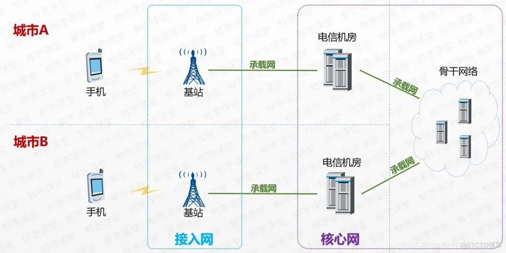
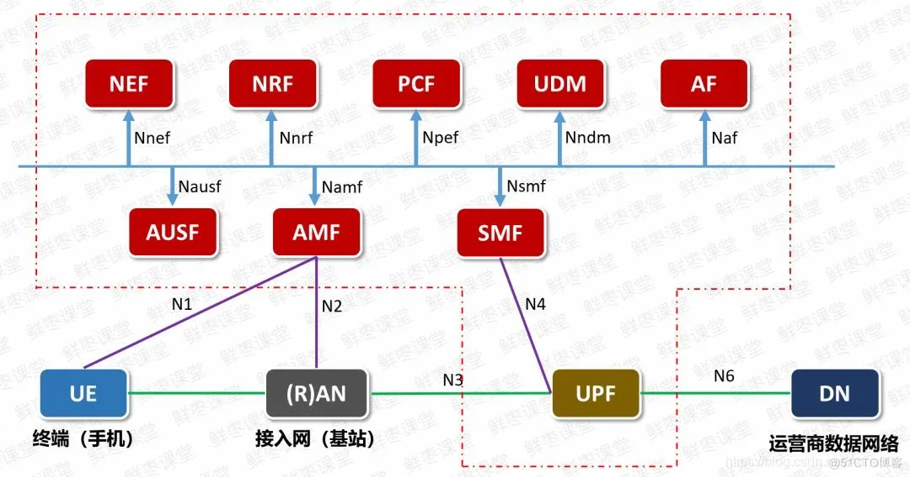
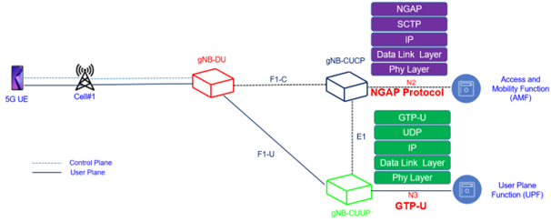
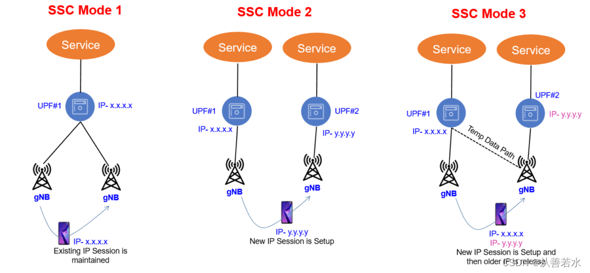
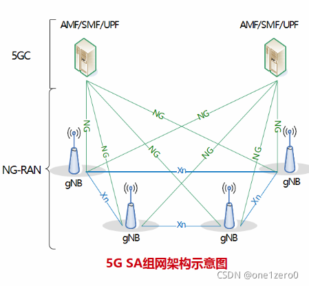
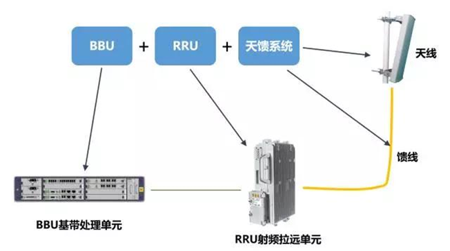
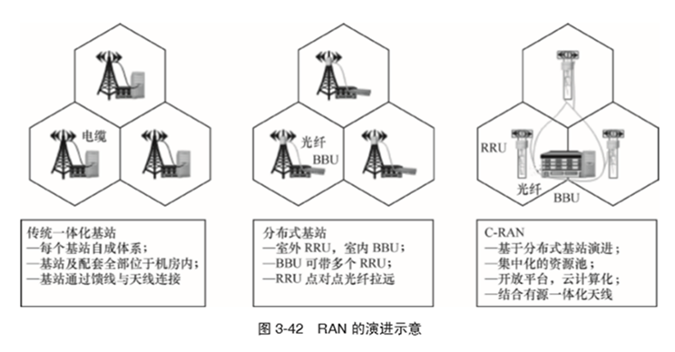

# 随记知识点和理解

## 基站核心网的部署方式
分别应该从架构角度和物理部署角度来分析。

### 架构角度
从宏观来看的架构：

描述了这三个网的关系，OAI_RAN就是接入网部分，CN为核心网，接入网是横向的，也可以将其归纳于下面从物理角度去分析的网络结构。

#### 核心网结构

其中各模块可以分开部署，并且模块间使用基于服务的方式交互。通信方式依赖于“HTTP REST范式”，不同网元之间的通信如下：**发起请求的网元为服务使用者，被请求功能的网元扮演服务提供者。**

重点关注AMF，SMF，UPF之间的联系。如果一个终端希望通过基站连接到互联网，那么下面这张图为主要部分：

实际的用户数据通过UPF传递，连接到互联网，而AMF和SMF是控制的网元。

* AMF（Access and Mobility Management Function，接入及移动性管理功能），负责用户的移动性和接入管理。

* SMF（Session Management Function，会话管理功能）5G网络的QoS模型中，SMF是执行会话管理QoS控制的网络功能实体，5G网络下，用户的签约信息结合PCF中的运营商策略控制信息来决定终端QoS。计费也是它，可以调控UE数据传输量。

* AUSF、UDM：负责数据管理；UDM负责前台数据的统一处理，包括用户标志、用户签约数据、鉴权数据等；AUSF配合UDM专门处理鉴权数据相关的处理。
* UPF：用户平面功能，主要用于连接外部数据网络的协议数据单元（protocol data unit, PDU）,即与UE进行数据层面的连接，控制UE的上下行数据。

核心网中的移动性：5G SSC(Session and Service Continuity)模式，5G系统架构提供三种类型的会话和业务连续性(SSC)模式，以满足不同应用/业务的各种连续性需求。一旦SSC模式与PDU会话相关联，那么它在PDU会话的生命周期内不会改变。以确保用户的不间断服务体验，而**不受任何UE IP地址或核心网锚点的变化。**

请注意核心网移动性和基站移动性是不一样的概念，看下图：

一个UPF会连接很多很多的基站，百万级的UE。而基站的移动性是通过Xn接口实现的。

### 物理部署角度
名词理解：

基站一般可分为三部分：BBU（基带处理单元）、RRU（射频拉远单元）和天线。在1G和2G时代，BBU，RRU和供电单元等设备是放在一个柜子里的；到了3G时代，提出了分布式基站，也就是将BBU和RRU分离，RRU甚至可以挂在天线下边，不必与BBU放在同一个机柜里，这就是**D-RAN（分布式无线接入网）**。4G基站基本上延续了3G的D-RAN结构；AAU即为天线加RRU的统称。

**C-RAN（Centralized RAN）集中化无线接入网**；继续采取BBU和RRU分离的方案，但是RRU无限接近于天线，这样大大减少了通过馈线（天线与RRU的连接）的衰减；同时BBU迁移并**集中于CO（中心机房）**，形成BBU基带池；而CO与RRU通过前传网络连接。这样非常有利于小区间协同工作。

C-RAN是基于集中化处理、协作无线电、实时云计算的绿色无线接入网架构，其基本思想是通过充分利用低成本高速光传输，直接在远端天线与集中化的中心节点间传递无线信号，以构建覆盖上百个基站服务区域，甚至上百平方公里的无线接入系统。C-RAN架构适用于协同技术，能够减少干扰，降低功率，提升频谱效率。实现动态智能化组网，有利于降低成本，便于维护和减少运营支出。目前的研究内容包括C-RAN的架构和功能，如BBU基带池、RRU(射频拉远模块)接口定义以及基于C-RAN的更紧密协作(如基站族、虚拟小区等)。

从RRU到BBU之间的传输**叫做“前传”**，一般采用CPRI/eCPRI接口；这一部分通常使用光纤进行传输。

关于BBU的分割方式，也可以分为CU和DU，前传：RRU-DU，中传：DU-CU，回传：CU以上。

功能：

* RRU负责无线信号的射频处理和传输。

* BBU负责处理数字信号处理(DSP)和无线信号的基带处理。

