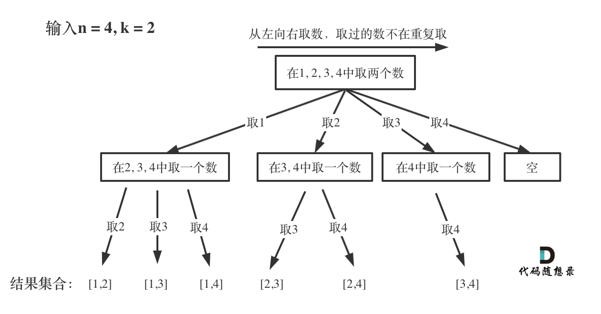
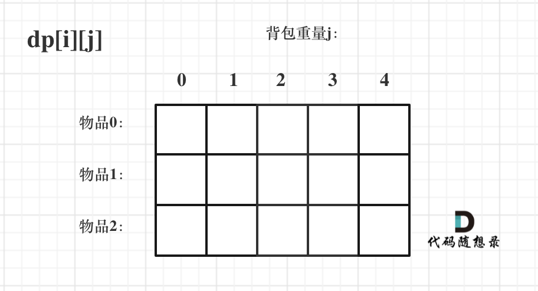
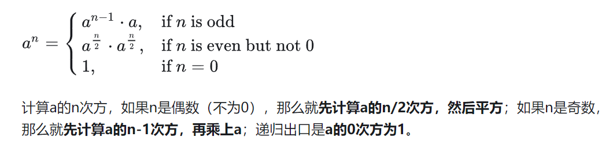
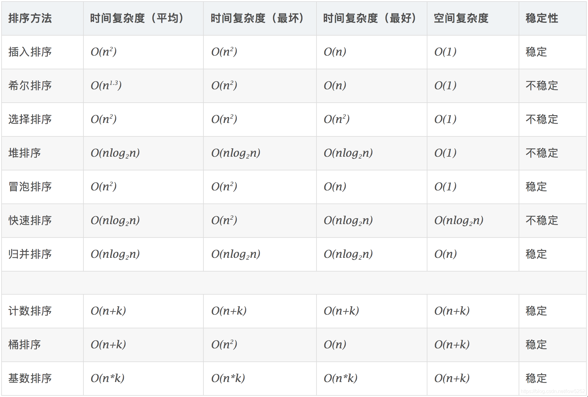

# 用到的基本函数
```c++
sort(nums.begin(), nums.end());   //排序

reverse(nums.begin(), nums.end());  //反转

string s += "->";  //字符串添加

//字符串切割（左闭右开）
String str = "我爱 Java 编程";
String result = str.substring(3,6);
System.out.println(result);		//输出：Jav

//和上面分割同义的函数
str.substr(3, 3);
str.substr(3, 5-3+1);  //尾减去头加一

//去尾巴
vector<int> vec;
vec.resize(5);   //大小为5

//插入字符
s.insert(s.begin() + i + 1 , '.');  // 在i的后面插入一个逗点

//删除字符
s.erase(s.begin() + i + 1);         // 回溯删掉逗点


//翻转字符串
reverse(s.begin(), s.end());  //左闭右开
```

# C++和C字符串转换
```c++
//char[] 转 char*
char ch[]="abcdef";
char *s = ch;

//char* 转 char[]
char *s="abcdef";
char ch[100];
strcpy(ch,s);

//string 转 char[]
string str= "abcdef";
char ch[20];
int i;
for( i=0;i<str.length();i++){
    ch[i] = str[i];
}
p[i] = '\0';     

//char[] 转 string
string str;
char ch[20] = "abcdef";
str = ch;

//string 转 char* data()仅返回字符串内容，而不含有结束符’\0’
string str = "abcdef";
const char* p = str.data();
//使用char * p=(char*)str.data()效果相同
string str=“abcdef”;
const char *p = str.c_str();
//使用char * p=(char*)str.c_str()效果相同

//char* 转 string
string str;
char *p = "abcdef";
str = p;

char *p = "abcdef";
string str;
str.assign(p,strlen(p));
```

# 常用方法
```c++
//字符串转数值
for(int i = 0; i < s.size(); i++) {
	num = num * 10 + (s[i] - '0');
}
//atoi(num);

//数值转字符串
while(num > 0) {
	s[i++] = num % 10 + '0';
	num = num / 10;
}
while(i){
	res[j++] = s[--i];
}
//reverse(s.begin(), s.end());

//to_string(num);
```

# 数据结构的操作函数
```
string:

length() / size()：返回字符串的长度。
empty()：检查字符串是否为空。
clear()：清空字符串内容。
append() / push_back()：在字符串末尾添加字符或字符串。
insert()：在指定位置插入字符或字符串。
erase()：删除指定位置或范围内的字符。
replace()：替换指定范围内的字符或字符串。
substr()：返回子字符串。
find() / rfind()：在字符串中查找指定子字符串，返回第一个匹配位置的索引。
find_first_of() / find_last_of()：在字符串中查找任意字符集合的第一个/最后一个匹配位置。
find_first_not_of() / find_last_not_of()：在字符串中查找不在指定字符集合中的第一个/最后一个字符位置。
compare()：按字典顺序比较两个字符串。
std::stoi(string);//将字符串转换成int
std::to_string(int); //将int转换成string
```

```
vector

size() / empty()：返回向量的大小或检查向量是否为空。
push_back() / pop_back()：在向量末尾添加元素或删除最后一个元素。
clear()：清空向量中的所有元素。
insert()：在指定位置插入元素或另一个向量的元素。
erase()：删除指定位置或范围内的元素。
swap()：交换两个向量的内容。
at() / operator[]：访问指定位置的元素。
front() / back()：访问第一个和最后一个元素。
```

```
#include <set>

//初始化
set<int>s;
set<int>s2(s);  
set<int>s2(s.begin(),s.end())
   
int myints[]= {10,20,30,40,50};
set<int>s(myints,myints+5); 

//常用操作
s.begin();            // 返回指向第一个元素的迭代器
s.end();              // 返回指向迭代器的最末尾处（即最后一个元素的下一个位置）
s.clear();            // 清除所有元素
s.count();            // 返回某个值元素的个数
s.empty();            // 如果集合为空，返回true
s.insert(x);          //向set中插入元素

```

```
map:

insert()：将键值对插入到 map 中。
erase()：删除指定键的元素。
clear()：清空 map 中的所有元素。
find()：查找具有指定键的元素，并返回指向该元素的迭代器。
size() / empty()：返回 map 中元素的数量或检查 map 是否为空。
begin() / end()：返回指向第一个和最后一个元素的迭代器，用于遍历 map。
operator[]：通过键访问元素的值，如果键不存在，则会插入一个默认构造的值并返回对应的引用。
at()：通过键访问元素的值，如果键不存在，则会抛出异常。
emplace()：用于在 map 中就地构造元素。
```

```
#include <queue>

queue<type>s;      //定义
q.empty();         //如果队列为空返回true, 否则返回false     
q.size();          //返回队列中元素的个数
q.front();         //返回队首元素但不删除该元素
q.pop();           //弹出队首元素但不返回其值
q.push();          //将元素压入队列
q.back();          //返回队尾元素的值但不删除该元素
```

```
#include <stack>

stack<type>s;     //定义
s.empty();        //如果栈空则返回true, 否则返回false
s.size();         //返回栈中元素的个数
s.top();          //返回栈顶元素, 但不删除该元素
s.pop();          //弹出栈顶元素, 但不返回其值
s.push();         //将元素压入栈顶

```

# set和map


```c++
/*
给定一个非空的整数数组，返回其中出现频率前 k 高的元素。

示例 1:

输入: nums = [1,1,1,2,2,3], k = 2
输出: [1,2]
示例 2:

输入: nums = [1], k = 1
输出: [1]
*/

class Solution {
public:
	vector<int> topKFrequent(vector<int>& nums, int k) {
		unordered_map<int, int> map;
		for (int n : nums) {
			map[n]++;
		}
		vector<pair<int, int>> vec(map.begin(), map.end());
		sort(vec.begin(), vec.end(), [](pair<int, int>& a, pair<int, int>& b) {a.second < b.second; });
		vector<int> res;
		for (int i = 0; i < k; i++) {
			res.push_back(vec[i].first);
		}
		return res;
	}
}solution;


//或者使用重载
bool operator()(const pair<int,int>& a, const pair<int,int>& b){
	return a.second > b.second;
}
```

# 树
## 前中后层序
```c++
class TreeNode {
public:
	int val;
	TreeNode* left;
	TreeNode* right;
	TreeNode(int x) : val(x), left(NULL), right(NULL) {}
};


//创建树
class BuildTree {
public:
	TreeNode* build() {
		TreeNode* root = new TreeNode(1);

		TreeNode* leftnode = new TreeNode(2);
		TreeNode* rightnode = new TreeNode(3);
		root->left = leftnode;
		root->right = rightnode;

		TreeNode* cur = root->left;
		cur->left = new TreeNode(4);
		cur->right = new TreeNode(5);

		return root;
	}
};


//层序方式创建树
class BuildTreeNum {
public:
	TreeNode* build(vector<int> vec) {
		int size = vec.size();
		vector<TreeNode*> node_vec;
		for (int i = 0; i < size; i++) {
			TreeNode* node = new TreeNode(vec[i]);
			node_vec.push_back(node);
		}

		queue<TreeNode*> que;
		if(node_vec.size() != 0) que.push(node_vec[0]);
		int index = 1;
		while (!que.empty()) {
			int quesize = que.size();
			for (int i = 0; i < quesize; i++) {
				TreeNode* cur = que.front();
				if (index < size) {
					que.push(node_vec[index]);
					cur->left = node_vec[index];
					index++;
					if (index < size) {
						que.push(node_vec[index]);
						cur->right = node_vec[index];
						index++;
					}
				}
				que.pop();
			}
		}
		return node_vec[0];
	}
};


class Solution {
public:
	//层序遍历
	vector<vector<int>> levelOrder(TreeNode* root) {
		vector<vector<int>> res;
		queue<TreeNode*> que;
		que.push(root);
		while (!que.empty()) {
			vector<int> vec;
			int size = que.size();
			for (int i = 0; i < size; i++) {
				TreeNode* cur = que.front();
				que.pop();
				vec.push_back(cur->val);

				if (cur->left) que.push(cur->left);
				if (cur->right) que.push(cur->right);
			}
			res.push_back(vec);
		}
		return res;
	}


	//前序遍历递归法
	void Traversal1(TreeNode* cur, vector<int>& vec) {
		if (cur == NULL) return;
		vec.push_back(cur->val);
		Traversal1(cur->left, vec);
		Traversal1(cur->right, vec);
	}

	//中序遍历递归
	void Travaersal2(TreeNode* cur, vector<int>& vec) {
		if (cur == NULL) return;
		Travaersal2(cur->left, vec);
		vec.push_back(cur->val);
		Travaersal2(cur->right, vec);
	}

	vector<int> preorderTraversal(TreeNode* root) {
		vector<int> res;
		Traversal1(root, res);
		return res;
	}

	//迭代遍历树
	//前序
	vector<int> perorder(TreeNode* root) {
		vector<int> res;
		stack<TreeNode*> st;
		st.push(root);
		while (!st.empty()) {
			TreeNode* cur = st.top();
			st.pop();
			res.push_back(cur->val);
			if (cur->right) st.push(cur->right);
			if (cur->left) st.push(cur->left);
		}
		return res;
	}

	//中序
	vector<int> midorder(TreeNode* root) {
		vector<int> res;
		stack<TreeNode*> st;
		TreeNode* cur = root;
		while (cur != NULL || !st.empty()) {
			if (cur != NULL) {
				st.push(cur);
				cur = cur->left;
			}
			else {
				cur = st.top();
				res.push_back(cur->val);
				st.pop();
				cur = cur->right;
			}
		}
		return res;
	}

	//后序
	vector<int> perorder(TreeNode* root) {
		vector<int> res;
		stack<TreeNode*> st;
		st.push(root);
		while (!st.empty()) {
			TreeNode* cur = st.top();
			st.pop();
			res.push_back(cur->val);
			if (cur->left) st.push(cur->left);
			if (cur->right) st.push(cur->right);
		}
		reverse(res.begin(), res.end());
		return res;
	}
}solution;
```

## 101树的深度
104.二叉树的最大深度
力扣题目链接(opens new window)

给定一个二叉树，找出其最大深度。

二叉树的深度为根节点到最远叶子节点的最长路径上的节点数。

说明: 叶子节点是指没有子节点的节点。

示例： 给定二叉树 [3,9,20,null,null,15,7]，深度为3

```c++
    //这个是后序遍历
	int maxDepth(TreeNode* root) {
		if (root == NULL) return 0;
		int leftdep = maxDepth(root->left);
		int rightdep = maxDepth(root->right);
		int dep = 1 + max(leftdep, rightdep);
		return dep;
	}

    //前序
	int result = 0;
	void maxDepth1(TreeNode* root, int depth) {
		if (root == NULL) return;
		result = max(depth, result);
		maxDepth1(root->left, depth + 1);
		maxDepth1(root->right, depth + 1);
	}

	//节点数量
	int maxNum(TreeNode* root) {
		if (root == NULL) return 0;
		int leftnum = maxNum(root->left);
		int rightnum = maxNum(root->right);
		int num = leftnum + rightnum + 1;
		return num;
	}


    //最小深度
	int getDepth(TreeNode* node) {
        if (node == NULL) return 0;
        int leftDepth = getDepth(node->left);  // 左
        int rightDepth = getDepth(node->right); // 右
                                                    
        // 当一个左子树为空，右不为空，这时并不是最低点
        if (node->left == NULL && node->right != NULL) { 
            return 1 + rightDepth;
        }   
        // 当一个右子树为空，左不为空，这时并不是最低点
        if (node->left != NULL && node->right == NULL) { 
            return 1 + leftDepth;
        }
        int result = 1 + min(leftDepth, rightDepth);
        return result;
    }


    //平衡二叉树判断的函数
	int getHigh(TreeNode* root) {
		if (root == NULL) return 0;

		int lhigh = getHigh(root->left);
		int rhigh = getHigh(root->right);
		if (lhigh == -1 || rhigh == -1) return -1;

		if (abs(lhigh - rhigh) > 1) return -1;
		else return max(lhigh, rhigh) + 1;
	}

	bool isBalanced(TreeNode* root) {
		return getHigh(root) == -1 ? false : true;
	}
```
### 深度与高度
关于二叉树深度和高度问题，深度是从上面开始计算起，向下增加，在遇到叶子返回时确定深度，主要运用回溯。典型的代码：

```c++
//513寻找左下角值
class Solution {
public:
    int maxDepth = INT_MIN;
    int result;
    void traversal(TreeNode* root, int depth) {
        if (root->left == NULL && root->right == NULL) {
            if (depth > maxDepth) {
                maxDepth = depth;
                result = root->val;
            }
            return;
        }
        if (root->left) {
            traversal(root->left, depth + 1); // 隐藏着回溯
        }
        if (root->right) {
            traversal(root->right, depth + 1); // 隐藏着回溯
        }
        return;
    }
    int findBottomLeftValue(TreeNode* root) {
        traversal(root, 0);
        return result;
    }
};
```

高度是从遇到叶子节点返回0开始，从下往上计数，主要运用递归的返回值，典型代码：
```c++
int maxDepth(TreeNode* root) {
		if (root == NULL) return 0;
		int leftdep = maxDepth(root->left);
		int rightdep = maxDepth(root->right);
		int dep = 1 + max(leftdep, rightdep);
		return dep;
	}
```

### 返回判断条件
是`if(cur == NULL) return;`，还是`if(!cur->left && !cur->right)`，主要看是否对叶子节点进行处理，如果需要选择后者。


## 450.删除二叉搜索树中的节点
本题关注回溯返回值的方式，以及删除一个树节点的方式。

```c++
class Solution {
public:
    TreeNode* deleteNode(TreeNode* root, int key) {
        if (root == nullptr) return root; // 第一种情况：没找到删除的节点，遍历到空节点直接返回了
        if (root->val == key) {
            // 第二种情况：左右孩子都为空（叶子节点），直接删除节点， 返回NULL为根节点
            if (root->left == nullptr && root->right == nullptr) {
                ///! 内存释放
                delete root;
                return nullptr;
            }
            // 第三种情况：其左孩子为空，右孩子不为空，删除节点，右孩子补位 ，返回右孩子为根节点
            else if (root->left == nullptr) {
                auto retNode = root->right;
                ///! 内存释放
                delete root;
                return retNode;
            }
            // 第四种情况：其右孩子为空，左孩子不为空，删除节点，左孩子补位，返回左孩子为根节点
            else if (root->right == nullptr) {
                auto retNode = root->left;
                ///! 内存释放
                delete root;
                return retNode;
            }
            // 第五种情况：左右孩子节点都不为空，则将删除节点的左子树放到删除节点的右子树的最左面节点的左孩子的位置
            // 并返回删除节点右孩子为新的根节点。
            else {
                TreeNode* cur = root->right; // 找右子树最左面的节点
                while(cur->left != nullptr) {
                    cur = cur->left;
                }
                cur->left = root->left; // 把要删除的节点（root）左子树放在cur的左孩子的位置
                TreeNode* tmp = root;   // 把root节点保存一下，下面来删除
                root = root->right;     // 返回旧root的右孩子作为新root
                delete tmp;             // 释放节点内存（这里不写也可以，但C++最好手动释放一下吧）
                return root;
            }
        }
        if (root->val > key) root->left = deleteNode(root->left, key);
        if (root->val < key) root->right = deleteNode(root->right, key);
        return root;
    }
};
```
注意这里的递归返回值为节点类型，可以总结为如果要对数本身的结构进行改变，可以考虑这种返回的方式，那么在删除或修剪或者添加时可以直接root = root->right;然后return root;


## 669.修剪二叉搜索树
注意学习的是这里的删除一个节点的方法，是通过返回节点直接跳过当前节点的方式来实现的。

给你二叉搜索树的根节点 root ，同时给定最小边界low 和最大边界 high。通过修剪二叉搜索树，使得所有节点的值在[low, high]中。修剪树 不应该 改变保留在树中的元素的相对结构 (即，如果没有被移除，原有的父代子代关系都应当保留)。 可以证明，存在 唯一的答案. 所以结果应当返回修剪好的二叉搜索树的新的根节点。注意，根节点可能会根据给定的边界发生改变。

```c++
class Solution {
public:
    TreeNode* trimBST(TreeNode* root, int low, int high) {
        if (root == nullptr ) return nullptr;
        if (root->val < low) {
            TreeNode* right = trimBST(root->right, low, high); // 寻找符合区间[low, high]的节点
            return right;
        }
        if (root->val > high) {
            TreeNode* left = trimBST(root->left, low, high); // 寻找符合区间[low, high]的节点
            return left;
        }
        root->left = trimBST(root->left, low, high); // root->left接入符合条件的左孩子
        root->right = trimBST(root->right, low, high); // root->right接入符合条件的右孩子
        return root;
    }
};
```

# 回溯
回溯法，一般可以解决如下几种问题：

* 组合问题：N个数里面按一定规则找出k个数的集合
* 切割问题：一个字符串按一定规则有几种切割方式
* 子集问题：一个N个数的集合里有多少符合条件的子集
* 排列问题：N个数按一定规则全排列，有几种排列方式
* 棋盘问题：N皇后，解数独等等

## 组合问题
记住一个图：


每次进入一次递归就横向循环递归，退出条件为深度达到。

剪枝的方法：
如果for循环选择的起始位置之后的元素个数 已经不足 我们需要的元素个数了，那么就没有必要搜索了。

已经选择的元素个数：path.size();

还需要的元素个数为: k - path.size();

在集合n中至多要从该起始位置 : n - (k - path.size()) + 1，开始遍历

为什么有个+1呢，因为包括起始位置，我们要是一个左闭的集合。

举个例子，n = 4，k = 3， 目前已经选取的元素为0（path.size为0），n - (k - 0) + 1 即 4 - ( 3 - 0) + 1 = 2。

从2开始搜索都是合理的，可以是组合[2, 3, 4]。

```c++
//for (int i = startIndex; i <= n; i++)
for (int i = startIndex; i <= n - (k - path.size()) + 1; i++) // i为本次搜索的起始位置
```

```c++
vector<vector<int>> res;
vector<int> path;
void backtracking(int n, int k, int startIndex) {
	if (path.size() == k) {
		res.push_back(path);
		return;
	}

	for (int i = startIndex; i <= n - (k - path.size()) + 1; i++) {
		path.push_back(i);
		backtracking(n, k, i + 1);
		path.pop_back();
	}
}

vector<vector<int>> combine(int n, int k) {
	backtracking(n, k, 1);
	return res;
	}
```

## 剪枝位置问题
以题目39为例：

```
给定一个无重复元素的数组 candidates 和一个目标数 target ，找出 candidates 中所有可以使数字和为 target 的组合。

candidates 中的数字可以无限制重复被选取。

说明：

所有数字（包括 target）都是正整数。
解集不能包含重复的组合。
示例 1：

输入：candidates = [2,3,6,7], target = 7,
所求解集为： [ [7], [2,2,3] ]
```

剪枝位置在进入递归下一层中判断：
```c++
class Solution {
private:
    vector<vector<int>> result;
    vector<int> path;
    void backtracking(vector<int>& candidates, int target, int sum, int startIndex) {
        if (sum > target) {
            return;
        }
        if (sum == target) {
            result.push_back(path);
            return;
        }

        for (int i = startIndex; i < candidates.size(); i++) {
            sum += candidates[i];
            path.push_back(candidates[i]);
            backtracking(candidates, target, sum, i); // 不用i+1了，表示可以重复读取当前的数
            sum -= candidates[i];
            path.pop_back();
        }
    }
public:
    vector<vector<int>> combinationSum(vector<int>& candidates, int target) {
        result.clear();
        path.clear();
        backtracking(candidates, target, 0, 0);
        return result;
    }
};
```

剪枝位置在横向循环中判断：
```c++
class Solution {
private:
    vector<vector<int>> result;
    vector<int> path;
    void backtracking(vector<int>& candidates, int target, int sum, int startIndex) {
        if (sum == target) {
            result.push_back(path);
            return;
        }

        // 如果 sum + candidates[i] > target 就终止遍历
        for (int i = startIndex; i < candidates.size() && sum + candidates[i] <= target; i++) {
            sum += candidates[i];
            path.push_back(candidates[i]);
            backtracking(candidates, target, sum, i);
            sum -= candidates[i];
            path.pop_back();

        }
    }
public:
    vector<vector<int>> combinationSum(vector<int>& candidates, int target) {
        result.clear();
        path.clear();
        sort(candidates.begin(), candidates.end()); // 需要排序
        backtracking(candidates, target, 0, 0);
        return result;
    }
};
```


## 横向循环和进入递归的每层起始位置问题（可否重复性问题）
如上面不能重复的组合中使用的：
```c++
//横向起始位置是 传递进来而不是 0，来自上一层的循环
for (int i = startIndex; i < candidates.size(); i++)

//进入递归时，i加1，不可重复
backtracking(candidates, target, sum, i + 1);
```

可重复元素：
```c++
//横向起始位置是 传递进来而不是 0，来自上一层的循环
for (int i = startIndex; i < candidates.size(); i++)

//进入递归时，i保持，可重复
backtracking(candidates, target, sum, i);
```

请复习题目：40.组合总和II
本题两种思路：
* 使用标志位，防止同层的重复使用数字
* 只允许startIndex使用一次，后面的不行
* 在同一层中使用新建一个set来记录已经使用过的数值（用在不能改变原数组顺序的题目）


## 切割问题
 切割问题一定要明确开闭区间问题，分割回文段建议前闭后闭的方式。无论是判断还是判断回文还是切割子字符串。


## 排列问题
排列问题是防止纵向重复使用，因此在递归中应当加入used数组used数组，记录是否使用过。
组合问题是防止横向重复使用，因此同层中进行去重，记录是否使用过。*注意：是每行内去重，所以used的初始化位置在什么地方*


# 动态规划
## 基本
1. 确定dp数组（dp table）以及下标的含义
2. 确定递推公式
3. dp数组如何初始化
4. 确定遍历顺序
5. 举例推导dp数组

## 343整数拆分
给定一个正整数 n，将其拆分为至少两个正整数的和，并使这些整数的乘积最大化。 返回你可以获得的最大乘积。

示例 1:

输入: 2
输出: 1
解释: 2 = 1 + 1, 1 × 1 = 1。
示例 2:

输入: 10
输出: 36
解释: 10 = 3 + 3 + 4, 3 × 3 × 4 = 36。
说明: 你可以假设 n 不小于 2 且不大于 58。

```c++
//dp含义：dp[i]：分拆数字i，可以得到的最大乘积为dp[i]。
class Solution {
public:
    int integerBreak(int n) {
        vector<int> dp(n + 1, 0);
        dp[1] = 1;
        for (int i = 0; i <= n; i++) {
            for (int j = 0; j <= i / 2; j++) {
                dp[i] = max({ dp[i], (i - j) * j, dp[i - j] * j });
            }
        }
        return dp[n];
    }
};
```

96.不同的二叉搜索树自行再看，找规律类的

## 01背包问题
dp[i][j] 表示从下标为[0-i]的物品里任意取，放进容量为j的背包，价值总和最大是多少。


那么可以有两个方向推出来dp[i][j]，

* 不放物品i：由dp[i - 1][j]推出，即背包容量为j，里面不放物品i的最大价值，此时dp[i][j]就是dp[i - 1][j]。(其实就是当物品i的重量大于背包j的重量时，物品i无法放进背包中，所以背包内的价值依然和前面相同。)
* 放物品i：由dp[i - 1][j - weight[i]]推出，dp[i - 1][j - weight[i]] 为背包容量为j - weight[i]的时候不放物品i的最大价值，那么dp[i - 1][j - weight[i]] + value[i] （物品i的价值），就是背包放物品i得到的最大价值
所以递归公式： dp[i][j] = max(dp[i - 1][j], dp[i - 1][j - weight[i]] + value[i]);

初始化：第一行

迭代方向：顺序，先物品或背包容量都可以

```c++
void test_2_wei_bag_problem1() {
    vector<int> weight = {1, 3, 4};
    vector<int> value = {15, 20, 30};
    int bagweight = 4;

    // 二维数组
    vector<vector<int>> dp(weight.size(), vector<int>(bagweight + 1, 0));

    // 初始化
    for (int j = weight[0]; j <= bagweight; j++) {
        dp[0][j] = value[0];
    }

    // weight数组的大小 就是物品个数
    for(int i = 1; i < weight.size(); i++) { // 遍历物品
        for(int j = 0; j <= bagweight; j++) { // 遍历背包容量
            if (j < weight[i]) dp[i][j] = dp[i - 1][j];
            else dp[i][j] = max(dp[i - 1][j], dp[i - 1][j - weight[i]] + value[i]);

        }
    }

    cout << dp[weight.size() - 1][bagweight] << endl;
}

int main() {
    test_2_wei_bag_problem1();
}

```

理解后将化位一维数组，免去复制流程。但是要理解一点，就是遍历顺序是倒序这件事。
```c++
for(int i = 0; i < weight.size(); i++){
	for(int j = weight[i]; j <= bagWeight; j++){
		...
	}
}
```
当执行这个代码时，当i为一个物品时，j在遍历时有可能重复放入物品i。而倒序的含义为，在背包容量剩余为j+weight[i]时如果放入i价值为多少，赋值时不会基于已经放入i时的情况。二维数组不会出现该现象的原因为：dp参照的都是上一个物品的。

## 完全背包问题
相较于01背包，唯一不同点在于一个物品可以无限重复放入，这一点不同也可以体现在遍历顺序的理解上。对于完全背包可以先遍历背包，再遍历物品，其含义为，当背包为这么大时，遍历尝试放入任何一个物品，其得到的效果是什么。从这个角度看，01背包似乎还要更加难一点，因为要排除已经放过的物品。

当然完全背包也可以理解为01背包演化版，即在一维数组中可以重复取，因此先遍历物品再遍历背包的遍历背包时不必从后往前，只需要从前往后就好。

**关键：上面说的都是放入物品可以无序状态放入，也就是组合，两种顺序都可以。但是一旦涉及有排列的完全背包，就只能选择先遍历背包，再遍历物品**

```
给定一个非空字符串 s 和一个包含非空单词的列表 wordDict，判定 s 是否可以被空格拆分为一个或多个在字典中出现的单词。

说明：

拆分时可以重复使用字典中的单词。

你可以假设字典中没有重复的单词。

示例 1：

输入: s = "leetcode", wordDict = ["leet", "code"]
输出: true
解释: 返回 true 因为 "leetcode" 可以被拆分成 "leet code"。
示例 2：

输入: s = "applepenapple", wordDict = ["apple", "pen"]
输出: true
解释: 返回 true 因为 "applepenapple" 可以被拆分成 "apple pen apple"。
注意你可以重复使用字典中的单词。
```
```c++
    //回溯算法的复习
	bool backtracking(const string& s, unordered_set<string> wordSet, int startIndex) {
		if (startIndex >= s.size()) return true;
		for (int i = startIndex; i < s.size(); i++) {
			string word = s.substr(startIndex, i - startIndex + 1);
			if (wordSet.find(word) != wordSet.end() && backtracking(s, wordSet, i + 1)) return true;
		}
		return false;
	}

	bool wordBreak(string s, vector<string>& wordDict) {
		unordered_set<string> wordSet(wordDict.begin(), wordDict.end());
		return backtracking(s, wordSet, 0);
	}

	//
	bool wordBreak(string s, vector<string>& wordDict) {
		vector<bool> dp(s.length() + 1, 0);
		dp[0] = true;
		for (int j = 1; j <= s.size(); j++) {
			for (int i = 0; i < wordDict.size(); i++) {
				if (j < wordDict[i].size()) continue;
				string word = s.substr(j - wordDict[i].size(), wordDict[i].size());
				if (word.compare(wordDict[i]) == 0 && dp[j - wordDict[i].size()] == true) {
					dp[j] = true;
				}
			}
		}
		return dp[s.size()];
	}
```

## 打家劫舍问题
基础：
有两个关键点
* 如果不偷第i家，那么那么dp[i] = dp[i - 1]，即考 虑i-1房，（注意这里是考虑，并不是一定要偷i-1房，这是很多人容易混淆的点）
* 在初始化中，dp[0] 一定是 nums[0]，dp[1]就是nums[0]和nums[1]的最大值即：dp[1] = max(nums[0], nums[1]);
```
你是一个专业的小偷，计划偷窃沿街的房屋。每间房内都藏有一定的现金，影响你偷窃的唯一制约因素就是相邻的房屋装有相互连通的防盗系统，如果两间相邻的房屋在同一晚上被小偷闯入，系统会自动报警。

给定一个代表每个房屋存放金额的非负整数数组，计算你 不触动警报装置的情况下 ，一夜之内能够偷窃到的最高金额。

示例 1：
输入：[1,2,3,1]
输出：4
解释：偷窃 1 号房屋 (金额 = 1) ，然后偷窃 3 号房屋 (金额 = 3)。   偷窃到的最高金额 = 1 + 3 = 4 。
```
关于“考虑”这件事在打家劫舍2中体现出来，一定要明白dp[i]的含义为考虑到第i家时最大的利润，而不是打劫第i家。打劫第i家，那么必然只能读取考虑第i-2的位置，不打劫则相当于第i家不存在，就是考虑到i-1家。

```c++
class Solution {
public:
    int rob(vector<int>& nums) {
        if (nums.size() == 0) return 0;
        if (nums.size() == 1) return nums[0];
        vector<int> dp(nums.size());
        dp[0] = nums[0];
        dp[1] = max(nums[0], nums[1]);
        for (int i = 2; i < nums.size(); i++) {
            dp[i] = max(dp[i - 2] + nums[i], dp[i - 1]);
        }
        return dp[nums.size() - 1];
    }
};
```

## 买卖股票
这里开始出现，dp表示状态的概念。dp[i][0]表示持有股票状态下所得最多现金，dp[i][1]表示不持有股票状态下所得最多现金。

该题应该联合打家劫舍3来一起看，打家劫舍3中每个节点也是有一个状态，即打劫当前节点或不打劫当前节点


## 最长公共子序列
```c++
示例 1:

输入：text1 = "abcde", text2 = "ace"
输出：3
解释：最长公共子序列是 "ace"，它的长度为 3。
示例 2:

输入：text1 = "abc", text2 = "abc"
输出：3
解释：最长公共子序列是 "abc"，它的长度为 3。
示例 3:

输入：text1 = "abc", text2 = "def"
输出：0
解释：两个字符串没有公共子序列，返回 0。
```
和最长公共子数组类似，但是注意递推公式一定要理解。

主要就是两大情况： text1[i - 1] 与 text2[j - 1]相同，text1[i - 1] 与 text2[j - 1]不相同

如果text1[i - 1] 与 text2[j - 1]相同，那么找到了一个公共元素，所以dp[i][j] = dp[i - 1][j - 1] + 1;

如果text1[i - 1] 与 text2[j - 1]不相同，那就看看text1[0, i - 2]与text2[0, j - 1]的最长公共子序列 和 text1[0, i - 1]与text2[0, j - 2]的最长公共子序列，取最大的。也就是理解为，增加的这个数组值对比的考虑，并没有产生影响，所以从上一个没有增加该考虑时的数值来计算。也可以理解为，删除掉当前考虑增加的那个字符时的比较数量。

即：dp[i][j] = max(dp[i - 1][j], dp[i][j - 1]);

该题也理解为可以两个字符串都删除，dp代表当前匹配数量。

注意该题dp[i][j]表示的是在[i-1][j-1]时有多长的数据是公共的。

现在同理到下一题：
```c++
字符串的一个子序列是原始字符串删除一些（也可以不删除）字符而不改变剩余字符相对位置形成的新字符串。（例如，"ace"是"abcde"的一个子序列，而"aec"不是）。

示例 1：

输入：s = "abc", t = "ahbgdc"
输出：true
示例 2：

输入：s = "axc", t = "ahbgdc"
输出：false
提示：

0 <= s.length <= 100
0 <= t.length <= 10^4
两个字符串都只由小写字符组成。
```
请考虑，哪个是可删除或者可跳过的，另一个不行。


# 单调栈
通常是一维数组，要寻找任一个元素的右边或者左边第一个比自己大或者小的元素的位置，此时我们就要想到可以用单调栈了。时间复杂度为O(n)。

单调栈的本质是空间换时间，因为在遍历的过程中需要用一个栈来记录右边第一个比当前元素高的元素，优点是整个数组只需要遍历一次。

解析可以参考739. 每日温度，主要关注：
* 栈中记录的是数组的位置下标，当找到更大的出栈时可以计算下标的距离
* 使用while时注意检查栈不要空，一开始push(0)


# 深度搜索和bfs
很容易认出来相应的题型。

记得广度搜索是通过queue来实现就好。每次循环四个周围的点，为nextx和nexty并进行判断，最后记录visited数组，并压到queue中。

同时bfs可以使用到连接图的最短路径中去，就比如单词接龙。

# 图论二把手：并查集
模板：

注意并查集是面对无向图时好用，记得一定要初始化。

```c++
int n = 1005; // n根据题目中节点数量而定，一般比节点数量大一点就好
vector<int> father = vector<int> (n, 0); 

// 并查集初始化
void init() {
    for (int i = 0; i < n; ++i) {
        father[i] = i;
    }
}
// 并查集里寻根的过程
int find(int u) {
    if (n = father[u]) return u;
	else return father[u] = find(father[u]);  //递归，且进行路径压缩
}

// 判断 u 和 v是否找到同一个根
bool isSame(int u, int v) {
    u = find(u);
    v = find(v);
    return u == v;
}

// 将v->u 这条边加入并查集
void join(int u, int v) {
    u = find(u); // 寻找u的根
    v = find(v); // 寻找v的根
    if (u == v) return ; // 如果发现根相同，则说明在一个集合，不用两个节点相连直接返回
    father[v] = u;
}
```

# 前缀和
专用于解决随机区间的问题。（随机区间内的数值和为多少），该区间和回溯的分割不一样，回溯分割出来的集合，不同分割方法会导致相同的子集，而全部求子集，又会比区间要多出一些组合。


# 快速幂
7的10次方，怎样算比较快？

最朴素的想法，7*7=49，49*7=343，... 一步一步算，共进行了9次乘法

先算7的5次方，即7*7*7*7*7，再算它的平方，共进行了5次乘法。

先算7*7得49，则7的5次方为49*49*7，再算它的平方，共进行了4次乘法。



```c++
//递归快速幂（对大素数取模）
#define MOD 1000000007
typedef long long ll

ll backtracking(int a, int n){
	if (n == 0) return 1;
	else if (n % 2 != 0){
		return backtracking(a, n - 1) * a % MOD;
	} else {
		ll tmp = backtracking(a, n / 2) % MOD;
		return tmp * tmp % MOD;
	}
}
```


# 各种排序算法


分为本地修改代码和分治方法，以及非比较的排序方法

希尔排序基于插入排序，归并排序需要占用额外空间，要会手写快速排序