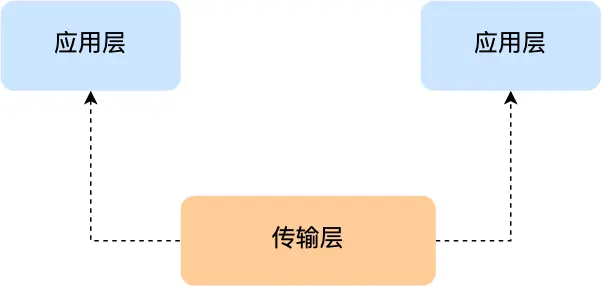
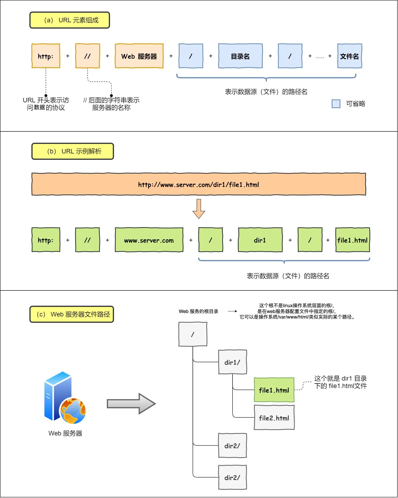
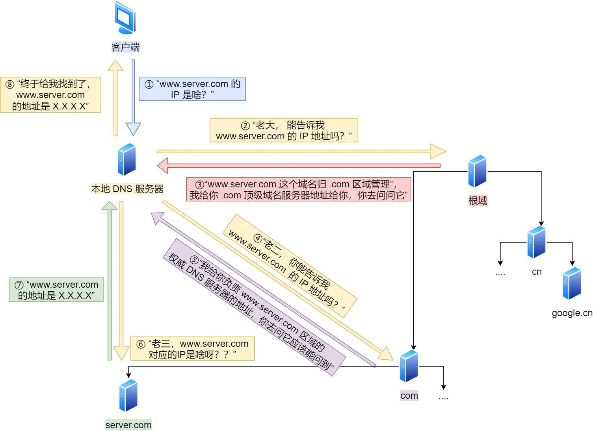
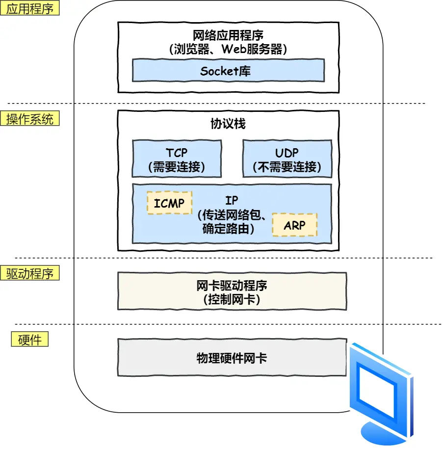
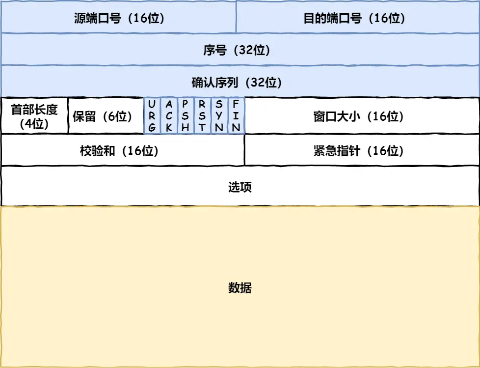
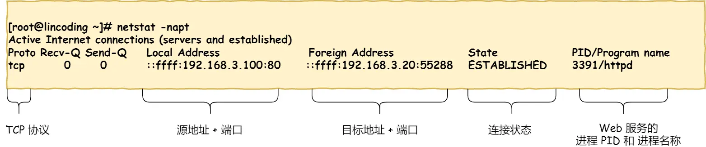
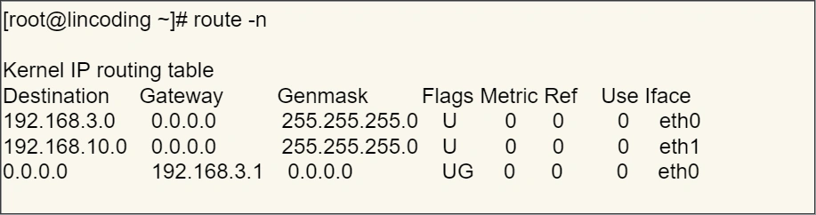
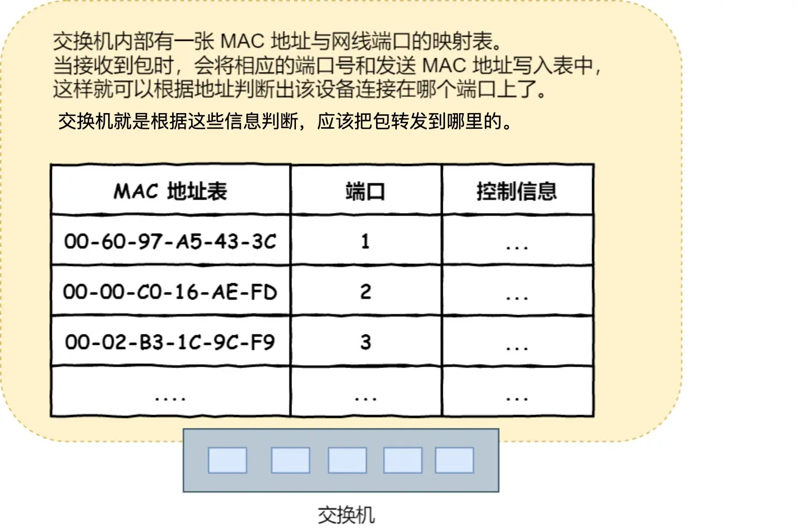
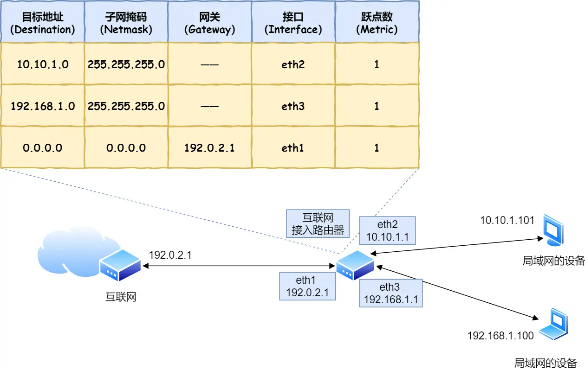
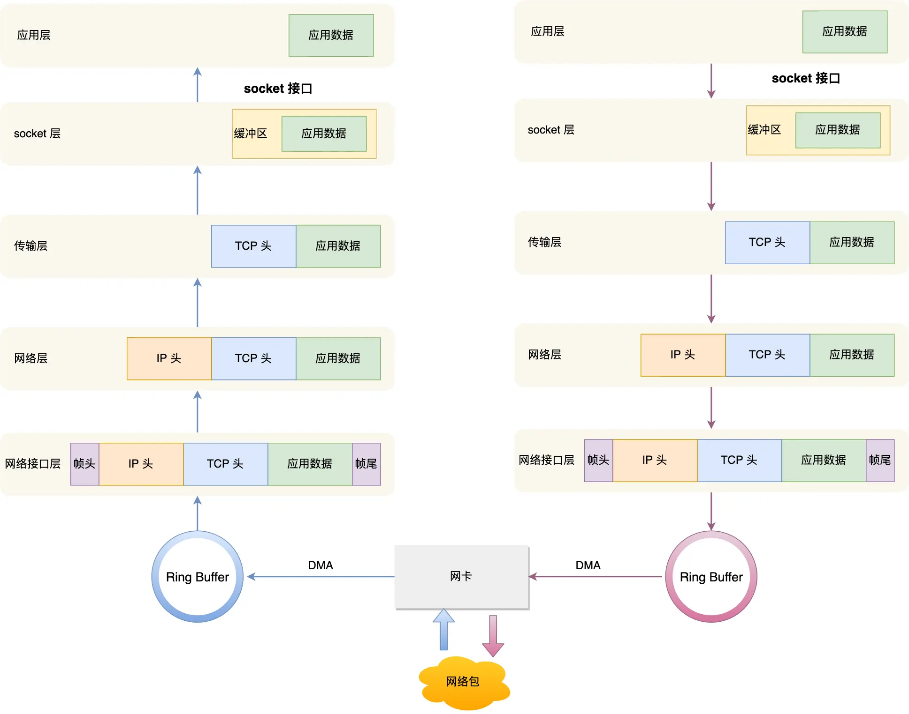

# 网络协议
## 2023.10.13
### 复习了OSI七层协议及内容，主要关注：

1. 传输层是将应用层数据分段打包，并用端口号标记属于哪个应用。

2. 注意网络层中子网掩码的知识点，网关通过子网掩码和地址决定转发方向。
3. udp协议是通过应用层来保证可靠传输的。

### 数据从输入网址到网页显示的总体路径：

1. HTTP输入一个网址，其名为URL通过URL确定访问的服务器和其中的文件。
2. DNS，URL需要转化为IP地址，则需要访问本地或远程的DNS主机，来查询该网址对应的IP通过指路的方式查询到。
3. 在本机中的工作如下：
4. TCP，注意TCP是全双工模式，在三次握手时特别注意那几个标志位，例如 SYN 是发起一个连接，ACK 是回复，RST 是重新连接，FIN 是结束连接等。TCP 是面向连接的，因而双方要维护连接的状态，这些带状态位的包的发送，会引起双方的状态变更。与三次握手相对应。所以三次握手目的是保证双方都有发送和接收的能力。
`
netstat -napt \\TCP 的连接状态查看
`

5. IP头格式：
`
route -n \\命令查看当前系统的路由表。
`
当前系统是指本机，最后一个参数表示该路由通过哪个网卡出去。第三条目比较特殊，它目标地址和子网掩码都是 0.0.0.0，这表示默认网关，如果其他所有条目都无法匹配，就会自动匹配这一行。并且后续就把包发给路由器，Gateway 即是路由器的 IP 地址。

6. MAC，使用ARP协议寻找路由，本机ARP广播目标的IP地址，使对方回答该IP地址对应的MAC地址，最后记录在本机缓存里。可以使用
`
arp -a
`
查看ARP缓存。

7. 网卡物理层
8. 交换机，交换机的端口不具有 MAC 地址。以下两个属于广播地址：
    1. MAC 地址中的 FF:FF:FF:FF:FF:FF
    2. IP 地址中的 255.255.255.255
9. 路由器，路由器和交换机是有区别的。
    1. 因为路由器是基于 IP 设计的，俗称三层网络设备，路由器的各个端口都具有 MAC 地址和 IP 地址；
    2. 而交换机是基于以太网设计的，俗称二层网络设备，交换机的端口不具有 MAC 地址。

10. 服务器将需要的HTTP内容打包再传回来。

### Linux中接收和发送网络包
那应该怎么告诉操作系统这个网络包已经到达了呢？

最简单的一种方式就是触发中断，也就是每当网卡收到一个网络包，就触发一个中断告诉操作系统。但是，这存在一个问题，在高性能网络场景下，网络包的数量会非常多，那么就会触发非常多的中断，所以为了解决频繁中断带来的性能开销，Linux 内核在 2.6 版本中引入了 NAPI 机制，它是混合「中断和轮询」的方式来接收网络包，它的核心概念就是不采用中断的方式读取数据，而是首先采用中断唤醒数据接收的服务程序，然后 poll 的方法来轮询数据。

可以看到socket的作用。