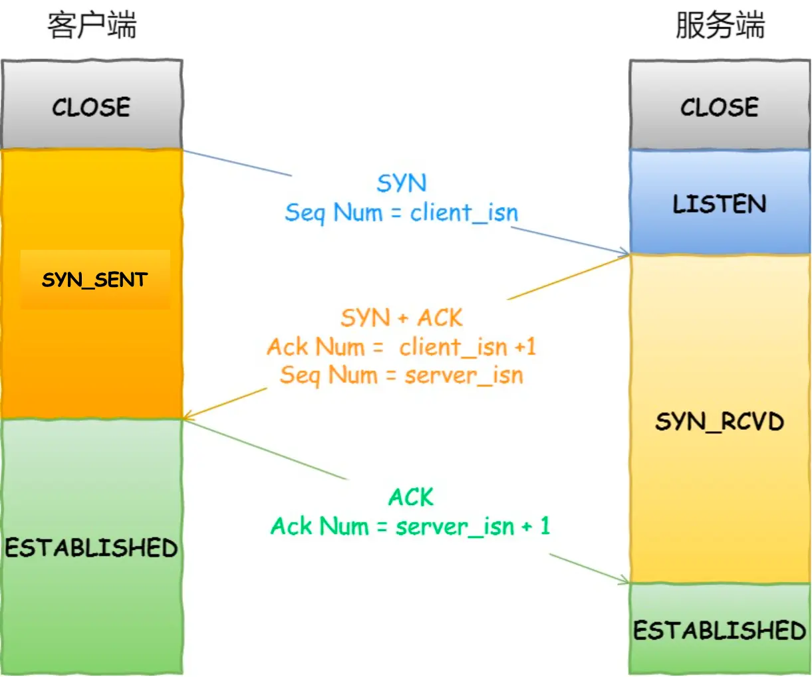
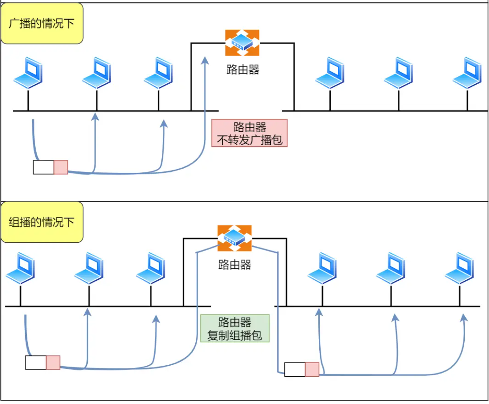

# 网络协议
## 2023.10.13
### 复习了OSI七层协议及内容，主要关注：

1. 传输层是将应用层数据分段打包，并用端口号标记属于哪个应用。

2. 注意网络层中子网掩码的知识点，网关通过子网掩码和地址决定转发方向。
3. udp协议是通过应用层来保证可靠传输的。

### 数据从输入网址到网页显示的总体路径：

1. HTTP输入一个网址，其名为URL通过URL确定访问的服务器和其中的文件。
2. DNS，URL需要转化为IP地址，则需要访问本地或远程的DNS主机，来查询该网址对应的IP通过指路的方式查询到。
3. 在本机中的工作如下：
4. TCP，注意TCP是全双工模式，在三次握手时特别注意那几个标志位，例如 SYN 是发起一个连接，ACK 是回复，RST 是重新连接，FIN 是结束连接等。TCP 是面向连接的，因而双方要维护连接的状态，这些带状态位的包的发送，会引起双方的状态变更。与三次握手相对应。所以三次握手目的是保证双方都有发送和接收的能力。
`
netstat -napt \\TCP 的连接状态查看
`

5. IP头格式：
`
route -n \\命令查看当前系统的路由表。
`
当前系统是指本机，最后一个参数表示该路由通过哪个网卡出去。第三条目比较特殊，它目标地址和子网掩码都是 0.0.0.0，这表示默认网关，如果其他所有条目都无法匹配，就会自动匹配这一行。并且后续就把包发给路由器，Gateway 即是路由器的 IP 地址。

6. MAC，使用ARP协议寻找路由，本机ARP广播目标的IP地址，使对方回答该IP地址对应的MAC地址，最后记录在本机缓存里。可以使用
`
arp -a
`
查看ARP缓存。

7. 网卡物理层
8. 交换机，交换机的端口不具有 MAC 地址。以下两个属于广播地址：
    1. MAC 地址中的 FF:FF:FF:FF:FF:FF
    2. IP 地址中的 255.255.255.255
9. 路由器，路由器和交换机是有区别的。
    1. 因为路由器是基于 IP 设计的，俗称三层网络设备，路由器的各个端口都具有 MAC 地址和 IP 地址；
    2. 而交换机是基于以太网设计的，俗称二层网络设备，交换机的端口不具有 MAC 地址。

10. 服务器将需要的HTTP内容打包再传回来。

### Linux中接收和发送网络包
那应该怎么告诉操作系统这个网络包已经到达了呢？

最简单的一种方式就是触发中断，也就是每当网卡收到一个网络包，就触发一个中断告诉操作系统。但是，这存在一个问题，在高性能网络场景下，网络包的数量会非常多，那么就会触发非常多的中断，所以为了解决频繁中断带来的性能开销，Linux 内核在 2.6 版本中引入了 NAPI 机制，它是混合「中断和轮询」的方式来接收网络包，它的核心概念就是不采用中断的方式读取数据，而是首先采用中断唤醒数据接收的服务程序，然后 poll 的方法来轮询数据。

可以看到socket的作用。建立一个 TCP 连接是需要客户端与服务端达成上述三个信息的共识。

* Socket：由 IP 地址和端口号组成
* 序列号：用来解决乱序问题等
* 窗口大小：用来做流量控制

## 各个HTTP版本的提升
### HTTP/1.1优化HTTP：
* HTTP长连接
* 使用cookie保持用户状态

### HTTP/1.1问题：
* 明文传输
* 队头阻塞

### HTTP/2优化HTTP：
* 二进制传输（减少bit使用），使用静态编码（哈夫曼）
* 多路复用（防止HTTP队头阻塞），将任务流分割成帧，组合在TCP连接中发送。其中一个帧的结构如下
* 头部压缩（减少多处相同头开销），使用动态编码给头上标记放双方内存
* 服务器推送（增加服务器主动），客户端建立的流标识为奇数，服务端建立的流标识为偶数

帧类型包括：

流标识符号指明了是属于哪个HTTP请求或数据的，在接收端被组合起来

### HTTP/2缺点：
* TCP层的队头阻塞未解决

### HTTP/3：
使用UDP，且使用quic协议保证可靠性
* 解决队头阻塞
* quic的握手更快，不用分TCP握手和TLS握手
* 标识不使用地址加端口模式，使用ID的形式，在网路切换时不会断连

安全问题交给中间层，即HTTPS

## RSA加密和ECDHE加密和握手

问题：
* 窃听
* 篡改
* 伪造身份

解决：
* 加密
* 对哈希值签名
* CA认证

加密流程都是：
先使用非对称密钥进行协商出会话密钥，之后的传输数据都通过会话密钥加密。

### RSA加密：

加密只有一对公私钥，都是服务端生成的。因此一旦服务端私钥被破解，则不安全。

### ECDHE加密：
加密服务端和用户端各有自己的私钥，并计算出各自的公钥，交换公钥并生成后面用于数据传输的会话密钥。

加密的数学原理可以看文章，其表述大概为，因为对数反向解密非常困难，因此拥有密钥（随机数）计算出公钥十分简单，而公钥解出密钥不可能。

在ECDHE中会先约定一些基本的参数（公共可见），然后服务端和客户端分别生成自己的随机数成为密钥，密钥作为对数使用基本参数计算出公钥，公钥相互交换。在数学上有一个特点，即对方的公钥和自己的私钥乘计算得到的值K两边都一样，因此K也被作为会话密钥的一部分（这部分对应于RSA中的pre-master）。

因此在握手流程中，也有些许的不一样，主要体现在二次和三次握手上。

## HTTP和HTTPS的优化方面

## websocket
前面所述都是客户端主动向服务端发起请求，对于简单的扫码场景下，网页端使用轮询或者长连接的模式与服务器连接。但是对于游戏就只能是服务端主动进行通信。

正因为各个浏览器都支持 HTTP协 议，所以 WebSocket 会先利用HTTP协议加上一些特殊的 header 头进行握手升级操作，升级成功后就跟 HTTP 没有任何关系了，之后就用 WebSocket 的数据格式进行收发数据。

## TCP
三个特点：
* 面向连接
* 可靠
* 基于字节流

属于传输层协议，之所以叫传输层，该协议主要用于网络寻址传输用，数据的内容全部是字节流，即纯0/1串，并不拥有信息的实际作用，赋予这些01串意义的是应用层，如HTTP和RPC，将相应信息的头和数据内容分帧派给TCP用于送达目的地。

RPC是基于C/S模型的，也是应用层，因为内部网络服务器访问并不需要像HTTP的B/S模型那样考虑很多标准，可以减少冗余加快速度，但是HTTP/2协议也很快了，因此有些RPC如gRPC就基于HTTP/2实现功能。

记忆：

**共同点在于**：端口号，校验和（包括IP伪头部）

**不同**：UDP中有包长

 TCP 是如何计算负载数据长度：
 
 其中 IP 总长度 和 IP 首部长度，在 IP 首部格式是已知的。TCP 首部长度，则是在 TCP 首部格式已知的，所以就可以求得 TCP 数据的长度。

大家这时就奇怪了问：“UDP 也是基于 IP 层的呀，那 UDP 的数据长度也可以通过这个公式计算呀？ 为何还要有「包长度」呢？”

这么一问，确实感觉 UDP 的「包长度」是冗余的。

我查阅了很多资料，我觉得有两个比较靠谱的说法：

第一种说法：因为为了网络设备硬件设计和处理方便，首部长度需要是 4 字节的整数倍。如果去掉 UDP 的「包长度」字段，那 UDP 首部长度就不是 4 字节的整数倍了，所以我觉得这可能是为了补全 UDP 首部长度是 4 字节的整数倍，才补充了「包长度」字段。
第二种说法：如今的 UDP 协议是基于 IP 协议发展的，而当年可能并非如此，依赖的可能是别的不提供自身报文长度或首部长度的网络层协议，因此 UDP 报文首部需要有长度字段以供计算。

**区分**：TCP会有粘包，其中粘包是指一个TCP包中会含有HTTP中头信息或数据信息都在一起，所以在HTTP中用\r\n来结束或指定长度等方法区分包间间隔

### 为什么三次握手
* 三次握手才可以阻止重复历史连接的初始化（主要原因）
* 三次握手才可以同步双方的初始序列号，SYN和ACK
* 三次握手才可以避免资源浪费

### 为什么每次连接SYN号不一样
因为每次如果一样，历史留在网络中的初始信号如果在下一次连接时到达，则出现接收历史消息，信息混乱。每次号码不同，可以及时发现是历史消息还是新消息。

### MSS

当 IP 层有一个超过 MTU 大小的数据（TCP 头部 + TCP 数据）要发送，那么 IP 层就要进行分片，把数据分片成若干片，保证每一个分片都小于 MTU。把一份 IP 数据报进行分片以后，由目标主机的 IP 层来进行重新组装后，再交给上一层 TCP 传输层。

这看起来井然有序，但这存在隐患的，那么当如果一个 IP 分片丢失，整个 IP 报文的所有分片都得重传。因为 IP 层本身没有超时重传机制，它由传输层的 TCP 来负责超时和重传。

所以，为了达到最佳的传输效能 TCP 协议在建立连接的时候通常要协商双方的 MSS 值，当 TCP 层发现数据超过 MSS 时，则就先会进行分片，当然由它形成的 IP 包的长度也就不会大于 MTU ，自然也就不用 IP 分片了。

### 半连接队列

解决SYN攻击的方法：
* 调大 netdev_max_backlog；
* 增大 TCP 半连接队列；
* 开启 tcp_syncookies；
* 减少 SYN+ACK 重传次数

### 四次挥手

需要 TIME-WAIT 状态，主要是两个原因：

* 防止历史连接中的数据，被后面相同四元组的连接错误的接收；（上次连接中的数据编号会在等待过程中在网络中被丢弃消失，才开始下一步的连接和传输）
* 保证「被动关闭连接」的一方，能被正确的关闭；

如果服务端要避免过多的 TIME_WAIT 状态的连接，就永远不要主动断开连接，让客户端去断开，由分布在各处的客户端去承受 TIME_WAIT。（虽然说双方都可以先发起结束）

什么场景下服务端会主动断开连接呢？

* 第一个场景：HTTP 没有使用长连接
* 第二个场景：HTTP 长连接超时
* 第三个场景：HTTP 长连接的请求数量达到上限

### 如果已经建立了连接，但是客户端突然出现故障了怎么办？
定义一个时间段，在这个时间段内，如果没有任何连接相关的活动，TCP 保活机制会开始作用，每隔一个时间间隔，发送一个探测报文，该探测报文包含的数据非常少，如果连续几个探测报文都没有得到响应，则认为当前的 TCP 连接已经死亡，系统内核将错误信息通知给上层应用程序。

客户端 connect 成功返回是在第二次握手，服务端 accept 成功返回是在三次握手成功之后。

## TCP包控制

其中回顾：
* D-SACK：数据包重传时，可以选择重传哪些数据包
* 发送窗口和接收端口大小由什么决定，是否动态
* 滑动窗口的指针
* 窗口关闭是什么导致，如何解决糊涂窗口综合征（Nagle 算法应用在发送端）
* 发送窗口、接收窗口、拥塞窗口。拥塞控制全流程

## TCP优化
应当结合半连接全连接队列来考虑。

四次挥手优化中主动关闭芳除了调用close函数以外，还有shutdown函数更加优秀，可以只关闭读或写

关于TCP的具体问答，可以在后序突击时使用。

## IP基本知识
各种类型的地址，用于早期以太网。

其中D类型属于多播（单播，广播，多播）

后来使用无分类地址的方案，即 CIDR。

