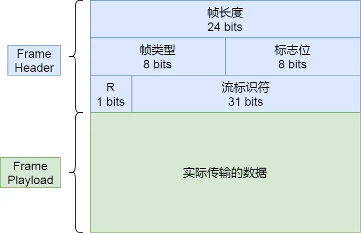
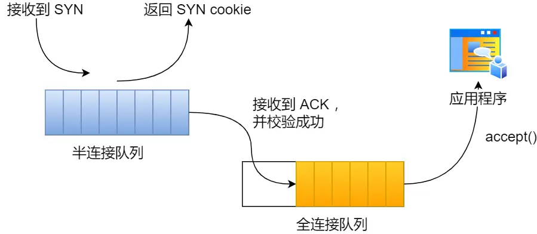
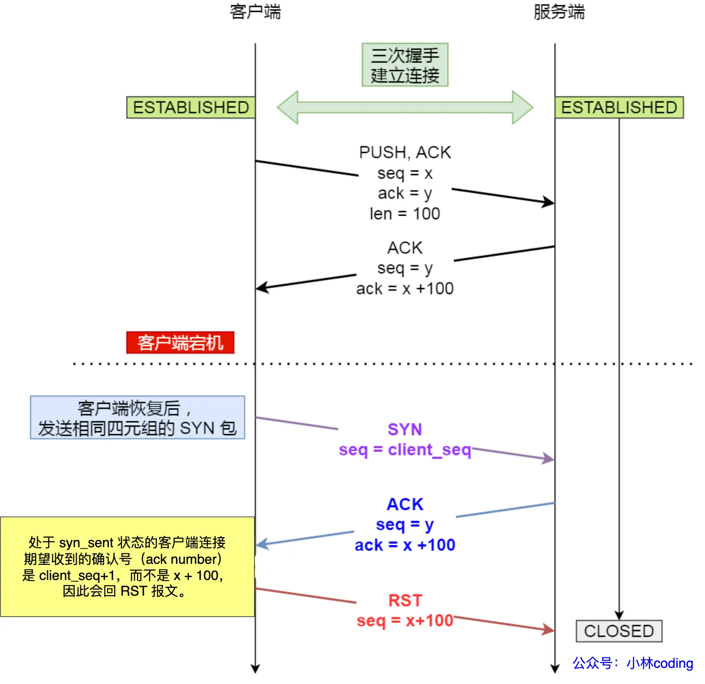
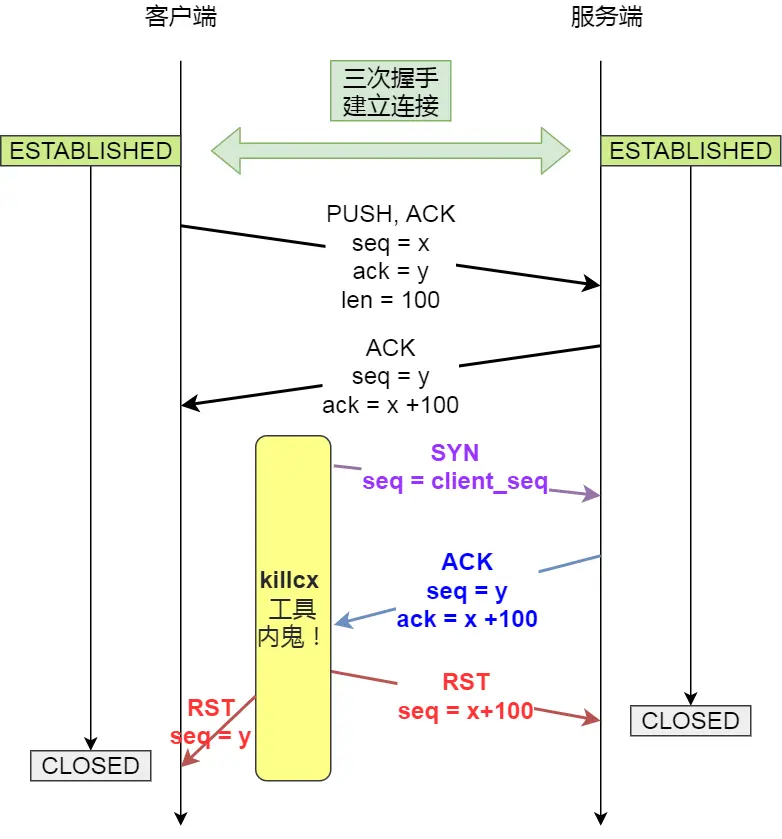
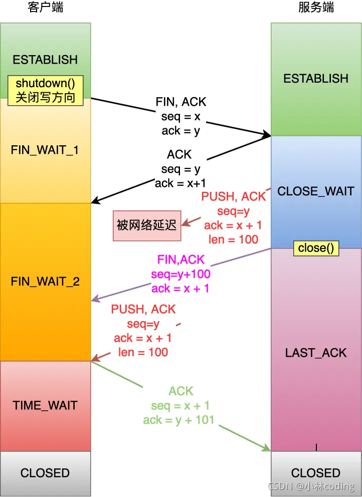
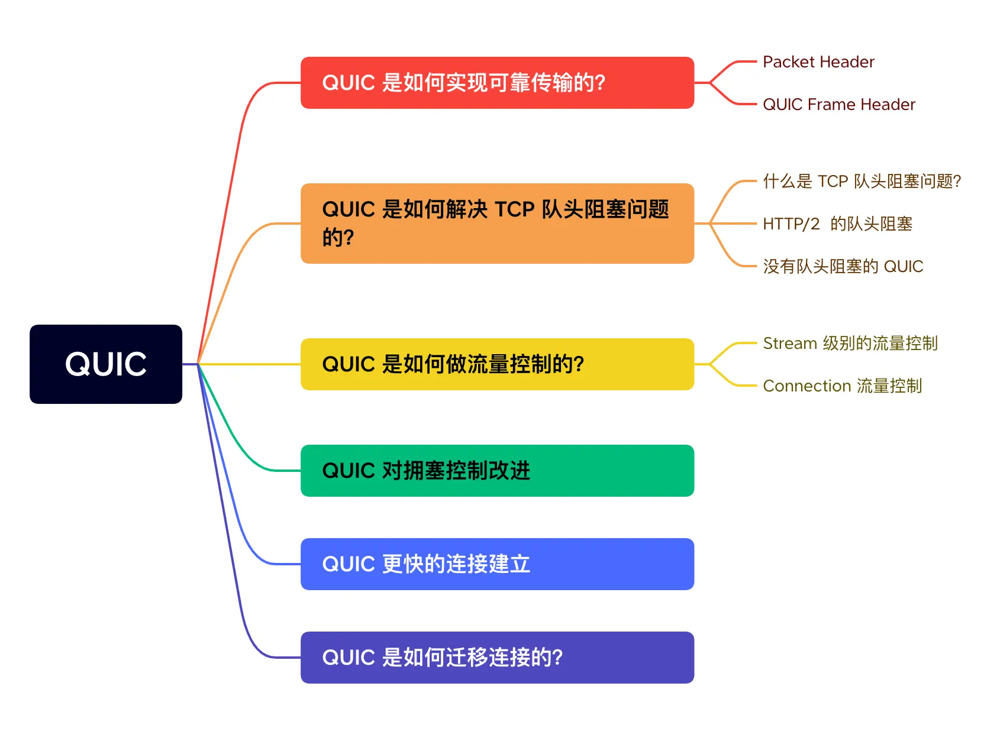
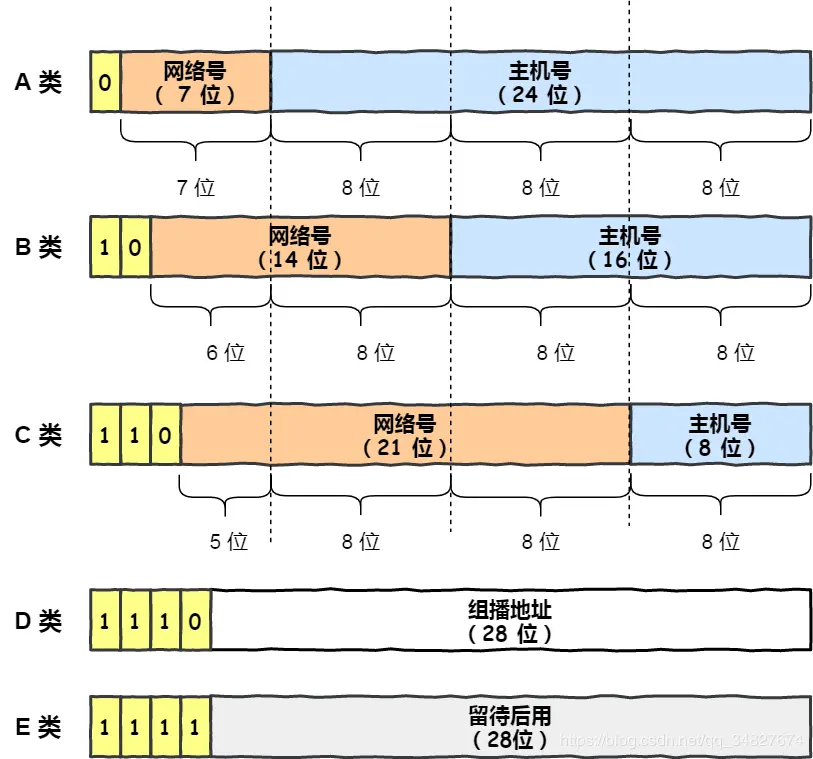

# 网络协议
## 2023.10.13
### 复习了OSI七层协议及内容，主要关注：

1. 传输层是将应用层数据分段打包，并用端口号标记属于哪个应用。

2. 注意网络层中子网掩码的知识点，网关通过子网掩码和地址决定转发方向。
3. udp协议是通过应用层来保证可靠传输的。

### 数据从输入网址到网页显示的总体路径：

1. HTTP输入一个网址，其名为URL通过URL确定访问的服务器和其中的文件。
2. DNS，URL需要转化为IP地址，则需要访问本地或远程的DNS主机，来查询该网址对应的IP通过指路的方式查询到。
3. 在本机中的工作如下：
4. TCP，注意TCP是全双工模式，在三次握手时特别注意那几个标志位，例如 SYN 是发起一个连接，ACK 是回复，RST 是重新连接，FIN 是结束连接等。TCP 是面向连接的，因而双方要维护连接的状态，这些带状态位的包的发送，会引起双方的状态变更。与三次握手相对应。所以三次握手目的是保证双方都有发送和接收的能力。
`
netstat -napt \\TCP 的连接状态查看
`

5. IP头格式：
`
route -n \\命令查看当前系统的路由表。
`
当前系统是指本机，最后一个参数表示该路由通过哪个网卡出去。第三条目比较特殊，它目标地址和子网掩码都是 0.0.0.0，这表示默认网关，如果其他所有条目都无法匹配，就会自动匹配这一行。并且后续就把包发给路由器，Gateway 即是路由器的 IP 地址。

6. MAC，使用ARP协议寻找路由，本机ARP广播目标的IP地址，使对方回答该IP地址对应的MAC地址，最后记录在本机缓存里。可以使用
`
arp -a
`
查看ARP缓存。

7. 网卡物理层
8. 交换机，交换机的端口不具有 MAC 地址。以下两个属于广播地址：
    1. MAC 地址中的 FF:FF:FF:FF:FF:FF
    2. IP 地址中的 255.255.255.255
9. 路由器，路由器和交换机是有区别的。
    1. 因为路由器是基于 IP 设计的，俗称三层网络设备，路由器的各个端口都具有 MAC 地址和 IP 地址；
    2. 而交换机是基于以太网设计的，俗称二层网络设备，交换机的端口不具有 MAC 地址。

10. 服务器将需要的HTTP内容打包再传回来。

### Linux中接收和发送网络包
那应该怎么告诉操作系统这个网络包已经到达了呢？

最简单的一种方式就是触发中断，也就是每当网卡收到一个网络包，就触发一个中断告诉操作系统。但是，这存在一个问题，在高性能网络场景下，网络包的数量会非常多，那么就会触发非常多的中断，所以为了解决频繁中断带来的性能开销，Linux 内核在 2.6 版本中引入了 NAPI 机制，它是混合「中断和轮询」的方式来接收网络包，它的核心概念就是不采用中断的方式读取数据，而是首先采用中断唤醒数据接收的服务程序，然后 poll 的方法来轮询数据。

可以看到socket的作用。建立一个 TCP 连接是需要客户端与服务端达成上述三个信息的共识。

* Socket：由 IP 地址和端口号组成
* 序列号：用来解决乱序问题等
* 窗口大小：用来做流量控制

# HTTP
## HTTP缓存技术
通过缓存在本地减少HTTP请求次数。
* 强制缓存，HTTP中带有过期时长，本地比较如果过期才发起请求。
* 协商缓存，当强制缓存是过期时，会发起请求，但是如果HTTP回复中带有304编号，说明协商使用本地缓存，从而减少了回复中的实际数据传输。服务器是通过判断请求资源携带的唯一标识符来确定缓存中内容是否过期。

## 各个HTTP版本的提升
### HTTP/1.1优化HTTP：
* HTTP长连接
* 使用cookie保持用户状态

### HTTP/1.1问题：
* 明文传输，泄露，伪装，篡改
* 队头阻塞

### HTTP/2优化HTTP：
* 二进制传输（减少bit使用），使用静态编码（哈夫曼）
* 多路复用（防止HTTP队头阻塞），将任务流分割成帧，组合在TCP连接中发送。其中一个帧的结构如下
* 头部压缩（减少多处相同头开销），使用动态编码给头上标记放双方内存
* 服务器推送（增加服务器主动），客户端建立的流标识为奇数，服务端建立的流标识为偶数

帧类型包括：

流标识符号指明了是属于哪个HTTP请求或数据的，在接收端被组合起来

### HTTP/2缺点：
* TCP层的队头阻塞未解决

HTTP/2 是基于 TCP 协议来传输数据的，TCP 是字节流协议，TCP 层必须保证收到的字节数据是完整且连续的，这样内核才会将缓冲区里的数据返回给 HTTP 应用，那么当「前 1 个字节数据」没有到达时，后收到的字节数据只能存放在内核缓冲区里，只有等到这 1 个字节数据到达时，HTTP/2 应用层才能从内核中拿到数据，这就是 HTTP/2 队头阻塞问题。

使用UDP可以没有这个问题，丢失数据包只会影响该业务的流，而不会影响其他流。 

### HTTP/3：
使用UDP，且使用quic协议保证可靠性
* 解决队头阻塞
* quic的握手更快，不用分TCP握手和TLS握手
* 标识不使用地址加端口模式，使用ID的形式，在网路切换时不会断连

安全问题交给中间层，即HTTPS

## HTTPS加密
### 数字签名
一般我们不会用非对称加密来加密实际的传输内容，因为非对称加密的计算比较耗费性能的。

所以非对称加密的用途主要在于通过「私钥加密，公钥解密」的方式，来确认消息的身份，我们常说的数字签名算法，就是用的是这种方式，不过私钥加密内容不是内容本身，而是对内容的哈希值加密。

### 数字证书

CA公钥是事先植入操作系统或浏览器的，因此这是我们信任链中的根证书。但如果操作系统是从其他不知道哪里下来的，那么根证书中出问题可能会真信任了其他中间的过程人。

关于中间人，其无法使用CA的私钥或者服务器的私钥，因此就会被客户端知道他的存在。抓包工具是在电脑中加入了证书公钥，因此可以同理成中间人。

## RSA加密和ECDHE加密和握手

问题：
* 窃听
* 篡改
* 伪造身份

解决：
* 加密
* 对哈希值签名
* CA认证

加密流程都是：
先使用非对称密钥进行协商出会话密钥，之后的传输数据都通过会话密钥加密。

### RSA加密：

加密只有一对公私钥，都是服务端生成的。因此一旦服务端私钥被破解，则不安全。

### ECDHE加密：
加密服务端和用户端各有自己的私钥，并计算出各自的公钥，交换公钥并生成后面用于数据传输的会话密钥。

加密的数学原理可以看文章，其表述大概为，因为对数反向解密非常困难，因此拥有密钥（随机数）计算出公钥十分简单，而公钥解出密钥不可能。

在ECDHE中会先约定一些基本的参数（公共可见），然后服务端和客户端分别生成自己的随机数成为密钥，密钥作为对数使用基本参数计算出公钥，公钥相互交换。在数学上有一个特点，即对方的公钥和自己的私钥乘计算得到的值K两边都一样，因此K也被作为会话密钥的一部分（这部分对应于RSA中的pre-master）。

因此在握手流程中，也有些许的不一样，主要体现在二次和三次握手上。

## HTTP和HTTPS的优化方面

会话复用就是类似于在HTTP中的cookie，在多次HTTPS访问中，不会出现多次TLS握手。

证书最优解就是周期的终端向CA进行申请更新本地的公钥表，支持目前最新的证书，并且也不会在访问网站时才进行申请，减少在访问时的时延。

## RPC
而 RPC（Remote Procedure Call），又叫做远程过程调用。它本身并不是一个具体的协议，而是一种调用方式。远程调用函数和本地调用一样。

现在电脑上装的各种联网软件，比如 xx管家，xx卫士，它们都作为客户端（Client）需要跟服务端（Server）建立连接收发消息，此时都会用到应用层协议，在这种 **Client/Server (C/S) 架构**下，它们可以使用自家造的 RPC 协议，因为它只管连自己公司的服务器就 ok 了。

但有个软件不同，浏览器（Browser），不管是 Chrome 还是 IE，它们不仅要能访问自家公司的服务器（Server），还需要访问其他公司的网站服务器，因此它们需要有个统一的标准，不然大家没法交流。于是，**HTTP 就是那个时代用于统一 Browser/Server (B/S) 的协议**。

也就是说在多年以前，HTTP 主要用于 B/S 架构，而 RPC 更多用于 C/S 架构。但现在其实已经没分那么清了，B/S 和 C/S 在慢慢融合。很多软件同时支持多端，比如某度云盘，既要支持网页版，还要支持手机端和 PC 端，如果通信协议都用 HTTP 的话，那服务器只用同一套就够了。而 RPC 就开始退居幕后，一般用于公司内部集群里，各个微服务之间的通讯。

## websocket
前面所述都是**客户端主动向服务端发起请求**，对于简单的（用手机扫电脑码）扫码场景下，网页端（我的电脑）使用**轮询**或者**长连接**的模式与服务器连接。但是对于游戏就只能是服务端主动进行通信。

正因为各个浏览器都支持 HTTP协议，所以 WebSocket 会先利用HTTP协议加上一些特殊的 header 头进行握手升级操作，升级成功后就跟 HTTP 没有任何关系了，之后就用 WebSocket 的数据格式进行收发数据。

这是因为 TCP 协议本身就是全双工，但直接使用纯裸TCP去传输数据，会有粘包的"问题"。为了解决这个问题，上层协议一般会用消息头+消息体的格式去重新包装要发的数据。而消息头里一般含有消息体的长度，通过这个长度可以去截取真正的消息体。HTTP 协议和大部分 RPC 协议，以及我们今天介绍的WebSocket协议，都是这样设计的。

## TCP
三个特点：
* 面向连接
* 可靠
* 基于字节流

属于传输层协议，之所以叫传输层，该协议主要用于网络寻址传输用，数据的内容全部是字节流，即纯0/1串，并不拥有信息的实际作用，赋予这些01串意义的是应用层，如HTTP和RPC，将相应信息的头和数据内容分帧派给TCP用于送达目的地。

RPC是基于C/S模型的，也是应用层，因为内部网络服务器访问并不需要像HTTP的B/S模型那样考虑很多标准，可以减少冗余加快速度，但是HTTP/2协议也很快了，因此有些RPC如gRPC就基于HTTP/2实现功能。

记忆：

**共同点在于**：端口号，校验和（包括IP伪头部）

**不同**：UDP中有包长

 TCP 是如何计算负载数据长度：
 
 其中 IP 总长度 和 IP 首部长度，在 IP 首部格式是已知的。TCP 首部长度，则是在 TCP 首部格式已知的，所以就可以求得 TCP 数据的长度。

大家这时就奇怪了问：“UDP 也是基于 IP 层的呀，那 UDP 的数据长度也可以通过这个公式计算呀？ 为何还要有「包长度」呢？”

这么一问，确实感觉 UDP 的「包长度」是冗余的。

我查阅了很多资料，我觉得有两个比较靠谱的说法：

第一种说法：因为为了网络设备硬件设计和处理方便，首部长度需要是 4 字节的整数倍。如果去掉 UDP 的「包长度」字段，那 UDP 首部长度就不是 4 字节的整数倍了，所以我觉得这可能是为了补全 UDP 首部长度是 4 字节的整数倍，才补充了「包长度」字段。
第二种说法：如今的 UDP 协议是基于 IP 协议发展的，而当年可能并非如此，依赖的可能是别的不提供自身报文长度或首部长度的网络层协议，因此 UDP 报文首部需要有长度字段以供计算。

**区分**：TCP会有粘包，其中粘包是指一个TCP包中会含有HTTP中头信息或数据信息都在一起，所以在HTTP中用\r\n来结束或指定长度等方法区分包间间隔

### 为什么三次握手
* 三次握手才可以阻止重复历史连接的初始化（主要原因），如果一发来服务器就进入establish状态，并且在第一个ack后面就带有数据，则出现了资源浪费（服务器资源浪费很严重）
* 三次握手才可以同步双方的初始序列号，SYN和ACK
* 三次握手才可以避免资源浪费

### 为什么每次连接SYN号不一样
因为每次如果一样，历史留在网络中的初始信号如果在下一次连接时到达，则出现接收历史消息，信息混乱。每次号码不同，可以及时发现是历史消息还是新消息。

### MSS

当 IP 层有一个超过 MTU 大小的数据（TCP 头部 + TCP 数据）要发送，那么 IP 层就要进行分片，把数据分片成若干片，保证每一个分片都小于 MTU。把一份 IP 数据报进行分片以后，由目标主机的 IP 层来进行重新组装后，再交给上一层 TCP 传输层。

这看起来井然有序，但这存在隐患的，那么当如果一个 IP 分片丢失，整个 IP 报文的所有分片都得重传。因为 IP 层本身没有超时重传机制，它由传输层的 TCP 来负责超时和重传。

所以，为了达到最佳的传输效能 TCP 协议在建立连接的时候通常要协商双方的 MSS 值，当 TCP 层发现数据超过 MSS 时，则就先会进行分片，当然由它形成的 IP 包的长度也就不会大于 MTU ，自然也就不用 IP 分片了。

### 半连接队列

解决SYN攻击的方法：
* 调大 netdev_max_backlog；
* 增大 TCP 半连接队列；
* 开启 tcp_syncookies；
* 减少 SYN+ACK 重传次数

### 总结回答
在TCP连接的回答中，要达到的点
* 三次握手哪三次
* 为什么是三次（三次的作用）
* 半连接队列和双方状态（半连接队列面对攻击的方法）
* TCP的优化方法（长连接，cookie，滑动窗口，拥塞避免）不要搞混TCP和HTTP

在断连中应该达到：
* 哪四次，四次时的双方状态
* timewait的作用，如果出现大量timewait的原因
* 关于timewait减少的端口复用技术，以及其缺点（时间戳避免SEQ环回的PAWS机制，在NAT下不安全，且RST不受时间戳影响，复用端口导致RST进入下次连接）

### 四次挥手

MSL 是 Maximum Segment Lifetime，报文最大生存时间，TIME-WAIT为2MSL。需要 TIME-WAIT 状态，主要是两个原因：

* 防止历史连接中的数据，被后面相同四元组的连接错误的接收；（上次连接中的数据编号会在等待过程中在网络中被丢弃消失，才开始下一步的连接和传输）
* 保证「被动关闭连接」的一方，能被正确的关闭；

如果**服务端要避免过多的 TIME_WAIT 状态的连接，就永远不要主动断开连接，让客户端去断开**，由分布在各处的客户端去承受 TIME_WAIT。（虽然说双方都可以先发起结束）

什么场景下服务端会主动断开连接呢？

* 第一个场景：HTTP 没有使用长连接
* 第二个场景：HTTP 长连接超时
* 第三个场景：HTTP 长连接的请求数量达到上限

当服务端出现大量的 TIME_WAIT 状态连接的时候，可以排查下是否客户端和服务端都开启了 HTTP Keep-Alive，因为任意一方没有开启 HTTP Keep-Alive，都会导致服务端在处理完一个 HTTP 请求后，就主动关闭连接，此时服务端上就会出现大量的 TIME_WAIT 状态的连接。

### 如果已经建立了连接，但是客户端突然出现故障了怎么办？
定义一个时间段，在这个时间段内，如果没有任何连接相关的活动，TCP 保活机制会开始作用，每隔一个时间间隔，发送一个探测报文，该探测报文包含的数据非常少，如果连续几个探测报文都没有得到响应，则认为当前的 TCP 连接已经死亡，系统内核将错误信息通知给上层应用程序。

客户端 connect 成功返回是在第二次握手，服务端 accept 成功返回是在三次握手成功之后。

## TCP包控制

其中回顾：
* D-SACK：数据包重传时，可以选择重传哪些数据包
* 发送窗口和接收端口大小由什么决定，是否动态
* 滑动窗口的指针
* 窗口关闭是什么导致，如何解决糊涂窗口综合征（Nagle 算法应用在发送端）
* 发送窗口、接收窗口、拥塞窗口。拥塞控制全流程

首先讲述tcp数据包发送的方式，在优化的过程中，除了开头和结尾，那么就是中间的传输过程，如何保证可靠的传输是通过协议的重传机制。重传包括超时重传和快速重传，传输方式为滑动窗口，根据滑动窗口的原理，得知窗口的大小决定了传输，那么就有流量控制和拥塞控制，流量控制的对于对端缓冲区来定下的，而拥塞控制是对于网络当前状态定下的。

### 重传机制
超时重传是动态的时间，略大于RTT，且每次重传时间间隔加倍。

快速重传：

SACK：

### 滑动窗口

滑动窗口的关键在于，回复最高接收的序号。注意滑动窗口是和上面超时重传相结合的，当收到同样的三次ack后会重传之前的数据。

### 流量控制
滑动窗口的大小要根据接收方的能力来决定。在返回时，接收端会告知发送端的窗口大小。但是每次都告知剩余窗口大小，会导致糊涂窗口综合症：接收端读取缓存速度比较慢，而发送端盲目的发送。

使用 Nagle 算法，该算法的思路是延时处理，只有满足下面两个条件中的任意一个条件，才可以发送数据：

* 条件一：要等到窗口大小 >= MSS 并且 数据大小 >= MSS；
* 条件二：收到之前发送数据的 ack 回包；

如果接收方不能满足「不通告小窗口给发送方」，那么即使开了 Nagle 算法，也无法避免糊涂窗口综合症，因为如果对端 ACK 回复很快的话（达到 Nagle 算法的条件二），Nagle 算法就不会拼接太多的数据包，这种情况下依然会有小数据包的传输，网络总体的利用率依然很低。

所以，接收方得满足「不通告小窗口给发送方」+ 发送方开启 Nagle 算法，才能避免糊涂窗口综合症。

### 窗口关闭现象

为了解决这个问题，TCP 为每个连接设有一个持续定时器，只要 TCP 连接一方收到对方的零窗口通知，就启动持续计时器。

如果持续计时器超时，就会发送窗口探测 ( Window probe ) 报文，而对方在确认这个探测报文时，给出自己现在的接收窗口大小。

### 拥塞控制
前面的流量控制是**避免「发送方」的数据填满「接收方」的缓存**，但是并不知道网络的中发生了什么。在网络出现拥堵时，如果继续发送大量数据包，可能会导致数据包时延、丢失等，这时 TCP 就会重传数据，但是一重传就会导致网络的负担更重，于是会导致更大的延迟以及更多的丢包

因此，就有了拥塞控制，控制的目的就是**避免「发送方」的数据填满整个网络**。

拥塞控制主要是四个算法：

* 慢启动
* 拥塞避免
* 拥塞发生
* 快速恢复

超时重传：

快速恢复：

## TCP优化
应当结合半连接全连接队列来考虑。

四次挥手优化中主动关闭芳除了调用close函数以外，还有shutdown函数更加优秀，可以只关闭读或写

关于TCP的具体问答，可以在后序突击时使用。

### 全连接队列因突发流量占用

非常重要，在面试的时候几乎就是问如何优化，关于突发流量的TCP，会出现全连接队列和半连接队列被占用满的情况。

tcp_abort_on_overflow 共有两个值分别是 0 和 1，其分别表示：

* 0 ：如果全连接队列满了，那么 server 扔掉 client 发过来的 ack ；
* 1 ：如果全连接队列满了，server 发送一个 reset 包给 client，表示废掉这个握手过程和这个连接；

如果要想知道客户端连接不上服务端，是不是服务端 TCP 全连接队列满的原因，那么可以把 tcp_abort_on_overflow 设置为 1，这时如果在客户端异常中可以看到很多 connection reset by peer 的错误，那么就可以证明是由于服务端 TCP 全连接队列溢出的问题。

**通常情况下，应当把 tcp_abort_on_overflow 设置为 0，因为这样更有利于应对突发流量。**

举个例子，当 TCP 全连接队列满导致服务器丢掉了 ACK，与此同时，客户端的连接状态却是 ESTABLISHED，进程就在建立好的连接上发送请求。只要服务器没有为请求回复 ACK，请求就会被多次重发。如果服务器上的进程只是短暂的繁忙造成 accept 队列满，那么当 TCP 全连接队列有空位时，再次接收到的请求报文由于含有 ACK，仍然会触发服务器端成功建立连接。

所以，tcp_abort_on_overflow 设为 0 可以提高连接建立的成功率，只有你非常肯定 TCP 全连接队列会长期溢出时，才能设置为 1 以尽快通知客户端。

为了能够应对突发流量，可以选择提高更大的全连接队列，设置linux默认参数和Nginx参数

### 半连接队列因攻击而占满

* 增大半连接队列；
* 开启 tcp_syncookies 功能
* 减少 SYN+ACK 重传次数

### 三次握手优化
包括连接队列扩大，调整重传次数，使用cookie减少第二次进行连接的开销等，在上面都有提及

### 四次挥手主动方优化

调用了 close 函数意味着完全断开连接，完全断开不仅指无法传输数据，而且也不能发送数据。 此时，调用了 close 函数的一方的连接叫做「孤儿连接」，如果你用 netstat -p 命令，会发现连接对应的进程名为空。

**使用 close 函数关闭连接是不优雅的**。于是，就出现了一种优雅关闭连接的 shutdown 函数，它可以控制只关闭一个方向的连接：`shutdown(int sock, int howto)`

* SHUT_RD(0)：关闭连接的「读」这个方向，如果接收缓冲区有已接收的数据，则将会被丢弃，并且后续再收到新的数据，会对数据进行 ACK，然后悄悄地丢弃。也就是说，对端还是会接收到 ACK，在这种情况下根本不知道数据已经被丢弃了。
* SHUT_WR(1)：关闭连接的「写」这个方向，这就是常被称为「半关闭」的连接。如果发送缓冲区还有未发送的数据，将被立即发送出去，并发送一个 FIN 报文给对端。
* SHUT_RDWR(2)：相当于 SHUT_RD 和 SHUT_WR 操作各一次，关闭套接字的读和写两个方向。

如果连接是用 shutdown 函数关闭的，连接可以一直处于 FIN_WAIT2 状态，因为它可能还可以发送或接收数据。但对于 close 函数关闭的孤儿连接，由于无法再发送和接收数据，所以这个状态不可以持续太久，而 tcp_fin_timeout 控制了这个状态下连接的持续时长，默认值是 60 秒：

timewait存在两原因：
* 防止历史数据进入下次连接，历史数据是指服务器端发送的数据中间延迟，并且在服务器发送最后一个fin的之后，到达新的连接区间，导致了数据的错误。
* 保证对端正确关闭

### 四次挥手被动方优化

当被动方收到 FIN 报文时，内核会自动回复 ACK，同时连接处于 CLOSE_WAIT 状态，顾名思义，它表示等待应用进程调用 close 函数关闭连接。

内核没有权利替代进程去关闭连接，因为如果主动方是通过 shutdown 关闭连接，那么它就是想在半关闭连接上接收数据或发送数据。因此，Linux 并没有限制 CLOSE_WAIT 状态的持续时间。

当然，大多数应用程序并不使用 shutdown 函数关闭连接。所以，当你用 netstat 命令发现大量 CLOSE_WAIT 状态。就需要排查你的应用程序，因为可能因为应用程序出现了 Bug，read 函数返回 0 时，没有调用 close 函数。

### 数据传输优化
如果缓冲区与网络传输能力匹配，那么缓冲区的利用率就达到了最大化。

弄清楚带宽和时延的区别，带宽是指网络可以在一秒内发送出多少数据，时延是一端到另一端的的传输时间，一个表示车道宽度，一个表示路途长度。该表示“飞行在网络上”的数据量。

比如最大带宽是 100 MB/s，网络时延（RTT）是 10ms 时，意味着客户端到服务端的网络上飞有 100MB/s * 0.01s = 1MB 的字节。**由于发送缓冲区大小决定了发送窗口的上限，而发送窗口又决定了「已发送未确认」的飞行报文的上限。因此，发送缓冲区不能超过「带宽时延积」**。

发送窗口自动调整，但是接收窗口大小受到系统内存的影响。

在高并发服务器中，为了兼顾网速与大量的并发连接，我们应当保证缓冲区的动态调整的最大值达到带宽时延积，而最小值保持默认的 4K 不变即可。而对于内存紧张的服务而言，调低默认值是提高并发的有效手段。

同时，如果这是网络 IO 型服务器，那么，调大 tcp_mem 的上限可以让 TCP 连接使用更多的系统内存，这有利于提升并发能力。需要注意的是，tcp_wmem 和 tcp_rmem 的单位是字节，而 tcp_mem 的单位是页面大小。而且，千万不要在 socket 上直接设置 SO_SNDBUF 或者 SO_RCVBUF，这样会关闭缓冲区的动态调整功能。

### 特殊情况之，客户端中途停机一下，再使用和原来相同的端口发SYN

处于 Established 状态的服务端，如果收到了客户端的 SYN 报文（注意此时的 SYN 报文其实是乱序的，因为 SYN 报文的初始化序列号其实是一个随机数），会回复一个携带了正确序列号和确认号的 ACK 报文，这个 ACK 被称之为 Challenge ACK。

接着，客户端收到这个 Challenge ACK，发现确认号（ack num）并不是自己期望收到的，于是就会回 RST 报文，服务端收到后，就会释放掉该连接。

利用该原理实现一个程序，在TCP连接过程中，非正常的干扰连接，让其断开。

### 客户端shutdown写，服务端发送最后信息和fin出现乱序

传输数据有序号，当序号乱序时客户端不会直接进入timewait。

### 拔掉网线后，连接存在性问题
拔掉网线后，有数据传输：
* 重传期内
* 重传期外

拔掉网线后，没有数据传输：
* 开启了keepalive机制
* 没有开启

### tcp_tw_reuse
如果客户端（主动关闭连接方）的 TIME_WAIT 状态过多，占满了所有端口资源，那么就无法对「目的 IP+ 目的 PORT」都一样的服务器发起连接了，但是被使用的端口，还是可以继续对另外一个服务器发起连接的。这是因为内核在定位一个连接的时候，是通过四元组（源IP、源端口、目的IP、目的端口）信息来定位的，并不会因为客户端的端口一样，而导致连接冲突。

使用tcp_tw_reuse会开启 recycle 和 timestamps 选项，就会开启一种叫 per-host 的 PAWS 机制。per-host 是对「对端 IP 做 PAWS 检查」，而非对「IP + 端口」四元组做 PAWS 检查。但是如果客户端网络环境是用了 NAT 网关，那么客户端环境的每一台机器通过 NAT 网关后，都会是相同的 IP 地址，在服务端看来，就好像只是在跟一个客户端打交道一样，无法区分出来。

Per-host PAWS 机制利用TCP option里的 timestamp 字段的增长来判断串扰数据，而 timestamp 是根据客户端各自的 CPU tick 得出的值。当客户端 A 通过 NAT 网关和服务器建立 TCP 连接，然后服务器主动关闭并且快速回收 TIME-WAIT 状态的连接后，客户端 B 也通过 NAT 网关和服务器建立 TCP 连接，注意客户端 A 和 客户端 B 因为经过相同的 NAT 网关，所以是用相同的 IP 地址与服务端建立 TCP 连接，如果客户端 B 的 timestamp 比 客户端 A 的 timestamp 小，那么由于服务端的 per-host 的 PAWS 机制的作用，服务端就会丢弃客户端主机 B 发来的 SYN 包。

因此，tcp_tw_recycle 在使用了 NAT 的网络下是存在问题的，如果它是对 TCP 四元组做 PAWS 检查，而不是对「相同的 IP 做 PAWS 检查」，那么就不会存在这个问题了。

### 为什么TCP第二次连接不能传输数据
Challenge ACK报文会回复一个SYN信号，告知现在正确的序号，如果发出SYN的客户端接收到该回复，且当前连接该序号的进程数据已经没了，那就会回复RST。

回到问题，第二次连接如果传输数据，ACK为SYN+数据包长，回复的ACK不是SYN+1，则被认为是错误接收，会发送RST进行断连。

### TCP天然缺点
* 升级困难，在内核层，每次升级需要在内核层面更新，兼容各个版本操作系统麻烦。
* 队头阻塞问题，即便使用HTTP2的多路复用技术，TCP本身丢包会导致队头阻塞所有其他的HTTP连接
* 固定四元组（地址，端口）导致切换必须经过重连。
* 建立连接缓慢，TCP在内核层，HTTPS在应用层，有时候想要复用连接传输都没有办法，通常需要先建立TCP三次握手再进行TLS连接，再进行数据传输。

这些缺点在UDP和自己实现的可靠传输的特性（序列号、确认应答、超时重传、流量控制、拥塞控制）上得到解决，QUC协议在HTTP3上的应用就是例子。

## QUIC协议

## IP基本知识
各种类型的地址，用于早期以太网。

其中D类型属于多播（单播，广播，多播）

后来使用无分类地址的方案，即 CIDR。

* DNS:域名解析
* DHCP：请求分配地址
* NAT：地址转换，用于解决IPV4用完的问题
* ICMP：实现网络控制的告知功能，ping就是基于其实现的
* IGMP:管理组播，最后一条路由器到主机的组信息控制。

ICMP图案：

