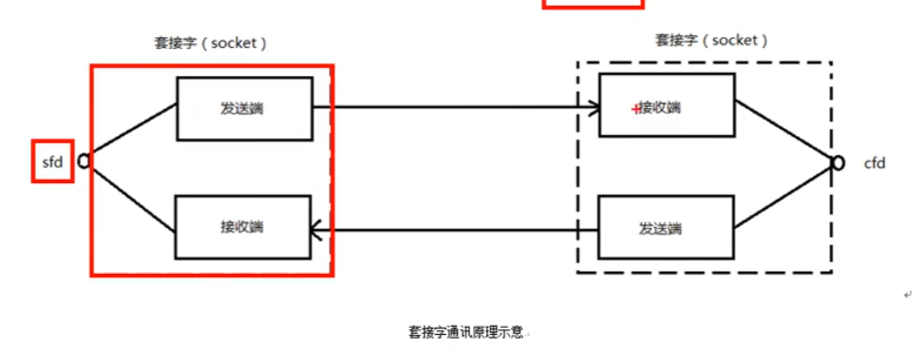
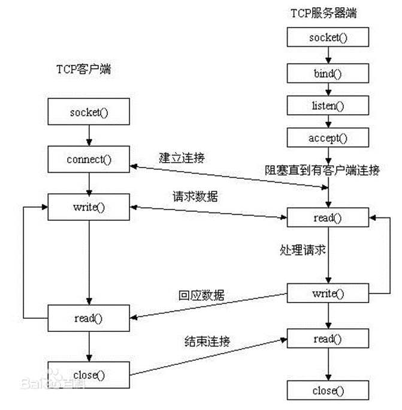

# 网络编程
## 基础概念
### CS  BS
CS client-server：可以缓存大量数据，协议可以自定义（不用TCPIP协议），但安全性不保证（因为自己协议就不知道在干什么了）
BS browser-server：不能缓存大量数据，遵守协议。但安全性高，跨平台性好。

### socket编程
套接字：在通信过程中必须成对出现，一对才能同样的协议。



一个描述符，但指向两个缓冲区，与管道是不一样的。

### 网络字节序
网络数据流采用大端字节序，低地址存高位字节。（计算机中通常使用小端法），因此有网络字节序和计算机字节序的转化。

```c++
uint32_t htonl(uint32_t hostlong);  //将32位地址转化，本地序转网络字节序（IP）
uint16_t htons(uint16_t hostshort);  //转化端口

//反过来
ntohl
ntohs

//一次性的IP地址转换函数
int inet_pton(int af, const char *src, void *dst);  //第一参数选择ipv4和6，第二参数为IP地址点分十进制，dst为转换后的网络字节序地址
//地址无效，返回0，成功1
```

### socket创建流程


注意，一对服务器客户端连接会有3个socket

服务端：

创建一个套接字socket()，并设置自己的IP和端口bind()，设置同时建立连接的上限listen()，而后阻塞监听客户端连接accept()，发现有客户端了，就再建立一个新的socket和客户端通信，自己继续监听，因此会有三个socket（就像迎宾小姐先领你去房间然后再回前台，这不就三个人了）

在accept和connect执行之后，就说明三次握手已经完成了。

### socketaddr套接字地址结构 (bind()函数)
```c++
//查看方法
man 7 sockaddr

//内部参数，在用以前要初始化
struct sockaddr_in {
	sa_family_t sin_family; // 地址结构类型
	in_port_t sin_port;	//端口号
	struct in_addr sin_addr;	//IP地址，内嵌结构体
}

struct in_addr{
    uint32_t s_addr;  //但结构体中只有一个参数
}

//例子
struct sockaddr_in addr;
addr.sin_family = AF_INET/AF_INET6;
addr.sin_port = htons(9527);

int dst;
inet_pton(AF_INET, "192.168.70.128", (void *)&dst);  //转字节序                                                                                            
addr.sin_addr.s_addr = dst;

addr.sin_addr.s_addr = htonl(INADDR_ANY);  //取出系统中任意有效的地址

bind(fd, (struct sockaddr *)&addr, size);  //传参时需要强转
```


### socket函数
```c++
#include <sys/types.h> /* See NOTES */
#include <sys/socket.h>
int socket(int domain, int type, int protocol);
domain:
	AF_INET 这是大多数用来产生socket的协议，使用TCP或UDP来传输，用IPv4的地址
	AF_INET6 与上面类似，不过是来用IPv6的地址
	AF_UNIX 本地协议，使用在Unix和Linux系统上，一般都是当客户端和服务器在同一台及其上的时候使用
type:
	SOCK_STREAM 这个协议是按照顺序的、可靠的、数据完整的基于字节流的连接。这是一个使用最多的socket类型，这个socket是使用TCP来进行传输。
	SOCK_DGRAM 这个协议是无连接的、固定长度的传输调用。该协议是不可靠的，使用UDP来进行它的连接。
	SOCK_SEQPACKET该协议是双线路的、可靠的连接，发送固定长度的数据包进行传输。必须把这个包完整的接受才能进行读取。
	SOCK_RAW socket类型提供单一的网络访问，这个socket类型使用ICMP公共协议。（ping、traceroute使用该协议）
	SOCK_RDM 这个类型是很少使用的，在大部分的操作系统上没有实现，它是提供给数据链路层使用，不保证数据包的顺序
protocol:
	传0 表示使用默认协议。
返回值：
	成功：返回指向新创建的socket的文件描述符，失败：返回-1，设置errno

```

### listen函数
```c++
int listen(int sockfd, int backlog);
sockfd:
	socket文件描述符
backlog:
	排队建立3次握手队列和刚刚建立3次握手队列的链接数和
查看系统默认backlog
cat /proc/sys/net/ipv4/tcp_max_syn_backlog
```

### accept函数
```c++
int accept(int sockfd, struct sockaddr *addr, socklen_t *addrlen);
sockdf:
	socket文件描述符
addr:
	传出参数，返回链接客户端地址信息，含IP地址和端口号
addrlen:
	传入传出参数（值-结果）,传入sizeof(addr)大小，函数返回时返回真正接收到地址结构体的大小
返回值：
	成功返回一个新的socket文件描述符，用于和客户端通信，失败返回-1，设置errno

```

注意比较bind和accept的传入参数区别。

```c++
//注意比较
int bind(int sockfd, const struct sockaddr *addr, socklen_t addrlen);
int accept(int sockfd, struct sockaddr *addr, socklen_t *addrlen);
```
在bind中sockaddr是一个const，只起传入作用。但accept中sockaddr是变量，是传出作用，传出连接的**客户端的**地址结构体。

addrlen在accept中也是传入传出变量，传入允许大小sizeof(addr)，传出时是客户端的实际addr大小。

accept函数返回的int是新的能与客户端通信的socket的文件描述符。


### connect函数
```c++
int connect(int sockfd, const struct sockaddr *addr, socklen_t addrlen);
sockdf:
	socket文件描述符
addr:
	传入参数，指定服务器端地址信息，含IP地址和端口号
addrlen:
	传入参数,传入sizeof(addr)大小
返回值：
	成功返回0，失败返回-1，设置errno

```

注意传入的addr是服务器的addr，客户端没有绑定过客户端相关的地址和端口。不使用bind绑定客户端地址，系统会隐式的进行这次绑定。


### 实现一个服务端
```c++
#include<stdlib.h>
#include<string.h>
#include<unistd.h>
#include<errno.h>
#include<pthread.h>
#include<stdio.h>
#include<signal.h>
#include<sys/types.h>
#include <sys/types.h> 
#include <sys/socket.h>
#include<arpa/inet.h>


#define SERV_PORT 9527

int main(void){
    int lfd = 0, cfd = 0;
    char buf[BUFSIZ], client_IP[1024];
    int ret = 0;

    lfd = socket(AF_INET, SOCK_STREAM, 0);
    if(lfd == -1){
        perror("socket error");
        exit(1);
    }

    struct sockaddr_in serv_addr, clit_addr;
    serv_addr.sa_family = AF_INET;
    serv_addr.sin_port =  htons(SERV_PORT);
    serv_addr.sin_addr.s_addr = htonl(INADDR_ANY);

    bind(lfd, (struct sockaddr *)&serv_addr, sizeof(addr));

    listen(lfd, 128);

    socklen_t clit_addr_len;
    clit_addr_len = sizeof(serv_addr)
    cfd = accept(lfd, (struct sockaddr *)&clit_addr, &clit_addr_len);
    if(cfd == -1){
        perror("accept error");
        exit(1);
    }

    printf("client IP: %s, port: %d\n", inet_ntop(AF_INET, &clit_addr.sin_addr.s_addr, client_IP, sizeof(cliet_IP)), ntohs(clit_addr.sin_port));  //注意这里是如何取得客户端的IP和端口的

    while(1){
        ret = read(cfd, buf, sizeof(buf));  //读客户端数据
        write(STDOUT_FILENO, buf, ret);  //在服务端打印一下

        for(int i = 0; i < ret; i++){
            buf[i] = toupper(buf[i]);
        }

        write(cfd, buf, ret);
    }

    close(lfd);   //别忘了关闭打开的文件，都是文件描述符了
    close(cfd);
    return 0;
}
```

测试方法：
```shell
nc 127.0.0.1 9527  #自己访问自己的服务器接口
```


### 实现一个客户端
```c++
#define SERV_PORT 9527

int main(void){
    int cfd;
    int counter = 10;
    char buf[BUFSIZ];

    cfd = socket(AF_INET, SOCK_STREAM, 0);
    if(lfd == -1){
        perror("socket error");
        exit(1);
    }

    struct sockaddr_in serv_addr;
    serv_addr.sa_family = AF_INET;
    serv_addr.sin_port = htons(SERV_PORT);
    // serv_addr.sin_addr.s_addr = 
    inet_pton(AF_INET, "127.0.0.1", serv_addr.sin_addr.s_addr);

    int ret = connect(cfd, (struct sockaddr *)&serv_addr, sizeof(serv_addr));
    if(ret == -1){
        perror("socket error");
        exit(1);
    }

    while(--counter){
        write(cfd, "hello\n", 5);
        sleep(1);

        int read_len = read(cfd, buf, sizeof(buf));
        write(STDOUT_FILENO, buf, read_len);
    }

    close(cfd);

    return 0;
}
```

### 错误处理函数封装
```c++
//.h文件
#ifndef __WRAP_H_
#define __WRAP_H_
void perr_exit(const char *s);
int Accept(int fd, struct sockaddr *sa, socklen_t *salenptr);
int Bind(int fd, const struct sockaddr *sa, socklen_t salen);
int Connect(int fd, const struct sockaddr *sa, socklen_t salen);
int Listen(int fd, int backlog);
int Socket(int family, int type, int protocol);
ssize_t Read(int fd, void *ptr, size_t nbytes);
ssize_t Write(int fd, const void *ptr, size_t nbytes);
int Close(int fd);
ssize_t Readn(int fd, void *vptr, size_t n);
ssize_t Writen(int fd, const void *vptr, size_t n);
ssize_t my_read(int fd, char *ptr);
ssize_t Readline(int fd, void *vptr, size_t maxlen);
#endif

```

相当于自己将要用的函数封装一下，如果出错就执行自己的操作，以防程序出错后导致整体崩溃。而后在书写正式程序的功能的主函数时，就可以逻辑清晰，不用反复考虑每一个函数是否调用成功。

```c++
#include <stdlib.h>
#include <errno.h>
#include <sys/socket.h>
void perr_exit(const char *s)
{
	perror(s);
	exit(1);
}
int Accept(int fd, struct sockaddr *sa, socklen_t *salenptr)
{
	int n;
	again:
	if ( (n = accept(fd, sa, salenptr)) < 0) {
		if ((errno == ECONNABORTED) || (errno == EINTR))
			goto again;
		else
			perr_exit("accept error");
	}
	return n;
}
int Bind(int fd, const struct sockaddr *sa, socklen_t salen)
{
	int n;
	if ((n = bind(fd, sa, salen)) < 0)
		perr_exit("bind error");
	return n;
}
int Connect(int fd, const struct sockaddr *sa, socklen_t salen)
{
	int n;
	if ((n = connect(fd, sa, salen)) < 0)
		perr_exit("connect error");
	return n;
}
int Listen(int fd, int backlog)
{
	int n;
	if ((n = listen(fd, backlog)) < 0)
		perr_exit("listen error");
	return n;
}
int Socket(int family, int type, int protocol)
{
	int n;
	if ( (n = socket(family, type, protocol)) < 0)
		perr_exit("socket error");
	return n;
}
ssize_t Read(int fd, void *ptr, size_t nbytes)
{
	ssize_t n;
again:
	if ( (n = read(fd, ptr, nbytes)) == -1) {
		if (errno == EINTR)
			goto again;
		else
			return -1;
	}
	return n;
}

```


### 多进程并发服务器
思想：while(1)中accept，不停的等待接入的客户端。等到一个就开一个子进程，在子进程中read和write。但难点在于如何回收进程（父进程中循环回收会导致程序停滞不前，可以使用信号通知回收子进程。


### 多线程并发服务器
回收可以使用默认detach，但是如果线程需要返回值，而只能使用join，而join又会阻塞主线程，怎么办：可以开个新线程专门回收线程。