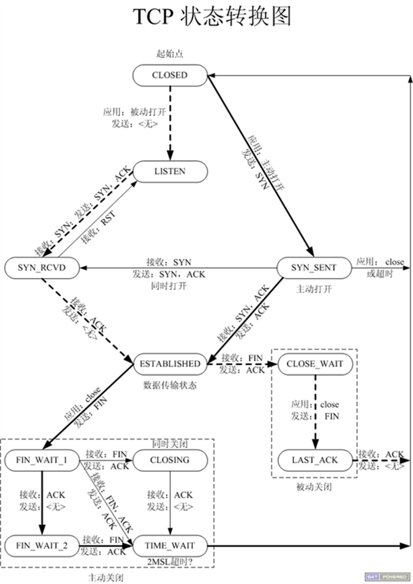
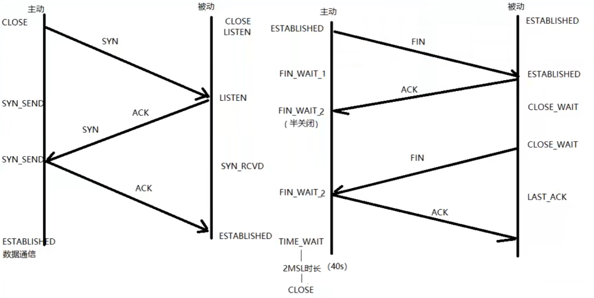
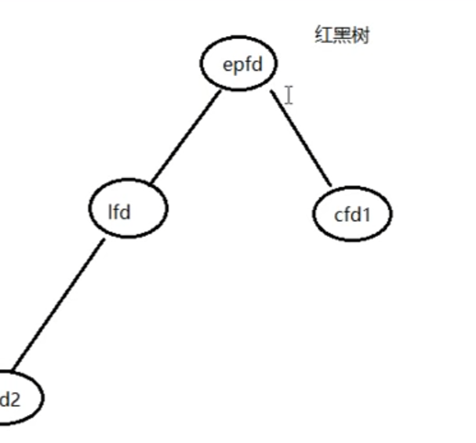
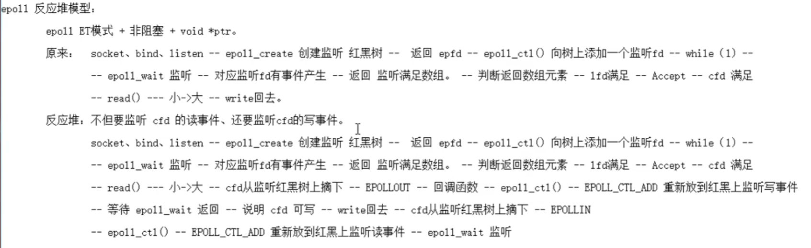
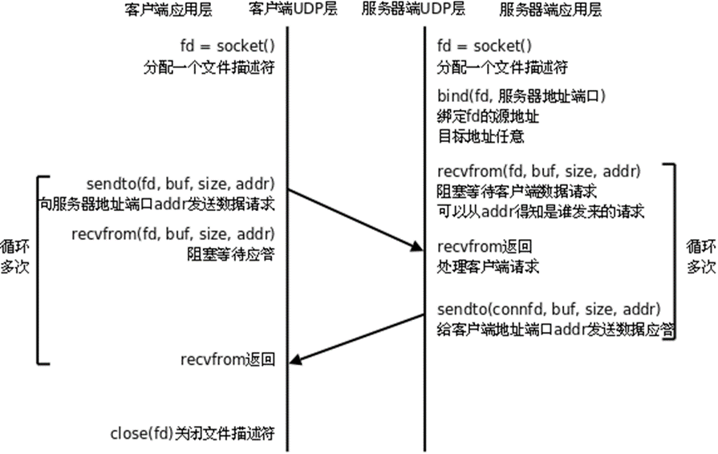
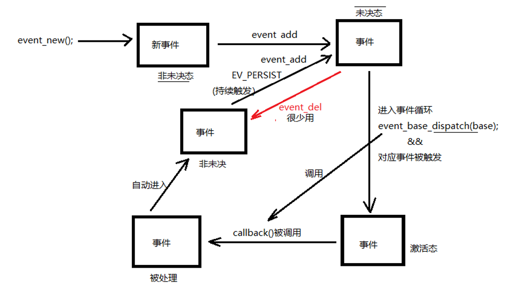
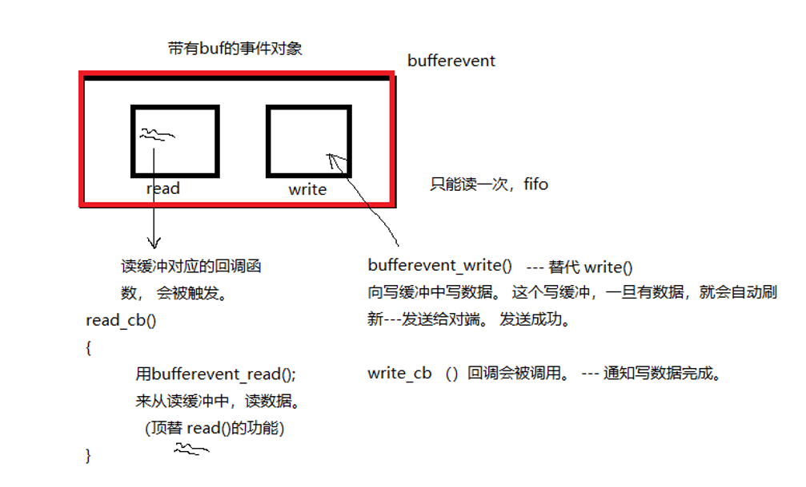
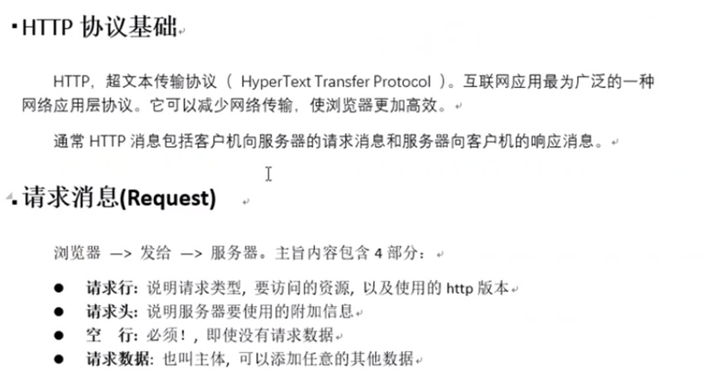
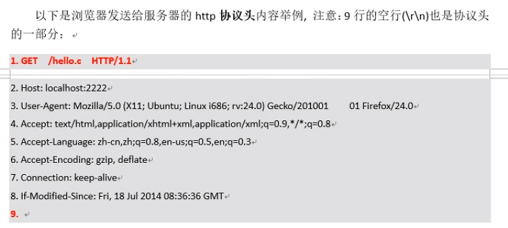
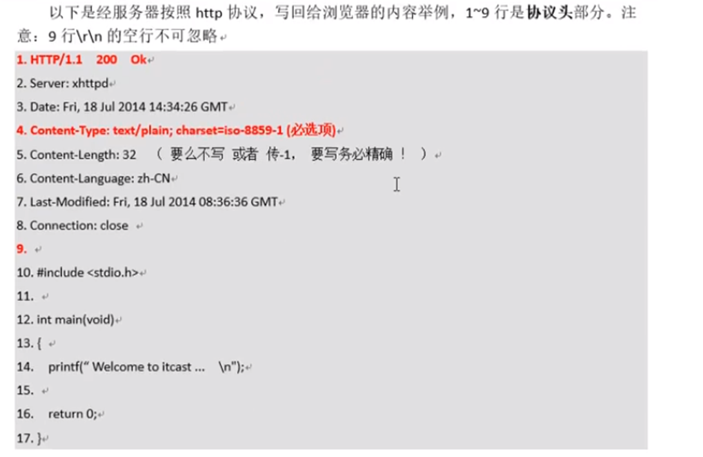

# 网络编程
## 基础概念
### CS  BS
CS client-server：可以缓存大量数据，协议可以自定义（不用TCPIP协议），但安全性不保证（因为自己协议就不知道在干什么了）
BS browser-server：不能缓存大量数据，遵守协议。但安全性高，跨平台性好。

### socket编程
套接字：在通信过程中必须成对出现，一对才能同样的协议。


一个描述符，但指向两个缓冲区，与管道是不一样的。

### 网络字节序
网络数据流采用大端字节序，低地址存高位字节。（计算机中通常使用小端法），因此有网络字节序和计算机字节序的转化。

```c++
uint32_t htonl(uint32_t hostlong);  //将32位地址转化，本地序转网络字节序（IP）
uint16_t htons(uint16_t hostshort);  //转化端口

//反过来
ntohl
ntohs

//一次性的IP地址转换函数
int inet_pton(int af, const char *src, void *dst);  //第一参数选择ipv4和6，第二参数为IP地址点分十进制，dst为转换后的网络字节序地址
//地址无效，返回0，成功1
```

### socket创建流程


注意，一对服务器客户端连接会有3个socket

服务端：

创建一个套接字socket()，并设置自己的IP和端口bind()，设置同时建立连接的上限listen()，而后阻塞监听客户端连接accept()，发现有客户端了，就再建立一个新的socket和客户端通信，自己继续监听，因此会有三个socket（就像迎宾小姐先领你去房间然后再回前台，这不就三个人了）

在accept和connect执行之后，就说明三次握手已经完成了。

### socketaddr套接字地址结构 (bind()函数)
```c++
//查看方法
man 7 sockaddr

//内部参数，在用以前要初始化
struct sockaddr_in {
	sa_family_t sin_family; // 地址结构类型
	in_port_t sin_port;	//端口号
	struct in_addr sin_addr;	//IP地址，内嵌结构体
}

struct in_addr{
    uint32_t s_addr;  //但结构体中只有一个参数
}

//例子
struct sockaddr_in addr;
addr.sin_family = AF_INET/AF_INET6;
addr.sin_port = htons(9527);

int dst;
inet_pton(AF_INET, "192.168.70.128", (void *)&dst);  //转字节序                                                                                            
addr.sin_addr.s_addr = dst;

addr.sin_addr.s_addr = htonl(INADDR_ANY);  //取出系统中任意有效的地址

bind(fd, (struct sockaddr *)&addr, size);  //传参时需要强转
```


### socket函数
```c++
#include <sys/types.h> /* See NOTES */
#include <sys/socket.h>
int socket(int domain, int type, int protocol);
domain:
	AF_INET 这是大多数用来产生socket的协议，使用TCP或UDP来传输，用IPv4的地址
	AF_INET6 与上面类似，不过是来用IPv6的地址
	AF_UNIX 本地协议，使用在Unix和Linux系统上，一般都是当客户端和服务器在同一台及其上的时候使用
type:
	SOCK_STREAM 这个协议是按照顺序的、可靠的、数据完整的基于字节流的连接。这是一个使用最多的socket类型，这个socket是使用TCP来进行传输。
	SOCK_DGRAM 这个协议是无连接的、固定长度的传输调用。该协议是不可靠的，使用UDP来进行它的连接。
	SOCK_SEQPACKET该协议是双线路的、可靠的连接，发送固定长度的数据包进行传输。必须把这个包完整的接受才能进行读取。
	SOCK_RAW socket类型提供单一的网络访问，这个socket类型使用ICMP公共协议。（ping、traceroute使用该协议）
	SOCK_RDM 这个类型是很少使用的，在大部分的操作系统上没有实现，它是提供给数据链路层使用，不保证数据包的顺序
protocol:
	传0 表示使用默认协议。
返回值：
	成功：返回指向新创建的socket的文件描述符，失败：返回-1，设置errno

```

### listen函数
```c++
int listen(int sockfd, int backlog);
sockfd:
	socket文件描述符
backlog:
	排队建立3次握手队列和刚刚建立3次握手队列的链接数和
查看系统默认backlog
cat /proc/sys/net/ipv4/tcp_max_syn_backlog
```

### accept函数
```c++
int accept(int sockfd, struct sockaddr *addr, socklen_t *addrlen);
sockdf:
	socket文件描述符
addr:
	传出参数，返回链接客户端地址信息，含IP地址和端口号
addrlen:
	传入传出参数（值-结果）,传入sizeof(addr)大小，函数返回时返回真正接收到地址结构体的大小
返回值：
	成功返回一个新的socket文件描述符，用于和客户端通信，失败返回-1，设置errno

```

注意比较bind和accept的传入参数区别。

```c++
//注意比较
int bind(int sockfd, const struct sockaddr *addr, socklen_t addrlen);
int accept(int sockfd, struct sockaddr *addr, socklen_t *addrlen);
```
在bind中sockaddr是一个const，只起传入作用。但accept中sockaddr是变量，是传出作用，传出连接的**客户端的**地址结构体。

addrlen在accept中也是传入传出变量，传入允许大小sizeof(addr)，传出时是客户端的实际addr大小。

accept函数返回的int是新的能与客户端通信的socket的文件描述符。


### connect函数
```c++
int connect(int sockfd, const struct sockaddr *addr, socklen_t addrlen);
sockdf:
	socket文件描述符
addr:
	传入参数，指定服务器端地址信息，含IP地址和端口号
addrlen:
	传入参数,传入sizeof(addr)大小
返回值：
	成功返回0，失败返回-1，设置errno

```

注意传入的addr是服务器的addr，客户端没有绑定过客户端相关的地址和端口。不使用bind绑定客户端地址，系统会隐式的进行这次绑定。


### 实现一个服务端
```c++
#include<stdlib.h>
#include<string.h>
#include<unistd.h>
#include<errno.h>
#include<pthread.h>
#include<stdio.h>
#include<signal.h>
#include<sys/types.h>
#include <sys/types.h> 
#include <sys/socket.h>
#include<arpa/inet.h>


#define SERV_PORT 9527

int main(void){
    int lfd = 0, cfd = 0;
    char buf[BUFSIZ], client_IP[1024];
    int ret = 0;

    lfd = socket(AF_INET, SOCK_STREAM, 0);
    if(lfd == -1){
        perror("socket error");
        exit(1);
    }

    struct sockaddr_in serv_addr, clit_addr;
    serv_addr.sa_family = AF_INET;
    serv_addr.sin_port =  htons(SERV_PORT);
    serv_addr.sin_addr.s_addr = htonl(INADDR_ANY);

    bind(lfd, (struct sockaddr *)&serv_addr, sizeof(addr));

    listen(lfd, 128);

    socklen_t clit_addr_len;
    clit_addr_len = sizeof(serv_addr)
    cfd = accept(lfd, (struct sockaddr *)&clit_addr, &clit_addr_len);
    if(cfd == -1){
        perror("accept error");
        exit(1);
    }

    printf("client IP: %s, port: %d\n", inet_ntop(AF_INET, &clit_addr.sin_addr.s_addr, client_IP, sizeof(cliet_IP)), ntohs(clit_addr.sin_port));  //注意这里是如何取得客户端的IP和端口的

    while(1){
        ret = read(cfd, buf, sizeof(buf));  //读客户端数据
        write(STDOUT_FILENO, buf, ret);  //在服务端打印一下

        for(int i = 0; i < ret; i++){
            buf[i] = toupper(buf[i]);
        }

        write(cfd, buf, ret);
    }

    close(lfd);   //别忘了关闭打开的文件，都是文件描述符了
    close(cfd);
    return 0;
}
```

测试方法：
```shell
nc 127.0.0.1 9527  #自己访问自己的服务器接口
```


### 实现一个客户端
```c++
#define SERV_PORT 9527

int main(void){
    int cfd;
    int counter = 10;
    char buf[BUFSIZ];

    cfd = socket(AF_INET, SOCK_STREAM, 0);
    if(lfd == -1){
        perror("socket error");
        exit(1);
    }

    struct sockaddr_in serv_addr;
    serv_addr.sa_family = AF_INET;
    serv_addr.sin_port = htons(SERV_PORT);
    // serv_addr.sin_addr.s_addr = 
    inet_pton(AF_INET, "127.0.0.1", serv_addr.sin_addr.s_addr);

    int ret = connect(cfd, (struct sockaddr *)&serv_addr, sizeof(serv_addr));
    if(ret == -1){
        perror("socket error");
        exit(1);
    }

    while(--counter){
        write(cfd, "hello\n", 5);
        sleep(1);

        int read_len = read(cfd, buf, sizeof(buf));
        write(STDOUT_FILENO, buf, read_len);
    }

    close(cfd);

    return 0;
}
```

### 错误处理函数封装
```c++
//.h文件
#ifndef __WRAP_H_
#define __WRAP_H_
void perr_exit(const char *s);
int Accept(int fd, struct sockaddr *sa, socklen_t *salenptr);
int Bind(int fd, const struct sockaddr *sa, socklen_t salen);
int Connect(int fd, const struct sockaddr *sa, socklen_t salen);
int Listen(int fd, int backlog);
int Socket(int family, int type, int protocol);
ssize_t Read(int fd, void *ptr, size_t nbytes);
ssize_t Write(int fd, const void *ptr, size_t nbytes);
int Close(int fd);
ssize_t Readn(int fd, void *vptr, size_t n);
ssize_t Writen(int fd, const void *vptr, size_t n);
ssize_t my_read(int fd, char *ptr);
ssize_t Readline(int fd, void *vptr, size_t maxlen);
#endif

```

相当于自己将要用的函数封装一下，如果出错就执行自己的操作，以防程序出错后导致整体崩溃。而后在书写正式程序的功能的主函数时，就可以逻辑清晰，不用反复考虑每一个函数是否调用成功。

```c++
#include <stdlib.h>
#include <errno.h>
#include <sys/socket.h>
void perr_exit(const char *s)
{
	perror(s);
	exit(1);
}
int Accept(int fd, struct sockaddr *sa, socklen_t *salenptr)
{
	int n;
	again:
	if ( (n = accept(fd, sa, salenptr)) < 0) {
		if ((errno == ECONNABORTED) || (errno == EINTR))
			goto again;
		else
			perr_exit("accept error");
	}
	return n;
}
int Bind(int fd, const struct sockaddr *sa, socklen_t salen)
{
	int n;
	if ((n = bind(fd, sa, salen)) < 0)
		perr_exit("bind error");
	return n;
}
int Connect(int fd, const struct sockaddr *sa, socklen_t salen)
{
	int n;
	if ((n = connect(fd, sa, salen)) < 0)
		perr_exit("connect error");
	return n;
}
int Listen(int fd, int backlog)
{
	int n;
	if ((n = listen(fd, backlog)) < 0)
		perr_exit("listen error");
	return n;
}
int Socket(int family, int type, int protocol)
{
	int n;
	if ( (n = socket(family, type, protocol)) < 0)
		perr_exit("socket error");
	return n;
}
ssize_t Read(int fd, void *ptr, size_t nbytes)
{
	ssize_t n;
again:
	if ( (n = read(fd, ptr, nbytes)) == -1) {
		if (errno == EINTR)
			goto again;
		else
			return -1;
	}
	return n;
}

```


### 多进程并发服务器
思想：while(1)中accept，不停的等待接入的客户端。等到一个就开一个子进程，在子进程中read和write。但难点在于如何回收进程（父进程中循环回收会导致程序停滞不前，可以使用信号通知回收子进程。

```c++
#include<stdlib.h>
#include<string.h>
#include<unistd.h>
#include<errno.h>
#include<pthread.h>
#include<stdio.h>
#include<signal.h>
#include<sys/types.h>
#include <sys/types.h> 
#include <sys/socket.h>
#include<arpa/inet.h>
#include <sys/wait.h>
#include <sys/stat.h>
#include <fcntl.h>
#include <sys/sendfile.h>
#include <sys/stat.h>


#define SERV_PORT 9527
#define define BUF_SIZE 1024

void catch_child(int signo){
    printf("catch_child\n");
    while(waitpid(0, NULL, WNOHANG) > 0);
}

int main(void){
    int lfd = 0, cfd = 0;
    char buf[BUFSIZ], client_IP[1024];
    int ret = 0;
    pid_t pid;
    socklen_t clit_addr_len;
    char buf[BUFFER_SIZE];

    struct sockaddr_in serv_addr, clit_addr;
    bzero(&serv_addr, sizeof(serv_addr));  //清零

    serv_addr.sa_family = AF_INET;
    serv_addr.sin_port =  htons(SERV_PORT);
    serv_addr.sin_addr.s_addr = htonl(INADDR_ANY);

    lfd = socket(AF_INET, SOCK_STREAM, 0);
    if(lfd == -1){
        perror("socket error");
        exit(1);
    }

    bind(lfd, (struct sockaddr *)&serv_addr, sizeof(serv_addr));

    listen(lfd, 128);

    while(1){
        clit_addr_len = sizeof(serv_addr);  //初始化accept必要的参数

        cfd = accept(lfd, (struct sockaddr *)&clit_addr, &clit_addr_len);
        if(cfd == -1){
            perror("accept error");
            exit(1);
        }

        pid = fork();

        if(pid < 0){
            perror("fork error");
            exit(1);
        }
        else if (pid == 0){
            close(lfd);
            break;
        }
        else{
            //父进程
            struct sigaction act;  //初始化信号处理函数
            act.sa_flags = 0;
            sigemptyset(&act.sa_mask);
            act.sa_handler = catch_child;

            ret = sigaction(SIGCHLD, &act, NULL);
            if(ret != 0){
                perror("signal error");
                exit(1);
            }

            close(cfd);
            continue;
        }
    }

    //子进程
    if(pid == 0){
        for(;;;){
            ret = read(cfd, buf, sizeof(buf));
            for(int i = 0; i <ret; i++){
                buf[i] = toupper(buf[i]);
            }

            write(cfd, buf, ret);
            write(STDOUT_FILENO, buf, ret);
        }
        close(cfd);
        exit(0);
    }

}
```

```c++
//客户端
#include <stdio.h>
#include <string.h>
#include <unistd.h>
#include <netinet/in.h>
#include "wrap.h"

#define MAXLINE 80
#define SERV_PORT 6666

int main(int argc, char *argv[])
{
	struct sockaddr_in servaddr;
	char buf[MAXLINE];
	int sockfd, n;

	sockfd = Socket(AF_INET, SOCK_STREAM, 0);

	bzero(&servaddr, sizeof(servaddr));
	servaddr.sin_family = AF_INET;
	inet_pton(AF_INET, "127.0.0.1", &servaddr.sin_addr);
	servaddr.sin_port = htons(SERV_PORT);

	Connect(sockfd, (struct sockaddr *)&servaddr, sizeof(servaddr));

	while (fgets(buf, MAXLINE, stdin) != NULL) {
		Write(sockfd, buf, strlen(buf));
		n = Read(sockfd, buf, MAXLINE);
		if (n == 0) {
			printf("the other side has been closed.\n");
			break;
		} else
			Write(STDOUT_FILENO, buf, n);
	}
	Close(sockfd);
	return 0;
}

```

```c++
scp -r ./test core1@192.169.70.1:/home/core1/socket_server  //第一个地址是文件的源地址，后面地址的要拷贝到的服务器目标地址
```

### 多线程并发服务器
回收可以使用默认detach，但是如果线程需要返回值，而只能使用join，而join又会阻塞主线程，怎么办：可以开个新线程专门回收线程。

代码请自行看视频或自己写。


### TCP状态
```c++
//查看命令
netstat -apn | grep 9090 //端口号

```





注意该被动端和主动端可以是服务器也可以用户


### 端口复用
```c++
int setsockopt(int sockfd, int level, int optname, const void *optval, socklen_t optlen)

//例子
int opt = 1;
setsockopt(listenfd, SOL_SOCKET, SO_REUSEADDR, (void *)&opt, sizeof(opt));   //选项很多，但是用在这很死，记住就好
```

该函数用在bind以前。


### 半关闭
通信双方只有一端停止发送（但是还在听）

```c++
//在一端调用
close(sockfd);  //则出现半关闭

//也可以用shotdownt
shutdown(sockfd, SHUT_RDWR);  //SHUT_RD只关读，SHUT_RDWR关读写

```

### select函数
与accept阻塞等客户端不同，也不是通过while循环，select是通过相应式的连接，叫多路IO转接。

该函数是由内核操作，不用用户书写程序去接收各种来到的客户端。因为服务器程序一直阻塞在accept上，其他事情就别想干了。select相当于一个监听，但是监听需要通过打电话来我才处理，处理时找到用户程序来创建socket。

```c++
int select(int nfds, fd_set *readfds, fd_set *writefds,
			fd_set *exceptfds, struct timeval *timeout);

	nfds: 		监控的文件描述符集里最大文件描述符加1，因为此参数会告诉内核检测前多少个文件描述符的状态
	readfds：	监控有读数据到达文件描述符集合，传入传出参数
	writefds：	监控写数据到达文件描述符集合，传入传出参数
	exceptfds：	监控异常发生达文件描述符集合,如带外数据到达异常，传入传出参数
	timeout：	定时阻塞监控时间，3种情况
				1.NULL，永远等下去
				2.设置timeval，等待固定时间
				3.设置timeval里时间均为0，检查描述字后立即返回，轮询

    void FD_CLR(int fd, fd_set *set); 	//把文件描述符集合里fd清0
	int FD_ISSET(int fd, fd_set *set); 	//测试文件描述符集合里fd是否置1
	void FD_SET(int fd, fd_set *set); 	//把文件描述符集合里fd位置1
	void FD_ZERO(fd_set *set); 			//把文件描述符集合里所有位清0

```

下面程序比较有难度，应当好好理解一下，特别是结合select函数返回的值到底代表什么含义。

```c++
//服务端程序
#include <stdio.h>
#include <stdlib.h>
#include <string.h>
#include <netinet/in.h>
#include <arpa/inet.h>
#include "wrap.h"

#define MAXLINE 80
#define SERV_PORT 6666

int main(int argc, char *argv[])
{
	int i, maxi, maxfd, listenfd, connfd, sockfd;
	int nready, client[FD_SETSIZE]; 	/* FD_SETSIZE 默认为 1024 */
	ssize_t n;
	fd_set rset, allset;
	char buf[MAXLINE];
	char str[INET_ADDRSTRLEN]; 			/* #define INET_ADDRSTRLEN 16 */
	socklen_t cliaddr_len;
	struct sockaddr_in cliaddr, servaddr;

	listenfd = Socket(AF_INET, SOCK_STREAM, 0);

bzero(&servaddr, sizeof(servaddr));
servaddr.sin_family = AF_INET;
servaddr.sin_addr.s_addr = htonl(INADDR_ANY);
servaddr.sin_port = htons(SERV_PORT);

Bind(listenfd, (struct sockaddr *)&servaddr, sizeof(servaddr));

Listen(listenfd, 20); 		/* 默认最大128 */

maxfd = listenfd; 			/* 初始化 */
maxi = -1;					/* client[]的下标 */

for (i = 0; i < FD_SETSIZE; i++)
	client[i] = -1; 		/* 用-1初始化client[] */

FD_ZERO(&allset);
FD_SET(listenfd, &allset); /* 构造select监控文件描述符集 */

for ( ; ; ) {
	rset = allset; 			/* 每次循环时都从新设置select监控信号集，思索问题：为什么要两个set */
	nready = select(maxfd+1, &rset, NULL, NULL, NULL);

	if (nready < 0)
		perr_exit("select error");

    //如果有新客户端上来了    
	if (FD_ISSET(listenfd, &rset)) { /* new client connection */
		cliaddr_len = sizeof(cliaddr);
		connfd = Accept(listenfd, (struct sockaddr *)&cliaddr, &cliaddr_len);
		printf("received from %s at PORT %d\n",
				inet_ntop(AF_INET, &cliaddr.sin_addr, str, sizeof(str)),
				ntohs(cliaddr.sin_port));
		for (i = 0; i < FD_SETSIZE; i++) {
			if (client[i] < 0) {
				client[i] = connfd; /* 保存accept返回的文件描述符到client[]里 */
				break;
			}
		}
		/* 达到select能监控的文件个数上限 1024 */
		if (i == FD_SETSIZE) {
			fputs("too many clients\n", stderr);
			exit(1);
		}

		FD_SET(connfd, &allset); 	/* 添加一个新的文件描述符到监控信号集里 */

		if (connfd > maxfd)
			maxfd = connfd; 		/* select第一个参数需要 */
		if (i > maxi)
			maxi = i; 				/* 更新client[]最大下标值 */

		if (--nready == 0)
			continue; 				/* 如果没有更多的就绪文件描述符继续回到上面select阻塞监听,
										负责处理未处理完的就绪文件描述符 */
		}
		for (i = 0; i <= maxi; i++) { 	/* 检测哪个clients 有数据就绪 */
			if ( (sockfd = client[i]) < 0)
				continue;
			if (FD_ISSET(sockfd, &rset)) {
				if ( (n = Read(sockfd, buf, MAXLINE)) == 0) {     //思考为什么选择这里关，当客户端写了一行然后停住不写，但也不断连接，它会不会阻塞
					Close(sockfd);		/* 当client关闭链接时，服务器端也关闭对应链接 */
					FD_CLR(sockfd, &allset); /* 解除select监控此文件描述符 */
					client[i] = -1;
				} else {
					int j;
					for (j = 0; j < n; j++)
						buf[j] = toupper(buf[j]);
					Write(sockfd, buf, n);
				}
				if (--nready == 0)
					break;
			}
		}
	}
	close(listenfd);
	return 0;
}

```

select监听上限受到文件描述符限制，最大为1024.
优点在于这个是跨平台的，不像epoll只能在linux上


### poll函数
poll函数没有特别大的改善，所以看看就好，重点放在epoll上。
```c++
#include <poll.h>
int poll(struct pollfd *fds, nfds_t nfds, int timeout);
	struct pollfd {
		int fd; /* 文件描述符 */
		short events; /* 监控的事件 */
		short revents; /* 监控事件中满足条件返回的事件 */
	};

```


### epoll
epoll创建时是一个红黑树，文件描述符就在这个数的节点上。epoll有三个函数，记住这几个函数是干什么的。**epoll是Linux下多路复用IO接口select/poll的增强版本，它能显著提高程序在大量并发连接中只有少量活跃的情况下的系统CPU利用率。**



```c++
//创建
int epoll_create(int size)		//size：监听数目，创建一个epoll句柄（创建根节点），参数size用来告诉内核监听的文件描述符的个数，跟内存大小有关。返回值为epfd
```

```c++
//控制
#include <sys/epoll.h>
int epoll_ctl(int epfd, int op, int fd, struct epoll_event *event)

	epfd：	为epoll_creat的句柄
	op：		表示动作，用3个宏来表示：
		EPOLL_CTL_ADD (注册新的fd到epfd)，
		EPOLL_CTL_MOD (修改已经注册的fd的监听事件)，
		EPOLL_CTL_DEL (从epfd删除一个fd)；
	event：	告诉内核需要监听的事件，注意这个参数是个传入传出参数

	struct epoll_event {
		__uint32_t events; /* Epoll events */
		epoll_data_t data; /* User data variable */
	};
	typedef union epoll_data {
		void *ptr;
		int fd;
		uint32_t u32;
		uint64_t u64;
	} epoll_data_t;

	__uint32_t events可选值如下：
	EPOLLIN ：	表示对应的文件描述符可以读（包括对端SOCKET正常关闭）
	EPOLLOUT：	表示对应的文件描述符可以写
	EPOLLPRI：	表示对应的文件描述符有紧急的数据可读（这里应该表示有带外数据到来）
	EPOLLERR：	表示对应的文件描述符发生错误
	EPOLLHUP：	表示对应的文件描述符被挂断；
	EPOLLET： 	将EPOLL设为边缘触发(Edge Triggered)模式，这是相对于水平触发(Level Triggered)而言的
	EPOLLONESHOT：只监听一次事件，当监听完这次事件之后，如果还需要继续监听这个socket的话，需要再次把这个socket加入到EPOLL队列里

```

```c++
//等待事件到达
#include <sys/epoll.h>
int epoll_wait(int epfd, struct epoll_event *events, int maxevents, int timeout)
	events：	用来存内核得到事件的集合，和creat中不一样，这是一个数组，单纯的传出参数，比如传出满足监听条件的文件描述符对应的结构体
	maxevents：	告之内核这个events有多大，这个maxevents的值不能大于创建epoll_create()时的size，
	timeout：	是超时时间
		-1：	阻塞
		0：	立即返回，非阻塞
		>0：	指定毫秒
	返回值：	成功返回有多少文件描述符就绪，时间到时返回0，出错返回-1

```

```c++
//简单写写结构
int lfd = socket();
bind();
listen();

struct epoll_event temp, ep[1024];
temp.events = EPOLLIN; //设置lfd听属性
temp.data.fd = lfd; //与要添加的文件描述符遥相呼应

int epfd = epoll_creat(1024);
epoll_ctl(epfd, EPOLL_CTL_ADD, lfd, &temp);
while(1){
	int ret = epoll_wait(epfd, ep, 1024, -1);  //设置阻塞
	for(int i = 0; i < ret; i++){
		if(ep[i].data.fd == lfd){  //lfd满足读，有新客户端接入
			cfd = accept();

			temp.events = EPOLLIN;
			temp.data.fd = cfd;

			epoll_ctl(epfd, EPOLL_CTL_ADD, cfd, &temp);
		} else {    //cfd们有写数据来
			n = read();
			if (n == 0){
				close(ep[i].data.fd);

				epoll_ctl(epfd, EPOLL_CTL_DEL, ep[i].data.fd, NULL);  //记得从树上摘下来
			} else if(n > 0){
				//处理读入数据
				write(ep[i].data.fd, buf, sizeof(buf));
			}
		}
	}
}
```

```c++
//标准代码
#include <stdio.h>
#include <stdlib.h>
#include <string.h>
#include <netinet/in.h>
#include <arpa/inet.h>
#include <sys/epoll.h>
#include <errno.h>
#include "wrap.h"

#define MAXLINE 80
#define SERV_PORT 6666
#define OPEN_MAX 1024

int main(int argc, char *argv[])
{
	int i, j, maxi, listenfd, connfd, sockfd;
	int nready, efd, res;
	ssize_t n;
	char buf[MAXLINE], str[INET_ADDRSTRLEN];
	socklen_t clilen;
	int client[OPEN_MAX];
	struct sockaddr_in cliaddr, servaddr;
	struct epoll_event tep, ep[OPEN_MAX];

	listenfd = Socket(AF_INET, SOCK_STREAM, 0);

	bzero(&servaddr, sizeof(servaddr));
	servaddr.sin_family = AF_INET;
	servaddr.sin_addr.s_addr = htonl(INADDR_ANY);
	servaddr.sin_port = htons(SERV_PORT);

	Bind(listenfd, (struct sockaddr *) &servaddr, sizeof(servaddr));

	Listen(listenfd, 20);

	for (i = 0; i < OPEN_MAX; i++)
		client[i] = -1;
	maxi = -1;

	efd = epoll_create(OPEN_MAX);
	if (efd == -1)
		perr_exit("epoll_create");

	tep.events = EPOLLIN; tep.data.fd = listenfd;

	res = epoll_ctl(efd, EPOLL_CTL_ADD, listenfd, &tep);
	if (res == -1)
		perr_exit("epoll_ctl");

	while (1) {
		nready = epoll_wait(efd, ep, OPEN_MAX, -1); /* 阻塞监听 */
		if (nready == -1)
			perr_exit("epoll_wait");

		for (i = 0; i < nready; i++) {
			if (!(ep[i].events & EPOLLIN))  //如果不是读的类型就不管了
				continue;
			if (ep[i].data.fd == listenfd) {
				clilen = sizeof(cliaddr);
				connfd = Accept(listenfd, (struct sockaddr *)&cliaddr, &clilen);
				printf("received from %s at PORT %d\n", 
						inet_ntop(AF_INET, &cliaddr.sin_addr, str, sizeof(str)), 
						ntohs(cliaddr.sin_port));
				for (j = 0; j < OPEN_MAX; j++) {   //这段可以暂时不管它了
					if (client[j] < 0) {
						client[j] = connfd; /* save descriptor */
						break;
					}
				}

				if (j == OPEN_MAX)
					perr_exit("too many clients");
				if (j > maxi)
					maxi = j; 		/* max index in client[] array */

				tep.events = EPOLLIN; 
				tep.data.fd = connfd;
				res = epoll_ctl(efd, EPOLL_CTL_ADD, connfd, &tep);
				if (res == -1)
					perr_exit("epoll_ctl");
			} else {
				sockfd = ep[i].data.fd;
				n = Read(sockfd, buf, MAXLINE);
				if (n == 0) {
					for (j = 0; j <= maxi; j++) {
						if (client[j] == sockfd) {
							client[j] = -1;
							break;
						}
					}
					res = epoll_ctl(efd, EPOLL_CTL_DEL, sockfd, NULL);
					if (res == -1)
						perr_exit("epoll_ctl");

					Close(sockfd);
					printf("client[%d] closed connection\n", j);
				} else {
					for (j = 0; j < n; j++)
						buf[j] = toupper(buf[j]);
					Writen(sockfd, buf, n);
				}
			}
		}
	}
	close(listenfd);
	close(efd);
	return 0;
}

```

### epoll事件类型
EPOLL事件有两种模型：
* Edge Triggered (ET) 边缘触发只有数据到来才触发，不管缓存区中是否还有数据。
* Level Triggered (LT) 水平触发只要有数据都会触发。

```c++
#include <stdio.h>
#include <stdlib.h>
#include <sys/epoll.h>
#include <errno.h>
#include <unistd.h>

#define MAXLINE 10

int main(int argc, char *argv[])
{
	int efd, i;
	int pfd[2];
	pid_t pid;
	char buf[MAXLINE], ch = 'a';

	pipe(pfd);
	pid = fork();
	if (pid == 0) {
		close(pfd[0]);
		while (1) {
			for (i = 0; i < MAXLINE/2; i++)
				buf[i] = ch;
			buf[i-1] = '\n';
			ch++;

			for (; i < MAXLINE; i++)
				buf[i] = ch;
			buf[i-1] = '\n';
			ch++;

			write(pfd[1], buf, sizeof(buf));  //这里一次写入的是aaaa\nbbbb\n
			sleep(2);
		}
		close(pfd[1]);
	} else if (pid > 0) {
		struct epoll_event event;
		struct epoll_event resevent[10];
		int res, len;
		close(pfd[1]);

		efd = epoll_create(10);
		/* event.events = EPOLLIN; */
		event.events = EPOLLIN | EPOLLET;		/* ET 边沿触发 ，默认是水平触发 */
		event.data.fd = pfd[0];
	epoll_ctl(efd, EPOLL_CTL_ADD, pfd[0], &event);

		while (1) {
			res = epoll_wait(efd, resevent, 10, -1);  
			printf("res %d\n", res);
			if (resevent[0].data.fd == pfd[0]) {
				len = read(pfd[0], buf, MAXLINE/2);  //一次只读取buf中数据的一半，如果是边缘触发，则剩下的留在缓冲区里了，不会再次循环来将剩下的数据读出
				write(STDOUT_FILENO, buf, len);
			}
		}
		close(pfd[0]);
		close(efd);
	} else {
		perror("fork");
		exit(-1);
	}
	return 0;
}

```

上面代码也说明epoll是对文件描述符的，不仅仅是客户端服务器的操作，任何文件描述符都是一样的。

关键：使用ET模式时，应当设置文件描述符为非阻塞的，因为文件如果是边缘触发，那么文件就不会被读完全（就像刚刚演示的那样）

```c++
#include <stdio.h>
#include <string.h>
#include <netinet/in.h>
#include <arpa/inet.h>
#include <sys/wait.h>
#include <sys/types.h>
#include <sys/epoll.h>
#include <unistd.h>
#include <fcntl.h>

#define MAXLINE 10
#define SERV_PORT 8080

int main(void)
{
	struct sockaddr_in servaddr, cliaddr;
	socklen_t cliaddr_len;
	int listenfd, connfd;
	char buf[MAXLINE];
	char str[INET_ADDRSTRLEN];
	int i, efd, flag;

	listenfd = socket(AF_INET, SOCK_STREAM, 0);

	bzero(&servaddr, sizeof(servaddr));
	servaddr.sin_family = AF_INET;
	servaddr.sin_addr.s_addr = htonl(INADDR_ANY);
	servaddr.sin_port = htons(SERV_PORT);

	bind(listenfd, (struct sockaddr *)&servaddr, sizeof(servaddr));

	listen(listenfd, 20);

	struct epoll_event event;
	struct epoll_event resevent[10];
	int res, len;
	efd = epoll_create(10);
	/* event.events = EPOLLIN; */
	event.events = EPOLLIN | EPOLLET;		/* ET 边沿触发 ，默认是水平触发 */

	printf("Accepting connections ...\n");
	cliaddr_len = sizeof(cliaddr);
	connfd = accept(listenfd, (struct sockaddr *)&cliaddr, &cliaddr_len);
	printf("received from %s at PORT %d\n",
			inet_ntop(AF_INET, &cliaddr.sin_addr, str, sizeof(str)),
			ntohs(cliaddr.sin_port));

	////////////////////////////////////设置文件非阻塞
	flag = fcntl(connfd, F_GETFL);
	flag |= O_NONBLOCK;
	fcntl(connfd, F_SETFL, flag);


	event.data.fd = connfd;
	epoll_ctl(efd, EPOLL_CTL_ADD, connfd, &event);

	while (1) {
		printf("epoll_wait begin\n");
		res = epoll_wait(efd, resevent, 10, -1);
		printf("epoll_wait end res %d\n", res);

		if (resevent[0].data.fd == connfd) {
			while ((len = read(connfd, buf, MAXLINE/2)) > 0)  //非阻塞读的实现
				write(STDOUT_FILENO, buf, len);
		}
	}
	return 0;
}

```


### epoll反应堆模型
上面的代码比较简单，如果对端半关闭或者滑动窗口已经满了，则无法write，所以使用现在的方法，该方法的特点是用到了epoll_data中的void *ptr。




## ctags
写代码时的软件，用于方便看代码函数之间的引用关系，和vscode中的goto reference一样的功能，判断系统是否安装软件ctags：
```c++
sudo aptitude show exuberan-ctags
```

```c++
//生成当前目录下c文件之间的调用关系
ctags ./* -R  
```


## 线程池
由于多线程服务器代码中每次来到一个连接就创建一个新线程，但是创建和销毁线程的开销比较大，因此在一开始就创建多个线程，而后阻塞等待需求的到达，而后分配线程处理。（在线程学习那里有一个pthread_cond_wait感觉有点像，线程阻塞等待条件符合）

```c++
//理论分析
//需要的变量
live_thr_num = 38;  //现存线程数
busy_thr_num = 20;  //在忙线程数，即将都忙时，方便判断添加新线程到线程池
thr_add_step = 15;  //一次添加和删除线程个数，根据忙和空闲的线程数而定
thr_del_step = 15;

ctl_thread;  //用于管理线程池的线程
```

```c++
#include <stdlib.h>
#include <pthread.h>
#include <unistd.h>
#include <assert.h>
#include <stdio.h>
#include <string.h>
#include <signal.h>
#include <errno.h>
#include "threadpool.h"

#define DEFAULT_TIME 10                 /*10s检测一次*/
#define MIN_WAIT_TASK_NUM 10            /*如果queue_size > MIN_WAIT_TASK_NUM 添加新的线程到线程池*/ 
#define DEFAULT_THREAD_VARY 10          /*每次创建和销毁线程的个数*/
#define true 1
#define false 0

typedef struct {
    void *(*function)(void *);          /* 函数指针，回调函数 */
    void *arg;                          /* 上面函数的参数 */
} threadpool_task_t;                    /* 各子线程任务结构体 */

/* 描述线程池相关信息 */

struct threadpool_t {
    pthread_mutex_t lock;               /* 用于锁住本结构体 */    
    pthread_mutex_t thread_counter;     /* 记录忙状态线程个数de琐 -- busy_thr_num */

    pthread_cond_t queue_not_full;      /* 当任务队列满时，添加任务的线程阻塞，等待此条件变量 */
    pthread_cond_t queue_not_empty;     /* 任务队列里不为空时，通知等待任务的线程 */

    pthread_t *threads;                 /* 存放线程池中每个线程的tid。数组 */
    pthread_t adjust_tid;               /* 存管理线程tid */
    threadpool_task_t *task_queue;      /* 任务队列(数组首地址) */

    int min_thr_num;                    /* 线程池最小线程数 */
    int max_thr_num;                    /* 线程池最大线程数 */
    int live_thr_num;                   /* 当前存活线程个数 */
    int busy_thr_num;                   /* 忙状态线程个数 */
    int wait_exit_thr_num;              /* 要销毁的线程个数 */

    int queue_front;                    /* task_queue队头下标 */
    int queue_rear;                     /* task_queue队尾下标 */
    int queue_size;                     /* task_queue队中实际任务数 */
    int queue_max_size;                 /* task_queue队列可容纳任务数上限 */

    int shutdown;                       /* 标志位，线程池使用状态，true或false */
};

void *threadpool_thread(void *threadpool);

void *adjust_thread(void *threadpool);

int is_thread_alive(pthread_t tid);
int threadpool_free(threadpool_t *pool);

//threadpool_create(3,100,100);  
threadpool_t *threadpool_create(int min_thr_num, int max_thr_num, int queue_max_size)
{
    int i;
    threadpool_t *pool = NULL;          /* 线程池 结构体 */

    do {
        if((pool = (threadpool_t *)malloc(sizeof(threadpool_t))) == NULL) {  
            printf("malloc threadpool fail");
            break;                                      /*跳出do while*/
        }

        pool->min_thr_num = min_thr_num;
        pool->max_thr_num = max_thr_num;
        pool->busy_thr_num = 0;
        pool->live_thr_num = min_thr_num;               /* 活着的线程数 初值=最小线程数 */
        pool->wait_exit_thr_num = 0;
        pool->queue_size = 0;                           /* 有0个产品 */
        pool->queue_max_size = queue_max_size;          /* 最大任务队列数 */
        pool->queue_front = 0;
        pool->queue_rear = 0;
        pool->shutdown = false;                         /* 不关闭线程池 */

        /* 根据最大线程上限数， 给工作线程数组开辟空间, 并清零 */
        pool->threads = (pthread_t *)malloc(sizeof(pthread_t) * max_thr_num); 
        if (pool->threads == NULL) {
            printf("malloc threads fail");
            break;
        }
        memset(pool->threads, 0, sizeof(pthread_t) * max_thr_num);

        /* 给 任务队列 开辟空间 */
        pool->task_queue = (threadpool_task_t *)malloc(sizeof(threadpool_task_t)*queue_max_size);
        if (pool->task_queue == NULL) {
            printf("malloc task_queue fail");
            break;
        }

        /* 初始化互斥琐、条件变量 */
        if (pthread_mutex_init(&(pool->lock), NULL) != 0
                || pthread_mutex_init(&(pool->thread_counter), NULL) != 0
                || pthread_cond_init(&(pool->queue_not_empty), NULL) != 0
                || pthread_cond_init(&(pool->queue_not_full), NULL) != 0)
        {
            printf("init the lock or cond fail");
            break;
        }

        /* 启动 min_thr_num 个 work thread */
        for (i = 0; i < min_thr_num; i++) {
            pthread_create(&(pool->threads[i]), NULL, threadpool_thread, (void *)pool);   /*pool指向当前线程池*/
            printf("start thread 0x%x...\n", (unsigned int)pool->threads[i]);
        }
        pthread_create(&(pool->adjust_tid), NULL, adjust_thread, (void *)pool);     /* 创建管理者线程 */

        return pool;

    } while (0);

    threadpool_free(pool);      /* 前面代码调用失败时，释放poll存储空间 */

    return NULL;
}

/* 向线程池中 添加一个任务 */
//threadpool_add(thp, process, (void*)&num[i]);   /* 向线程池中添加任务 process: 小写---->大写*/

int threadpool_add(threadpool_t *pool, void*(*function)(void *arg), void *arg)
{
    pthread_mutex_lock(&(pool->lock));

    /* ==为真，队列已经满， 调wait阻塞 */
    while ((pool->queue_size == pool->queue_max_size) && (!pool->shutdown)) {
        pthread_cond_wait(&(pool->queue_not_full), &(pool->lock));
    }

    if (pool->shutdown) {
        pthread_cond_broadcast(&(pool->queue_not_empty));
        pthread_mutex_unlock(&(pool->lock));
        return 0;
    }

    /* 清空 工作线程 调用的回调函数 的参数arg */
    if (pool->task_queue[pool->queue_rear].arg != NULL) {
        pool->task_queue[pool->queue_rear].arg = NULL;
    }

    /*添加任务到任务队列里*/
    pool-> [pool->queue_rear].function = function;
    pool->task_queue[pool->queue_rear].arg = arg;
    pool->queue_rear = (pool->queue_rear + 1) % pool->queue_max_size;       /* 队尾指针移动, 模拟环形 */
    pool->queue_size++;

    /*添加完任务后，队列不为空，唤醒线程池中 等待处理任务的线程*/
    pthread_cond_signal(&(pool->queue_not_empty));
    pthread_mutex_unlock(&(pool->lock));

    return 0;
}

/* 线程池中各个工作线程 */
void *threadpool_thread(void *threadpool)
{
    threadpool_t *pool = (threadpool_t *)threadpool;
    threadpool_task_t task;

    while (true) {
        /* Lock must be taken to wait on conditional variable */
        /*刚创建出线程，等待任务队列里有任务，否则阻塞等待任务队列里有任务后再唤醒接收任务*/
        pthread_mutex_lock(&(pool->lock));

        /*queue_size == 0 说明没有任务，调 wait 阻塞在条件变量上, 若有任务，跳过该while*/
        while ((pool->queue_size == 0) && (!pool->shutdown)) {  
            printf("thread 0x%x is waiting\n", (unsigned int)pthread_self());
            pthread_cond_wait(&(pool->queue_not_empty), &(pool->lock));

            /*清除指定数目的空闲线程，如果要结束的线程个数大于0，结束线程*/
            if (pool->wait_exit_thr_num > 0) {
                pool->wait_exit_thr_num--;

                /*如果线程池里线程个数大于最小值时可以结束当前线程*/
                if (pool->live_thr_num > pool->min_thr_num) {
                    printf("thread 0x%x is exiting\n", (unsigned int)pthread_self());
                    pool->live_thr_num--;
                    pthread_mutex_unlock(&(pool->lock));

                    pthread_exit(NULL);
                }
            }
        }

        /*如果指定了true，要关闭线程池里的每个线程，自行退出处理---销毁线程池*/
        if (pool->shutdown) {
            pthread_mutex_unlock(&(pool->lock));
            printf("thread 0x%x is exiting\n", (unsigned int)pthread_self());
            pthread_detach(pthread_self());
            pthread_exit(NULL);     /* 线程自行结束 */
        }

        /*从任务队列里获取任务, 是一个出队操作*/
        task.function = pool->task_queue[pool->queue_front].function;
        task.arg = pool->task_queue[pool->queue_front].arg;

        pool->queue_front = (pool->queue_front + 1) % pool->queue_max_size;       /* 出队，模拟环形队列 */
        pool->queue_size--;

        /*通知可以有新的任务添加进来*/
        pthread_cond_broadcast(&(pool->queue_not_full));

        /*任务取出后，立即将 线程池琐 释放*/
        pthread_mutex_unlock(&(pool->lock));

        /*执行任务*/ 
        printf("thread 0x%x start working\n", (unsigned int)pthread_self());
        pthread_mutex_lock(&(pool->thread_counter));                            /*忙状态线程数变量琐*/
        pool->busy_thr_num++;                                                   /*忙状态线程数+1*/
        pthread_mutex_unlock(&(pool->thread_counter));

        (*(task.function))(task.arg);                                           /*执行回调函数任务*/
        //task.function(task.arg);                                              /*执行回调函数任务*/

        /*任务结束处理*/ 
        printf("thread 0x%x end working\n", (unsigned int)pthread_self());
        pthread_mutex_lock(&(pool->thread_counter));
        pool->busy_thr_num--;                                       /*处理掉一个任务，忙状态数线程数-1*/
        pthread_mutex_unlock(&(pool->thread_counter));
    }

    pthread_exit(NULL);
}

/* 管理线程 */
void *adjust_thread(void *threadpool)
{
    int i;
    threadpool_t *pool = (threadpool_t *)threadpool;
    while (!pool->shutdown) {

        sleep(DEFAULT_TIME);                                    /*定时 对线程池管理*/

        pthread_mutex_lock(&(pool->lock));
        int queue_size = pool->queue_size;                      /* 关注 任务数 */
        int live_thr_num = pool->live_thr_num;                  /* 存活 线程数 */
        pthread_mutex_unlock(&(pool->lock));

        pthread_mutex_lock(&(pool->thread_counter));
        int busy_thr_num = pool->busy_thr_num;                  /* 忙着的线程数 */
        pthread_mutex_unlock(&(pool->thread_counter));

        /* 创建新线程 算法： 任务数大于最小线程池个数, 且存活的线程数少于最大线程个数时 如：30>=10 && 40<100*/
        if (queue_size >= MIN_WAIT_TASK_NUM && live_thr_num < pool->max_thr_num) {
            pthread_mutex_lock(&(pool->lock));  
            int add = 0;

            /*一次增加 DEFAULT_THREAD 个线程*/
            for (i = 0; i < pool->max_thr_num && add < DEFAULT_THREAD_VARY
                    && pool->live_thr_num < pool->max_thr_num; i++) {
                if (pool->threads[i] == 0 || !is_thread_alive(pool->threads[i])) {
                    pthread_create(&(pool->threads[i]), NULL, threadpool_thread, (void *)pool);
                    add++;
                    pool->live_thr_num++;
                }
            }

            pthread_mutex_unlock(&(pool->lock));
        }

        /* 销毁多余的空闲线程 算法：忙线程X2 小于 存活的线程数 且 存活的线程数 大于 最小线程数时*/
        if ((busy_thr_num * 2) < live_thr_num  &&  live_thr_num > pool->min_thr_num) {

            /* 一次销毁DEFAULT_THREAD个线程, 隨機10個即可 */
            pthread_mutex_lock(&(pool->lock));
            pool->wait_exit_thr_num = DEFAULT_THREAD_VARY;      /* 要销毁的线程数 设置为10 */
            pthread_mutex_unlock(&(pool->lock));

            for (i = 0; i < DEFAULT_THREAD_VARY; i++) {
                /* 通知处在空闲状态的线程, 他们会自行终止*/
                pthread_cond_signal(&(pool->queue_not_empty));
            }
        }
    }

    return NULL;
}

int threadpool_destroy(threadpool_t *pool)
{
    int i;
    if (pool == NULL) {
        return -1;
    }
    pool->shutdown = true;

    /*先销毁管理线程*/
    pthread_join(pool->adjust_tid, NULL);

    for (i = 0; i < pool->live_thr_num; i++) {
        /*通知所有的空闲线程*/
        pthread_cond_broadcast(&(pool->queue_not_empty));
    }
    for (i = 0; i < pool->live_thr_num; i++) {
        pthread_join(pool->threads[i], NULL);
    }
    threadpool_free(pool);

    return 0;
}

int threadpool_free(threadpool_t *pool)
{
    if (pool == NULL) {
        return -1;
    }

    if (pool->task_queue) {
        free(pool->task_queue);
    }
    if (pool->threads) {
        free(pool->threads);
        pthread_mutex_lock(&(pool->lock));
        pthread_mutex_destroy(&(pool->lock));
        pthread_mutex_lock(&(pool->thread_counter));
        pthread_mutex_destroy(&(pool->thread_counter));
        pthread_cond_destroy(&(pool->queue_not_empty));
        pthread_cond_destroy(&(pool->queue_not_full));
    }
    free(pool);
    pool = NULL;

    return 0;
}

int threadpool_all_threadnum(threadpool_t *pool)
{
    int all_threadnum = -1;                 // 总线程数

    pthread_mutex_lock(&(pool->lock));
    all_threadnum = pool->live_thr_num;     // 存活线程数
    pthread_mutex_unlock(&(pool->lock));

    return all_threadnum;
}

int threadpool_busy_threadnum(threadpool_t *pool)
{
    int busy_threadnum = -1;                // 忙线程数

    pthread_mutex_lock(&(pool->thread_counter));
    busy_threadnum = pool->busy_thr_num;    
    pthread_mutex_unlock(&(pool->thread_counter));

    return busy_threadnum;
}

int is_thread_alive(pthread_t tid)
{
    int kill_rc = pthread_kill(tid, 0);     //发0号信号，测试线程是否存活
    if (kill_rc == ESRCH) {
        return false;
    }
    return true;
}

/*测试*/ 

#if 1

/* 线程池中的线程，模拟处理业务 */
void *process(void *arg)
{
    printf("thread 0x%x working on task %d\n ",(unsigned int)pthread_self(),(int)arg);
    sleep(1);                           //模拟 小---大写
    printf("task %d is end\n",(int)arg);

    return NULL;
}

int main(void)
{
    /*threadpool_t *threadpool_create(int min_thr_num, int max_thr_num, int queue_max_size);*/

    threadpool_t *thp = threadpool_create(3,100,100);   /*创建线程池，池里最小3个线程，最大100，队列最大100*/
    printf("pool inited");

    //int *num = (int *)malloc(sizeof(int)*20);
    int num[20], i;
    for (i = 0; i < 20; i++) {
        num[i] = i;
        printf("add task %d\n",i);
        
        /*int threadpool_add(threadpool_t *pool, void*(*function)(void *arg), void *arg) */

        threadpool_add(thp, process, (void*)&num[i]);   /* 向线程池中添加任务 */
    }

    sleep(10);                                          /* 等子线程完成任务 */
    threadpool_destroy(thp);

    return 0;
}

#endif

```


## UDP通信
不可靠的通信，只发，不建立连接链路。保证UDP可靠传输是通过应用层的设计，可以保证时效性要求。大公司通常使用的是这种，因为TCP即便使用IO复用和线程池，依然无法摆脱通信协议底层的确认机制，导致速度瓶颈。



```c++
//服务端
#include <string.h>
#include <netinet/in.h>
#include <stdio.h>
#include <unistd.h>
#include <strings.h>
#include <arpa/inet.h>
#include <ctype.h>

#define MAXLINE 80
#define SERV_PORT 6666

int main(void)
{
	struct sockaddr_in servaddr, cliaddr;
	socklen_t cliaddr_len;
	int sockfd;
	char buf[MAXLINE];
	char str[INET_ADDRSTRLEN];
	int i, n;

	sockfd = socket(AF_INET, SOCK_DGRAM, 0);  //注意第二个参数的选择

	bzero(&servaddr, sizeof(servaddr));
	servaddr.sin_family = AF_INET;
	servaddr.sin_addr.s_addr = htonl(INADDR_ANY);
	servaddr.sin_port = htons(SERV_PORT);

	bind(sockfd, (struct sockaddr *)&servaddr, sizeof(servaddr));
	printf("Accepting connections ...\n");

	while (1) {
		cliaddr_len = sizeof(cliaddr);
		n = recvfrom(sockfd, buf, MAXLINE,0, (struct sockaddr *)&cliaddr, &cliaddr_len);  //替换了read的功能
		if (n == -1)
			perror("recvfrom error");
		printf("received from %s at PORT %d\n", 
				inet_ntop(AF_INET, &cliaddr.sin_addr, str, sizeof(str)),
				ntohs(cliaddr.sin_port));
		for (i = 0; i < n; i++)
			buf[i] = toupper(buf[i]);

		n = sendto(sockfd, buf, n, 0, (struct sockaddr *)&cliaddr, sizeof(cliaddr));
		if (n == -1)
			perror("sendto error");
	}
	close(sockfd);
	return 0;
}

```

```c++
//客户端
#include <stdio.h>
#include <string.h>
#include <unistd.h>
#include <netinet/in.h>
#include <arpa/inet.h>
#include <strings.h>
#include <ctype.h>

#define MAXLINE 80
#define SERV_PORT 6666

int main(int argc, char *argv[])
{
	struct sockaddr_in servaddr;
	int sockfd, n;
	char buf[MAXLINE];

	sockfd = socket(AF_INET, SOCK_DGRAM, 0);

	bzero(&servaddr, sizeof(servaddr));
	servaddr.sin_family = AF_INET;
	inet_pton(AF_INET, "127.0.0.1", &servaddr.sin_addr);
	servaddr.sin_port = htons(SERV_PORT);

	//注意客户端不用bind，指定服务器端直接使用sendto就指定并发送了

	while (fgets(buf, MAXLINE, stdin) != NULL) {
		n = sendto(sockfd, buf, strlen(buf), 0, (struct sockaddr *)&servaddr, sizeof(servaddr));
		if (n == -1)
			perror("sendto error");
		n = recvfrom(sockfd, buf, MAXLINE, 0, NULL, 0);
		if (n == -1)
			perror("recvfrom error");
		write(STDOUT_FILENO, buf, n);
	}
	close(sockfd);
	return 0;
}

```


## 本地套接字
本地通信IPC，pipe，fifo，mmap，信号，本地套domain。
```c++
//sock
socket(AF_UNIX, SOCK_STREAM, 0);

//地址结构
sockaddr_in  -->  sockaddr_un
//区别
struct sockaddr_in {
__kernel_sa_family_t sin_family; 			/* Address family */  	地址结构类型
__be16 sin_port;					 	/* Port number */		端口号
struct in_addr sin_addr;					/* Internet address */	IP地址
};

struct sockaddr_un {
__kernel_sa_family_t sun_family; 		/* AF_UNIX */			地址结构类型
char sun_path[UNIX_PATH_MAX]; 		/* pathname */		socket文件名(含路径)
};

```

```c++
//服务端
#include <stdio.h>
#include <unistd.h>
#include <sys/socket.h>
#include <strings.h>
#include <string.h>
#include <ctype.h>
#include <arpa/inet.h>
#include <sys/un.h>
#include <stddef.h>

#include "wrap.h"

#define SERV_ADDR  "serv.socket"

int main(void)
{
    int lfd, cfd, len, size, i;
    struct sockaddr_un servaddr, cliaddr;
    char buf[4096];

    lfd = Socket(AF_UNIX, SOCK_STREAM, 0);

    bzero(&servaddr, sizeof(servaddr));
    servaddr.sun_family = AF_UNIX;
    strcpy(servaddr.sun_path, SERV_ADDR);

    len = offsetof(struct sockaddr_un, sun_path) + strlen(servaddr.sun_path);     /* servaddr total len，注意该长度的计算的使用 */

    unlink(SERV_ADDR);                              /* 确保bind之前serv.sock文件不存在,bind会创建该文件 */
    Bind(lfd, (struct sockaddr *)&servaddr, len);           /* 参3不能是sizeof(servaddr) */

    Listen(lfd, 20);

    printf("Accept ...\n");
    while (1) {
        len = sizeof(cliaddr);  //AF_UNIX大小+108B

        cfd = Accept(lfd, (struct sockaddr *)&cliaddr, (socklen_t *)&len);  //注意长度要强转一下

        len -= offsetof(struct sockaddr_un, sun_path);      /* 得到文件名的长度 */
        cliaddr.sun_path[len] = '\0';                       /* 确保打印时,没有乱码出现 */

        printf("client bind filename %s\n", cliaddr.sun_path);

        while ((size = read(cfd, buf, sizeof(buf))) > 0) {
            for (i = 0; i < size; i++)
                buf[i] = toupper(buf[i]);
            write(cfd, buf, size);
        }
        close(cfd);
    }
    close(lfd);

    return 0;
}

```

在客户端有一个不同的地方，主要是bind不能隐式的指定客户端地址了，需要主动创建一个客户端的文件，要使用bind

```c++
#include <stdio.h>
#include <unistd.h>
#include <sys/types.h>         
#include <sys/socket.h>
#include <strings.h>
#include <string.h>
#include <ctype.h>
#include <arpa/inet.h>
#include <sys/un.h>
#include <stddef.h>

#include "wrap.h"

#define SERV_ADDR "serv.socket"
#define CLIE_ADDR "clie.socket"

int main(void)
{
    int  cfd, len;
    struct sockaddr_un servaddr, cliaddr;
    char buf[4096];

    cfd = Socket(AF_UNIX, SOCK_STREAM, 0);

    bzero(&cliaddr, sizeof(cliaddr));
    cliaddr.sun_family = AF_UNIX;
    strcpy(cliaddr.sun_path,CLIE_ADDR);

    len = offsetof(struct sockaddr_un, sun_path) + strlen(cliaddr.sun_path);     /* 计算客户端地址结构有效长度 */

    unlink(CLIE_ADDR);   //注意这里细节，在创建套接字文件以前，要先删除一个可能已经有的防止出错
    Bind(cfd, (struct sockaddr *)&cliaddr, len);                                 /* 客户端也需要bind, 不能依赖自动绑定*/

    
    bzero(&servaddr, sizeof(servaddr));                                          /* 构造server 地址 */
    servaddr.sun_family = AF_UNIX;
    strcpy(servaddr.sun_path, SERV_ADDR);

    len = offsetof(struct sockaddr_un, sun_path) + strlen(servaddr.sun_path);   /* 计算服务器端地址结构有效长度 */

    Connect(cfd, (struct sockaddr *)&servaddr, len);

    while (fgets(buf, sizeof(buf), stdin) != NULL) {
        write(cfd, buf, strlen(buf));
        len = read(cfd, buf, sizeof(buf));
        write(STDOUT_FILENO, buf, len);
    }

    close(cfd);

    return 0;
}

```

## libevent库
开源、精简、跨平台、专注于网络编程。建议直接使用2.0版本。

编译c文件时，要加上-levent。

libevent框架：

	1. 创建 event_base		(乐高底座)
	2. 创建 事件evnet	
	3. 将事件 添加到 base上	
	4. 循环监听事件满足
	5. 释放 event_base
```
1. 创建 event_base		(乐高底座)
	struct event_base *event_base_new(void);
	struct event_base *base = event_base_new();

2. 创建 事件evnet	
	常规事件 event	--> event_new(); 
	bufferevent --> bufferevent_socket_new();

3. 将事件 添加到 base上	
	int event_add(struct event *ev, const struct timeval *tv)

4. 循环监听事件满足
	int event_base_dispatch(struct event_base *base);
		event_base_dispatch(base);

5. 释放 event_base
	event_base_free(base);
```

特性：基于“事件”异步通信模型。--- 依赖于回调。


### 创建event_base
```c++
struct event_base *base = event_base_new();
```

### 创建event
```c++
struct event *event_new(struct event_base *base，evutil_socket_t fd，short what，event_callback_fn cb;  void *arg);


		base： event_base_new()返回值。

		 fd： 绑定到 event 上的 文件描述符

		what：对应的事件（r、w、e）

			EV_READ		一次 读事件

			EV_WRTIE	一次 写事件

			EV_PERSIST	持续触发，结合 event_base_dispatch 函数使用时生效。

		cb：一旦事件满足监听条件，回调的函数。
        typedef void (*event_callback_fn)(evutil_socket_t fd,  short,  void *)

        返回值：成功创建的event

```

### 添加事件event
将事件添加到base上

```c++
int event_add(struct event *ev, const struct timeval *tv);

		ev: event_new() 的返回值。

		tv：NULL不会超时，一直等待。如果设置非0值则为倒计时等待事件

        返回值成功0失败-1

```

### 事件循环
```c++
event_base_dispatch(base);  //注意是把base传进去
```


### 销毁
从base上销毁掉一个event
```c++
int event_free(struct event *ev);
```

### libevent的fifo代码
```c++
//接收端代码
#include <stdio.h>  
#include <unistd.h>  
#include <stdlib.h>  
#include <sys/types.h>  
#include <sys/stat.h>  
#include <string.h>  
#include <fcntl.h>  
#include <event2/event.h>  
  
// 对操作处理函数  
void read_cb(evutil_socket_t fd, short what, void *arg)  
{  
    // 读管道  
    char buf[1024] = {0};  
      
    int len = read(fd, buf, sizeof(buf));  
      
    printf("read event: %s \n", what & EV_READ ? "Yes" : "No");  
    printf("data len = %d, buf = %s\n", len, buf);  
      
    sleep(1);  
}  
  
  
// 读管道  
int main(int argc, const char* argv[])  
{  
    unlink("myfifo");  
  
    //创建有名管道  
    mkfifo("myfifo", 0664);  
  
    // open file  
    //int fd = open("myfifo", O_RDONLY | O_NONBLOCK);  
    int fd = open("myfifo", O_RDONLY);  
    if(fd == -1)  
    {  
        perror("open error");  
        exit(1);  
    }  
  
    // 创建个event_base  
    struct event_base* base = NULL;  
    base = event_base_new();  
  
    // 创建事件  
    struct event* ev = NULL;  
    ev = event_new(base, fd, EV_READ | EV_PERSIST, read_cb, NULL);    //读事件，且循环
  
    // 添加事件  
    event_add(ev, NULL);  
  
    // 事件循环  
    event_base_dispatch(base);  // while（1） { epoll();}  
  
    // 释放资源  
    event_free(ev);  
    event_base_free(base);  
    close(fd);  
      
    return 0;  
}  

```

```c++
//发送端代码
#include <stdio.h>  
#include <unistd.h>  
#include <stdlib.h>  
#include <sys/types.h>  
#include <sys/stat.h>  
#include <string.h>  
#include <fcntl.h>  
#include <event2/event.h>  
  
// 对操作处理函数  
void write_cb(evutil_socket_t fd, short what, void *arg)  
{  
    // write管道  
    char buf[1024] = {0};  
      
    static int num = 0;  
    sprintf(buf, "hello,world-%d\n", num++);  
    write(fd, buf, strlen(buf)+1);  
      
    sleep(1);  
}  
  
  
// 写管道  
int main(int argc, const char* argv[])  
{  
    // open file  
    //int fd = open("myfifo", O_WRONLY | O_NONBLOCK);  
    int fd = open("myfifo", O_WRONLY);  
    if(fd == -1)  
    {  
        perror("open error");  
        exit(1);  
    }  
  
    // 写管道  
    struct event_base* base = NULL;  
    base = event_base_new();  
  
    // 创建事件  
    struct event* ev = NULL;  
    // 检测的写缓冲区是否有空间写  
    //ev = event_new(base, fd, EV_WRITE , write_cb, NULL);  
    ev = event_new(base, fd, EV_WRITE | EV_PERSIST, write_cb, NULL);  
  
    // 添加事件  
    event_add(ev, NULL);  
  
    // 事件循环  
    event_base_dispatch(base);  
  
    // 释放资源  
    event_free(ev);  
    event_base_free(base);  
    close(fd);  
      
    return 0;  
} 

```

### libevent未决和非未决



### bufferevent
在上面例子中可以看到event也可以用于其他类型的通信，比如fifo，bufferevent是我们后面常用于服务器通信的。

bufferevent和之前的event区别在于该event自带两个缓冲区。



socket通过accept返回的cfd进行读写操作，但是bufferevent封装了读写，且通过回调函数来实行读写，而不是通过文件描述符。

```c++
//创建、销毁bufferevent：

struct bufferevent *ev；

struct bufferevent *bufferevent_socket_new(struct event_base *base, evutil_socket_t fd, enum bufferevent_options options);

    base： event_base

    fd:	封装到bufferevent内的 fd

    options：BEV_OPT_CLOSE_ON_FREE

返回： 成功创建的 bufferevent事件对象。


void  bufferevent_socket_free(struct bufferevent *ev);

```

注意到上面的函数并没有指定读写回调函数，因此我们还需要一个函数。

再注意这个函数第一个参数已经传入base，那么就不再需要add函数到base上去了，直接就进入了事件监听。

```c++
//给bufferevent设置回调：
给bufferevent设置回调：

//bufferevent_socket_new（fd）  bufferevent_setcb（ callback ）

void bufferevent_setcb(struct bufferevent * bufev,
            bufferevent_data_cb readcb,
            bufferevent_data_cb writecb,
            bufferevent_event_cb eventcb,
            void *cbarg );

    bufev： bufferevent_socket_new() 返回值

    readcb： 设置 bufferevent 读缓冲，对应回调  read_cb{  bufferevent_read() 读数据  }

    writecb： 设置 bufferevent 写缓冲，对应回调 write_cb {  } -- 给调用者，发送写成功通知。  可以 NULL

    eventcb： 设置 事件回调。   也可传NULL

    typedef void (*bufferevent_event_cb)(struct bufferevent *bev,  short events, void *ctx);

//bufferevent_read()函数的原型：
    size_t bufferevent_read(struct bufferevent *bev, void *buf, size_t bufsize);

    int bufferevent_write(struct bufferevent *bufev, const void *data,  size_t size);
```

bufferread和bufferwrite取代了read和write函数。同时在调用时默认write 缓冲是 enable，read 缓冲是 disable，因此需要启动缓冲区。

```c++
//启动、关闭 bufferevent的 缓冲区：

void bufferevent_enable(struct bufferevent *bufev, short events);   //启动	

    events： EV_READ、EV_WRITE、EV_READ|EV_WRITE

```

### 

```c++
连接客户端：

	socket();connect();

	int bufferevent_socket_connect(struct bufferevent *bev, struct sockaddr *address, int addrlen);

		bev: bufferevent 事件对象（封装了fd）

		address、len：等同于 connect() 参2/3


创建监听服务器：

	等同于作用： socket();bind();listen();accept();

	struct evconnlistener * listner

	struct evconnlistener *evconnlistener_new_bind (	
		struct event_base *base,
		evconnlistener_cb cb, 
		void *ptr, 
		unsigned flags,
		int backlog,
		const struct sockaddr *sa,
		int socklen);

	base： event_base

	cb: 回调函数。 一旦被回调，说明在其内部应该与客户端完成， 数据读写操作，进行通信。

	ptr： 回调函数的参数

	flags： LEV_OPT_CLOSE_ON_FREE | LEV_OPT_REUSEABLE

	backlog： listen() 2参。 -1 表最大值

	sa：服务器自己的地址结构体

	socklen：服务器自己的地址结构体大小。

	返回值：成功创建的监听器。
释放监听服务器:

	void evconnlistener_free(struct evconnlistener *lev);

```

### libevent实现TCP服务器
```c++
#include <stdio.h>  
#include <unistd.h>  
#include <stdlib.h>  
#include <sys/types.h>  
#include <sys/stat.h>  
#include <string.h>  
#include <event2/event.h>  
#include <event2/listener.h>  
#include <event2/bufferevent.h>  
  
// 读缓冲区回调  
void read_cb(struct bufferevent *bev, void *arg)  
{  
    char buf[1024] = {0};     
    bufferevent_read(bev, buf, sizeof(buf));  
    printf("client say: %s\n", buf);  
  
    char *p = "我是服务器, 已经成功收到你发送的数据!";  
    // 发数据给客户端  
    bufferevent_write(bev, p, strlen(p)+1);  
    sleep(1);  
}  
  
// 写缓冲区回调  
void write_cb(struct bufferevent *bev, void *arg)  
{  
    printf("I'm服务器, 成功写数据给客户端,写缓冲区回调函数被回调...\n");   
}  
  
// 事件  
void event_cb(struct bufferevent *bev, short events, void *arg)  
{  
    if (events & BEV_EVENT_EOF)  
    {  
        printf("connection closed\n");    
    }  
    else if(events & BEV_EVENT_ERROR)     
    {  
        printf("some other error\n");  
    }  
      
    bufferevent_free(bev);      
    printf("buffevent 资源已经被释放...\n");   
}  
  
  
  
void cb_listener(  
        struct evconnlistener *listener,   
        evutil_socket_t fd,   
        struct sockaddr *addr,   
        int len, void *ptr)  
{  
   printf("connect new client\n");  
  
   struct event_base* base = (struct event_base*)ptr;  
   // 通信操作  
   // 添加新事件  
   struct bufferevent *bev;  
   bev = bufferevent_socket_new(base, fd, BEV_OPT_CLOSE_ON_FREE);  
  
   // 给bufferevent缓冲区设置回调  
   bufferevent_setcb(bev, read_cb, write_cb, event_cb, NULL);  
   bufferevent_enable(bev, EV_READ);  
}  
  
  
int main(int argc, const char* argv[])  
{  
  
    // init server   
    struct sockaddr_in serv;  
  
    memset(&serv, 0, sizeof(serv));  
    serv.sin_family = AF_INET;  
    serv.sin_port = htons(9876);  
    serv.sin_addr.s_addr = htonl(INADDR_ANY);  
  
    struct event_base* base;  
    base = event_base_new();  
    // 创建套接字  
    // 绑定  
    // 接收连接请求  
    struct evconnlistener* listener;  
    listener = evconnlistener_new_bind(base, cb_listener, base,   
                                  LEV_OPT_CLOSE_ON_FREE | LEV_OPT_REUSEABLE,   
                                  36, (struct sockaddr*)&serv, sizeof(serv));  
  
    event_base_dispatch(base);  
  
    evconnlistener_free(listener);  
    event_base_free(base);  
  
    return 0;  
}  

```

## http服务器
底层使用的和之前的一致，即服务器模式，但是传输的内容是http协议内的东西，比如html文件等。








### 回顾的epoll封装的代码
该代码都是以前的知识，其中do_read函数是后面准备为HTTP通信内容而设计的代码。

```c++
#include <stdio.h>  
#include <string.h>  
#include <stdlib.h>  
#include <netinet/in.h>  
#include <arpa/inet.h>  
#include <sys/wait.h>  
#include <sys/types.h>  
#include <sys/epoll.h>  
#include <unistd.h>  
#include <fcntl.h>  
  
#define MAXSIZE 2048  
  
  
  
int init_listen_fd(int port, int epfd)  
{  
    //　创建监听的套接字 lfd  
    int lfd = socket(AF_INET, SOCK_STREAM, 0);  
    if (lfd == -1) {      
        perror("socket error");  
        exit(1);  
    }  
    // 创建服务器地址结构 IP+port  
    struct sockaddr_in srv_addr;  
      
    bzero(&srv_addr, sizeof(srv_addr));  
    srv_addr.sin_family = AF_INET;  
    srv_addr.sin_port = htons(port);  
    srv_addr.sin_addr.s_addr = htonl(INADDR_ANY);  
  
    // 端口复用  
    int opt = 1;  
    setsockopt(lfd, SOL_SOCKET, SO_REUSEADDR, &opt, sizeof(opt));  
      
    // 给 lfd 绑定地址结构  
    int ret = bind(lfd, (struct sockaddr*)&srv_addr, sizeof(srv_addr));  
    if (ret == -1) {     
        perror("bind error");  
        exit(1);  
    }  
    // 设置监听上限  
    ret = listen(lfd, 128);  
    if (ret == -1) {   
        perror("listen error");  
        exit(1);  
    }  
      
    // lfd 添加到 epoll 树上  
    struct epoll_event ev;  
    ev.events = EPOLLIN;  
    ev.data.fd = lfd;  
      
    ret = epoll_ctl(epfd, EPOLL_CTL_ADD, lfd, &ev);  
    if (ret == -1) {   
        perror("epoll_ctl add lfd error");  
        exit(1);  
    }  
  
    return lfd;  
}  
  
void do_accept(int lfd, int epfd)  
{  
    struct sockaddr_in clt_addr;  
    socklen_t clt_addr_len = sizeof(clt_addr);  
      
    int cfd = accept(lfd, (struct sockaddr*)&clt_addr, &clt_addr_len);  
    if (cfd == -1) {     
        perror("accept error");  
        exit(1);  
    }  
  
    // 打印客户端IP+port  
    char client_ip[64] = {0};  
    printf("New Client IP: %s, Port: %d, cfd = %d\n",  
           inet_ntop(AF_INET, &clt_addr.sin_addr.s_addr, client_ip, sizeof(client_ip)),  
           ntohs(clt_addr.sin_port), cfd);  
  
    // 设置 cfd 非阻塞  
    int flag = fcntl(cfd, F_GETFL);  
    flag |= O_NONBLOCK;  
    fcntl(cfd, F_SETFL, flag);  
  
    // 将新节点cfd 挂到 epoll 监听树上  
    struct epoll_event ev;  
    ev.data.fd = cfd;  
      
    // 边沿非阻塞模式  
    ev.events = EPOLLIN | EPOLLET;  
      
    int ret = epoll_ctl(epfd, EPOLL_CTL_ADD, cfd, &ev);  
    if (ret == -1)  {  
        perror("epoll_ctl add cfd error");  
        exit(1);  
    }  
}  
  
void do_read(int cfd, int epfd)  
{  
    // read cfd 小 -- 大 write 回  
    // 读取一行http协议， 拆分， 获取 get 文件名 协议号  
}  
  
void epoll_run(int port)  
{  
    int i = 0;  
    struct epoll_event all_events[MAXSIZE];  
  
    // 创建一个epoll监听树根  
    int epfd = epoll_create(MAXSIZE);  
    if (epfd == -1) {   
        perror("epoll_create error");  
        exit(1);  
    }  
      
    // 创建lfd，并添加至监听树  
    int lfd = init_listen_fd(port, epfd);  
     
    while (1) {  
        // 监听节点对应事件  
        int ret = epoll_wait(epfd, all_events, MAXSIZE, -1);  
        if (ret == -1) {        
            perror("epoll_wait error");  
            exit(1);  
        }  
  
        for (i=0; i<ret; ++i) {  
                  
            // 只处理读事件, 其他事件默认不处理  
            struct epoll_event *pev = &all_events[i];  
              
            // 不是读事件  
            if (!(pev->events & EPOLLIN)) {                       
                continue;  
            }  
            if (pev->data.fd == lfd) {       // 接受连接请求     
                  
                do_accept(lfd, epfd);  
                  
            } else {                        // 读数据  
                  
                do_read(pev->data.fd, epfd);  
            }  
        }  
    }  
}  
  
  
int main(int argc, char *argv[])  
{   
    // 命令行参数获取 端口 和 server提供的目录  
    if (argc < 3)   
    {  
        printf("./server port path\n");   
    }  
      
    // 获取用户输入的端口   
    int port = atoi(argv[1]);  
      
    // 改变进程工作目录  
    int ret = chdir(argv[2]);  
    if (ret != 0) {  
        perror("chdir error");    
        exit(1);  
    }  
  
    // 启动 epoll监听  
    epoll_run(port);  
  
    return 0;  
}  

```

我们的故事开始于2023年9月9日。到今天已经在一起100天咯！我还记得我们加微信的第一天，还记得我们经历过的一点一滴。在没有遇到你以前，我以为没有其他人能走进我内心。

我希望我们能成为一对真正相配的爱人，用最舒服的方式相爱，在磨合中找到属于我们的默契，共同进步。

我相信命运，在人生的这个时刻遇见你，也相信我们可以在未来，经历许许多多和你一起的100天，吃遍美食，看遍风景。


