# 文件系统
inode是索引存储方式中，记录了各个数据块的位置指针，称为文件头（索引数据块）。注意区分这和目录项不同，目录项是一个列表分别指向各个文件的inode，是用户看的，而inode是机器看具体存哪的。

硬链接是多个目录项中的「索引节点」指向一个文件，也就是指向同一个 inode，但是 inode 是不可能跨越文件系统的，每个文件系统都有各自的 inode 数据结构和列表，所以硬链接是不可用于跨文件系统的。由于多个目录项都是指向一个 inode，那么只有删除文件的所有硬链接以及源文件时，系统才会彻底删除该文件。

软链接相当于重新创建一个文件，这个文件有独立的 inode，但是这个文件的内容是另外一个文件的路径，所以访问软链接的时候，实际上相当于访问到了另外一个文件，所以软链接是可以跨文件系统的，甚至目标文件被删除了，链接文件还是在的，只不过指向的文件找不到了而已。  

阻塞IO，默认的read，管道等
非阻塞IO，配置非阻塞持续循环访问，或者epoll等IO复用技术通过通知的形式实现。

Linux 系统上供用户可访问的内存分为两个类型，即：

* File-backed pages：文件备份页也就是 Page Cache 中的 page，对应于磁盘上的若干数据块；对于这些页最大的问题是脏页回盘；
* Anonymous pages：匿名页不对应磁盘上的任何磁盘数据块，它们是进程的运行是内存空间（例如方法栈、局部变量表等属性）

Page Cache 用于缓存文件的页数据，buffer cache 用于缓存块设备（如磁盘）的块数据。这代表有可能会出现两个存有相同的数据，后面操作系统有优化这方面的事。

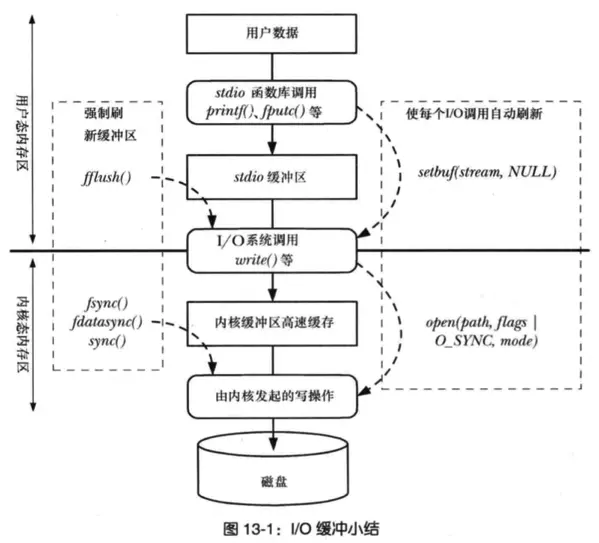

文件系统的缓存称为page cache，直接IO操作如read和write函数，绕过内核的page cache直接写入磁盘，只有一个用户区的缓存，而调用fprint等函数，它会缓存在page cache中，等到合适的时机写入持久化设备：
* 用户调用函数sync
* 周期的写脏页线程写入磁盘
* 内存不足时换出脏页

零拷贝mmap就是使用了DMA技术，将磁盘数据拷贝到内核的page cache，然后再将这段内存共享到用户区，减少了内核缓存到用户缓存的一次拷贝

大文件的传输不应该使用 PageCache，因为可能由于 PageCache 被大文件占据，而导致「热点」小文件无法利用到 PageCache。
于是，在高并发的场景下，针对大文件的传输的方式，应该使用「异步 I/O + 直接 I/O」来替代零拷贝技术。
直接 I/O 应用场景常见的两种：
* 应用程序已经实现了磁盘数据的缓存，那么可以不需要 PageCache 再次缓存，减少额外的性能损耗。在 MySQL 数据库中，可以通过参数设置开启直接 I/O，默认是不开启；
* 传输大文件的时候，由于大文件难以命中 PageCache 缓存，而且会占满 PageCache 导致「热点」文件无法充分利用缓存，从而增大了性能开销，因此，这时应该使用直接 I/O。

另外，由于直接 I/O 绕过了 PageCache，就无法享受内核的这两点的优化：
* 内核的 I/O 调度算法会缓存尽可能多的 I/O 请求在 PageCache 中，最后「合并」成一个更大的 I/O 请求再发给磁盘，这样做是为了减少磁盘的寻址操作；
* 内核也会「预读」后续的 I/O 请求放在 PageCache 中，一样是为了减少对磁盘的操作；

关于进程和文件描述符，文件描述符是一个整数，在一个进程中有一个数组，该整数其实代表的是该数组的下标，数组内容是指向要操作的文件，对于用户是不可见的，在进程的task_struck里。然后每个文件都有一个 inode，Socket 文件的 inode 指向了内核中的 Socket 结构，在这个结构体里有两个队列，分别是发送队列和接收队列，这个两个队列里面保存的是一个个 struct sk_buff，用链表的组织形式串起来。

# CPU及缓存
由于多级缓存是属于每个CPU的，多CPU情况下会出现缓存一致性问题，即写回内存时会出现不一致。因此需要写传播和事务串行化.

MESI协议：
* Modified，已修改
* Exclusive，独占
* Shared，共享
* Invalidated，已失效

「已修改」状态就是我们前面提到的脏标记，代表该 Cache Block 上的数据已经被更新过，但是还没有写到内存里。而「已失效」状态，表示的是这个 Cache Block 里的数据已经失效了，不可以读取该状态的数据。

「独占」和「共享」状态都代表 Cache Block 里的数据是干净的，也就是说，这个时候 Cache Block 里的数据和内存里面的数据是一致性的。

共享数据被修改以前，会通过总线告知其他缓存中的该数据标记为已失效。

## 伪共享
变量A，B同处于一个CPU cache line，但是两个CPU同时读取了该line，分别修改A和B，那么就会交替将对方标为已失效，使得发生交替的读写内存，重新进行。

一般 64 位 CPU 的 CPU Cache Line 的大小是 64 个字节，一个 long 类型的数据是 8 个字节，所以 CPU 一下会加载 8 个 long 类型的数据。通过声明热点数据对其，不在一个line中就可以了。

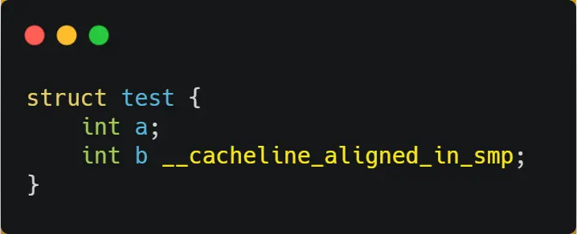

## CPU调度
对于普通任务来说，公平性最重要，在 Linux 里面，实现了一个基于 CFS 的调度算法，也就是完全公平调度（Completely Fair Scheduling）。

每个任务安排一个虚拟运行时间 vruntime，如果一个任务在运行，其运行的越久，该任务的 vruntime 自然就会越大，而没有被运行的任务，vruntime 是不会变化的。那么，在 CFS 算法调度的时候，会优先选择 vruntime 少的任务，以保证每个任务的公平性。

同时还有一个nice参数，来和vruntime相乘，作为优先级设置。

## 软中断
中断分为两段：硬中断和软中断。为了解决中断处理时间过长导致其他中断被忽略的情况，CPU在对于一个中断任务时先执行硬中断，只执行很少的内容，而后软中断，由内核触发中断，用来异步处理上半部未完成的工作。

网卡收到网络包后，通过 DMA 方式将接收到的数据写入内存，接着会通过硬件中断通知内核有新的数据到了，于是内核就会调用对应的中断处理程序来处理该事件，这个事件的处理也是会分成上半部和下半部。上部分要做的事情很少，会先禁止网卡中断，避免频繁硬中断，而降低内核的工作效率。接着，内核会触发一个软中断，把一些处理比较耗时且复杂的事情，交给「软中断处理程序」去做，也就是中断的下半部，其主要是需要从内存中找到网络数据，再按照网络协议栈，对网络数据进行逐层解析和处理，最后把数据送给应用程序。

## 二进制补码
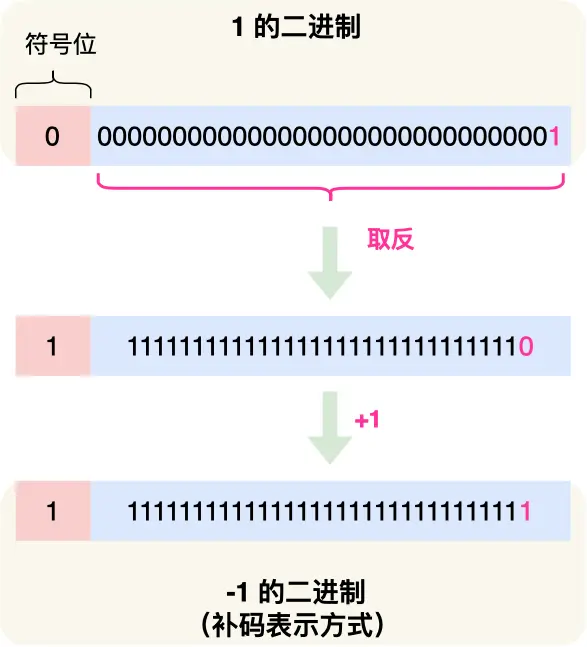

为了保证负数和正数同样使用加减法能够得到正确的结果。

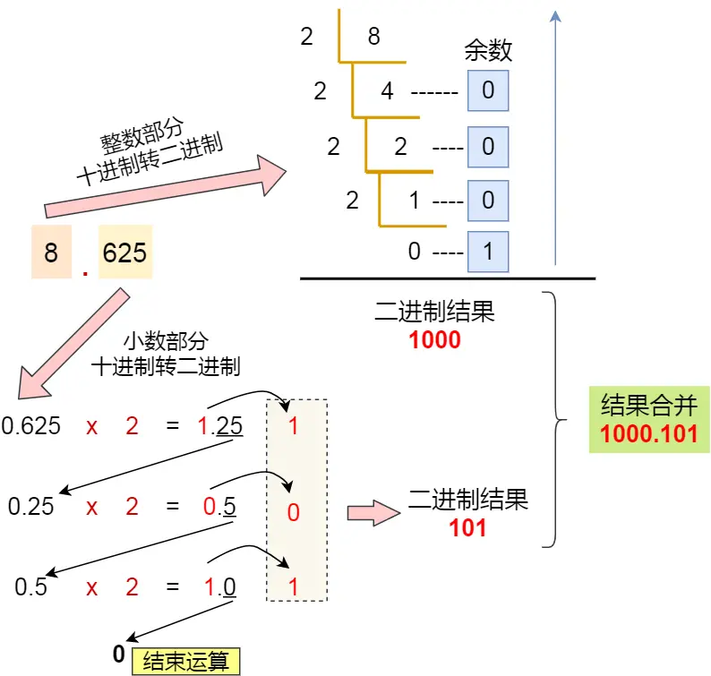

但是这种计算方法会导致0.1的表示为无穷长的二进制

浮点数计数方法：比如 1000.101 这个二进制数，可以表示成 1.000101 x 2^3
* 000101 称为尾数，即小数点后面的数字；
* 3 称为指数，指定了小数点在数据中的位置；

* 符号位：表示数字是正数还是负数，为 0 表示正数，为 1 表示负数；
* 指数位：指定了小数点在数据中的位置，指数可以是负数，也可以是正数，指数位的长度越长则数值的表达范围就越大；
* 尾数位：小数点右侧的数字，也就是小数部分，比如二进制 1.0011 x 2^(-2)，尾数部分就是 0011，而且尾数的长度决定了这个数的精度，因此如果要表示精度更高的小数，则就要提高尾数位的长度；

# 操作系统
Monolithic Kernel 的意思是宏内核，Linux 内核架构就是宏内核，意味着 Linux 的内核是一个完整的可执行程序，且拥有最高的权限。

宏内核的特征是系统内核的所有模块，比如进程调度、内存管理、文件系统、设备驱动等，都运行在内核态。

与宏内核相反的是微内核，微内核架构的内核只保留最基本的能力，比如进程调度、虚拟机内存、中断等，把一些应用放到了用户空间，比如驱动程序、文件系统等。这样服务与服务之间是隔离的，单个服务出现故障或者完全攻击，也不会导致整个操作系统挂掉，提高了操作系统的稳定性和可靠性。

但微内核由于一些驱动程序需要频繁调用底层能力的，于是驱动和硬件设备交互就需要频繁切换到内核态，这样会带来性能损耗。

# 内存
## 内存分页分段
内存会通过虚拟内存映射到物理内存。

分段式存储：

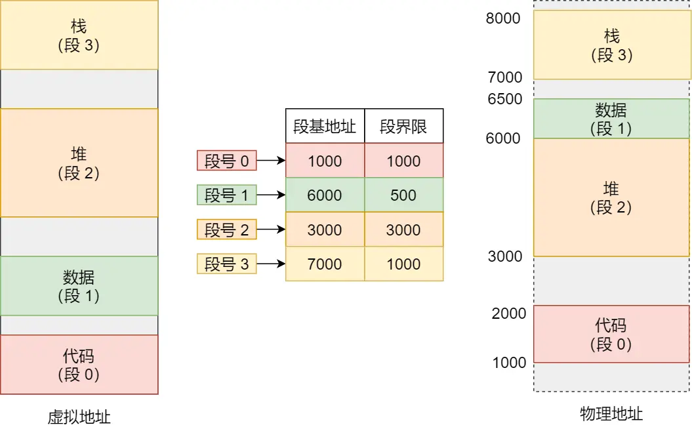

* 第一个就是内存碎片的问题。
* 第二个就是内存交换的效率低的问题。（通过换出到swap来整理内存）

优点：没有内部空隙。

分页可以解决这个问题。但是分页又会带来另一个问题，就是页不能太大，那么每个进程都有一个虚拟内存到物理内存的映射表，表单很大，维护麻烦。解决方案：多级页表

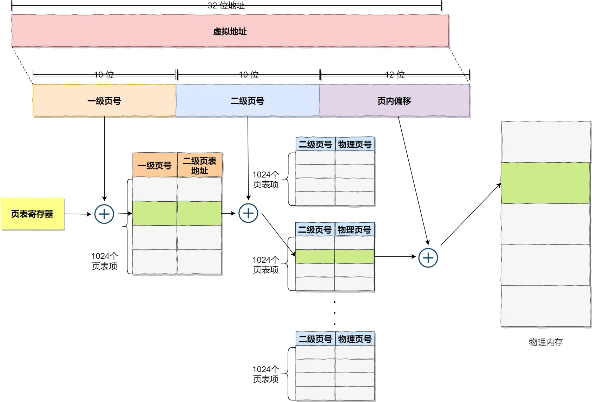

你可能会问，分了二级表，映射 4GB 地址空间就需要 4KB（一级页表）+ 4MB（二级页表）的内存，这样占用空间不是更大了吗？

如果使用了二级分页，一级页表就可以覆盖整个 4GB 虚拟地址空间，但如果某个一级页表的页表项没有被用到，也就不需要创建这个页表项对应的二级页表了，即可以在需要时才创建二级页表。（进程通常不会用完所有的内存）

段页式：

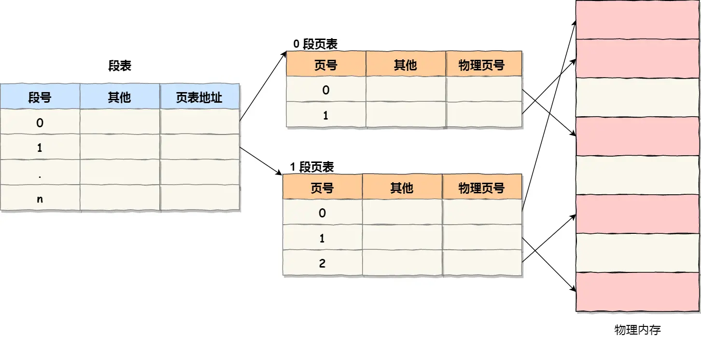

这个可以在虚拟内存分区中再看（关于内存的用户区和内核区以及分段方法）

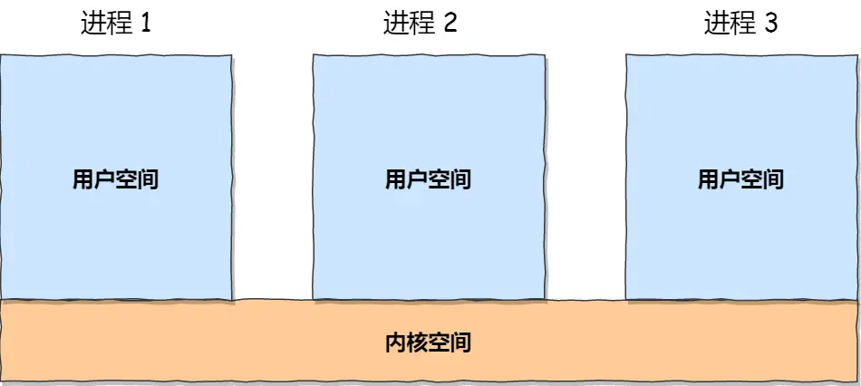

虽然每个进程都各自有独立的虚拟内存，但是每个虚拟内存中的内核地址，其实关联的都是相同的物理内存。这样，进程切换到内核态后，就可以很方便地访问内核空间内存。

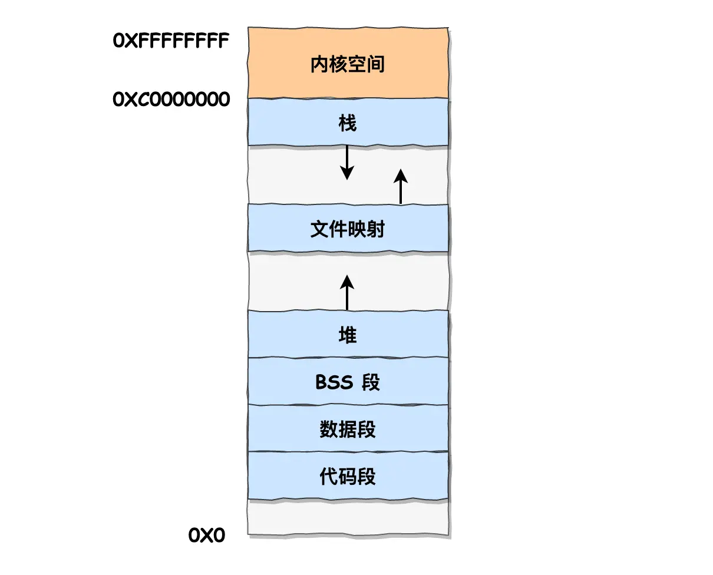

## malloc
malloc() 源码里默认定义了一个阈值：

* 如果用户分配的内存小于 128 KB，则通过 brk() 申请内存；
* 如果用户分配的内存大于 128 KB，则通过 mmap() 申请内存；

申请内存的操作应该避免频繁的系统调用，如果都用 mmap 来分配内存，等于每次都要执行系统调用。
另外，因为 mmap 分配的内存每次释放的时候，都会归还给操作系统，于是每次 mmap 分配的虚拟地址都是缺页状态的，然后在第一次访问该虚拟地址的时候，就会触发缺页中断。
也就是说，频繁通过 mmap 分配的内存话，不仅每次都会发生运行态的切换，还会发生缺页中断（在第一次访问虚拟地址后），这样会导致 CPU 消耗较大。

为了改进这两个问题，malloc 通过 brk() 系统调用在堆空间申请内存的时候，由于堆空间是连续的，所以直接预分配更大的内存来作为内存池，当内存释放的时候，就缓存在内存池中。
等下次在申请内存的时候，就直接从内存池取出对应的内存块就行了，而且可能这个内存块的虚拟地址与物理地址的映射关系还存在，这样不仅减少了系统调用的次数，也减少了缺页中断的次数，这将大大降低 CPU 的消耗。

但是只用brk会导致存在很多内存间隙

## 内存回收
* 文件页（File-backed Page）：内核缓存的磁盘数据（Buffer）和内核缓存的文件数据（Cache）都叫作文件页。大部分文件页，都可以直接释放内存，以后有需要时，再从磁盘重新读取就可以了。而那些被应用程序修改过，并且暂时还没写入磁盘的数据（也就是脏页），就得先写入磁盘，然后才能进行内存释放。所以，回收干净页的方式是直接释放内存，回收脏页的方式是先写回磁盘后再释放内存。
* 匿名页（Anonymous Page）：这部分内存没有实际载体，不像文件缓存有硬盘文件这样一个载体，比如堆、栈数据等。这部分内存很可能还要再次被访问，所以不能直接释放内存，它们回收的方式是通过 Linux 的 Swap 机制，Swap 会把不常访问的内存先写到磁盘中，然后释放这些内存，给其他更需要的进程使用。再次访问这些内存时，重新从磁盘读入内存就可以了。

如果没有空闲的物理内存，那么内核就会开始进行回收内存的工作，回收的方式主要是两种：直接内存回收和后台内存回收。

* 后台内存回收（kswapd）：在物理内存紧张的时候，会唤醒 kswapd 内核线程来回收内存，这个回收内存的过程异步的，不会阻塞进程的执行。
* 直接内存回收（direct reclaim）：如果后台异步回收跟不上进程内存申请的速度，就会开始直接回收，这个回收内存的过程是同步的，会阻塞进程的执行。
* 如果直接内存回收后，空闲的物理内存仍然无法满足此次物理内存的申请，那么内核就会放最后的大招了 ——触发 OOM （Out of Memory）机制。

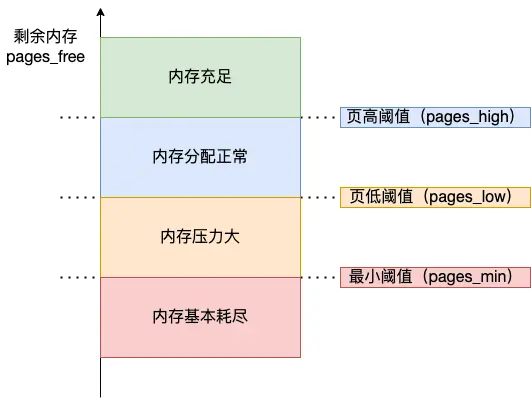

橙色启动后台回收，红色启动直接回收。

通过配置进程的OOM校准值来防止重要进程被kill

虚拟内存允许分配比实际内存更大的内存，因为进程申请内存是申请虚拟内存，只要不读写这个虚拟内存，操作系统就不会分配物理内存，只是创建了内存一级页表，并不分配。同时如果开启了swap机制，4G内存可以申请到128T的内存大小（64位系统）

## 预读失效和缓存污染
### 预读失效
LRU最近使用链表：

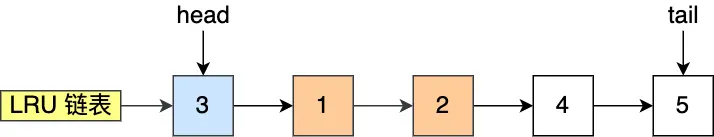

操作系统出于空间局部性原理（靠近当前被访问数据的数据，在未来很大概率会被访问到），应用程序只想读取磁盘上文件 A 的 offset 为 0-3KB 范围内的数据，这恰好可以在一个 page 中装下。预读会选择将磁盘块 offset [4KB,8KB)、[8KB,12KB) 以及 [12KB,16KB) 都加载到内存，于是额外在内存中申请了 3 个 page。预读机制带来的好处就是减少了 磁盘 I/O 次数，提高系统磁盘 I/O 吞吐量。

如果这些被提前加载进来的页，并没有被访问，相当于这个预读工作是白做了，这个就是预读失效。如果使用传统的 LRU 算法，就会把「预读页」放到 LRU 链表头部，而当内存空间不够的时候，还需要把末尾的页淘汰掉。如果这些「预读页」如果一直不会被访问到，就会出现一个很奇怪的问题，不会被访问的预读页却占用了 LRU 链表前排的位置，而末尾淘汰的页，可能是热点数据，这样就大大降低了缓存命中率 。

linux解决方法：

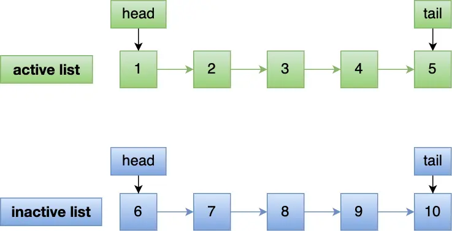

预读页就只需要加入到 inactive list 区域的头部，当页被真正访问的时候，才将页插入 active list 的头部。如果预读的页一直没有被访问，就会从 inactive list 移除，这样就不会影响 active list 中的热点数据。

linux解决方法：

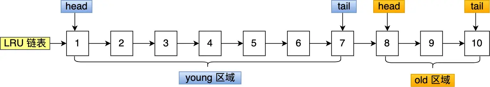

划分这两个区域后，预读的页就只需要加入到 old 区域的头部，当页被真正访问的时候，才将页插入 young 区域的头部。如果预读的页一直没有被访问，就会从 old 区域移除，这样就不会影响 young 区域中的热点数据。

### 缓存污染
但是如果还是使用「只要数据被访问一次，就将数据加入到活跃 LRU 链表头部（或者 young 区域）」这种方式的话，那么还存在缓存污染的问题。

当我们在批量读取数据的时候，由于数据被访问了一次，这些大量数据都会被加入到「活跃 LRU 链表」里，然后之前缓存在活跃 LRU 链表（或者 young 区域）里的热点数据全部都被淘汰了，如果这些大量的数据在很长一段时间都不会被访问的话，那么整个活跃 LRU 链表（或者 young 区域）就被污染了。

正式因为门槛太低，才导致在发生缓存污染的时候，很容就将原本在活跃 LRU 链表里的热点数据淘汰了。所以，只要我们提高进入到活跃 LRU 链表（或者 young 区域）的门槛，就能有效地保证活跃 LRU 链表（或者 young 区域）里的热点数据不会被轻易替换掉。第二次访问才放入。

## 内存划分
32位系统：

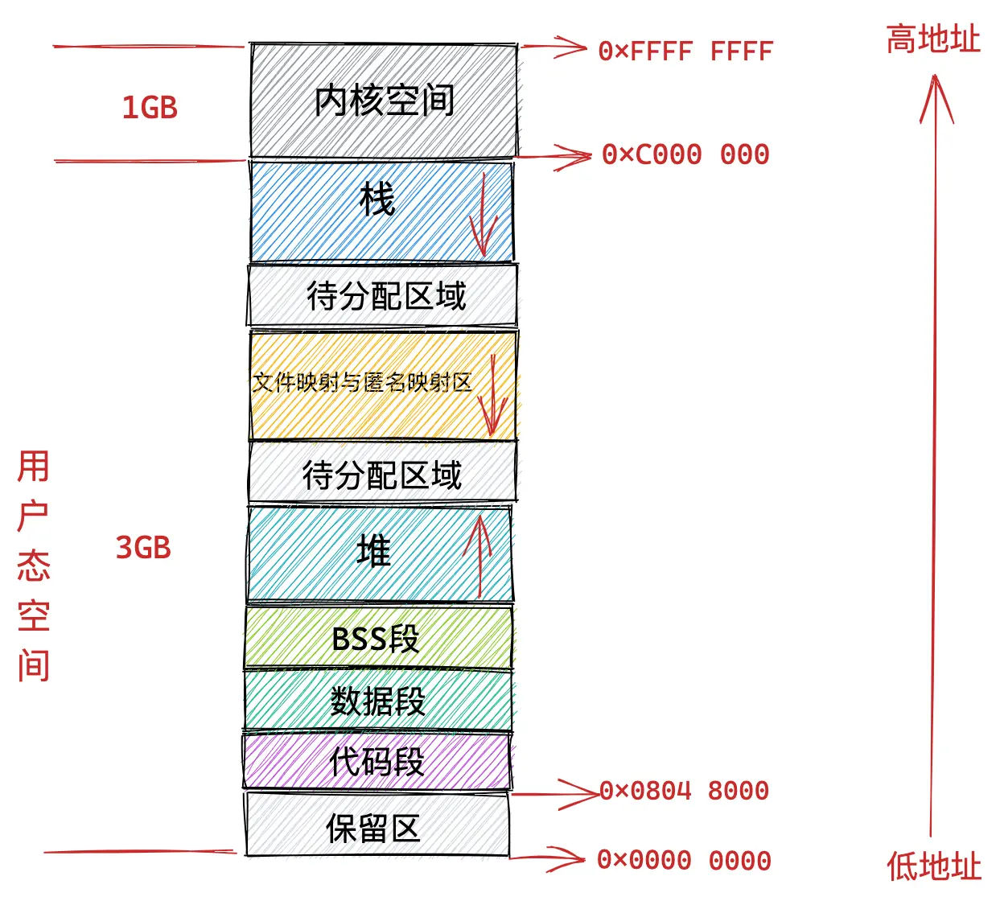

代码段在内存中被映射为只读。它是由编译器在编译链接时自动计算的。通常是用来存放程序执行的指令。代码段输入静态内存分配。

数据段通常用来存放程序中已初始化的（非 0）全局变量和静态局部变量。数据段的起始位置由链接定位文件确认，大小在编译链接时自动分配。数据段属于静态内存分配

bss 是英文 Block by Symbol 的简称。通常用来存放程序中未初始化和初始化为0的全局变量的一块内存区域，在程序载入时由内核清零。数据段属于静态内存分配

64位：（有内存空洞）

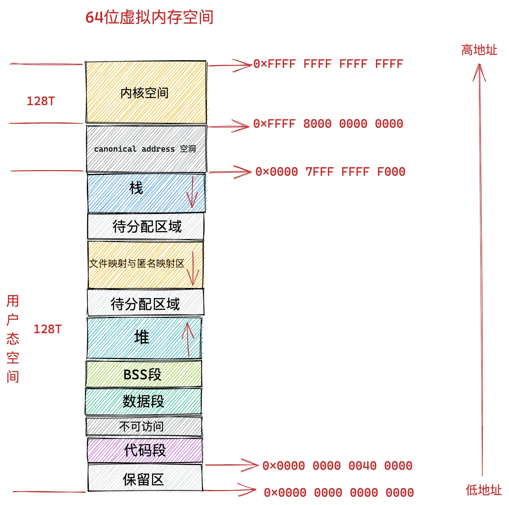

进程的PCB通过指针区分虚拟内存块

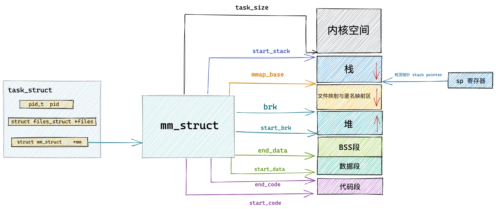

内核态：

要记得内核态虚拟内存空间的前 896M 区域是直接映射到物理内存中的前 896M 区域中的，直接映射区中的映射关系是一比一映射。映射关系是固定的不会改变。

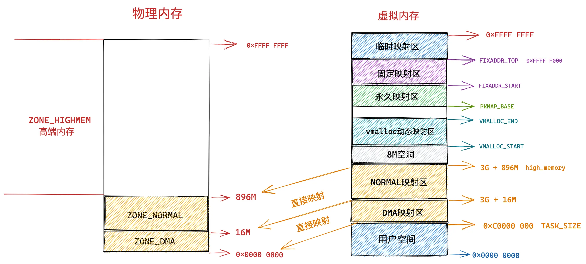

## 物理内存
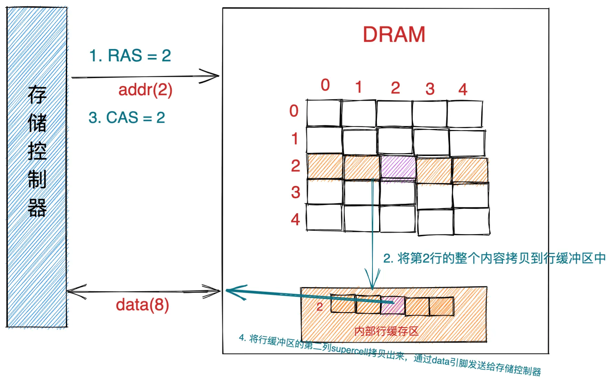

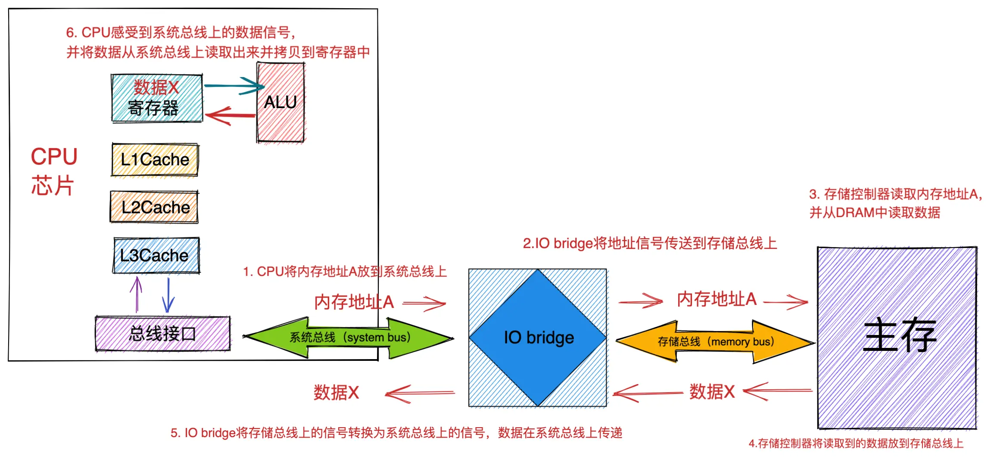

# 进程
## 基础
### 进程
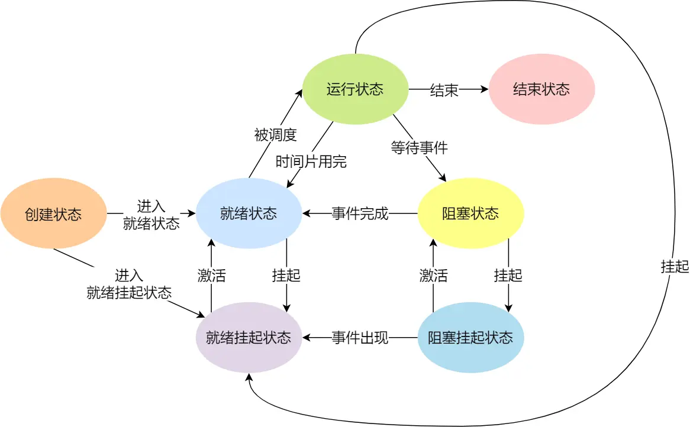

挂起即为被内存swap到磁盘的，是内存不足或空闲时出现。

**各个进程之间是共享 CPU 资源的，在不同的时候进程之间需要切换，让不同的进程可以在 CPU 执行，那么这个一个进程切换到另一个进程运行，称为进程的上下文切换。**

CPU 寄存器和程序计数（在高速缓存内）是 CPU 在运行任何任务前，所必须依赖的环境，这些环境就叫做 CPU 上下文。上面说到所谓的「任务」，主要包含进程、线程和中断。所以，可以根据任务的不同，把 CPU 上下文切换分成：进程上下文切换、线程上下文切换和中断上下文切换。

### 线程
同一个进程内多个线程之间可以共享代码段、数据段、打开的文件等资源，但每个线程各自都有一套独立的寄存器和栈，这样可以确保线程的控制流是相对独立的。

线程与进程的比较如下：

* 进程是资源（包括内存、打开的文件等）分配的单位，线程是 CPU 调度的单位；
* 进程拥有一个完整的资源平台，而线程只独享必不可少的资源，如寄存器和栈；
* 线程同样具有就绪、阻塞、执行三种基本状态，同样具有状态之间的转换关系；
* 线程能减少并发执行的时间和空间开销；

对于，线程相比进程能减少开销，体现在：

* 线程的创建时间比进程快，因为进程在创建的过程中，还需要资源管理信息，比如内存管理信息、文件管理信息，而线程在创建的过程中，不会涉及这些资源管理信息，而是共享它们；
* 线程的终止时间比进程快，因为线程释放的资源相比进程少很多；
* 同一个进程内的线程切换比进程切换快，因为线程具有相同的地址空间（虚拟内存共享），这意味着同一个进程的线程都具有同一个页表，那么在切换的时候不需要切换页表。而对于进程之间的切换，切换的时候要把页表给切换掉，而页表的切换过程开销是比较大的；
* 由于同一进程的各线程间共享内存和文件资源，那么在线程之间数据传递的时候，就不需要经过内核了，这就使得线程之间的数据交互效率更高了；

所以，不管是时间效率，还是空间效率线程比进程都要高。

### 内核调度方式
用户线程的整个线程管理和调度，操作系统是不直接参与的，而是由用户级线程库函数来完成线程的管理，包括线程的创建、终止、同步和调度等。

用户级线程的模型，也就类似多对一的关系，即多个用户线程对应同一个内核线程

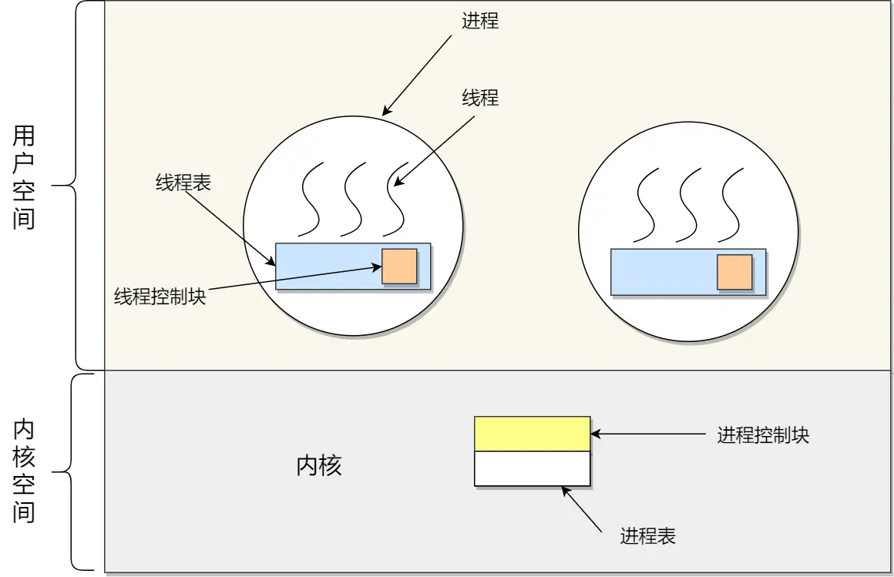

用户线程的优点：

* 每个进程都需要有它私有的线程控制块（TCB）列表，用来跟踪记录它各个线程状态信息（PC、栈指针、寄存器），TCB 由用户级线程库函数来维护，可用于不支持线程技术的操作系统；
* 用户线程的切换也是由线程库函数来完成的，无需用户态与内核态的切换，所以速度特别快；

用户线程的缺点：

* 由于操作系统不参与线程的调度，如果一个线程发起了系统调用而阻塞，那进程所包含的用户线程都不能执行了。
* 当一个线程开始运行后，除非它主动地交出 CPU 的使用权，否则它所在的进程当中的其他线程无法运行，因为用户态的线程没法打断当前运行中的线程，它没有这个特权，只有操作系统才有，但是用户线程不是由操作系统管理的。
* 由于时间片分配给进程，故与其他进程比，在多线程执行时，每个线程得到的时间片较少，执行会比较慢；

内核线程：一对一的关系，由内核直接运行每个线程

内核线程的优点：

* 在一个进程当中，如果某个内核线程发起系统调用而被阻塞，并不会影响其他内核线程的运行；
* 分配给线程，多线程的进程获得更多的 CPU 运行时间；

内核线程的缺点：

* 在支持内核线程的操作系统中，由内核来维护进程和线程的上下文信息，如 PCB 和 TCB；
* 线程的创建、终止和切换都是通过系统调用的方式来进行，因此对于系统来说，系统开销比较大；

**轻量级进程（Light-weight process，LWP）是内核支持的用户线程，一个进程可有一个或多个 LWP，每个 LWP 是跟内核线程一对一映射的，也就是 LWP 都是由一个内核线程支持，而且 LWP 是由内核管理并像普通进程一样被调度。**

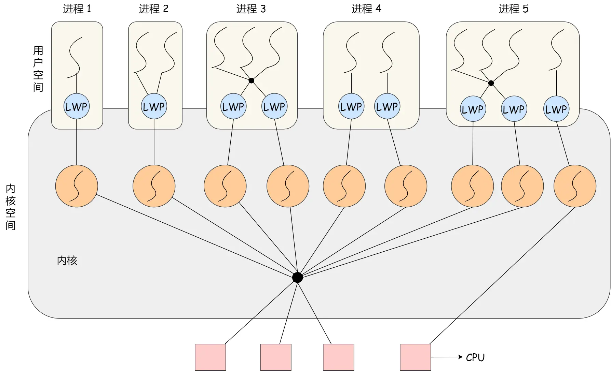

## 调度算法
### 先来先服务（First Come First Serve, FCFS）算法
