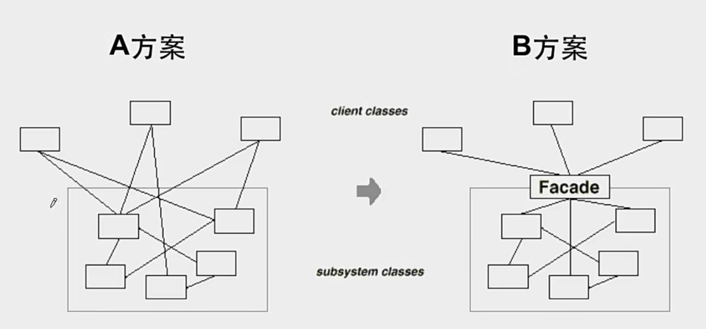
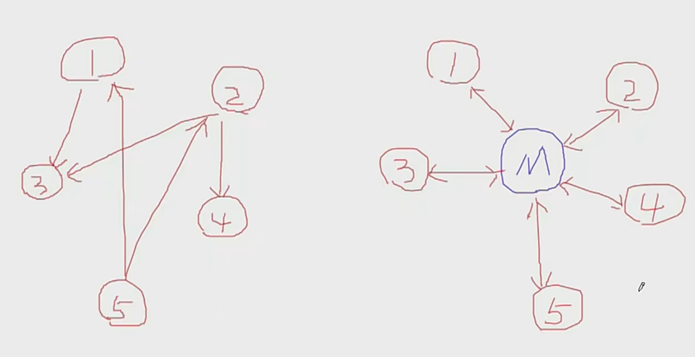

# c++设计模式
软件设计的目标最重要的事情就是：**复用**，当新的需求到来时，不是满工程的到处改东西，最希望就是放入就能用。

面向对象设计原则：
SOLID原则
* S，单一职责原则，一个类只做一件事
* O，开放封闭原则，对扩展开放，对修改封闭
* L，里氏替换原则，子类可以使用父类方法
* I，接口隔离原则，接口要小
* D，依赖倒置原则，高层依赖抽象，不要依赖底层模块具体实现具体实现
* 迪米特法则，只和朋友交流


一个面向对象的程序必定有稳定的部分和变化的部分


下图中的流程由lib中写好，这是稳定的部分，但是它同时留下了2，4作为虚函数，这是变化的部分，在看一个程序的时候要养成这样的思路，在变化的部分合理运用设计模式。不能全设计不稳定和全稳定。上面这张图就是模板模式，即虚函数加继承。

## 策略模式
如果代码中想要写if else时，策略模式是个好选择。策略模式通过继承父类，利用成员函数多态，当调用时通过子类定义的多态实现选择不同模式。为社么会这么考虑呢？因为当需求不断改变时，你需要不停的改变这个if else的程序，而使用多态时只需要添加子类。
```c++
//传统方法
enum TaxBase {
	CN_Tax,
	US_Tax,
	DE_Tax,
	FR_Tax       //更改
};

class SalesOrder{
    TaxBase tax;
public:
    double CalculateTax(){
        //...
        
        if (tax == CN_Tax){
            //CN***********
        }
        else if (tax == US_Tax){
            //US***********
        }
        else if (tax == DE_Tax){
            //DE***********
        }
		else if (tax == FR_Tax){  //更改
			//...
		}

        //....
     }
    
};
```


```c++
//策略模式
class TaxStrategy{
public:
    virtual double Calculate(const Context& context)=0;
    virtual ~TaxStrategy(){}
};


class CNTax : public TaxStrategy{
public:
    virtual double Calculate(const Context& context){
        //***********
    }
};

class USTax : public TaxStrategy{
public:
    virtual double Calculate(const Context& context){
        //***********
    }
};

class DETax : public TaxStrategy{
public:
    virtual double Calculate(const Context& context){
        //***********
    }
};


//扩展
//*********************************
class FRTax : public TaxStrategy{
public:
	virtual double Calculate(const Context& context){
		//.........
	}
};


class SalesOrder{
private:
    TaxStrategy* strategy;

public:
    SalesOrder(StrategyFactory* strategyFactory){
        this->strategy = strategyFactory->NewStrategy();
    }
    ~SalesOrder(){
        delete this->strategy;
    }

    public double CalculateTax(){
        //...
        Context context();
        
        double val = 
            strategy->Calculate(context); //多态调用
        //...
    }
    
};

//usage
int main(){
    FRTax fr = new FRTax();  //创建工厂
    SalesOrder* sale = new SalesOrder(fr);  //传入工厂，相当于运行时选择策略
    double res = sale->Calculate();  //执行计算
    //...
}
```

## 观察者模式
在类中委托一个虚类。样例为：当前有个文件分割器，可以分割大文件为一个个小文件，现在我忽然想加入一个进度条功能，但是进度条可能是条形的，也可以是圆形的，还可能多个进度条同时出现。文件分割器类为观察者，进度条类为目标对象，当进度条变化时，希望文件分割器不受到影响。（委托其的类不受到影响）
```c++
//传统做法
class FileSplitter
{
	string m_filePath;
	int m_fileNumber;
	ProgressBar* m_progressBar;

  FileSplitter(const string& filePath, int number, ProgressBar* progressBar) : m_filePath(filePath)...
  ..

  void split() {..}
}

//使用时
FileSplitter splitter(filePath, number, progressBar);
splitter.split();
```
传统做法弊端在于，引入的进度条是具体的一个对象，不灵活。
```c++
//创建一个进度条虚类
class IProgress{
public:
	virtual void DoProgress(float value)=0;
	virtual ~IProgress(){}
};

//观察者设计模式
class FileSplitter
{
	string m_filePath;
	int m_fileNumber;
	List<IProgress*>  m_iprogressList;  //委托的是一个纯虚类IProgress，list是为了可以同时多个进度条

public:
	FileSplitter(const string& filePath, int fileNumber) :
	  m_filePath(filePath), 
		m_fileNumber(fileNumber){}  //构造时先指定两个

  void split() {
    ...
    onProgress(num)  //将进度值赋予m_iprogressList里的对象
  }

  void onProgress(int num) {..}

  void addIProgress(IProgress* iprogress){  //提供操作的方法
    m_iprogressList.push_back(iprogress);
  }  
}

//使用时
//创建一个具体进度条类
class ConsoleNotifier : public IProgress {    //继承复写进度条虚类
public:
	virtual void DoProgress(float value){
		cout << ".";
	}
};

ConsoleNotifier cn;     //创建进度条子类对象，有具体的进度条样式
FileSplitter splitter(filePath, number);
splitter.addIProgress(&cn);   //加进度条到观察者类中
splitter.split();     //执行
```


## 装饰模式
将继承实现功能扩展，变成通过组合对象实现功能扩展。使用时机就是功能扩展时，在扩展的类上首先考虑的是组合，而不是直接继承上一层的父类。
```c++
//通过继承实现功能扩展
//业务操作
class Stream{    //基类，对什么流的操作都有读，选，写三个基本操作
public：
    virtual char Read(int number)=0;
    virtual void Seek(int position)=0;
    virtual void Write(char data)=0;
    
    virtual ~Stream(){}
};

//主体类
class FileStream: public Stream{    //文件流的操作，这些只是复写基类中的功能，还没有附加功能
public:
    virtual char Read(int number){
        //读文件流
    }
    virtual void Seek(int position){
        //定位文件流
    }
    virtual void Write(char data){
        //写文件流
    }

};

class NetworkStream :public Stream{    //网络流的操作
public:
    virtual char Read(int number){
        //读网络流
    }
    virtual void Seek(int position){
        //定位网络流
    }
    virtual void Write(char data){
        //写网络流
    }
    
};
//##################################
//扩展操作，多出加密的功能，则分别为文件流和网络流都加上这操作，分别继承文件流和网络流
class CryptoFileStream :public FileStream{
public:
    virtual char Read(int number){
       
        //额外的加密操作...
        FileStream::Read(number);//读文件流
        
    }
    virtual void Seek(int position){
        //额外的加密操作...
        FileStream::Seek(position);//定位文件流
        //额外的加密操作...
    }
    virtual void Write(byte data){
        //额外的加密操作...
        FileStream::Write(data);//写文件流
        //额外的加密操作...
    }
};

class CryptoNetworkStream : :public NetworkStream{
public:
    virtual char Read(int number){
        
        //额外的加密操作...
        NetworkStream::Read(number);//读网络流
    }
    virtual void Seek(int position){
        //额外的加密操作...
        NetworkStream::Seek(position);//定位网络流
        //额外的加密操作...
    }
    virtual void Write(byte data){
        //额外的加密操作...
        NetworkStream::Write(data);//写网络流
        //额外的加密操作...
    }
};
```

其关键部分在于，直接继承基类，传入为基类的子类，多态，就不用为了一个子类添加功能而再单独继承一个基类的子类来实现功能扩展。

```c++
//前面不变，也是有基类，以及基类引申出来的文件流和网络流
//扩展操作
class CryptoStream: public Stream {
    
    Stream* stream;     //直接继承基类，再在类里面定义基类对象以便于传入文件流和网络流的多态对象

public:
    CryptoStream(Stream* stm):stream(stm){   //在这里传入基类的子类对象
    
    }
    
    
    virtual char Read(int number){  //注意此时要重新复写基类功能，并复用文件流内的read功能，以达到文件流和加密功能都有
       
        //额外的加密操作...
        stream->Read(number);//读文件流  
    }
    virtual void Seek(int position){
        //额外的加密操作...
        stream::Seek(position);//定位文件流
        //额外的加密操作...
    }
    virtual void Write(byte data){
        //额外的加密操作...
        stream::Write(data);//写文件流
        //额外的加密操作...
    }
};

//使用时
//运行时装配
FileStream* s1=new FileStream();
CryptoStream* s2=new CryptoStream(s1);
```

## 桥模式
与装饰模式相似，但是也有所不同，中心思想是通过对象组合。装饰模式是在原有的类上添加功能，桥模式是对基类里的虚成员功能进行不同组合的复写。
```c++
//一般实现：继承
class Messager{
public:
    virtual void Login(string username, string password)=0;
    virtual void SendMessage(string message)=0;
    virtual void SendPicture(Image image)=0;

    virtual void PlaySound()=0;
    virtual void DrawShape()=0;
    virtual void WriteText()=0;
    virtual void Connect()=0;
    
    virtual ~Messager(){}
};

//平台实现，只复写了平台功能，分成不同的种类
class PCMessagerBase : public Messager{
public:
    
    virtual void PlaySound(){
        //**********
    }
    virtual void DrawShape(){
        //**********
    }
    virtual void WriteText(){
        //**********
    }
    virtual void Connect(){
        //**********
    }
};

class MobileMessagerBase : public Messager{
public:
    
    virtual void PlaySound(){
        //==========
    }
    virtual void DrawShape(){
        //==========
    }
    virtual void WriteText(){
        //==========
    }
    virtual void Connect(){
        //==========
    }
};


//业务抽象，复写了平台操作，分别继承不同的功能
class PCMessagerLite : public PCMessagerBase {
public:
    
    virtual void Login(string username, string password){
        
        PCMessagerBase::Connect();
        //........
    }
    virtual void SendMessage(string message){
        
        PCMessagerBase::WriteText();
        //........
    }
    virtual void SendPicture(Image image){
        
        PCMessagerBase::DrawShape();
        //........
    }
};

class MobileMessagerLite : public MobileMessagerBase {
public:
    
    virtual void Login(string username, string password){
        
        MobileMessagerBase::Connect();
        //........
    }
    virtual void SendMessage(string message){
        
        MobileMessagerBase::WriteText();
        //........
    }
    virtual void SendPicture(Image image){
        
        MobileMessagerBase::DrawShape();
        //........
    }
};
```

```c++
//请注意这里为什么要分开两部分Messager和MessagerImp，因为如果不分开，而如PCMessagerImp只复写了部分成员函数，那么是无法创建成对象的，因为有纯虚函数没有得到复写。但现在分开来，PCMessagerImp可以独立创建为对象，并传递给后面平台实现。
class Messager{
protected:
     MessagerImp* messagerImp;//...
public:
    virtual void Login(string username, string password)=0;
    virtual void SendMessage(string message)=0;
    virtual void SendPicture(Image image)=0;
    
    virtual ~Messager(){}
};

class MessagerImp{
public:
    virtual void PlaySound()=0;
    virtual void DrawShape()=0;
    virtual void WriteText()=0;
    virtual void Connect()=0;
    
    virtual MessagerImp(){}
};


//平台实现 n
class PCMessagerImp : public MessagerImp{
public:
    virtual void PlaySound(){
        //**********
    }
    virtual void DrawShape(){
        //**********
    }
    virtual void WriteText(){
        //**********
    }
    virtual void Connect(){
        //**********
    }
};

class MobileMessagerImp : public MessagerImp{
public:
    virtual void PlaySound(){
        //==========
    }
    virtual void DrawShape(){
        //==========
    }
    virtual void WriteText(){
        //==========
    }
    virtual void Connect(){
        //==========
    }
};


//业务抽象 m

//类的数目：1+n+m

class MessagerLite :public Messager {
public:
    virtual void Login(string username, string password){
        
        messagerImp->Connect();
        //........
    }
    virtual void SendMessage(string message){
        
        messagerImp->WriteText();
        //........
    }
    virtual void SendPicture(Image image){
        
        messagerImp->DrawShape();
        //........
    }
};

void Process(){
    //运行时装配
    MessagerImp* mImp=new PCMessagerImp();
    Messager *m =new Messager(mImp);
}
```


## 工厂模式
工厂方法、抽象工厂和原型模式。工厂方法解决问题为：我主函数mainform希望创建一个对象，使用了new XXX，如`ISplitter * splitter=new BinarySplitter();`，等式右边依然是一个具体的类名，现在希望创建的这个类是什么由外部决定而不是在mainform中定死了，因此采用工厂模式。
```c++
//延续之前的例子，一个分割大文件的类
//首先是两个基类

//分割器抽象类
class ISplitter{
public:
    virtual void split()=0;
    virtual ~ISplitter(){}
};

//工厂基类，工厂就是形象的类比，这个工厂的功能就是生产以ISplitter为基类的对象，它也是虚类，什么工厂就生产什么对象
class SplitterFactory{
public:
    virtual ISplitter* CreateSplitter()=0;
    virtual ~SplitterFactory(){}
};


//现在这里有创建一些具体的类和对应的工厂
//具体类
class BinarySplitter : public ISplitter{
    
};

class TxtSplitter: public ISplitter{
    
};

//具体工厂，什么工厂就生产什么对象
class BinarySplitterFactory: public SplitterFactory{
public:
    virtual ISplitter* CreateSplitter(){
        return new BinarySplitter();
    }
};

class TetSplitterFactory : public SplitterFactory{
public:
    virtual ISplitter* CreateSplitter(){
        return new TxtSplitter();
    }
}


//工厂模式的使用
class MainForm : public Form {
    SplitterFactory* factory;   //委托对象为工厂

public:
    MainForm(SplitterFactory* factory) : factory(factory) {}  //此处传入的对象可以是多态的，传入对象为工厂
    ISplitter* splitter = factory->CreateSplitter();   //在创建splitter时，就不必要在MainForm内指定具体的对象
    //换句话说，就是将等式的右边new的部分也变成一个多态

    splitter->split();
}；
```

上面的例子中，一个工厂中就只生产一种对象，但是如果有几个对象是有关联的，那么一个工厂可以一次性生产几个相关联的对象，可以说工厂方法就是抽象工厂的一个特例。

```c++
//数据库访问有关的基类
class IDBConnection{
    
};

class IDBCommand{
    
};

class IDataReader{
    
};

//工厂基类，同时生产几个相关联的基类
class IDBFactory{
public:
    virtual IDBConnection* CreateDBConnection()=0;
    virtual IDBCommand* CreateDBCommand()=0;
    virtual IDataReader* CreateDataReader()=0;
};


//支持SQL Server
class SqlConnection: public IDBConnection{
    
};
class SqlCommand: public IDBCommand{
    
};
class SqlDataReader: public IDataReader{
    
};

//工厂具体类，sql
class SqlDBFactory:public IDBFactory{
public:
    virtual IDBConnection* CreateDBConnection() {
      return new SqlConnection();
    }
    virtual IDBCommand* CreateDBCommand() {
      return new SqlCommand();
    }
    virtual IDataReader* CreateDataReader() {
      return new SqlDataReader();
    }
 
};

//支持Oracle
class OracleConnection: public IDBConnection{
    
};

class OracleCommand: public IDBCommand{
    
};

class OracleDataReader: public IDataReader{
    
};

//工厂具体类，Oracle
class OracleDBFactory:public IDBFactory{
public:
    virtual IDBConnection* CreateDBConnection() {
      return new OracleConnection();
    }
    virtual IDBCommand* CreateDBCommand() {
      return new OracleCommand();
    }
    virtual IDataReader* CreateDataReader() {
      return new OracleDataReader();
    }
 
};


//实现
class EmployeeDAO{
    IDBFactory* dbFactory;
    
public:
    vector<EmployeeDO> GetEmployees(){
        IDBConnection* connection =
            dbFactory->CreateDBConnection();   //创建第一个对象
        connection->ConnectionString("...");

        IDBCommand* command =
            dbFactory->CreateDBCommand();    //创建第二个对象，与第一个关联，第一个为sql第二个也是，而不是oracle
        command->CommandText("...");
        command->SetConnection(connection); //关联性

        IDBDataReader* reader = command->ExecuteReader(); //关联性
        while (reader->Read()){

        }

    }
};
```

原型模式即通过浅拷贝，将已有对象复制一个出来，通常用于对象创建new时比较复杂，但是已经有配置好的对象，则使用。
```c++
//抽象类
class ISplitter{
public:
    virtual void split()=0;
    virtual ISplitter* clone()=0; //通过克隆自己来创建对象，实际上也是把工厂搬到对象基类里来了，但该工厂是复制产生对象
    
    virtual ~ISplitter(){}

};

//具体类
class BinarySplitter : public ISplitter{
public:
    virtual void split() {}
    virtual ISplitter* clone(){
        return new BinarySplitter(*this);
    }
};

class TxtSplitter: public ISplitter{
public:
    virtual void split() {}
    virtual ISplitter* clone(){
        return new TxtSplitter(*this);
    }
};


//使用
class MainForm : public Form {
  ISplitter* prototype;  //委托对象为工厂

public:
  MainForm(ISplitter* prototype) {
    this->prototype = prototype;
  }

  ISplitter* splitter = prototype->clone();
  splitter->split();
}
```

## 构建器
当类比较复杂时，分离对象中变化较多的部分和变化较少的部分。现在考虑建造一个房子的类。这节与桥模式十分相近，都是把**变化的功能**当作一个类单独用于多态继承。但不同在于桥模式注重点在创建一个类时，打包进去不同的具体细节。而构建器重点在于构建器类是个相对稳定的类，而后将构建好的house返回传递给House类。
```c++
class House{
public:
  void Init(){
    
        pHouseBuilder->BuildPart1();
        
        for (int i = 0; i < 4; i++){
            pHouseBuilder->BuildPart2();
        }
        
        bool flag=pHouseBuilder->BuildPart3();
        
        if(flag){
            pHouseBuilder->BuildPart4();
        }
        
        pHouseBuilder->BuildPart5();
  }

private:
  virtual void BuildPart1()=0;  //变化部分，到未来重写子类要继承整个House来写变化内容，是缺点
  virtual void BuildPart2()=0;
  virtual void BuildPart3()=0;
  virtual void BuildPart4()=0;
  virtual void BuildPart5()=0;
}
```

下面的代码主要关注点为：创建了HouseBuilder对象方便动态的改变。HouseDirector是静态的流程，其中中使用HouseBuilder指针。
```c++
class House{
    //具有很多复杂的房子属性
};

//建造具体步骤的基类
class HouseBuilder {
public:
    House* GetResult(){
        return pHouse;
    }
    virtual ~HouseBuilder(){}
protected:
    
    House* pHouse;
	  virtual void BuildPart1()=0;
    virtual void BuildPart2()=0;
    virtual void BuildPart3()=0;
    virtual void BuildPart4()=0;
    virtual void BuildPart5()=0;
	
};

//具体房子
class StoneHouse: public House{
    
};

//具体步骤内容
class StoneHouseBuilder: public HouseBuilder{
protected:
    
    virtual void BuildPart1(){
        //pHouse->Part1 = ...;
    }
    virtual void BuildPart2(){
        
    }
    virtual void BuildPart3(){
        
    }
    virtual void BuildPart4(){
        
    }
    virtual void BuildPart5(){
        
    }
    
};

//固定的构建方法，对于不同的房子有相同的建造步骤
class HouseDirector{
public:
    HouseBuilder* pHouseBuilder;
    
    HouseDirector(HouseBuilder* pHouseBuilder){
        this->pHouseBuilder=pHouseBuilder;
    }
    
    House* Construct(){
        
        pHouseBuilder->BuildPart1();
        
        for (int i = 0; i < 4; i++){
            pHouseBuilder->BuildPart2();
        }
        
        bool flag=pHouseBuilder->BuildPart3();
        
        if(flag){
            pHouseBuilder->BuildPart4();
        }
        
        pHouseBuilder->BuildPart5();
        
        return pHouseBuilder->GetResult();
    }
};


//使用方法
//House* stoneHouse = new StoneHouse();
HouseBuilder* stoneHouseBulider = new StoneHouseBuilder();   //创建石头房子建造方法
HouseDirector* houseDirector = HouseDirector(stoneHouseBulider); 
House* stoneHonuse = houseDirector->Construct();  //认真思考该房子对象是怎么返回的
```

## 单件模式
创建一个对象，其实例在整个程序中只允许有一个实例。实现起来比较简单，就是将构造函数放在private中。由于在多线程中调用会有一些问题，因此讨论了其设计方法的具体细节。
```c++
class Singleton{
private:
    Singleton();
    Singleton(const Singleton& other);   //拷贝构造是用于重新创建对象
public:
    static Singleton* getInstance();  //外部创建和访问都通过这个函数
    static Singleton* m_instance;  //注意哦，使用static，在全局区，只有一个
};

Singleton* Singleton::m_instance=nullptr;

//线程非安全版本
Singleton* Singleton::getInstance() {
    if (m_instance == nullptr) {     //但在多线程会导致多个线程进入该函数，创建了多个对象
        m_instance = new Singleton();
    }
    return m_instance;
}


//线程安全版本，但锁的代价过高
Singleton* Singleton::getInstance() {
    Lock lock;        //不管三七二十一直接加锁，但是在高并发场景每个用户想要读取时都得等其他用户先读完判断是不是唯一一个对象，代价大
    if (m_instance == nullptr) {
        m_instance = new Singleton();
    }
    return m_instance;
}


//双检查锁，但由于内存读写reorder不安全
Singleton* Singleton::getInstance() {
    
    if(m_instance==nullptr){    //这样读取的就可以不被阻塞
        Lock lock;
        if (m_instance == nullptr) {   //防止同时两个进入
            m_instance = new Singleton();   //但由于cpu内部会打乱分配指针地址的顺序时机，下面return可能会被别的线程抢先返回尚未创建对象完成的地址。
        }
    }
    return m_instance;   
}


//C++ 11版本之后的跨平台实现 (volatile)
std::atomic<Singleton*> Singleton::m_instance;
std::mutex Singleton::m_mutex;

Singleton* Singleton::getInstance() {
    Singleton* tmp = m_instance.load(std::memory_order_relaxed);
    std::atomic_thread_fence(std::memory_order_acquire);//获取内存fence
    if (tmp == nullptr) {
        std::lock_guard<std::mutex> lock(m_mutex);
        tmp = m_instance.load(std::memory_order_relaxed);
        if (tmp == nullptr) {
            tmp = new Singleton;
            std::atomic_thread_fence(std::memory_order_release);//释放内存fence
            m_instance.store(tmp, std::memory_order_relaxed);
        }
    }
    return tmp;
}
```


## 享元模式
应对小对象常使用的情况，就比如int，double，string，通常本不考虑使用对象模式来占用内存空间，但万一有呢？
```c++
class Font {
private:

    //unique object key
    string key;
    
    //object state
    //....
    
public:
    Font(const string& key){
        //...
    }
};
ß

class FontFactory{
private:
    map<string,Font* > fontPool;
    
public:
    Font* GetFont(const string& key){

        map<string,Font*>::iterator item=fontPool.find(key);
        
        if(item!=footPool.end()){
            return fontPool[key];
        }
        else{
            Font* font = new Font(key);
            fontPool[key]= font;
            return font;
        }

    }
    
    void clear(){
        //...
    }
};
```

## 面门模式
对接口之间加入中间层，将系统层间解耦合。应对内部不断变化，但对于外部没有影响。



下面几种方法都是这种思想。

## 代理模式
看起来像是在直接透明的调用一个类的方法，实际上是有一个中间层，这个层做了很多处理，可能是安全的，可能是适配的。打个比方，迭代器可以看起来像一个指针来用。（智能指针）


## 适配器
新类为老类提供了新的接口。举例：
```c++
class queue{
  deque que;
  referenceType push(const valueType& __x){
    que.push_back(__x);
  }
};

//此时新的使用方法为
queue.push(..);
```

## 中介者


当多个对象互相关联时，耦合方式可能非常复杂，那么使用中介者来管理和隔离，希望访问其他类通过中介者来实现。


## 状态模式
和策略模式非常相似，都是应对if else，而且使用的是状态这样一个概念。
```c++
enum NetworkState
{
    Network_Open,
    Network_Close,
    Network_Connect,
};

class NetworkProcessor{
    
    NetworkState state;

public:
    void Operation1(){
        if (state == Network_Open){
            //**********
            state = Network_Close;
        }
        else if (state == Network_Close){
            //..........
            state = Network_Connect;
        }
        else if (state == Network_Connect){
            //$$$$$$$$$$
            state = Network_Open;
        }
    }

    public void Operation2(){

        if (state == Network_Open){
            //**********
            state = Network_Connect;
        }
        else if (state == Network_Close){
            //.....
            state = Network_Open;
        }
        else if (state == Network_Connect){
            //$$$$$$$$$$
            state = Network_Close;
        }
    }

    public void Operation3(){

    }
};
```

但是在这种情况下，如果添加新的状态，就要改变代码中的多处，每一个operation都要改。

```c++
//虚基类
class NetworkState {
public:
    NetworkState* pNext;  //注意这里定义了下一状态是一个对象指针，考虑为什么这么做，这是一个有趣的心思，不在这写也得在每个继承类中写
    virtual void Operation1()=0;
    virtual void Operation2()=0;
    virtual void Operation3()=0;
    virtual ~NetworkState() {}
};


//不同状态为子类继承
class OpenState : public NetworkState{
private:
    static NetworkState* m_instance;     //为单件模式准备的

public:
    //状态的类，复写了operation中的操作，使用时多态传入
    static NetworkState* getInstance() {    //使用单件模式设计，因为一个状态的对象假设为只有一个
        if(m_instance == nullptr) {
            m_instance = new OpenState();  //返回一个openstate的对象
        }
        return m_instance;
    }

    virtual void Operation1() {
        pNext = CloseState::getInstance();  //在单件模式下，返回后pNext是一个新的对象
    }

        void Operation2(){
        //..........
        pNext = ConnectState::getInstance();
    }
    
    void Operation3(){
        //$$$$$$$$$$
        pNext = OpenState::getInstance();
    }
};

class CloseState : public NetworkState{
    //...
};

class ConnectState : public NetworkState{
    //...
};


class NetworkProcessor{
private:
    NetworkState* pState;  //当前状态
public:
    NetworkProcessor(NetworkState* pState){
        this->pState = pState;
    }

    void Operation1(){    //每个操作就是执行命令，然后跳转到下一状态，至于传入是什么状态，下一状态是什么，都定义在状态的类里面了
        pState->Operation1();
        pState = pState->pNext;  
    }

    void Operation2(){
        //...
        pState->Operation2();
        pState = pState->pNext;
        //...
    }
    
    void Operation3(){
        //...
        pState->Operation3();
        pState = pState->pNext;
        //...
    }
};
```

## 备忘录
在不破坏类的封装性质来给类当前状态留下快照，当时的方法已经有些过时，现在有序列化等技术可以实现这些功能。

## 组合模式
对于外界接口，不希望关注程序内部的类的结构，不用关注我是调用的一个类还是下面有多个类一起支持。这里使用了多态和树形结构来实现。
```c++
#include<iostream>
#include<list>
using namespace std;

class Component
{
public:
    virtual void process() = 0;
    virtual ~Component(){}
};

class Composite : public Component{
    string name;
    list<Component*> elements;
public:
    //构造
    Composite(const string& name){
        this->name = name;
    }

    //各种添加和删除子节点方法
    void addElement(Component* element) {
        elements.push_back(element);
    }

    void deleteElement(Component* element) {
        elements.remove(element);
    }

    //功能
    void process() {
        //...

        for(Component* &a : elements){  //关键在于这里树形调用子节点
            a->process();
        }
    }
};

class Leaf : public Component{
    string name;
public:
    Leaf(const string& s) : name(s) {}
    void process() {
        //...
    }
};

//使用
Composite root("root");
Composite node1("node1");
Leaf leaf("leaf");

root.addaddElement(node1);
node1.addaddElement(leaf);

root.process();
```

## 迭代器
实现方法依照之前学的库函数

## 职责链
也是一种数据结构的思想，当使用者希望使用一个功能通过同一个接口，但是处理该功能的可能是多个模块中的一个，那么就设计一个像链一样的结构去寻找能够处理该功能的类。
```c++
enum class RequestType
{
    REQ_HANDLER1,
    REQ_HANDLER2,
    REQ_HANDLER3
};

//接收命令的类
class Reqest {
private:
    string description;
    RequestType reqType;

public:
    Reqest(string desc, RequestType req) : description(desc), reqType(req) {}
    RequestType getReqType() const { return reqType; }
    const string& getDescription() const { return description; }
};

//功能模块的基类
class ChainHandler{
private:
    ChainHandler* nextHandler;
    void sendReqestToNextHandler(const Reqest & req)
    {
        if (nextHandler != nullptr)
            nextHandler->handle(req);
    }
protected:
    virtual bool canHandlerReq(const Reqest& req)=0;
    virtual void processRequest(const Reqest & req) = 0;
public:
    ChainHandler() { nextHandler = nullptr; }

    void addHandler(ChainHandler* next){
        nextHandler = next;
    }

    void handle(const Reqest& req) {
        if(canHandlerReq(req)){
            processRequest(req);
        } else{
            sendReqestToNextHandler(req);
        }
    }
};


//模块实例
class Handler1 : public ChainHandler{
public:
    bool canHandlerReq(const Reqest& req){
        return req.getReqType() == RequestType::REQ_HANDLER1;
    }

    void processRequest(const Reqest & req) {
        //...
    }
};

class Handler2 : public ChainHandler{
//...
};

//使用
Reqest req("process task ... ", RequestType::REQ_HANDLER3);
Handler1 h1;
Handler2 h2;
h1.addHandler(&h2);

h1.handle(req);
```

## 访问器
当设计好的一个类和后面所有继承结构后，想要加入新的功能，如果在基类中多写一个成员函数，那么后面的继承和使用都要作出更改。该模式是在设计时留下了一个visiter类的指针，方便以后加入新的功能可以通过调用它来实现。注意这个程序中的visiter是通过什么方法来根据子类选择方法的。
```c++
class Visitor;


class Element
{
public:
    virtual void accept(Visitor& visitor) = 0; //第一次多态辨析

    virtual ~Element(){}
};

class ElementA : public Element
{
public:
    void accept(Visitor &visitor) override {
        visitor.visitElementA(*this);  //第二次多态辨析
    }
    

};

class ElementB : public Element
{
public:
    void accept(Visitor &visitor) override {
        visitor.visitElementB(*this); //注意这里先起好了未来的名字，以后添加功能到B型子类时，就要写该名称
    }

};


class Visitor{
public:
    virtual void visitElementA(ElementA& element) = 0;
    virtual void visitElementB(ElementB& element) = 0;
    
    virtual ~Visitor(){}
};

//==================================在此以前是写好的代码就不用变化了，新增功能在下面

//扩展1
class Visitor1 : public Visitor{
public:
    void visitElementA(ElementA& element) override{
        cout << "Visitor1 is processing ElementA" << endl;
    }
        
    void visitElementB(ElementB& element) override{
        cout << "Visitor1 is processing ElementB" << endl;
    }
};
     
//扩展2
class Visitor2 : public Visitor{
public:
    void visitElementA(ElementA& element) override{
        cout << "Visitor2 is processing ElementA" << endl;
    }
    
    void visitElementB(ElementB& element) override{
        cout << "Visitor2 is processing ElementB" << endl;
    }
};
        
        
int main()
{
    Visitor2 visitor_2;  //使用2号扩展功能
    ElementB elementB;
    elementB.accept(visitor_2);
    
    ElementA elementA;
    elementA.accept(visitor_2);

    return 0;
}
```

## 解析器
有点类似于STL中的算法板块的概念，即将方法抽象，然后根据输入得到输出结果。下面代码提供参考，就是加减的字符串解析为加减计算，将加减抽象分解为节点。
```c++
#include <iostream>
#include <map>
#include <stack>

using namespace std;

class Expression {
public:
    virtual int interpreter(map<char, int> var)=0;
    virtual ~Expression(){}
};

//变量表达式
class VarExpression: public Expression {
    
    char key;
    
public:
    VarExpression(const char& key)
    {
        this->key = key;
    }
    
    int interpreter(map<char, int> var) override {
        return var[key];
    }
    
};

//符号表达式
class SymbolExpression : public Expression {
    
    // 运算符左右两个参数
protected:
    Expression* left;
    Expression* right;
    
public:
    SymbolExpression( Expression* left,  Expression* right):
        left(left),right(right){
        
    }
    
};

//加法运算
class AddExpression : public SymbolExpression {
    
public:
    AddExpression(Expression* left, Expression* right):
        SymbolExpression(left,right){
        
    }
    int interpreter(map<char, int> var) override {
        return left->interpreter(var) + right->interpreter(var);
    }
    
};

//减法运算
class SubExpression : public SymbolExpression {
    
public:
    SubExpression(Expression* left, Expression* right):
        SymbolExpression(left,right){
        
    }
    int interpreter(map<char, int> var) override {
        return left->interpreter(var) - right->interpreter(var);
    }
    
};


Expression*  analyse(string expStr) {
    
    stack<Expression*> expStack;
    Expression* left = nullptr;
    Expression* right = nullptr;
    for(int i=0; i<expStr.size(); i++)
    {
        switch(expStr[i])
        {
            case '+':
                // 加法运算
                left = expStack.top();
                right = new VarExpression(expStr[++i]);
                expStack.push(new AddExpression(left, right));
                break;
            case '-':
                // 减法运算
                left = expStack.top();
                right = new VarExpression(expStr[++i]);
                expStack.push(new SubExpression(left, right));
                break;
            default:
                // 变量表达式
                expStack.push(new VarExpression(expStr[i]));
        }
    }
   
    Expression* expression = expStack.top();

    return expression;
}

void release(Expression* expression){
    
    //释放表达式树的节点内存...
}

int main(int argc, const char * argv[]) {
    
    
    string expStr = "a+b-c+d-e";
    map<char, int> var;
    var.insert(make_pair('a',5));
    var.insert(make_pair('b',2));
    var.insert(make_pair('c',1));
    var.insert(make_pair('d',6));
    var.insert(make_pair('e',10));

    
    Expression* expression= analyse(expStr);
    
    int result=expression->interpreter(var);
    
    cout<<result<<endl;
    
    release(expression);
    
    return 0;
}
```

## 自己的实践

### 20.有效的括号
```c++
#include<iostream>
#include<stack>
using namespace std;


//压入st操作的基类
template<class T>
class BaseType {
public:
	virtual void pushStack(stack<T>& st) = 0;
	virtual ~BaseType() {}
};


//压入st的具体对象
class Type1 : public BaseType<char> {
public:
	void pushStack(stack<char>& st) {
		st.push(')');
	}
};

class Type2 : public BaseType<char> {
public:
	void pushStack(stack<char>& st) {
		st.push(']');
	}
};

class Type3 : public BaseType<char> {
public:
	void pushStack(stack<char>& st) {
		st.push('}');
	}
};


//选择创建哪种压入对象，选择器应当时常变动，因此最好设置多态
class Selector_char {
private:
	char type;

public:
	Selector_char() {}
	Selector_char(const char& type) {
		this->type = type;
	}

	bool isKnownType() {
		return (type == '(' || type == '[' || type == '{');
	}

	BaseType<char>* selec() {
		if (type == '(') return new Type1();
		if (type == '[') return new Type2();
		if (type == '{') return new Type3();
	}
};


//检查是否合法功能的类
template<class T>
class Solution {
private:
	BaseType<T>* pushOperator;
	stack<T> st;

public:
	//Solution() {}
	//Solution(BaseType<T>* push) : pushOperator(push) {}

	//~Solution() {}

	bool chackIsOK_char(string s) {

		for (char c : s) {
			//创建选择器选择加载的push功能的对象，这里也可以使用多态但是为方便不写了
			Selector_char selector(c);
			//如果是对称前项，则加入st
			if (selector.isKnownType()) {
				pushOperator = selector.selec();
				pushOperator->pushStack(st);
				delete pushOperator;
			}
			else if (st.empty() || c != st.top()) {
				return false;
			}
			else {
				st.pop();
			}
		}
		return st.empty();
	}
};


//test
int main() {
	string s = "{{[]}}";
	Solution<char> solution;
	bool res = solution.chackIsOK_char(s);
	cout << res << endl;
	return 0;
}


//class Solution {
//public:
//	bool isValid(string s) {
//		if (s.length() % 2 != 0) return false;
//		stack<char> st;
//		for (int i = 0; i < s.length(); i++) {
//			if (s[i] == '[') st.push(']');
//			else if (s[i] == '{') st.push('}');
//			else if (s[i] == '(') st.push(')');
//			//else if (s[i] == st.top()) st.pop();  //这里如果st已经是空的了，那么top可能出现问题，要加入非空条件
//			//else return false;
//			else if (s.empty() || s[i] != st.top()) return false;
//			else st.pop();
//		}
//		return st.empty();
//	}
//}solution;

//int main() {
//	string s = "{{[]}}";
//	cout << solution.isValid(s) << endl;
//	return 0;
//}
```

# 设计模式总结
## 多线程访问单例模式
单例模式是为了一个类的示例只有一个，并且可以自己实例化，从而向系统提供该实例化的对象

单例模式的使用场景

* 整个程序的运行中只允许有一个类的实例
* 需要频繁实例化然后销毁的对象
* 创建对象时耗时过多或者耗资源过多，但又经常用到的对象

一般是对于那些业务逻辑上限定不能存在多实例的情况

例如：序列号生成器(解决不能id自增的问题)，计数器—统计网站访问人数等场景，单例线程池等，都需要使用一个系统唯一实例来进行记录，若多实例计数则会不准确

饿汉式:指在第一次加载类的时候，就实例化对象，也就是在单例类的内部将类实例化
```c++
/**
 * @author ruoxi
 */
public class TestSingleTon {
    public static void main(String[] args) {
        SingleTon singleTon1 = SingleTon.getSingleTon();
        SingleTon singleTon2 = SingleTon.getSingleTon();
        System.out.println(singleTon1==singleTon2); //true
    }
}
/**
 * 饿汉式
 */
class SingleTon{
    /**
     * 注意需要使用 static和final修饰 并在这里直接实例化
     */
    private static final SingleTon singleTon = new SingleTon();
    /**
     * 定义private私有构造器，表示只在类内部使用，亦指单例的实例只能在单例类内部创建
     */
    private SingleTon(){}
    /**
     * 返回内部的singleTon实例
     * @return
     */
    public static SingleTon getSingleTon(){
        return singleTon;
    }
    /* 如果该对象被用于序列化，可以保证对象在序列化前后保持一致 */
	public Object readResolve() {
		return this.singleTon;
	}
}

```

懒汉式就是不在类加载时就创建类的单例，而是在第一次使用实例的时候再创建
```c++
/**
 * @author ruoxi
 */
public class TestSingleTon {
    public static void main(String[] args) {
        SingleTon2 singleTon21 = SingleTon2.getSingleTon();
        SingleTon2 singleTon22 = SingleTon2.getSingleTon();
        System.out.println(singleTon21==singleTon22); //true
    }
}

/**
 * 懒汉式
 */
class SingleTon2{
    /**
     * 懒汉式不在此处实例化
     */
    private static SingleTon2 singleTon=null;
    private SingleTon2(){}
    /**
     * 如果singleTon为空则进行实例化
     * @return
     */
    public static SingleTon2 getSingleTon(){
        if(singleTon==null) {
            singleTon = new SingleTon2();
        }
        return singleTon;
    }
    /* 如果该对象被用于序列化，可以保证对象在序列化前后保持一致 */
	public Object readResolve() {
		return this.singleTon;
	}

}
```
对于饿汉式的实现方式，在多线程下也能保证单一实例

但是对于懒汉式来说，在一个线程获取实例的时候，可能会有另一个线程也在获取实例，导致产生两个及以上的实例对象出现

(1) Synchronized
```c++
/**
 * synchronized实现多线程的单例模式
 */
class ThreadSingleTon{
    private static ThreadSingleTon singleTon = null;
    private ThreadSingleTon(){}
    /**
     * 使用synchronized防止多个线程同时调用这个方式去创建
     * @return
     */
    public static synchronized ThreadSingleTon getThreadSingleTon(){
        //为空则创建对象
        if(singleTon==null) {
            singleTon = new ThreadSingleTon();
        }
        return singleTon;
    }
}
```

但是每次调用该方法，都会给方法加锁，而只有第一次创建对象的时候需要加锁，其他时候都不需要，这样会导致程序的效率地下，那么可以使用下面的方式(双重检查锁)

(2) 双重检查锁
```c++
/**
 * 双重检查锁
 */
class ThreadSingleTon2{
    private static ThreadSingleTon2 singleTon = null;
    private ThreadSingleTon2(){}
    /**
     * 双重检查锁 具体解释看代码注释
     * @return
     */
    public static ThreadSingleTon2 getThreadSingleTon(){
        if(getThreadSingleTon()==null) {
            //如果对象为空，则是第一次实例化，这时锁住对象
            //给ThreadSingleTon.class加锁也可以
            synchronized (singleTon){
                //第二次判断是否为空，防止多线程操作时，在执行第一次判断后另一个线程完成了实例化
                if(singleTon==null){
                    singleTon = new ThreadSingleTon2();
                }
            }
        }
        return singleTon;
    }
}

```
虽然解决了每次尝试创建都加锁的问题，但是会有种情况，在A创建了对象并准备放入内存时，还是处于null状态，B也会进入创建。

(3) 双重检查锁+Volatile
```c++
/**
 * 双重检查锁+volatile
 */
class ThreadSingleTon2{
    /**
     * 使用volatile使主内存中的singleTon对线程可见
     */
    private volatile static ThreadSingleTon2 singleTon = null;
    private ThreadSingleTon2(){}
    /**
     * 双重检查锁 具体解释看代码注释
     * @return
     */
    public static ThreadSingleTon2 getThreadSingleTon(){
        if(getThreadSingleTon()==null) {
            //如果对象为空，则是第一次实例化，这时锁住对象
            //给ThreadSingleTon.class加锁也可以
            synchronized (singleTon){
                //第二次判断是否为空，防止多线程操作时，在执行第一次判断后另一个线程完成了实例化
                if(singleTon==null){
                    singleTon = new ThreadSingleTon2();
                }
            }
        }
        return singleTon;
    }
    /* 如果该对象被用于序列化，可以保证对象在序列化前后保持一致 */
	public Object readResolve() {
		return this.singleTon;
	}
}

```

其中synchronized保证线程序列化的调用关键字修饰的内容。

volatile提醒编译器它后面所定义的变量随时都有可能改变，因此编译后的程序每次需要存储或读取这个变量的时候，告诉编译器对该变量不做优化，都会直接从变量内存地址中读取数据，从而可以提供对特殊地址的稳定访问。

如果没有volatile关键字，则编译器可能优化读取和存储，可能暂时使用寄存器中的值，如果这个变量由别的程序更新了的话，将出现不一致的现象。（简洁的说就是：volatile关键词影响编译器编译的结果，用volatile声明的变量表示该变量随时可能发生变化，与该变量有关的运算，不要进行编译优化，以免出错）

## 模式分析
23种经典设计模式共分为3种类型，分别是创建型、结构型和行为型。

### 创建型设计模式
创建型设计模式包括：单例模式、工厂模式、建造者模式、原型模式。它主要解决对象的创建问题，封装复杂的创建过程，解耦对象的创建代码和使用代码。

#### 单例模式
有人把单例当作反模式，主张杜绝在项目中使用。我个人觉得这有点极端。模式本身没有对错，关键看你怎么用。如果单例类并没有后续扩展的需求，并且不依赖外部系统，那设计成单例类就没有太大问题。对于一些全局类，我们在其他地方new的话，还要在类之间传来传去，不如直接做成单例类，使用起来简洁方便。

#### 工厂模式
工厂模式包括简单工厂、工厂方法、抽象工厂这3种细分模式。其中，简单工厂和工厂方法比较常用，抽象工厂的应用场景比较特殊，所以很少用到，不是我们学习的重点。

当每个对象的创建逻辑都比较简单的时候，我推荐使用简单工厂模式，将多个对象的创建逻辑放到一个工厂类中。当每个对象的创建逻辑都比较复杂的时候，为了避免设计一个过于庞大的工厂类，我们推荐使用工厂方法模式，将创建逻辑拆分得更细，每个对象的创建逻辑独立到各自的工厂类中。

详细点说，工厂模式的作用有下面4个，这也是判断要不要使用工厂模式最本质的参考标准。

* 封装变化：创建逻辑有可能变化，封装成工厂类之后，创建逻辑的变更对调用者透明。
* 代码复用：创建代码抽离到独立的工厂类之后可以复用。
* 隔离复杂性：封装复杂的创建逻辑，调用者无需了解如何创建对象。
* 控制复杂度：将创建代码抽离出来，让原本的函数或类职责更单一，代码更简洁。

除此之外，我们还讲了工厂模式一个非常经典的应用场景：依赖注入框架，比如Spring IOC、Google Guice，它用来集中创建、组装、管理对象，跟具体业务代码解耦，让程序员聚焦在业务代码的开发上。DI框架已经成为了我们平时开发的必备框架。

### 结构型设计模式
结构型模式主要总结了一些类或对象组合在一起的经典结构，这些经典的结构可以解决特定应用场景的问题。结构型模式包括：代理模式、桥接模式、装饰器模式、适配器模式、门面模式、组合模式、享元模式。

#### 代理模式
代理模式在不改变原始类接口的条件下，为原始类定义一个代理类，主要目的是控制访问，而非加强功能，这是它跟装饰器模式最大的不同。一般情况下，我们让代理类和原始类实现同样的接口。但是，如果原始类并没有定义接口，并且原始类代码并不是我们开发维护的。在这种情况下，我们可以通过让代理类继承原始类的方法来实现代理模式。

代理模式常用在业务系统中开发一些非功能性需求，比如：监控、统计、鉴权、限流、事务、幂等、日志。我们将这些附加功能与业务功能解耦，放到代理类统一处理，让程序员只需要关注业务方面的开发。除此之外，代理模式还可以用在RPC、缓存等应用场景中。

#### 桥接模式
桥接模式的代码实现非常简单，但是理解起来稍微有点难度，并且应用场景也比较局限，所以，相对来说，桥接模式在实际的项目中并没有那么常用，你只需要简单了解，见到能认识就可以了，并不是我们学习的重点。等同于“组合优于继承”设计原则，这种理解方式更加通用，应用场景比较多。

#### 装饰器模式
装饰器模式主要解决继承关系过于复杂的问题，通过组合来替代继承，给原始类添加增强功能。这也是判断是否该用装饰器模式的一个重要的依据。

#### 适配器模式
代理模式、装饰器模式提供的都是跟原始类相同的接口，而适配器提供跟原始类不同的接口。适配器模式是用来做适配的，它将不兼容的接口转换为可兼容的接口，让原本由于接口不兼容而不能一起工作的类可以一起工作。适配器模式有两种实现方式：类适配器和对象适配器。其中，类适配器使用继承关系来实现，对象适配器使用组合关系来实现。


#### 享元模式
所谓“享元”，顾名思义就是被共享的单元。享元模式的意图是复用对象，节省内存，前提是享元对象是不可变对象。

具体来讲，当一个系统中存在大量重复对象的时候，我们就可以利用享元模式，将对象设计成享元，在内存中只保留一份实例，供多处代码引用，这样可以减少内存中对象的数量，以起到节省内存的目的。实际上，不仅仅相同对象可以设计成享元，对于相似对象，我们也可以将这些对象中相同的部分（字段），提取出来设计成享元，让这些大量相似对象引用这些享元。打比方，自定义buf对象，然后被其他对象复用。

### 行为型设计模式
我们知道，创建型设计模式主要解决“对象的创建”问题，结构型设计模式主要解决“类或对象的组合”问题，那行为型设计模式主要解决的就是“类或对象之间的交互”问题。行为型模式比较多，有11种，它们分别是：观察者模式、模板模式、策略模式、职责链模式、迭代器模式、状态模式、访问者模式、备忘录模式、命令模式、解释器模式、中介模式。

#### 观察者模式
观察者模式将观察者和被观察者代码解耦。观察者模式的应用场景非常广泛，小到代码层面的解耦，大到架构层面的系统解耦，再或者一些产品的设计思路，都有这种模式的影子，比如，邮件订阅、RSS Feeds，本质上都是观察者模式。

不同的应用场景和需求下，这个模式也有截然不同的实现方式：有同步阻塞的实现方式，也有异步非阻塞的实现方式；有进程内的实现方式，也有跨进程的实现方式。同步阻塞是最经典的实现方式，主要是为了代码解耦；异步非阻塞除了能实现代码解耦之外，还能提高代码的执行效率；进程间的观察者模式解耦更加彻底，一般是基于消息队列来实现，用来实现不同进程间的被观察者和观察者之间的交互。

在代码层面的解耦：观察者为所需功能的类，如一个页面，现在需要一个进度条，页面类通过委托（类中调用进度条类的指针），委托的是进度条的基类，通过多态实现进度条类型和页面的解耦合。

#### 模板模式
模板方法模式在一个方法中定义一个算法骨架，并将某些步骤推迟到子类中实现。模板方法模式可以让子类在不改变算法整体结构的情况下，重新定义算法中的某些步骤。这里的“算法”，我们可以理解为广义上的“业务逻辑”，并不特指数据结构和算法中的“算法”。这里的算法骨架就是“模板”，包含算法骨架的方法就是“模板方法”，这也是模板方法模式名字的由来。

比如C++标准库中的函数，定义函数模板，具体类型通过模板传入决定。经典函数max（）

除此之外，我们还讲到回调。它跟模板模式具有相同的作用：代码复用和扩展。在一些框架、类库、组件等的设计中经常会用到，比如JdbcTemplate就是用了回调。

相对于普通的函数调用，回调是一种双向调用关系。A类事先注册某个函数F到B类，A类在调用B类的P函数的时候，B类反过来调用A类注册给它的F函数。这里的F函数就是“回调函数”。A调用B，B反过来又调用A，这种调用机制就叫作“回调”。

#### 策略模式
策略模式定义一族算法类，将每个算法分别封装起来，让它们可以互相替换。策略模式可以使算法的变化独立于使用它们的客户端（这里的客户端代指使用算法的代码）。策略模式用来解耦策略的定义、创建、使用。实际上，一个完整的策略模式就是由这三个部分组成的。

策略类的定义比较简单，包含一个策略接口和一组实现这个接口的策略类。策略的创建由工厂类来完成，封装策略创建的细节。策略模式包含一组策略可选，客户端代码选择使用哪个策略，有两种确定方法：编译时静态确定和运行时动态确定。其中，“运行时动态确定”才是策略模式最典型的应用场景。


#### 职责链模式
在职责链模式中，多个处理器依次处理同一个请求。一个请求先经过A处理器处理，然后再把请求传递给B处理器，B处理器处理完后再传递给C处理器，以此类推，形成一个链条。链条上的每个处理器各自承担各自的处理职责，所以叫作职责链模式。

职责链模式常用在框架开发中，用来实现过滤器、拦截器功能，让框架的使用者在不需要修改框架源码的情况下，添加新的过滤、拦截功能。这也体现了之前讲到的对扩展开放、对修改关闭的设计原则。

#### 迭代器模式
迭代器模式也叫游标模式，它用来遍历集合对象。这里说的“集合对象”，我们也可以叫“容器”“聚合对象”，实际上就是包含一组对象的对象，比如，数组、链表、树、图、跳表。迭代器模式主要作用是解耦容器代码和遍历代码。大部分编程语言都提供了现成的迭代器可以使用，我们不需要从零开始开发


#### 状态模式
状态模式一般用来实现状态机，而状态机常用在游戏、工作流引擎等系统开发中。状态机又叫有限状态机，它由3个部分组成：状态、事件、动作。其中，事件也称为转移条件。事件触发状态的转移及动作的执行。不过，动作不是必须的，也可能只转移状态，不执行任何动作。