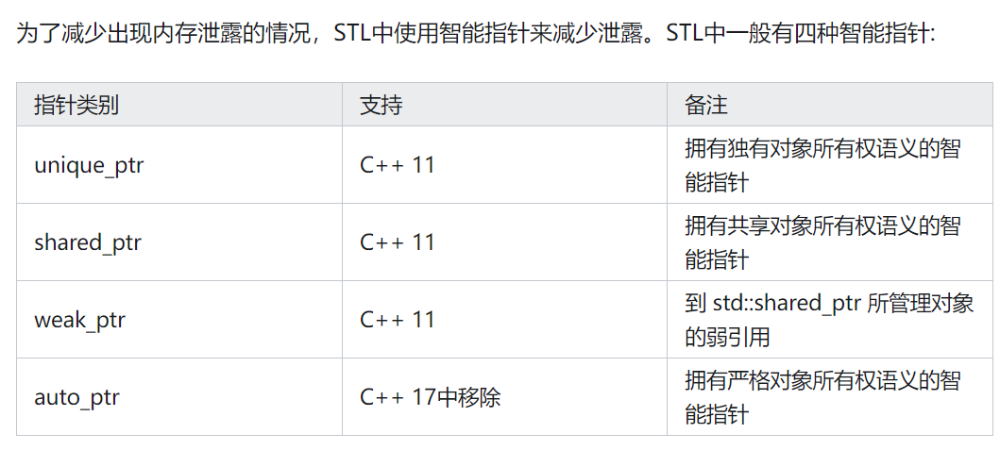
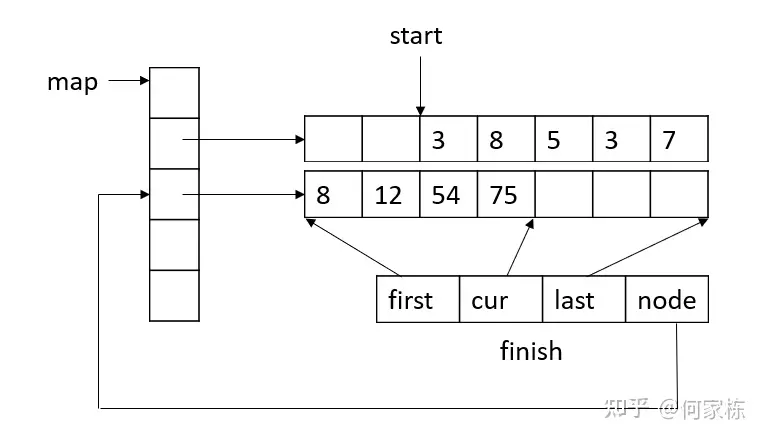
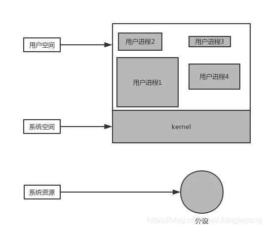
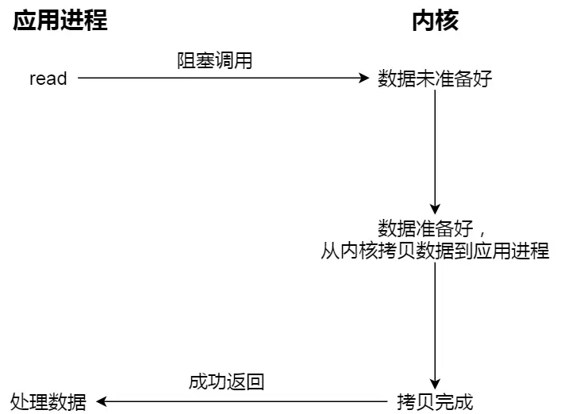
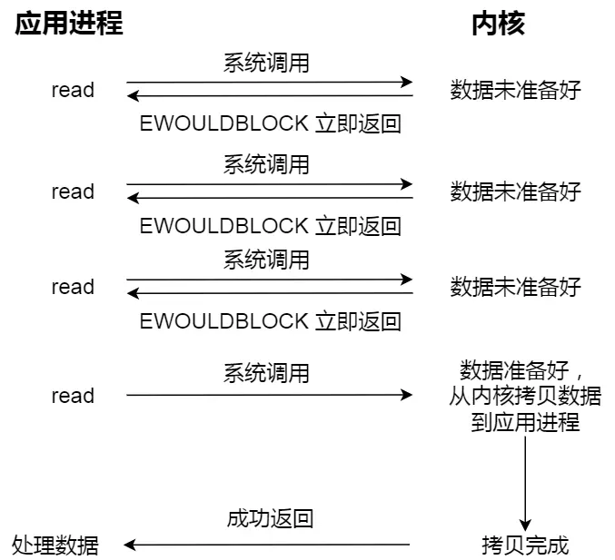
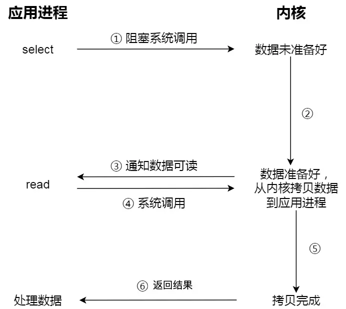
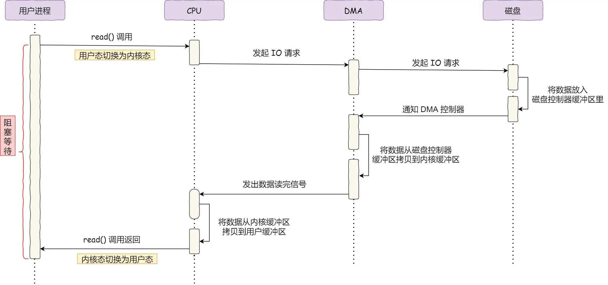
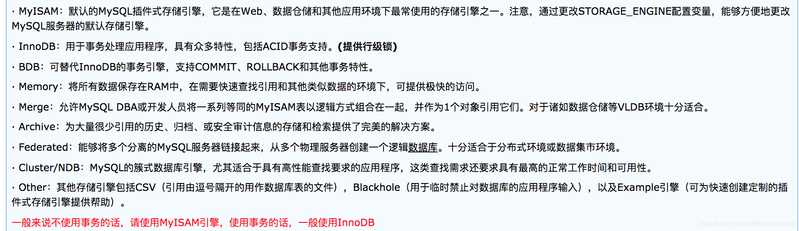
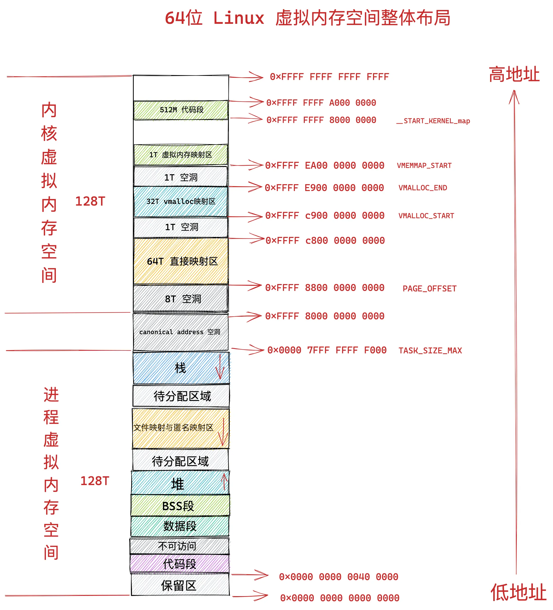

# 快手
## C++
### 内存溢出、野指针
#### 一、内存分配方式

通常内存分配方式有以下三种：

（1）从静态存储区域分配。内存在程序编译的时候就已经分配好，这块内存在程序的整个运行期间都存在。例如全局变量，static变量。

（2）在栈上创建。在执行函数时，函数内局部变量的存储单元都可以在栈上创建，函数执行结束时这些存储单元自动被释放。栈内存分配运算内置于处理器的指令集中，效率很高，但是分配的内存容量有限。

（3）从堆上分配，亦称动态内存分配。程序在运行的时候用malloc或new申请任意多少的内存，程序员自己负责在何时用free或delete释放内存。动态内存的生存期由程序员决定，使用非常灵活，但如果在堆上分配了空间，就有责任回收它，否则运行的程序会出现内存泄漏，频繁地分配和释放不同大小的堆空间将会产生堆内碎块。

#### 二、程序内存空间
堆的主要优点是可以动态分配内存，并且大小可以根据程序需要进行调整，但是由于需要手动管理内存，容易出现内存泄漏或者内存溢出等问题。

栈的主要优点是速度快，内存管理由操作系统自动完成，不容易出现内存泄漏或者内存溢出等问题，**但是栈的大小是静态的，无法动态调整**，所以栈上分配的内存空间比较有限，如果程序需要大量内存空间，就需要使用堆上的内存。


一个程序将操作系统分配给其运行的内存分为五个区域：

（1）栈区：由编译器自动分配释放，存放为函数运行的局部变量，函数参数，返回数据，返回地址等。操作方式与数据结构中的类似，栈区有以下特点：

　　1）由系统自动分配。比如在函数运行中声明一个局部变量int b = 10;，系统自动在栈中为b开辟空间；

　　2）只要栈的剩余空间大于所申请空间，系统将为程序提供内存，否则将报异常提示栈溢出。

（2）堆区：一般由程序员分配释放，若程序员不释放，程序结束时可能由OS回收；分配方式类似于链表，堆区有以下特点：

　　1）需要程序员自己申请，并指明大小，在C中是有malloc函数，在C++中多使用new运算符（从C++角度上说，使用new分配堆空间可以调用类的构造函数，而malloc()函数仅仅是一个函数调用，它不会调用构造函数，它所接受的参数是一个unsigned long类型。同样，delete在释放堆空间之前会调用析构函数，而free函数则不会）。

　　2）在操作系统中有一个记录空闲内存地址的表，这是一种链式结构。它记录了有哪些还未使用的内存空间。当系统收到程序的申请时，会遍历该链表，寻找第一个空间大于所申请空间的堆结点，然后将该结点从空闲结点链表中删除，并将该结点的空间分配给程序。

（3）全局数据区：也叫做静态区，存放全局变量，静态数据。程序结束后由系统释放。

（4）文字常量区：可以理解为常量区，常量字符串存放这里。程序结束后由系统释放。“常量”是指它的值是不可变的，同时，虽然常量也是存储在内存的某个地方，但是无法访问常量的地址的。

（5）程序代码区：存放函数体的二进制代码。但是代码段中也分为代码段和数据段。

#### 三、内存溢出原因

（1）在类的构造函数和析构函数中没有匹配的调用new和delete函数

　　两种情况下会出现这种内存泄露：

　　1）在堆里创建了对象占用了内存，但是没有显示地释放对象占用的内存；

　　2）在类的构造函数中动态的分配了内存，但是在析构函数中没有释放内存或者没有正确的释放内存。

（2）没有正确地清除嵌套的对象指针

（3）在释放对象数组时在delete中没有使用方括号

　　方括号是告诉编译器这个指针指向的是一个对象数组，同时也告诉编译器正确的对象地址值并调用对象的析构函数，如果没有方括号，那么这个指针就被默认为只指向一个对象，对象数组中的其他对象的析构函数就不会被调用，结果造成了内存泄露。如果在方括号中间放了一个比对象数组大小还大的数字，那么编译器就会调用无效对象（内存溢出）的析构函数，会造成堆的奔溃。如果方括号中间的数字值比对象数组的大小小的话，编译器就不能调用足够多个析构函数，结果会造成内存泄露。释放单个对象、单个基本数据类型的变量或者是基本数据类型的数组不需要大小参数，释放定义了析构函数的对象数组才需要大小参数。

（4）指向对象的指针数组不等同于对象数组

　　对象数组是指：数组中存放的是对象，只需要delete [ ] p，即可调用对象数组中的每个对象的析构函数释放空间
指向对象的指针数组是指：数组中存放的是指向对象的指针，不仅要释放每个对象的空间，还要释放每个指针的空间，delete [ ] p只是释放了每个指针，但是并没有释放对象的空间，正确的做法，是通过一个循环，将每个对象释放了，然后再把指针释放了。

**（5）缺少拷贝构造函数**（很重要的一个点）

　　两次释放相同的内存是一种错误的做法，同时可能会造成堆的奔溃。按值传递会调用（拷贝）构造函数，引用传递不会调用。

　　在C++中，如果没有定义拷贝构造函数，那么编译器就会调用默认的拷贝构造函数，会逐个成员拷贝的方式来复制数据成员，如果是以逐个成员拷贝的方式来复制指针被定义为将一个变量的地址赋给另一个变量。这种隐式的指针复制结果就是两个对象拥有指向同一个动态分配的内存空间的指针。当释放第一个对象的时候，它的析构函数就会释放与该对象有关的动态分配的内存空间。而释放第二个对象的时候，它的析构函数会释放相同的内存，这样是错误的。

　　**所以，如果一个类里面有指针成员变量，要么必须显示的写拷贝构造函数和重载赋值运算符，要么禁用拷贝构造函数和重载赋值运算符。**

（6）缺少重载赋值运算符

　　这种问题跟上述问题类似，也是逐个成员拷贝的方式复制对象，如果这个类的大小是可变的，那么结果就是造成内存泄露.

**（7）关于nonmodifying运算符重载的常见错误**

　　1）返回栈上对象的引用或者指针（也即返回局部对象的引用或者指针）。导致最后返回的是一个空引用或者空指针，因此变成野指针（指向被释放的或者访问受限内存的指针）；

　　2）返回内部静态对象的引用；

　　3）返回一个泄露内存的动态分配的对象。导致内存泄露，并且无法回收。

解决这一类问题的办法是重载运算符函数的返回值不是类型的引用，而应该是类型的返回值，即不是 int&而是int。

**（8）没有将基类的析构函数定义为虚函数**

　　当基类指针指向子类对象时，如果基类的析构函数不是虚函数，那么子类的析构函数将不会被调用，子类的资源没有正确是释放，因此造成内存泄露。

**造成野指针的原因：**

　　1）指针变量没有被初始化（如果值不定，可以初始化为NULL）；

　　2）指针被free或者delete后，没有置为NULL, free和delete只是把指针所指向的内存给释放掉，并没有把指针本身干掉，此时指针指向的是“垃圾”内存。释放后的指针应该被置为NULL；

　　3）指针操作超越了变量的作用范围，比如返回指向栈内存的指针就是野指针；

　　4）shared_ptr循环引用。

（9）析构的时候使用void*

　　delete掉一个void*类型的指针，导致没有调用到对象的析构函数，析构的所有清理工作都没有去执行从而导致内存的泄露。

（10）构造的时候浅拷贝，释放的时候调用了两侧delete

```c++
#include <iostream>
using namespace std;

// 深浅拷贝操作

class Person
{
public:
    // 无参构造函数
    Person()
    {
        cout << "Person的构造函数调用" << endl;
    }
    // 有参构造函数
    Person(int a, int h)
    {
        m_Age = a;
        m_Height = new int(h);
        cout << "Person的有参构造函数调用" << endl;
    }
    // 析构造函数
    ~Person()      //如果基类的析构函数没有被设置为虚函数，子类析构函数没法调用，会产生内存泄漏
    {
        // 将堆区开辟的空间释放掉
        if(m_Height != NULL)
        {
            delete m_Height;
            m_Height = NULL;    // 防止野指针出现
        }
        cout << "Person的析构造函数调用" << endl;
    }

    // 自己实现拷贝构造函数，解决浅拷贝带来的问题
    Person(const Person &p)
    {
        cout << "Person拷贝造函数调用" << endl;
        m_Age = p.m_Age;
        // m_Height = p.m_Height;   // 编译器默认实现就是这行代码(浅拷贝)，如果被复制的对象被销毁，则
        // 深拷贝操作
        m_Height = new int(*p.m_Height);
    }

    int m_Age;  // 年龄
    int *m_Height; // 身高
};

void test01()
{
    Person p1(18, 160);
    cout << "Person的年龄：" << p1.m_Age << "身高为：" << *p1.m_Height << endl;

    Person p2(p1);  // 执行来浅拷贝操作（调用默认的拷贝函数）
    cout << "P2的年龄：" << p1.m_Age << "身高为：" << *p2.m_Height << endl;
}

int main(int argc, char const *argv[])
{
    /* code */
    test01();

    return 0;
}
```

### 系统化的避免野指针
避免在堆上分配:

众所周知，大部分的内存泄漏都是因为在堆上分配引起的，如果我们不在堆上进行分配，就不会存在内存泄漏了(这不废话嘛)，我们可以根据具体的使用场景，如果对象可以在栈上进行分配，就在栈上进行分配，一方面栈的效率远高于堆，另一方面，还能避免内存泄漏，我们何乐而不为呢。

手动释放:

* 对于malloc函数分配的内存，在结束使用的时候，使用free函数进行释放
* 对于new操作符创建的对象，切记使用delete来进行释放
* 对于new []创建的对象，使用delete[]来进行释放(使用free或者delete均会造成内存泄漏)

避免使用裸指针:

尽可能避免使用裸指针，除非所调用的lib库或者合作部门的接口是裸指针。
```c++
int fun(int *ptr) {// fun 是一个接口或lib函数
      return 0;
}

int main() {
      int a = 1000;
      int *ptr = &a;
      fun(ptr);
      return 0;
}
```
在上面的fun函数中，有一个参数ptr,为int *，我们需要根据上下文来分析这个指针是否需要释放，这是一种**很不好的设计**

使用STL中或者自己实现对象:

在C++中，提供了相对完善且可靠的STL供我们使用，所以能用STL的尽可能的避免使用C中的编程方式，比如：
* 使用std::string 替代char *, string类自己会进行内存管理，而且优化的相当不错
* 使用std::vector或者std::array来替代传统的数组
* 其它适合使用场景的对象

智能指针:

自C++11开始，STL中引入了智能指针(smart pointer)来动态管理资源，针对使用场景的不同，提供了以下三种智能指针


定位:
* 日志
* 统计
* 工具，在Linux上比较常用的内存泄漏检测工具是valgrind


### 关于类实例化和栈区分配
类一旦加载，就会占用内存（否则加载啥），实例化，是将其在堆里面复制了一份(一般是属性)，然后返回给用户。根据不同的需求实例化成不同的实例，这就是多态。所以类就是实例的模板。类在实例化之前肯定储存在代码段中只是没有执行而已，就像function一样，这个段在new的时候才能执行并为类中的成员属性在堆中分配空间，方法在堆中只有指针，指针指向代码段的方法定义，就像function只有在调用的时候才会在栈中为它定义的临时变量分配空间。类只是一种定义，和function一样，**但是类变量（静态变量）和类方法（静态方法）不同，他们在类加载时候就执行了并且和常量一起被分布到静态区了，所以可以直接访问，不过他们还是属于类的，所以访问前要加上类名和范围解析符**。类中的普通方法和普通属性在实例化之前变量名不会存储在符号表中，实例化后对象指针存在栈中的变量，类中的属性名在符号表中对应的是是对象地址的偏移量，**而代码段类中的普通方法的地址被存在对象中的方法指针中**。

如果一个类中有静态变量的话，程序首先会把该静态变量加载进内存中，也就是在堆中开辟一个区域专门存放。以后不管你new多少个类的对象，该静态变量永远都是在那里的。也就是说，静态变量在类的初始化一次后，系统就不会为该变量开辟新的内存空间。而每new一个类的对象，系统就会重新在堆内存中开辟一个新空间来存放该类的实例对象，并且栈中也会有一个新的引用变量去指向它。

静态方法也是类似，但是有一点要强调，静态方法只中不能调用非静态方法。因为被static修饰的方法会首先被Classloader对象先加载进内存，而这个时候可能其它的非静态方法或者变量还没有被加载进来。就好比我现在想做包子，现在面粉被static修饰，首先已经拿到你身边，可是因为包子馅不是static修饰的，所以可能包子馅儿还没运过来，你说怎么做的出包子呢。

被static修饰过的都是随着类的初始化后就产生了，在堆内存中都有一块专门的区域来存放，所以只需要类名点方法名或者变量名即可。而非静态的就必须通过类的对象去调相应的。

在回答堆和栈的区别时，应当回答和面向对象编程有关的东西，腾讯也有面试为C++在运行时是怎么进行的，在内存方面，问的也是面向对象程序，类在程序加载时和运行时的状态。考虑问题：实例化一个类到底是放在堆还是栈，类占用空间多少，实例化呢？继承呢？

### 类实例化占用空间
```c++
#include<iostream.h>
 
using namespace std;
 
class a {};
class b{};
class c:public a{
	virtual void fun()=0;
};
class d:public b,public c{};
 
int main()
{
	 cout<<"sizeof(a)="<<sizeof(a)<<endl;
	 cout<<"sizeof(b)="<<sizeof(b)<<endl;
	 cout<<"sizeof(c)="<<sizeof(c)<<endl;
	 cout<<"sizeof(d)="<<sizeof(d)<<endl;
	 return  0;
 }
```
程序执行的输出结果为：

sizeof(a) =1

sizeof(b)=1

sizeof(c)=4

sizeof(d)=8

为什么会出现这种结果呢？类a，b明明是空类，它的大小应该为为0，为什么编译器输出的结果为１呢？这就是我们刚才所说的实例化的原因（空类同样可以被实例化），每个实例在内存中都有一个独一无二的地址，为了达到这个目的，编译器往往会给一个空类隐含的加一个字节，这样空类在实例化后在内存得到了独一无二的地址．所以a，b的大小为１．

而类c是由类a派生而来，它里面有一个纯虚函数，由于有虚函数的原因，有一个指向虚函数的指针（vptr），在３２位的系统分配给指针的大小为４个字节，所以最后得到c类的大小为４．

类d的大小更让初学者疑惑吧，类d是由类b，c派生而来的，它的大小应该为二者之和５，为什么却是８呢？这是因为为了提高实例在内存中的存取效率．类的大小往往被调整到最长元素的整数倍（类似结构体的内存对齐原则），所以应该调整为4的整数倍，即８个字节．

当然在不同的编译器上得到的结果可能不同，但是这个实验告诉我们初学者，不管类是否为空类，均可被实例化（空类也可被实例化），每个被实例都有一个独一无二的地址．

```c++
#include<iostream.h>
 
class A{
	public :
		A(int a) : x(a){}

		void f(int x){
		cout<<x<<endl;}

        virtual void fun()=0;

		~A(){}
 
	private:
	   int x;
	   int g;
};
class B{
	public:
		private:
		int  data; int data2;
		static int xs;
};
int B::xs=0;
 
void  main(){
	A s(10);
	s.f(10);
	cout<<"sizeof(a)"<<sizeof(A)<<endl;
	cout<<"sizeof(b)"<<sizeof(B)<<endl;
}
```
sizeof(a) 12 两个int一起8 虚函数指针4 

sizeof(b) 8

从以上的几个例子不难发现类的大小：

１．为类的非静态成员数据的类型大小之和．

２．有编译器额外加入的成员变量的大小，用来支持语言的某些特性（如：指向虚函数的指针）．

３．为了优化存取效率，进行的边缘调整．

４　与类中的构造函数，析构函数以及其他的成员函数无关．

### 类实例化在堆还是栈
Object obj;
此时，obj是在栈上分配的吗？

要回答这个问题，我们首先要理解这个语句是什么意思。这个语句就是代表着，在栈上创建对象吗？

其实，这行语句的含义是，使对象obj具有“自动存储（automatic storage）”的性质。所谓“自动存储”，意思是这个对象的存储位置取决于其声明所在的上下文。

如果这个语句出现在函数内部，那么它就在栈上创建对象。

如果这个语句不是在函数内部，而是作为一个类的成员变量，则取决于这个类的对象是如何分配的。考虑下面的代码：

class Class
{
    Object obj;
};
 
Class *pClass = new Class;
  // 指针pClass所指向的对象在堆上分配空间。

  // 因为Object obj;语句的含义是“自动存储”，所以，pClass->obj也是在堆上创建的。

堆和栈的区别在于两点：

* 生命周期
* 性能 

第一点才是我们需要着重考虑的。由于栈的特性，如果你需要一个具有比其所在的上下文更长的生命周期的变量，只能在堆上创建它。所以，我们的推荐是：只要能在栈上创建对象，就在栈上创建；否则的话，如果你不得不需要更长的生命周期，只能选择堆上创建。这是由于在栈上的对象不需要我们手动管理内存。有经验的开发人员都会对内存管理感到头疼，我们就是要避免这种情况的发生。总的来说，我们更多推荐选择在栈上创建对象。

但是，有些情况，即便你在栈上创建了对象，它还是会占用堆的空间。考虑如下代码：

void func
{
    std::vector v;
}

对象v是在栈上创建的。但是，STL 的vector类其实是在堆上面存储数据的（这点可以查看源代码）。因此，只有对象v本身是在栈上的，它所管理的数据（这些数据大多数时候都会远大于其本身的大小）还是保存在堆上。

关于第二点性能，有影响，不过一般可以忽略不计。确切的说，一般情况下你不需要考虑性能问题，除非它真的是一个问题。

首先，在堆上创建对象需要追踪内存的可用区域。这个算法是由操作系统提供，通常不会是常量时间的。当内存出现大量碎片，或者几乎用到 100% 内存时，这个过程会变得更久。与此相比，栈分配是常量时间的。其次，栈的大小是固定的，并且远小于堆的大小。所以，如果你需要分配很大的对象，或者很多很多小对象，一般而言，堆是更好的选择。如果你分配的对象大小超出栈的大小，通常会抛出一个异常。尽管很罕见，但是有时候也的确会发生。有关性能方面的问题，更多出现在嵌入式开发中：频繁地分配、释放内存可能造成碎片问题。

### 关于类中创建成员变量在堆区，如何将堆区回收


### C++11智能指针


std::unique_ptr 是通过指针占有并管理另一对象，并在 unique_ptr 离开作用域时释放该对象的智能指针。在下列两者之一发生时用关联的删除器释放对象：

* 销毁了管理的 unique_ptr 对象
* 通过 operator= 或 reset() 赋值另一指针给管理的 unique_ptr 对象。

std::shared_ptr 是通过指针保持对象共享所有权的智能指针。多个 shared_ptr 对象可占有同一对象。下列情况之一出现时销毁对象并解分配其内存：

* 最后剩下的占有对象的 shared_ptr 被销毁；
* 最后剩下的占有对象的 shared_ptr 被通过 operator= 或 reset() 赋值为另一指针。

```c++
unique_ptr<int> uptr( new int );
unique_ptr<int[ ]> uptr( new int[5] );

//声明,可以用一个指针显示的初始化,或者声明成一个空指针,可以指向一个类型为T的对象
shared_ptr<T> sp;
unique_ptr<T> up;
//赋值,返回相对应类型的智能指针,指向一个动态分配的T类型对象,并且用args来初始化这个对象
make_shared<T>(args);
make_unique<T>(args);     //注意make_unique是C++14之后才有的
//用来做条件判断,如果其指向一个对象,则返回true否则返回false
p;
//解引用
*p;
//获得其保存的指针,一般不要用
p.get();
//交换指针
swap(p,q);
p.swap(q);

//release()用法
 //release()返回原来智能指针指向的指针,只负责转移控制权，不负责释放内存，常见的用法
 unique_ptr<int> q(p.release()) // 此时p失去了原来的的控制权交由q,同时p指向nullptr  
 //所以如果单独用:
 p.release()
 //则会导致p丢了控制权的同时,原来的内存得不到释放
 //则会导致//reset()用法
 p.reset()     // 释放p原来的对象,并将其置为nullptr，
 p = nullptr   // 等同于上面一步
 p.reset(q)    // 注意此处q为一个内置指针,令p释放原来的内存，p新指向这个对象
```

```c++
unique_ptr<int> a(new int(0));
unique_ptr<int> b = a;  // 编译错误
unique_ptr<int> b = std::move(a); // 可以通过move语义进行所有权转移
```

```c++
void fun() {
      std::shared_ptr<Type> a; // a是一个空对象
      {
            std::shared_ptr<Type> b = std::make_shared<Type>(); // 分配资源
            a = b; // 此时引用计数为2
            {
              std::shared_ptr<Type> c = a; // 此时引用计数为3
            } // c退出作用域，此时引用计数为2
      } // b 退出作用域，此时引用计数为1
} // a 退出作用域，引用计数为0，释放对象

```


### 拷贝构造函数和赋值函数
在C++中，3种对象需要复制，此时拷贝构造函数会被调用

1）一个对象以值传递的方式传入函数体

2）一个对象以值传递的方式从函数返回

3）一个对象需要通过另一个对象进行初始化

拷贝构造函数重载声明如下：
```
A (const A&other)  //一定要传递引用，因为值传递会调用对象的拷贝构造函数，而拷贝构造的对象也调用拷贝构造函数，如此无限递归调用会导致栈溢出，C++不允许出现该情况，因此会便于其报错。
```

赋值函数：
当没有重载赋值函数（赋值运算符）时，通过默认赋值函数来进行赋值操作

```c++
<span style="font-size:14px;">class  A;
A a;
A b=a;   //调用拷贝构造函数（b不存在）
A c(a) ;   //调用拷贝构造函数
 
/************************/
 
class  A;
A a;
A b;   
b = a ;   //调用赋值函数(b存在)</span>
```

强调：这里a,b对象是已经存在的，是用a 对象来赋值给b的！！

1）拷贝构造函数是一个对象初始化一块内存区域，这块内存就是新对象的内存区，而赋值函数是对于一个已经被初始化的对象来进行赋值操作。

2）一般来说在数据成员包含指针对象的时候，需要考虑两种不同的处理需求：一种是复制指针对象，另一种是引用指针对象。拷贝构造函数大多数情况下是复制，而赋值函数是引用对象

3）实现不一样。拷贝构造函数首先是一个构造函数，它调用时候是通过参数的对象初始化产生一个对象。赋值函数则是把一个新的对象赋值给一个原有的对象，所以如果原来的对象中有内存分配要先把内存释放掉，而且还要检察一下两个对象是不是同一个对象，如果是，不做任何操作，直接返回。（这些要点会在下面的String实现代码中体现）

！！！如果不想写拷贝构造函数和赋值函数，又不允许别人使用编译器生成的缺省函数，最简单的办法是将拷贝构造函数和赋值函数声明为私有函数，不用编写代码。

```c++
class A
{
 private:
    A(const A& a); //私有拷贝构造函数
    A& operate=(const A& a); //私有赋值函数
};
```

```c++
String::String(const char* str)    //普通构造函数
 
{
    cout<<construct<<endl;
 
    if(str==NULL)        //如果str 为NULL，就存一个空字符串“”
    {
    m_string=new char[1];
    *m_string ='\0';
    }
 
    else
    {
    m_string = new char[strlen(str)+1] ;   //分配空间
    strcpy(m_string,str);
    }
}
 
 
String::String(const String& other)   //拷贝构造函数
{
    cout<<"copy construct"<<endl;
    m_string = new char[strlen(other.m_string)+1]; //分配空间并拷贝
    strcpy(m_string, other.m_string);
}
 
String & String::operator=(const String& other) //赋值运算符，注意返回值是传递引用
{
    cout<<"operator =funtion"<<endl ;
    if(this == &other) //如果对象和other是用一个对象，直接返回本身
    {
    return *this;
    }
    
    delete []m_string; //先释放原来的内存，非常关键的地方在这里，要把原本创建的空间消除掉
    m_string = new char[strlen(other.m_string)+1];  //再重新创建堆区
    strcpy(m_string, other.m_string);
    return *this;
}
```

```c++
//自己练手
#define _CRT_SECURE_NO_WARNINGS

#include <iostream>
using namespace std;


class myString {
private:
	int val;
	char* m_pData;

public:
	//构造函数
	myString(const int val, const char* str) {
		this->val = val;
		if (str == nullptr) {
			m_pData = new char[1];
			m_pData[0] = '\0';
		}
		else {
			m_pData = new char[strlen(str) + 1];
			strcpy(m_pData, str);
		}
	}

	//拷贝构造函数
	myString(const myString& s) {
		this->val = s.val;
		this->m_pData = new char[strlen(s.m_pData) + 1];
		strcpy(m_pData, s.m_pData);
	}

	//赋值函数
	myString& operator=(const myString& s) {
		if (this == &s) {
			return *this;
		}

		delete[]m_pData;
		m_pData = new char[strlen(s.m_pData) + 1];
		strcpy(m_pData, s.m_pData);
		this->val = s.val;
		return *this;
	}

	void getVal() {
		cout << val << endl;
		cout << m_pData << endl;
	}

	//析构函数
	virtual ~myString() {     //如果有继承的考虑
		delete[] m_pData;
		m_pData = NULL;
	}
};

int main() {
	myString my_string(999, "tymxx");
	myString my1(my_string);

	myString my2(111, "xxxxx");
	my2 = my_string;

	my1.getVal();
	my2.getVal();
	return 0;
}
```

## 数据结构
### 常见的数据结构和底层实现
顺序容器：vector, dequeue, list
关联容器：set, multi_set, map, multi_map
无序容器：unorder_set, unorder_map
容器适配器：stack, queue

### 顺序访问和随机访问
顺序访问：顺序容器
随机访问：除了容器适配器和list，注意，dequeue可以随机访问。

dequeue底层：



vector底层为数组，list是链表，关联容器为红黑树，无序容器为哈希表，容器适配器在上述容器的接口上进行封装和改写实现

## 操作系统
### 多线程的通信方式
多进程通信方式：
* 管道
* 命名管道
* 共享内存
* 消息队列
* socket
* 信号
* 信号量

多线程通信方式：
* 锁机制：包括互斥锁、条件变量、读写锁
* 信号量机制(Semaphore)：包括无名线程信号量和命名线程信号量
* 信号机制(Signal)：类似进程间的信号处理

### 内核态和用户态切换是什么


访问系统资源，包括外设、内存、IO、网络通信等，比如文件系统中读取文件，通过磁盘写入内存，该动作是内核做的，CPU为了将内核和用户程序进行隔离，所以在这些操作时，而这对应一些特殊的堆栈和内存环境，必须在系统调用前建立好。而在系统调用结束后，cpu会从核心模式切回到用户模式，而堆栈又必须恢复成用户进程的上下文。而这种切换就会有大量的耗时。

read是把数据从内核缓冲区复制到进程缓冲区。write是把进程缓冲区复制到内核缓冲区。write并不一定导致内核的写动作，比如os可能会把内核缓冲区的数据积累到一定量后，再一次写入。这也就是为什么断电有时会导致数据丢失。

结合阻塞和非阻塞来看，一次读其实包含两个部分：

阻塞等待的是「内核数据准备好」和「数据从内核态拷贝到用户态」这两个过程。



非阻塞的 read 请求在数据未准备好的情况下立即返回，可以继续往下执行，这里最后一次 read 调用，获取数据的过程，是一个同步的过程，是需要等待的过程。这里的同步指的是内核态的数据拷贝到用户程序的缓存区这个过程。



为了解决这种傻乎乎轮询方式，于是 I/O 多路复用技术就出来了，如 select、poll，它是通过 I/O 事件分发，当内核数据准备好时，再以事件通知应用程序进行操作。



真正的异步调用就是第一张图内核拷贝到用户区之后才开始系统调用进程。



## 网络编程
### 非阻塞connect的使用
linux下非阻塞connect用法：

* 套接字设置非阻塞
* connect，比较错误码，EINPROGRESS表示正在建立连接
* select判断fd是否可写
* 跟windows不同，winsock用select就能判断connect连接是否建立，而linux下可能存在出错的情况，所以还需要getsockopt函数判断是否出错，如果没错则连接成功。

阻塞：阻塞调用是指调用结果返回之前，当前线程会被挂起。该进程被标记为睡眠状态并被调度出去。函数只有在得到结果之后才会返回。当socket工作在阻塞模式的时候， 如果没有数据的情况下调用该函数，则当前线程就会被挂起，直到有数据为止。

非阻塞：非阻塞和阻塞的概念相对应，指在不能立刻得到结果之前，该函数不会阻塞当前线程，而会立刻返回。epoll工作在非阻塞模式时，才会发挥作用。

## 数据库
### InnoDB的特点，和其他数据库相比


MyISAM是MySQL的默认数据库引擎（5.5版之前），由早期的 ISAM （Indexed Sequential Access Method：有索引的顺序访问方法）所改良。虽然性能极佳，而且提供了大量的特性，包括全文索引、压缩、空间函数等，但MyISAM不支持事务和行级锁，而且最大的缺陷就是崩溃后无法安全恢复。

不过，5.5版本之后，MySQL引入了InnoDB（另一种数据库引擎），以强化参考完整性与并发违规处理机制，后来就逐渐取代MyISAM。与传统的ISAM与MyISAM相比，InnoDB的最大特色就是支持了ACID兼容的事务（Transaction）功能，类似于PostgreSQL。目前InnoDB采用双轨制授权，一是GPL授权，另一是专有软件授权。

现在大多数时候我们使用的都是InnoDB存储引擎，但是在某些情况下使用MyISAM更好，比如：MyISAM更适合读密集的表，而InnoDB更适合写密集的的表。 在数据库做主从分离的情况下，经常选择MyISAM作为主库的存储引擎（最后一句有待验证，因为主库负责对外提供写服务，从库对外提供读服务）。

MyISAM特点

不支持行锁(MyISAM只有表锁)，读取时对需要读到的所有表加锁，写入时则对表加排他锁；
不支持事务
不支持外键
不支持崩溃后的安全恢复
在表有读取查询的同时，支持往表中插入新纪录
支持BLOB和TEXT的前500个字符索引，支持全文索引
支持延迟更新索引，极大地提升了写入性能
对于不会进行修改的表，支持 压缩表 ，极大地减少了磁盘空间的占用

InnoDB特点

支持行锁，采用MVCC来支持高并发，有可能死锁
支持事务
支持外键
支持崩溃后的安全恢复
不支持全文索引

1) 事务支持
MyISAM不支持事务，而InnoDB支持。InnoDB的AUTOCOMMIT默认是打开的，即每条SQL语句会默认被封装成一个事务，自动提交，这样会影响速度，所以最好是把多条SQL语句显示放在begin和commit之间，组成一个事务去提交。

MyISAM是非事务安全型的，而InnoDB是事务安全型的，默认开启自动提交，宜合并事务，一同提交，减小数据库多次提交导致的开销，大大提高性能。

3) 存储空间
MyISAM：可被压缩，存储空间较小。支持三种不同的存储格式：静态表(默认，但是注意数据末尾不能有空格，会被去掉)、动态表、压缩表。

7) 表锁差异
MyISAM：只支持表级锁，用户在操作myisam表时，select，update，delete，insert语句都会给表自动加锁，如果加锁以后的表满足insert并发的情况下，可以在表的尾部插入新的数据。
InnoDB：支持事务和行级锁，是innodb的最大特色。行锁大幅度提高了多用户并发操作的新能。但是InnoDB的行锁，只是在WHERE的主键是有效的，非主键的WHERE都会锁全表的。

MyISAM和InnoDB两者的应用场景：
1) MyISAM管理非事务表。它提供高速存储和检索，以及全文搜索能力。如果应用中需要执行大量的SELECT查询，那么MyISAM是更好的选择。
2) InnoDB用于事务处理应用程序，具有众多特性，包括ACID事务支持。如果应用中需要执行大量的INSERT或UPDATE操作，则应该使用InnoDB，这样可以提高多用户并发操作的性能。

但是实际场景中，针对具体问题需要具体分析，一般而言可以遵循以下几个问题：
-  数据库是否有外键？ 
-  是否需要事务支持？ 
-  是否需要全文索引？ 
-  数据库经常使用什么样的查询模式？在写多读少的应用中还是Innodb插入性能更稳定，在并发情况下也能基本，如果是对读取速度要求比较快的应用还是选MyISAM。 
-  数据库的数据有多大？ 大尺寸倾向于innodb，因为事务日志，故障恢复。

### 主库从库
数据库主主：两台都是主数据库，同时对外提供读写操作。客户端访问任意一台。数据存在双向同步。

数据库主从：一台是主数据库，同时对外提供读写操作。一台是 从数据库，对外提供读的操作。数据从主库同步到从库。

数据库主备：一台是主数据库，同时对外提供读写操作。一台是 备库，只作为备份作用，不对外提供读写，主机挂了它就取而代之。数据从主库同步到备库。


## 设计模式
### 多线程单例模式创建
单例模式是为了一个类的示例只有一个，并且可以自己实例化，从而向系统提供该实例化的对象

单例模式的使用场景

* 整个程序的运行中只允许有一个类的实例
* 需要频繁实例化然后销毁的对象
* 创建对象时耗时过多或者耗资源过多，但又经常用到的对象

一般是对于那些业务逻辑上限定不能存在多实例的情况

例如：序列号生成器(解决不能id自增的问题)，计数器—统计网站访问人数等场景，单例线程池等，都需要使用一个系统唯一实例来进行记录，若多实例计数则会不准确

饿汉式:指在第一次加载类的时候，就实例化对象，也就是在单例类的内部将类实例化
```c++
/**
 * @author ruoxi
 */
public class TestSingleTon {
    public static void main(String[] args) {
        SingleTon singleTon1 = SingleTon.getSingleTon();
        SingleTon singleTon2 = SingleTon.getSingleTon();
        System.out.println(singleTon1==singleTon2); //true
    }
}
/**
 * 饿汉式
 */
class SingleTon{
    /**
     * 注意需要使用 static和final修饰 并在这里直接实例化
     */
    private static final SingleTon singleTon = new SingleTon();
    /**
     * 定义private私有构造器，表示只在类内部使用，亦指单例的实例只能在单例类内部创建
     */
    private SingleTon(){}
    /**
     * 返回内部的singleTon实例
     * @return
     */
    public static SingleTon getSingleTon(){
        return singleTon;
    }
    /* 如果该对象被用于序列化，可以保证对象在序列化前后保持一致 */
	public Object readResolve() {
		return this.singleTon;
	}
}

```

懒汉式就是不在类加载时就创建类的单例，而是在第一次使用实例的时候再创建
```c++
/**
 * @author ruoxi
 */
public class TestSingleTon {
    public static void main(String[] args) {
        SingleTon2 singleTon21 = SingleTon2.getSingleTon();
        SingleTon2 singleTon22 = SingleTon2.getSingleTon();
        System.out.println(singleTon21==singleTon22); //true
    }
}

/**
 * 懒汉式
 */
class SingleTon2{
    /**
     * 懒汉式不在此处实例化
     */
    private static SingleTon2 singleTon=null;
    private SingleTon2(){}
    /**
     * 如果singleTon为空则进行实例化
     * @return
     */
    public static SingleTon2 getSingleTon(){
        if(singleTon==null) {
            singleTon = new SingleTon2();
        }
        return singleTon;
    }
    /* 如果该对象被用于序列化，可以保证对象在序列化前后保持一致 */
	public Object readResolve() {
		return this.singleTon;
	}

}
```
对于饿汉式的实现方式，在多线程下也能保证单一实例

但是对于懒汉式来说，在一个线程获取实例的时候，可能会有另一个线程也在获取实例，导致产生两个及以上的实例对象出现

(1) Synchronized
```c++
/**
 * synchronized实现多线程的单例模式
 */
class ThreadSingleTon{
    private static ThreadSingleTon singleTon = null;
    private ThreadSingleTon(){}
    /**
     * 使用synchronized防止多个线程同时调用这个方式去创建
     * @return
     */
    public static synchronized ThreadSingleTon getThreadSingleTon(){
        //为空则创建对象
        if(singleTon==null) {
            singleTon = new ThreadSingleTon();
        }
        return singleTon;
    }
}
```

但是每次调用该方法，都会给方法加锁，而只有第一次创建对象的时候需要加锁，其他时候都不需要，这样会导致程序的效率地下，那么可以使用下面的方式(双重检查锁)

(2) 双重检查锁
```c++
/**
 * 双重检查锁
 */
class ThreadSingleTon2{
    private static ThreadSingleTon2 singleTon = null;
    private ThreadSingleTon2(){}
    /**
     * 双重检查锁 具体解释看代码注释
     * @return
     */
    public static ThreadSingleTon2 getThreadSingleTon(){
        if(getThreadSingleTon()==null) {
            //如果对象为空，则是第一次实例化，这时锁住对象
            //给ThreadSingleTon.class加锁也可以
            synchronized (singleTon){
                //第二次判断是否为空，防止多线程操作时，在执行第一次判断后另一个线程完成了实例化
                if(singleTon==null){
                    singleTon = new ThreadSingleTon2();
                }
            }
        }
        return singleTon;
    }
}

```
虽然解决了每次尝试创建都加锁的问题，但是会有种情况，在A创建了对象并准备放入内存时，还是处于null状态，B也会进入创建。

(3) 双重检查锁+Volatile
```c++
/**
 * 双重检查锁+volatile
 */
class ThreadSingleTon2{
    /**
     * 使用volatile使主内存中的singleTon对线程可见
     */
    private volatile static ThreadSingleTon2 singleTon = null;
    private ThreadSingleTon2(){}
    /**
     * 双重检查锁 具体解释看代码注释
     * @return
     */
    public static ThreadSingleTon2 getThreadSingleTon(){
        if(getThreadSingleTon()==null) {
            //如果对象为空，则是第一次实例化，这时锁住对象
            //给ThreadSingleTon.class加锁也可以
            synchronized (singleTon){
                //第二次判断是否为空，防止多线程操作时，在执行第一次判断后另一个线程完成了实例化
                if(singleTon==null){
                    singleTon = new ThreadSingleTon2();
                }
            }
        }
        return singleTon;
    }
    /* 如果该对象被用于序列化，可以保证对象在序列化前后保持一致 */
	public Object readResolve() {
		return this.singleTon;
	}
}

```


### 工厂模式实现和举例
工厂模式是属于创建型模式的一种，主要分为简单工厂模式、工厂方法模式、抽象工厂模式，是为了隐藏创建逻辑而创建对象的一种方法。

要知道其发展由来，首先是简单工厂，即我认识的工厂模式叫抽象工厂，每种产品对象有特定的工厂生产实现。

而简单工厂是一个工厂基类实现工厂内部的ifelse来生产，但是这有违背开闭原则。


# 腾讯
## c++
### C++编译的全过程，程序编译后的二进制文件如何映射到虚拟内存空间中
直接详见小林coding

关键的就是：二进制文件在磁盘中通过函数调用映射到虚拟内存中，不同权限（代码段只读，而堆区可读写和执行）的源文件数据映射到内存的不同区域，构建起mm_struct，再进行实际的进程运行，不同进程用户态看到的内存都是虚拟映射到实际内存中的不同地方，自以为是独占了内存，是分离的。而内核态虚拟内存空间是所有进程共享的，不同进程进入内核态之后看到的虚拟内存空间全部是一样的，不同进程访问同一个虚拟地址是相同的物理位置。



## 网络编程
### time_wait如何减少
快速启动(NAT不安全)
发送rst

## 项目
### 如何在不使用锁和信号量来实现多线程
可以看到单例模式下线程不安全是通过什么解决的。是时间片分别分给了if判断语句发现单例指针处于null，而后分别进入了判断进行创建。解决方法是通过关键字原子化操作。synchronized。

### 在设计时为什不考虑端口复用
首先要熟悉epoll使用的概念，是IO事件到达后，epoll返回事件文件描述符进行处理，处理是通过epoll返回的链表来顺序进行的，如果事件中出现阻塞read等，会导致其他事件等待。

但是端口复用最大的有点在于避免了开销，线程上下文频繁切换和

### 使用了什么数据结构


## 数据结构
### 对于set的扩容
在碰撞链表过长时，会扩容。


# 阿里云
## 项目
### 有没有观察进程在运行时堆区的使用情况
`ulimit -s`查看栈大小。

### 守护进程


### TCP挂掉了会怎么处理


### 进程挂掉了会怎么处理


### epoll如何实现的高性能
* epoll 使用非阻塞I/O，允许一个线程同时管理多个事件，避免了传统阻塞I/O的效率问题。
* epoll 是事件驱动的，只有在事件发生时才会通知应用程序，避免了轮询的开销。
* epoll 支持注册大量的文件描述符，适用于高并发环境。
* epoll 内部使用了红黑树和双链表等高效数据结构来管理事件。
* epoll 支持 “边缘触发” 模式，可以减少数据从内核到用户空间的拷贝次数。

红黑树（Red-Black Tree）： epoll 使用红黑树来存储注册的文件描述符，这使得在添加、删除和查找文件描述符时的时间复杂度都是 O(log n)。红黑树是一种自平衡的二叉搜索树，能够保持树的相对平衡，从而保证操作的高效性能。

就绪列表（Ready List）： 内核会维护一个就绪列表，其中包含已经就绪的文件描述符。当文件描述符就绪时，它会被添加到这个列表中。应用程序可以通过系统调用来获取就绪列表中的文件描述符，从而避免了轮询所有文件描述符的开销。

回调机制： 当文件描述符就绪时，内核会调用注册的回调函数来通知应用程序。这些回调函数是在应用程序代码中定义的，它们会处理实际的 I/O 操作。

事件数据结构： 内核会使用数据结构来表示事件，这些数据结构包括有关文件描述符和事件类型的信息。应用程序通过查询这些数据结构，可以了解文件描述符的状态以及需要执行的操作。
epoll 的实现方式充分利用了数据结构和算法的优势，通过红黑树的高效查找和插入，以及就绪列表的通知机制，实现了在高并发情况下高效地管理和处理大量的 I/O 事件。这种设计使得应用程序能够及时地响应就绪的文件描述符，而不需要耗费大量的 CPU 资源在轮询上。

**阻塞等待事件触发**：

将红黑树中的文件描述符注册到内核事件表中，开始监听事件。
等待事件的发生，这个过程中 epoll 会使线程进入阻塞态。

**事件的触发和处理**：

当某个文件描述符上有感兴趣的事件发生时，触发事件，并将该文件描述符加入内核事件表的就绪队列中。
epoll 从就绪队列中获取已触发的文件描述符，根据红黑树找到对应的节点，并从节点中获取事件信息。
epoll 会将该文件描述符和触发的事件放入一个就绪事件列表中，以等待后续的处理。

**处理就绪的事件**：

从就绪事件列表中依次取出就绪的文件描述符和对应的事件类型。
根据事件类型，执行相应的处理操作。


### 进程中有使用什么信号，有什么功能


### 不通过waitpid实现子进程回收


## 数据结构
### vector的扩容，vector继承会出现什么
分配新的地址，并复制数据。

为什么要设计虚函数：

我们知道派生类会拥有基类定义的函数，但是对于某些函数，我们希望派生类各自定义适合于自己版本的函数，于是基类就将此函数定义为虚函数，让派生类各自实现自己功能版本的函数，当某个虚函数通过指针或引用调用时，编译器产生的代码直到运行时才能确定到该调用哪个版本的函数，该实现多态的过程叫**动态绑定**。

当没有虚函数，直接在派生类中进行相同名称或者相同函数的书写，则进行替代原函数，并且原成员函数需要加入限定域才能访问如`father::m_val`（不是多态，在作为形参传递使用子类时，形参类型名只能是子类名）。

直接继承STL会出现问题，类似 `class a: public vector<b>` 的写法，这些容器都不带虚析构函数，会有资源泄露问题。因为之前提到，如果继承时，父类的析构函数不是虚函数，因此继承导致了类中new出来的堆区无法正确回收，内存泄漏。

在STL中使用的是组合代替继承的思想，实现了容器适配器：
```c++
template<class T, class Container = std::deque<T>>
class stack{
    ...
    Container c_;
};
```


## 操作系统
### 多线程是否共享堆区
每个线程都有自己的堆栈，但它们共享一个公共堆。

函数运行时的信息保存在栈帧中，栈帧中保存了函数的返回值、调用其它函数的参数、该函数使用的局部变量以及该函数使用的寄存器信息，由于线程运行的本质就是函数运行，函数运行时信息是保存在栈帧中的，因此每个线程都有自己独立的、私有的栈区。

同时函数运行时需要额外的寄存器来保存一些信息，像部分局部变量之类，这些寄存器也是线程私有的，一个线程不可能访问到另一个线程的这类寄存器信息。从上面的讨论中我们知道，到目前为止，所属线程的栈区、程序计数器、栈指针以及函数运行使用的寄存器是线程私有的。

以上这些信息有一个统一的名字，就是线程上下文，thread context。

我们在C/C++中用malloc或者new出来的数据就存放在这个区域，很显然，只要知道变量的地址，也就是指针，任何一个线程都可以访问指针指向的数据，**因此堆区也是线程共享的属于进程的资源**。

最后，如果程序在运行过程中打开了一些文件，那么进程地址空间中还保存有打开的文件信息，**进程打开的文件也可以被所有的线程使用**，这也属于线程间的共享资源。

全局变量是所有进程共享的，多线程访问时要注意，要么直接对全局变量进行赋值，不能出现以下代码：
```c++
void* my_funa(void *arg)
{
    int i = 0;
    for(;i < MAX;++i)
    {
        int cur = count;
        cur++;     //存在中间变量，若此时时间片用完，另一个线程进行，结果导致再次运行该线程时后面一句话会覆盖正确值
        count = cur;
        printf("线程A:id = %lu,count = %d\n",pthread_self(),count);
        usleep(10);
    }
    return NULL;
}
```

同时，可以看到单例模式下线程不安全是通过什么解决的。是时间片分别分给了if判断语句发现单例指针处于null，而后分别进入了判断进行创建。解决方法是通过关键字原子化操作。synchronized。

这告诉我们在访问共享数据时应该注意原子化操作。
