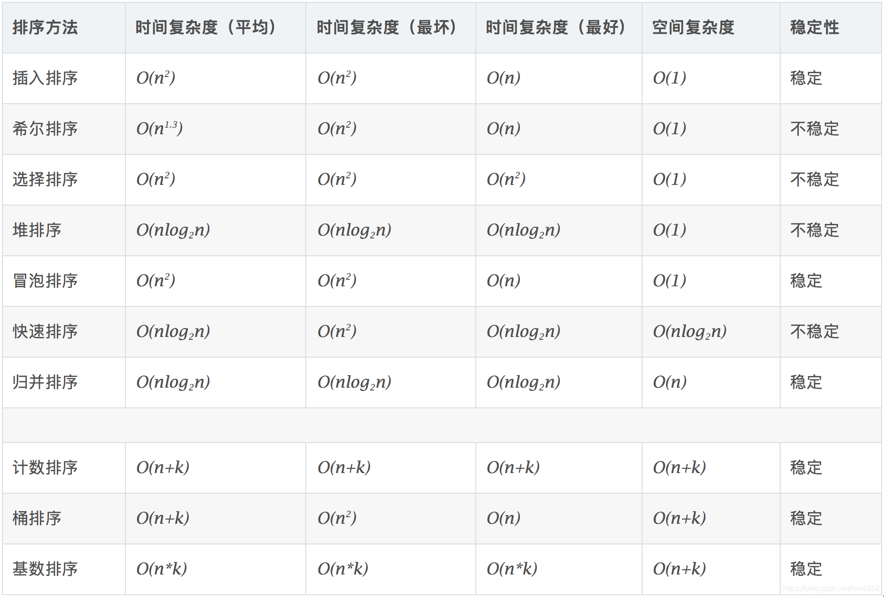

# 快手
## C++
### 内存溢出、野指针
#### 一、内存分配方式

通常内存分配方式有以下三种：

（1）从静态存储区域分配。内存在程序编译的时候就已经分配好，这块内存在程序的整个运行期间都存在。例如全局变量，static变量。

（2）在栈上创建。在执行函数时，函数内局部变量的存储单元都可以在栈上创建，函数执行结束时这些存储单元自动被释放。栈内存分配运算内置于处理器的指令集中，效率很高，但是分配的内存容量有限。

（3）从堆上分配，亦称动态内存分配。程序在运行的时候用malloc或new申请任意多少的内存，程序员自己负责在何时用free或delete释放内存。动态内存的生存期由程序员决定，使用非常灵活，但如果在堆上分配了空间，就有责任回收它，否则运行的程序会出现内存泄漏，频繁地分配和释放不同大小的堆空间将会产生堆内碎块。

#### 二、程序内存空间
堆的主要优点是可以动态分配内存，并且大小可以根据程序需要进行调整，但是由于需要手动管理内存，容易出现内存泄漏或者内存溢出等问题。

栈的主要优点是速度快，内存管理由操作系统自动完成，不容易出现内存泄漏或者内存溢出等问题，**但是栈的大小是静态的，无法动态调整**，所以栈上分配的内存空间比较有限，如果程序需要大量内存空间，就需要使用堆上的内存。


一个程序将操作系统分配给其运行的内存分为五个区域：

（1）栈区：由编译器自动分配释放，存放为函数运行的局部变量，函数参数，返回数据，返回地址等。操作方式与数据结构中的类似，栈区有以下特点：

　　1）由系统自动分配。比如在函数运行中声明一个局部变量int b = 10;，系统自动在栈中为b开辟空间；

　　2）只要栈的剩余空间大于所申请空间，系统将为程序提供内存，否则将报异常提示栈溢出。

（2）堆区：一般由程序员分配释放，若程序员不释放，程序结束时可能由OS回收；分配方式类似于链表，堆区有以下特点：

　　1）需要程序员自己申请，并指明大小，在C中是有malloc函数，在C++中多使用new运算符（从C++角度上说，使用new分配堆空间可以调用类的构造函数，而malloc()函数仅仅是一个函数调用，它不会调用构造函数，它所接受的参数是一个unsigned long类型。同样，delete在释放堆空间之前会调用析构函数，而free函数则不会）。

　　2）在操作系统中有一个记录空闲内存地址的表，这是一种链式结构。它记录了有哪些还未使用的内存空间。当系统收到程序的申请时，会遍历该链表，寻找第一个空间大于所申请空间的堆结点，然后将该结点从空闲结点链表中删除，并将该结点的空间分配给程序。

（3）全局数据区：也叫做静态区，存放全局变量，静态数据。程序结束后由系统释放。

（4）文字常量区：可以理解为常量区，常量字符串存放这里。程序结束后由系统释放。“常量”是指它的值是不可变的，同时，虽然常量也是存储在内存的某个地方，但是无法访问常量的地址的。

（5）程序代码区：存放函数体的二进制代码。但是代码段中也分为代码段和数据段。

#### 三、内存溢出原因

（1）在类的构造函数和析构函数中没有匹配的调用new和delete函数

　　两种情况下会出现这种内存泄露：

　　1）在堆里创建了对象占用了内存，但是没有显示地释放对象占用的内存；

　　2）在类的构造函数中动态的分配了内存，但是在析构函数中没有释放内存或者没有正确的释放内存。

（2）没有正确地清除嵌套的对象指针

（3）在释放对象数组时在delete中没有使用方括号

　　方括号是告诉编译器这个指针指向的是一个对象数组，同时也告诉编译器正确的对象地址值并调用对象的析构函数，如果没有方括号，那么这个指针就被默认为只指向一个对象，对象数组中的其他对象的析构函数就不会被调用，结果造成了内存泄露。如果在方括号中间放了一个比对象数组大小还大的数字，那么编译器就会调用无效对象（内存溢出）的析构函数，会造成堆的奔溃。如果方括号中间的数字值比对象数组的大小小的话，编译器就不能调用足够多个析构函数，结果会造成内存泄露。释放单个对象、单个基本数据类型的变量或者是基本数据类型的数组不需要大小参数，释放定义了析构函数的对象数组才需要大小参数。

（4）指向对象的指针数组不等同于对象数组

　　对象数组是指：数组中存放的是对象，只需要delete [ ] p，即可调用对象数组中的每个对象的析构函数释放空间
指向对象的指针数组是指：数组中存放的是指向对象的指针，不仅要释放每个对象的空间，还要释放每个指针的空间，delete [ ] p只是释放了每个指针，但是并没有释放对象的空间，正确的做法，是通过一个循环，将每个对象释放了，然后再把指针释放了。

**（5）缺少拷贝构造函数**（很重要的一个点，会产生野指针）

　　两次释放相同的内存是一种错误的做法，同时可能会造成堆的奔溃。按值传递会调用（拷贝）构造函数，引用传递不会调用。

　　在C++中，如果没有定义拷贝构造函数，那么编译器就会调用默认的拷贝构造函数，会逐个成员拷贝的方式来复制数据成员，如果是以逐个成员拷贝的方式来复制指针被定义为将一个变量的地址赋给另一个变量。这种隐式的指针复制结果就是两个对象拥有指向同一个动态分配的内存空间的指针。当释放第一个对象的时候，它的析构函数就会释放与该对象有关的动态分配的内存空间。而释放第二个对象的时候，它的析构函数会释放相同的内存，这样是错误的。

　　**所以，如果一个类里面有指针成员变量，要么必须显示的写拷贝构造函数和重载赋值运算符，要么禁用拷贝构造函数和重载赋值运算符。**

注意，没有拷贝构造函数会导致无法通过形参值传递的方式传递对象，也不能作为函数返回参数。

（6）缺少重载赋值运算符

　　这种问题跟上述问题类似，也是逐个成员拷贝的方式复制对象，如果这个类的大小是可变的，那么结果就是造成内存泄露.chansheng

**（7）关于nonmodifying运算符重载的常见错误**会产生野指针

　　1）返回栈上对象的引用或者指针（也即返回局部对象的引用或者指针）。导致最后返回的是一个空引用或者空指针，因此变成野指针（指向被释放的或者访问受限内存的指针）；

　　2）返回内部静态对象的引用；

　　3）返回一个泄露内存的动态分配的对象。导致内存泄露，并且无法回收。

解决这一类问题的办法是重载运算符函数的返回值不是类型的引用，而应该是类型的返回值，即不是 int&而是int。

**（8）没有将基类的析构函数定义为虚函数**

　　当基类指针指向子类对象时，如果基类的析构函数不是虚函数，那么子类的析构函数将不会被调用，子类的资源没有正确是释放，因此造成内存泄露。

**造成野指针的原因：**
请区分清楚野指针和内存泄漏，野指针表示指向代表意义不明的地址
野指针的三种情况：
* 指针未初始化地址
* 访问数组越界
* 指针指向的空间被释放

（9）析构的时候使用void*

　　delete掉一个void*类型的指针，导致没有调用到对象的析构函数，析构的所有清理工作都没有去执行从而导致内存的泄露。

（10）构造的时候浅拷贝，释放的时候调用了两侧delete

```c++
#include <iostream>
using namespace std;

// 深浅拷贝操作

class Person
{
public:
    // 无参构造函数
    Person()
    {
        cout << "Person的构造函数调用" << endl;
    }
    // 有参构造函数
    Person(int a, int h)
    {
        m_Age = a;
        m_Height = new int(h);
        cout << "Person的有参构造函数调用" << endl;
    }
    // 析构造函数
    ~Person()      //如果基类的析构函数没有被设置为虚函数，子类析构函数没法调用，会产生内存泄漏
    {
        // 将堆区开辟的空间释放掉
        if(m_Height != NULL)
        {
            delete m_Height;
            m_Height = NULL;    // 防止野指针出现
        }
        cout << "Person的析构造函数调用" << endl;
    }

    // 自己实现拷贝构造函数，解决浅拷贝带来的问题
    Person(const Person &p)
    {
        cout << "Person拷贝造函数调用" << endl;
        m_Age = p.m_Age;
        // m_Height = p.m_Height;   // 编译器默认实现就是这行代码(浅拷贝)，如果被复制的对象被销毁，则
        // 深拷贝操作
        m_Height = new int(*p.m_Height);
    }

    int m_Age;  // 年龄
    int *m_Height; // 身高
};

void test01()
{
    Person p1(18, 160);
    cout << "Person的年龄：" << p1.m_Age << "身高为：" << *p1.m_Height << endl;

    Person p2(p1);  // 执行来浅拷贝操作（调用默认的拷贝函数）
    cout << "P2的年龄：" << p1.m_Age << "身高为：" << *p2.m_Height << endl;
}

int main(int argc, char const *argv[])
{
    /* code */
    test01();

    return 0;
}
```

### 系统化的避免野指针
避免在堆上分配:

众所周知，大部分的内存泄漏都是因为在堆上分配引起的，如果我们不在堆上进行分配，就不会存在内存泄漏了(这不废话嘛)，我们可以根据具体的使用场景，如果对象可以在栈上进行分配，就在栈上进行分配，一方面栈的效率远高于堆，另一方面，还能避免内存泄漏，我们何乐而不为呢。

手动释放:

* 对于malloc函数分配的内存，在结束使用的时候，使用free函数进行释放
* 对于new操作符创建的对象，切记使用delete来进行释放
* 对于new []创建的对象，使用delete[]来进行释放(使用free或者delete均会造成内存泄漏)

避免使用裸指针:

尽可能避免使用裸指针，除非所调用的lib库或者合作部门的接口是裸指针。
```c++
int fun(int *ptr) {// fun 是一个接口或lib函数
      return 0;
}

int main() {
      int a = 1000;
      int *ptr = &a;
      fun(ptr);
      return 0;
}
```
在上面的fun函数中，有一个参数ptr,为int *，我们需要根据上下文来分析这个指针是否需要释放，这是一种**很不好的设计**

使用STL中或者自己实现对象:

在C++中，提供了相对完善且可靠的STL供我们使用，所以能用STL的尽可能的避免使用C中的编程方式，比如：
* 使用std::string 替代char *, string类自己会进行内存管理，而且优化的相当不错
* 使用std::vector或者std::array来替代传统的数组
* 其它适合使用场景的对象

智能指针:

自C++11开始，STL中引入了智能指针(smart pointer)来动态管理资源，针对使用场景的不同，提供了以下三种智能指针


定位:
* 日志
* 统计
* 工具，在Linux上比较常用的内存泄漏检测工具是valgrind


### 关于类实例化和栈区分配
类一旦加载，就会占用内存（否则加载啥），实例化，是将其在堆里面复制了一份(一般是属性)，然后返回给用户。根据不同的需求实例化成不同的实例，这就是多态。所以类就是实例的模板。类在实例化之前肯定储存在代码段中只是没有执行而已，就像function一样，这个段在new的时候才能执行并为类中的成员属性在堆中分配空间，方法在堆中只有指针，指针指向代码段的方法定义，就像function只有在调用的时候才会在栈中为它定义的临时变量分配空间。类只是一种定义，和function一样，**但是类变量（静态变量）和类方法（静态方法）不同，他们在类加载时候就执行了并且和常量一起被分布到静态区了，所以可以直接访问，不过他们还是属于类的，所以访问前要加上类名和范围解析符**。类中的普通方法和普通属性在实例化之前变量名不会存储在符号表中，实例化后对象指针存在栈中的变量，类中的属性名在符号表中对应的是是对象地址的偏移量，**而代码段类中的普通方法的地址被存在对象中的方法指针中**。

如果一个类中有静态变量的话，程序首先会把该静态变量加载进内存中，也就是在堆中开辟一个区域专门存放。以后不管你new多少个类的对象，该静态变量永远都是在那里的。也就是说，静态变量在类的初始化一次后，系统就不会为该变量开辟新的内存空间。而每new一个类的对象，系统就会重新在堆内存中开辟一个新空间来存放该类的实例对象，并且栈中也会有一个新的引用变量去指向它。

静态方法也是类似，但是有一点要强调，静态方法只中不能调用非静态方法。因为被static修饰的方法会首先被Classloader对象先加载进内存，而这个时候可能其它的非静态方法或者变量还没有被加载进来。就好比我现在想做包子，现在面粉被static修饰，首先已经拿到你身边，可是因为包子馅不是static修饰的，所以可能包子馅儿还没运过来，你说怎么做的出包子呢。

被static修饰过的都是随着类的初始化后就产生了，在堆内存中都有一块专门的区域来存放，所以只需要类名点方法名或者变量名即可。而非静态的就必须通过类的对象去调相应的。

在回答堆和栈的区别时，应当回答和面向对象编程有关的东西，腾讯也有面试为C++在运行时是怎么进行的，在内存方面，问的也是面向对象程序，类在程序加载时和运行时的状态。考虑问题：实例化一个类到底是放在堆还是栈，类占用空间多少，实例化呢？继承呢？

### 类实例化占用空间
```c++
#include<iostream.h>
 
using namespace std;
 
class a {};
class b{};
class c:public a{
	virtual void fun()=0;
};
class d:public b,public c{};
 
int main()
{
	 cout<<"sizeof(a)="<<sizeof(a)<<endl;
	 cout<<"sizeof(b)="<<sizeof(b)<<endl;
	 cout<<"sizeof(c)="<<sizeof(c)<<endl;
	 cout<<"sizeof(d)="<<sizeof(d)<<endl;
	 return  0;
 }
```
程序执行的输出结果为：

sizeof(a) =1

sizeof(b)=1

sizeof(c)=4

sizeof(d)=8

为什么会出现这种结果呢？类a，b明明是空类，它的大小应该为为0，为什么编译器输出的结果为１呢？这就是我们刚才所说的实例化的原因（空类同样可以被实例化），每个实例在内存中都有一个独一无二的地址，为了达到这个目的，编译器往往会给一个空类隐含的加一个字节，这样空类在实例化后在内存得到了独一无二的地址．所以a，b的大小为１．

而类c是由类a派生而来，它里面有一个纯虚函数，由于有虚函数的原因，有一个指向虚函数的指针（vptr），在３２位的系统分配给指针的大小为４个字节，所以最后得到c类的大小为４．

类d的大小更让初学者疑惑吧，类d是由类b，c派生而来的，它的大小应该为二者之和５，为什么却是８呢？这是因为为了提高实例在内存中的存取效率．类的大小往往被调整到最长元素的整数倍（类似结构体的内存对齐原则），所以应该调整为4的整数倍，即８个字节．

当然在不同的编译器上得到的结果可能不同，但是这个实验告诉我们初学者，不管类是否为空类，均可被实例化（空类也可被实例化），每个被实例都有一个独一无二的地址．

```c++
#include<iostream.h>
 
class A{
	public :
		A(int a) : x(a){}

		void f(int x){
		cout<<x<<endl;}

        virtual void fun()=0;

		~A(){}
 
	private:
	   int x;
	   int g;
};
class B{
	public:
		private:
		int  data; int data2;
		static int xs;
};
int B::xs=0;
 
void  main(){
	A s(10);
	s.f(10);
	cout<<"sizeof(a)"<<sizeof(A)<<endl;
	cout<<"sizeof(b)"<<sizeof(B)<<endl;
}
```
sizeof(a) 12 两个int一起8 虚函数指针4 

sizeof(b) 8

从以上的几个例子不难发现类的大小：

１．为类的非静态成员数据的类型大小之和．

２．有编译器额外加入的成员变量的大小，用来支持语言的某些特性（如：指向虚函数的指针）．

３．为了优化存取效率，进行的边缘调整．

４　与类中的构造函数，析构函数以及其他的成员函数无关．

### 类实例化在堆还是栈
Object obj;
此时，obj是在栈上分配的吗？

要回答这个问题，我们首先要理解这个语句是什么意思。这个语句就是代表着，在栈上创建对象吗？

其实，这行语句的含义是，使对象obj具有“自动存储（automatic storage）”的性质。所谓“自动存储”，意思是这个对象的存储位置取决于其声明所在的上下文。

如果这个语句出现在函数内部，那么它就在栈上创建对象。

如果这个语句不是在函数内部，而是作为一个类的成员变量，则取决于这个类的对象是如何分配的。考虑下面的代码：

class Class
{
    Object obj;
};
 
Class *pClass = new Class;
  // 指针pClass所指向的对象在堆上分配空间。

  // 因为Object obj;语句的含义是“自动存储”，所以，pClass->obj也是在堆上创建的。

堆和栈的区别在于两点：

* 生命周期
* 性能 

第一点才是我们需要着重考虑的。由于栈的特性，如果你需要一个具有比其所在的上下文更长的生命周期的变量，只能在堆上创建它。所以，我们的推荐是：只要能在栈上创建对象，就在栈上创建；否则的话，如果你不得不需要更长的生命周期，只能选择堆上创建。这是由于在栈上的对象不需要我们手动管理内存。有经验的开发人员都会对内存管理感到头疼，我们就是要避免这种情况的发生。总的来说，我们更多推荐选择在栈上创建对象。

但是，有些情况，即便你在栈上创建了对象，它还是会占用堆的空间。考虑如下代码：

void func
{
    std::vector v;
}

对象v是在栈上创建的。但是，STL 的vector类其实是在堆上面存储数据的（这点可以查看源代码）。因此，只有对象v本身是在栈上的，它所管理的数据（这些数据大多数时候都会远大于其本身的大小）还是保存在堆上。

关于第二点性能，有影响，不过一般可以忽略不计。确切的说，一般情况下你不需要考虑性能问题，除非它真的是一个问题。

首先，在堆上创建对象需要追踪内存的可用区域。这个算法是由操作系统提供，通常不会是常量时间的。当内存出现大量碎片，或者几乎用到 100% 内存时，这个过程会变得更久。与此相比，栈分配是常量时间的。其次，栈的大小是固定的，并且远小于堆的大小。所以，如果你需要分配很大的对象，或者很多很多小对象，一般而言，堆是更好的选择。如果你分配的对象大小超出栈的大小，通常会抛出一个异常。尽管很罕见，但是有时候也的确会发生。有关性能方面的问题，更多出现在嵌入式开发中：频繁地分配、释放内存可能造成碎片问题。

### 关于类中创建成员变量在堆区，如何将堆区回收


### C++11智能指针


**智能指针本质就是一个类，因此使用方法就是类的使用方法**

std::unique_ptr 是通过指针占有并管理另一对象，并在 unique_ptr 离开作用域时释放该对象的智能指针。在下列两者之一发生时用关联的删除器释放对象：

* 销毁了管理的 unique_ptr 对象
* 通过 operator= 或 reset() 赋值另一指针给管理的 unique_ptr 对象。

std::shared_ptr 是通过指针保持对象共享所有权的智能指针。多个 shared_ptr 对象可占有同一对象。下列情况之一出现时销毁对象并解分配其内存：

* 最后剩下的占有对象的 shared_ptr 被销毁；
* 最后剩下的占有对象的 shared_ptr 被通过 operator= 或 reset() 赋值为另一指针。

```c++
unique_ptr<int> uptr( new int );
unique_ptr<int[ ]> uptr( new int[5] );

//声明,可以用一个指针显示的初始化,或者声明成一个空指针,可以指向一个类型为T的对象
shared_ptr<T> sp;
unique_ptr<T> up;
//赋值,返回相对应类型的智能指针,指向一个动态分配的T类型对象,并且用args来初始化这个对象
make_shared<T>(args);
make_unique<T>(args);     //注意make_unique是C++14之后才有的
//用来做条件判断,如果其指向一个对象,则返回true否则返回false
p;
//解引用
*p;
//获得其保存的指针,一般不要用
p.get();
//交换指针
swap(p,q);
p.swap(q);

//release()用法
 //release()返回原来智能指针指向的指针,只负责转移控制权，不负责释放内存，常见的用法
 unique_ptr<int> q(p.release()) // 此时p失去了原来的的控制权交由q,同时p指向nullptr  
 //所以如果单独用:
 p.release()
 //则会导致p丢了控制权的同时,原来的内存得不到释放
 //则会导致//reset()用法
 p.reset()     // 释放p原来的对象,并将其置为nullptr，
 p = nullptr   // 等同于上面一步
 p.reset(q)    // 注意此处q为一个内置指针,令p释放原来的内存，p新指向这个对象
```

```c++
unique_ptr<int> a(new int(0));
unique_ptr<int> b = a;  // 编译错误
unique_ptr<int> b = std::move(a); // 可以通过move语义进行所有权转移
```

```c++
void fun() {
      std::shared_ptr<Type> a; // a是一个空对象
      {
            std::shared_ptr<Type> b = std::make_shared<Type>(); // 分配资源
            a = b; // 此时引用计数为2
            {
              std::shared_ptr<Type> c = a; // 此时引用计数为3
            } // c退出作用域，此时引用计数为2
      } // b 退出作用域，此时引用计数为1
} // a 退出作用域，引用计数为0，释放对象

```

智能指针注意要点：

* 调用智能指针构造函数进行初始化而不是直接赋值裸指针` std::shared_ptr<int> p = new int(1);//错误用法`

* 不能用一个原始指针初始化多个shared_ptr，不是调用构造函数而是调用智能指针类的成员函数

* 要避免循环引用，循环引用会导致内存泄露
```c++
struct A;
struct B;
struct A
{
    std::shared_ptr<B> bptr;
    ~A(){ cout << "A is deleted!" << endl; }
};
struct B
{
    std::shared_ptr<A> aptr;
    ~B(){ cout << "B is deleted!" << endl; }
};
int main()
{
    std::shared_ptr<A> ap(new A);
    std::shared_ptr<B> bp(new B);
    ap->bptr = bp;
    bp->aptr = ap;
    return 0;  
}
```
循环引用导致 ap和bp 的引用计数为2，在离开作用域之后，ap和bp 的引用计数减为1，并不会减为0，导致两个指针都不会被析构，产生了内存泄露。

弱智能指针weak_ptr区别于shared_ptr之处在于：

* weak_ptr不会改变资源的引用计数，只是一个观察者的角色，通过观察shared_ptr来判定资源是否存在
* weak_ptr持有的引用计数，不是资源的引用计数，而是同一个资源的观察者的计数
* **weak_ptr没有提供常用的指针操作，无法直接访问资源，需要先通过lock方法提升为shared_ptr强智能指针，才能访问资源**


weak_ptr解决循环引用问题 —— 引用对象，用weak_ptr
请注意强弱智能指针的一个重要应用规则：定义对象时，用强智能指针shared_ptr，在其它地方引用对象时，使用弱智能指针weak_ptr。
```c++
class B; // 前置声明类B
class A
{
public:
	A() { cout << "A()" << endl; }
	~A() { cout << "~A()" << endl; }
	weak_ptr<B> _ptrb; // 指向B对象的弱智能指针。引用对象时，用弱智能指针
};
class B
{
public:
	B() { cout << "B()" << endl; }
	~B() { cout << "~B()" << endl; }
	weak_ptr<A> _ptra; // 指向A对象的弱智能指针。引用对象时，用弱智能指针
};
int main()
{
    // 定义对象时，用强智能指针
	shared_ptr<A> ptra(new A());// ptra指向A对象，A的引用计数为1
	shared_ptr<B> ptrb(new B());// ptrb指向B对象，B的引用计数为1
	
    // A对象的成员变量_ptrb也指向B对象，B的引用计数为1，因为是弱智能指针，引用计数没有改变
	ptra->_ptrb = ptrb;
	// B对象的成员变量_ptra也指向A对象，A的引用计数为1，因为是弱智能指针，引用计数没有改变
	ptrb->_ptra = ptra;

	cout << ptra.use_count() << endl; // 打印结果:1
	cout << ptrb.use_count() << endl; // 打印结果:1

	/*
	出main函数作用域，ptra和ptrb两个局部对象析构，分别给A对象和
	B对象的引用计数从1减到0，达到释放A和B的条件，因此new出来的A和B对象
	被析构掉，解决了“强智能指针的交叉引用(循环引用)问题”
	*/
	return 0;
}

```

有时候我们需要“如果对象还活着，就调用它的成员函数，否则忽略之”的语意，就像Observable::notifyObservers()那样，我称之为“弱回调”。这也是可以实现的，利用weak_ptr，我们可以把weak_ptr绑到boost::function里，这样对象的生命期就不会被延长。然后在回调的时候先尝试提升为shared_ptr，如果提升成功，说明接受回调的对象还健在，那么就执行回调；如果提升失败，就不必劳神了。

muduo的源代码，该源码中对于智能指针的应用非常优秀，其中借助shared_ptr和weak_ptr解决了这样一个问题，多线程访问共享对象的线程安全问题，解释如下：线程A和线程B访问一个共享的对象，如果线程A正在析构这个对象的时候，线程B又要调用该共享对象的成员方法，此时可能线程A已经把对象析构完了，线程B再去访问该对象，就会发生不可预期的错误。

```c++
class Test
{
public:
	// 构造Test对象，_ptr指向一块int堆内存，初始值是20
	Test() :_ptr(new int(20)) 
	{
		cout << "Test()" << endl;
	}
	// 析构Test对象，释放_ptr指向的堆内存
	~Test()
	{
		delete _ptr;
		_ptr = nullptr;
		cout << "~Test()" << endl;
	}
	// 该show会在另外一个线程中被执行
	void show()
	{
		cout << *_ptr << endl;
	}
private:
	int *volatile _ptr;  //注意关键，线程共享数据，应当保证直接访问到内存
};
void threadProc(weak_ptr<Test> pw) // 通过弱智能指针观察强智能指针
{
	// 睡眠两秒
	std::this_thread::sleep_for(std::chrono::seconds(2));
	/* 
	如果想访问对象的方法，先通过pw的lock方法进行提升操作，把weak_ptr提升
	为shared_ptr强智能指针，提升过程中，是通过检测它所观察的强智能指针保存
	的Test对象的引用计数，来判定Test对象是否存活，ps如果为nullptr，说明Test对象
	已经析构，不能再访问；如果ps!=nullptr，则可以正常访问Test对象的方法。
	*/
	shared_ptr<Test> ps = pw.lock();
	if (ps != nullptr)
	{
		ps->show();
	}
}
int main()
{
	// 在堆上定义共享对象
	shared_ptr<Test> p(new Test);
	// 使用C++11的线程，开启一个新线程，并传入共享对象的弱智能指针
	std::thread t1(threadProc, weak_ptr<Test>(p));
	// 在main线程中析构Test共享对象
	// 等待子线程运行结束
	t1.join();
	return 0;
}

```

总结：weak_ptr作用：1，解决循环引用，使用强指针定义，弱指针引用。2，多线程共享资源安全访问，线程传入形参为弱指针，在后面升级为强指针并进行判断是否已经被销毁。


### 拷贝构造函数和赋值函数
在C++中，3种对象需要复制，此时拷贝构造函数会被调用

1）一个对象以值传递的方式传入函数体

2）一个对象以值传递的方式从函数返回

3）一个对象需要通过另一个对象进行初始化

拷贝构造函数重载声明如下：
```
A (const A&other)  //一定要传递引用，因为值传递会调用对象的拷贝构造函数，而拷贝构造的对象也调用拷贝构造函数，如此无限递归调用会导致栈溢出，C++不允许出现该情况，因此会便于其报错。
```

赋值函数：
当没有重载赋值函数（赋值运算符）时，通过默认赋值函数来进行赋值操作

```c++
<span style="font-size:14px;">class  A;
A a;
A b=a;   //调用拷贝构造函数（b不存在）
A c(a) ;   //调用拷贝构造函数
 
/************************/
 
class  A;
A a;
A b;   
b = a ;   //调用赋值函数(b存在)</span>
```

强调：这里a,b对象是已经存在的，是用a 对象来赋值给b的！！

1）拷贝构造函数是一个对象初始化一块内存区域，这块内存就是新对象的内存区，而赋值函数是对于一个已经被初始化的对象来进行赋值操作。

2）一般来说在数据成员包含指针对象的时候，需要考虑两种不同的处理需求：一种是复制指针对象，另一种是引用指针对象。拷贝构造函数大多数情况下是复制，而赋值函数是引用对象

3）实现不一样。拷贝构造函数首先是一个构造函数，它调用时候是通过参数的对象初始化产生一个对象。赋值函数则是把一个新的对象赋值给一个原有的对象，所以如果原来的对象中有内存分配要先把内存释放掉，而且还要检察一下两个对象是不是同一个对象，如果是，不做任何操作，直接返回。（这些要点会在下面的String实现代码中体现）

！！！如果不想写拷贝构造函数和赋值函数，又不允许别人使用编译器生成的缺省函数，最简单的办法是将拷贝构造函数和赋值函数声明为私有函数，不用编写代码。

```c++
class A
{
 private:
    A(const A& a); //私有拷贝构造函数
    A& operate=(const A& a); //私有赋值函数
};
```

```c++
String::String(const char* str)    //普通构造函数
 
{
    cout<<construct<<endl;
 
    if(str==NULL)        //如果str 为NULL，就存一个空字符串“”
    {
    m_string=new char[1];
    *m_string ='\0';
    }
 
    else
    {
    m_string = new char[strlen(str)+1] ;   //分配空间
    strcpy(m_string,str);
    }
}
 
 
String::String(const String& other)   //拷贝构造函数
{
    cout<<"copy construct"<<endl;
    m_string = new char[strlen(other.m_string)+1]; //分配空间并拷贝
    strcpy(m_string, other.m_string);
}
 
String & String::operator=(const String& other) //赋值运算符，注意返回值是传递引用
{
    cout<<"operator =funtion"<<endl ;
    if(this == &other) //如果对象和other是用一个对象，直接返回本身
    {
    return *this;
    }
    
    delete []m_string; //先释放原来的内存，非常关键的地方在这里，要把原本创建的空间消除掉
    m_string = new char[strlen(other.m_string)+1];  //再重新创建堆区
    strcpy(m_string, other.m_string);
    return *this;
}
```

```c++
//自己练手
#define _CRT_SECURE_NO_WARNINGS

#include <iostream>
using namespace std;


class myString {
private:
	int val;
	char* m_pData;

public:
	//构造函数
	myString(const int val, const char* str) {
		this->val = val;
		if (str == nullptr) {
			m_pData = new char[1];
			m_pData[0] = '\0';
		}
		else {
			m_pData = new char[strlen(str) + 1];
			strcpy(m_pData, str);
		}
	}

	//拷贝构造函数
	myString(const myString& s) {
		this->val = s.val;
		this->m_pData = new char[strlen(s.m_pData) + 1];
		strcpy(m_pData, s.m_pData);
	}

	//赋值函数
	myString& operator=(const myString& s) {
		if (this == &s) {
			return *this;
		}

		delete[]m_pData;
		m_pData = new char[strlen(s.m_pData) + 1];
		strcpy(m_pData, s.m_pData);
		this->val = s.val;
		return *this;
	}

	void getVal() {
		cout << val << endl;
		cout << m_pData << endl;
	}

	//析构函数
	virtual ~myString() {     //如果有继承的考虑
		delete[] m_pData;
		m_pData = NULL;
	}
};

int main() {
	myString my_string(999, "tymxx");
	myString my1(my_string);

	myString my2(111, "xxxxx");
	my2 = my_string;

	my1.getVal();
	my2.getVal();
	return 0;
}
```

## 数据结构
### 常见的数据结构和底层实现
顺序容器：vector, dequeue, list
关联容器：set, multi_set, map, multi_map
无序容器：unorder_set, unorder_map
容器适配器：stack, queue

### 顺序访问和随机访问
顺序访问：顺序容器
随机访问：除了容器适配器和list，注意，dequeue可以随机访问。

dequeue底层：


vector底层为数组，list是链表，关联容器为红黑树，无序容器为哈希表，容器适配器在上述容器的接口上进行封装和改写实现

## 操作系统
### 多线程的通信方式
多进程通信方式：
* 管道
* 命名管道
* 共享内存
* 消息队列
* socket
* 信号
* 信号量

多线程通信方式：
* 锁机制：包括互斥锁、条件变量、读写锁
* 信号量机制(Semaphore)：包括无名线程信号量和命名线程信号量
* 信号机制(Signal)：类似进程间的信号处理

### 内核态和用户态切换是什么


访问系统资源，包括外设、内存、IO、网络通信等，比如文件系统中读取文件，通过磁盘写入内存，该动作是内核做的，CPU为了将内核和用户程序进行隔离，所以在这些操作时，而这对应一些特殊的堆栈和内存环境，必须在系统调用前建立好。而在系统调用结束后，cpu会从核心模式切回到用户模式，而堆栈又必须恢复成用户进程的上下文。而这种切换就会有大量的耗时。

read是把数据从内核缓冲区复制到进程缓冲区。write是把进程缓冲区复制到内核缓冲区。write并不一定导致内核的写动作，比如os可能会把内核缓冲区的数据积累到一定量后，再一次写入。这也就是为什么断电有时会导致数据丢失。

结合阻塞和非阻塞来看，一次读其实包含两个部分：

阻塞等待的是「内核数据准备好」和「数据从内核态拷贝到用户态」这两个过程。


非阻塞的 read 请求在数据未准备好的情况下立即返回，可以继续往下执行，这里最后一次 read 调用，获取数据的过程，是一个同步的过程，是需要等待的过程。这里的同步指的是内核态的数据拷贝到用户程序的缓存区这个过程。


为了解决这种傻乎乎轮询方式，于是 I/O 多路复用技术就出来了，如 select、poll，它是通过 I/O 事件分发，当内核数据准备好时，再以事件通知应用程序进行操作。


真正的异步调用就是第一张图内核拷贝到用户区之后才开始系统调用进程。


## 网络编程
### 非阻塞connect的使用
linux下非阻塞connect用法：

* 套接字设置非阻塞
* connect，比较错误码，EINPROGRESS表示正在建立连接
* select判断fd是否可写
* 跟windows不同，winsock用select就能判断connect连接是否建立，而linux下可能存在出错的情况，所以还需要getsockopt函数判断是否出错，如果没错则连接成功。

阻塞：阻塞调用是指调用结果返回之前，当前线程会被挂起。该进程被标记为睡眠状态并被调度出去。函数只有在得到结果之后才会返回。当socket工作在阻塞模式的时候， 如果没有数据的情况下调用该函数，则当前线程就会被挂起，直到有数据为止。

非阻塞：非阻塞和阻塞的概念相对应，指在不能立刻得到结果之前，该函数不会阻塞当前线程，而会立刻返回。epoll工作在非阻塞模式时，才会发挥作用。

## 数据库
### InnoDB的特点，和其他数据库相比


MyISAM是MySQL的默认数据库引擎（5.5版之前），由早期的 ISAM （Indexed Sequential Access Method：有索引的顺序访问方法）所改良。虽然性能极佳，而且提供了大量的特性，包括全文索引、压缩、空间函数等，但MyISAM不支持事务和行级锁，而且最大的缺陷就是崩溃后无法安全恢复。

不过，5.5版本之后，MySQL引入了InnoDB（另一种数据库引擎），以强化参考完整性与并发违规处理机制，后来就逐渐取代MyISAM。与传统的ISAM与MyISAM相比，InnoDB的最大特色就是支持了ACID兼容的事务（Transaction）功能，类似于PostgreSQL。目前InnoDB采用双轨制授权，一是GPL授权，另一是专有软件授权。

现在大多数时候我们使用的都是InnoDB存储引擎，但是在某些情况下使用MyISAM更好，比如：MyISAM更适合读密集的表，而InnoDB更适合写密集的的表。 在数据库做主从分离的情况下，经常选择MyISAM作为主库的存储引擎（最后一句有待验证，因为主库负责对外提供写服务，从库对外提供读服务）。

MyISAM特点

不支持行锁(MyISAM只有表锁)，读取时对需要读到的所有表加锁，写入时则对表加排他锁；
不支持事务
不支持外键
不支持崩溃后的安全恢复
在表有读取查询的同时，支持往表中插入新纪录
支持BLOB和TEXT的前500个字符索引，支持全文索引
支持延迟更新索引，极大地提升了写入性能
对于不会进行修改的表，支持 压缩表 ，极大地减少了磁盘空间的占用

InnoDB特点

支持行锁，采用MVCC来支持高并发，有可能死锁
支持事务
支持外键
支持崩溃后的安全恢复
不支持全文索引

1) 事务支持
MyISAM不支持事务，而InnoDB支持。InnoDB的AUTOCOMMIT默认是打开的，即每条SQL语句会默认被封装成一个事务，自动提交，这样会影响速度，所以最好是把多条SQL语句显示放在begin和commit之间，组成一个事务去提交。

MyISAM是非事务安全型的，而InnoDB是事务安全型的，默认开启自动提交，宜合并事务，一同提交，减小数据库多次提交导致的开销，大大提高性能。

3) 存储空间
MyISAM：可被压缩，存储空间较小。支持三种不同的存储格式：静态表(默认，但是注意数据末尾不能有空格，会被去掉)、动态表、压缩表。

7) 表锁差异
MyISAM：只支持表级锁，用户在操作myisam表时，select，update，delete，insert语句都会给表自动加锁，如果加锁以后的表满足insert并发的情况下，可以在表的尾部插入新的数据。
InnoDB：支持事务和行级锁，是innodb的最大特色。行锁大幅度提高了多用户并发操作的新能。但是InnoDB的行锁，只是在WHERE的主键是有效的，非主键的WHERE都会锁全表的。

MyISAM和InnoDB两者的应用场景：
1) MyISAM管理非事务表。它提供高速存储和检索，以及全文搜索能力。如果应用中需要执行大量的SELECT查询，那么MyISAM是更好的选择。
2) InnoDB用于事务处理应用程序，具有众多特性，包括ACID事务支持。如果应用中需要执行大量的INSERT或UPDATE操作，则应该使用InnoDB，这样可以提高多用户并发操作的性能。

但是实际场景中，针对具体问题需要具体分析，一般而言可以遵循以下几个问题：
-  数据库是否有外键？ 
-  是否需要事务支持？ 
-  是否需要全文索引？ 
-  数据库经常使用什么样的查询模式？在写多读少的应用中还是Innodb插入性能更稳定，在并发情况下也能基本，如果是对读取速度要求比较快的应用还是选MyISAM。 
-  数据库的数据有多大？ 大尺寸倾向于innodb，因为事务日志，故障恢复。

### 主库从库
数据库主主：两台都是主数据库，同时对外提供读写操作。客户端访问任意一台。数据存在双向同步。

数据库主从：一台是主数据库，同时对外提供读写操作。一台是 从数据库，对外提供读的操作。数据从主库同步到从库。

数据库主备：一台是主数据库，同时对外提供读写操作。一台是 备库，只作为备份作用，不对外提供读写，主机挂了它就取而代之。数据从主库同步到备库。


## 设计模式
### 多线程单例模式创建
单例模式是为了一个类的示例只有一个，并且可以自己实例化，从而向系统提供该实例化的对象

单例模式的使用场景

* 整个程序的运行中只允许有一个类的实例
* 需要频繁实例化然后销毁的对象
* 创建对象时耗时过多或者耗资源过多，但又经常用到的对象

一般是对于那些业务逻辑上限定不能存在多实例的情况

例如：序列号生成器(解决不能id自增的问题)，计数器—统计网站访问人数等场景，单例线程池等，都需要使用一个系统唯一实例来进行记录，若多实例计数则会不准确

饿汉式:指在第一次加载类的时候，就实例化对象，也就是在单例类的内部将类实例化
```c++
/**
 * @author ruoxi
 */
public class TestSingleTon {
    public static void main(String[] args) {
        SingleTon singleTon1 = SingleTon.getSingleTon();
        SingleTon singleTon2 = SingleTon.getSingleTon();
        System.out.println(singleTon1==singleTon2); //true
    }
}
/**
 * 饿汉式
 */
class SingleTon{
    /**
     * 注意需要使用 static和final修饰 并在这里直接实例化
     */
    private static final SingleTon singleTon = new SingleTon();
    /**
     * 定义private私有构造器，表示只在类内部使用，亦指单例的实例只能在单例类内部创建
     */
    private SingleTon(){}
    /**
     * 返回内部的singleTon实例
     * @return
     */
    public static SingleTon getSingleTon(){
        return singleTon;
    }
    /* 如果该对象被用于序列化，可以保证对象在序列化前后保持一致 */
	public Object readResolve() {
		return this.singleTon;
	}
}

```

懒汉式就是不在类加载时就创建类的单例，而是在第一次使用实例的时候再创建
```c++
/**
 * @author ruoxi
 */
public class TestSingleTon {
    public static void main(String[] args) {
        SingleTon2 singleTon21 = SingleTon2.getSingleTon();
        SingleTon2 singleTon22 = SingleTon2.getSingleTon();
        System.out.println(singleTon21==singleTon22); //true
    }
}

/**
 * 懒汉式
 */
class SingleTon2{
    /**
     * 懒汉式不在此处实例化
     */
    private static SingleTon2 singleTon=null;
    private SingleTon2(){}
    /**
     * 如果singleTon为空则进行实例化
     * @return
     */
    public static SingleTon2 getSingleTon(){
        if(singleTon==null) {
            singleTon = new SingleTon2();
        }
        return singleTon;
    }
    /* 如果该对象被用于序列化，可以保证对象在序列化前后保持一致 */
	public Object readResolve() {
		return this.singleTon;
	}

}
```
对于饿汉式的实现方式，在多线程下也能保证单一实例

但是对于懒汉式来说，在一个线程获取实例的时候，可能会有另一个线程也在获取实例，导致产生两个及以上的实例对象出现

(1) Synchronized
```c++
/**
 * synchronized实现多线程的单例模式
 */
class ThreadSingleTon{
    private static ThreadSingleTon singleTon = null;
    private ThreadSingleTon(){}
    /**
     * 使用synchronized防止多个线程同时调用这个方式去创建
     * @return
     */
    public static synchronized ThreadSingleTon getThreadSingleTon(){
        //为空则创建对象
        if(singleTon==null) {
            singleTon = new ThreadSingleTon();
        }
        return singleTon;
    }
}
```

但是每次调用该方法，都会给方法加锁，而只有第一次创建对象的时候需要加锁，其他时候都不需要，这样会导致程序的效率地下，那么可以使用下面的方式(双重检查锁)

(2) 双重检查锁
```c++
/**
 * 双重检查锁
 */
class ThreadSingleTon2{
    private static ThreadSingleTon2 singleTon = null;
    private ThreadSingleTon2(){}
    /**
     * 双重检查锁 具体解释看代码注释
     * @return
     */
    public static ThreadSingleTon2 getThreadSingleTon(){
        if(getThreadSingleTon()==null) {
            //如果对象为空，则是第一次实例化，这时锁住对象
            //给ThreadSingleTon.class加锁也可以
            synchronized (singleTon){
                //第二次判断是否为空，防止多线程操作时，在执行第一次判断后另一个线程完成了实例化
                if(singleTon==null){
                    singleTon = new ThreadSingleTon2();
                }
            }
        }
        return singleTon;
    }
}

```
虽然解决了每次尝试创建都加锁的问题，但是会有种情况，在A创建了对象并准备放入内存时，还是处于null状态，B也会进入创建。

(3) 双重检查锁+Volatile
```c++
/**
 * 双重检查锁+volatile
 */
class ThreadSingleTon2{
    /**
     * 使用volatile使主内存中的singleTon对线程可见
     */
    private volatile static ThreadSingleTon2 singleTon = null;
    private ThreadSingleTon2(){}
    /**
     * 双重检查锁 具体解释看代码注释
     * @return
     */
    public static ThreadSingleTon2 getThreadSingleTon(){
        if(getThreadSingleTon()==null) {
            //如果对象为空，则是第一次实例化，这时锁住对象
            //给ThreadSingleTon.class加锁也可以
            synchronized (singleTon){
                //第二次判断是否为空，防止多线程操作时，在执行第一次判断后另一个线程完成了实例化
                if(singleTon==null){
                    singleTon = new ThreadSingleTon2();
                }
            }
        }
        return singleTon;
    }
    /* 如果该对象被用于序列化，可以保证对象在序列化前后保持一致 */
	public Object readResolve() {
		return this.singleTon;
	}
}

```
其中synchronized保证线程序列化的调用关键字修饰的内容。

volatile提醒编译器它后面所定义的变量随时都有可能改变，因此编译后的程序每次需要存储或读取这个变量的时候，告诉编译器对该变量不做优化，都会直接从变量内存地址中读取数据，从而可以提供对特殊地址的稳定访问。

如果没有volatile关键字，则编译器可能优化读取和存储，可能暂时使用寄存器中的值，如果这个变量由别的程序更新了的话，将出现不一致的现象。（简洁的说就是：volatile关键词影响编译器编译的结果，用volatile声明的变量表示该变量随时可能发生变化，与该变量有关的运算，不要进行编译优化，以免出错）


### 工厂模式实现和举例
工厂模式是属于创建型模式的一种，主要分为简单工厂模式、工厂方法模式、抽象工厂模式，是为了隐藏创建逻辑而创建对象的一种方法。

要知道其发展由来，首先是简单工厂，即我认识的工厂模式叫抽象工厂，每种产品对象有特定的工厂生产实现。

而简单工厂是一个工厂基类实现工厂内部的ifelse来生产，但是这有违背开闭原则。


# 腾讯
## c++
### C++编译的全过程，程序编译后的二进制文件如何映射到虚拟内存空间中
直接详见小林coding

关键的就是：二进制文件在磁盘中通过函数调用映射到虚拟内存中，不同权限（代码段只读，而堆区可读写和执行）的源文件数据映射到内存的不同区域，构建起mm_struct，再进行实际的进程运行，不同进程用户态看到的内存都是虚拟映射到实际内存中的不同地方，自以为是独占了内存，是分离的。而内核态虚拟内存空间是所有进程共享的，不同进程进入内核态之后看到的虚拟内存空间全部是一样的，不同进程访问同一个虚拟地址是相同的物理位置。


从c程序到运行通过以下过程：
* 预处理：宏定义文本插入替换，展开头文件
* 编译：检查语言，转换为汇编
* 汇编：转换为机器语言
* 链接：将不同的c程序调用链接

### 各类排序算法


## 网络编程
### time_wait如何减少
这里需要区分time_wait发生在客户端还是服务端

发生在客户端：

原因：客户端发起终止连接close或者shutdown
* 快速启动(NAT不安全)，只有客户端可以设置
* 发送rst

发生在服务端：

原因：服务端出现主动断开，主要是HTTP没有长连接或者HTTP长时间没响应
* 开启双端的长连接
* 避免没响应

发生在客户端的坏处：该服务器地址和端口暂时不能使用，如果同样的四元组占用了所有的端口，则无法通信添加

发生在服务端的坏处：服务端端口只有一个，面对的是来自不同目标地址和目标端口的连接。如果timewait多了的话，则有很多连接得不到释放，占用CPU，文件描述符，内存，线程。

## 项目
### 如何在不使用锁和信号量来实现多线程
可以看到单例模式下线程不安全是通过什么解决的。是时间片分别分给了if判断语句发现单例指针处于null，而后分别进入了判断进行创建。解决方法是通过关键字原子化操作。synchronized。

### 在设计时为什不考虑端口复用
首先要熟悉epoll使用的概念，是IO事件到达后，epoll返回事件文件描述符进行处理，处理是通过epoll返回的链表来顺序进行的，如果事件中出现阻塞read等，会导致其他事件等待。

但是端口复用最大的有点在于避免了开销，线程上下文频繁切换和

### 使用了什么数据结构
在主循环中使用了connection的map，其余主要是使用vector

## 数据结构
### 对于set的扩容
在碰撞链表过长时，会扩容。


扩展和收缩哈希表的工作可以通过执行 rehash （重新散列）操作来完成， Redis 对字典的哈希表执行 rehash 的步骤如下：

为字典的 ht[1] 哈希表分配空间， 这个哈希表的空间大小取决于要执行的操作以及 ht[0] 当前包含的键值对数量（也即是ht[0].used 属性的值）：如果执行的是扩展操作， 那么 ht[1] 的大小为第一个大于等于 ht[0].used * 2 的 2n （2 的 n 次方幂）；如果执行的是收缩操作， 那么 ht[1] 的大小为第一个大于等于 ht[0].used 的2n 。

将保存在 ht[0] 中的所有键值对 rehash 到 ht[1] 上面： rehash 指的是重新计算键的哈希值和索引值，然后将键值对放置到 ht[1] 哈希表的指定位置上。

当 ht[0] 包含的所有键值对都迁移到了 ht[1] 之后 （ht[0] 变为空表）， 释放 ht[0] ， 将 ht[1] 设置为 ht[0] ， 并在 ht[1] 新创建一个空白哈希表， 为下一次 rehash 做准备。

渐进式哈希：

为了避免 rehash 对服务器性能造成影响， 服务器不是一次性将 ht[0] 里面的所有键值对全部 rehash 到 ht[1] ， 而是分多次、渐进式地将 ht[0] 里面的键值对慢慢地 rehash 到 ht[1] 。

* 为 ht[1] 分配空间， 让字典同时持有 ht[0] 和 ht[1] 两个哈希表。 在字典中维持一个索引计数器变量 rehashidx， 并将它的值设置为 0 ， 表示 rehash 工作正式开始。
* 在 rehash 进行期间， 每次对字典执行添加、删除、查找或者更新操作时， 程序除了执行指定的操作以外， 还会顺带将 ht[0] 哈希表在 rehashidx 索引上的所有键值对 rehash 到 ht[1] ， 当 rehash 工作完成之后， 程序将 rehashidx 属性的值增一。
* 随着字典操作的不断执行， 最终在某个时间点上， ht[0] 的所有键值对都会被 rehash 至 ht[1] ， 这时程序将 rehashidx 属性的值设为 -1 ， 表示 rehash 操作已完成。


# 阿里云
## 项目
### 有没有观察进程在运行时堆区的使用情况
`ulimit -s`查看栈大小。

多线程情况下，使用gdb进行调试：先运行`info threads`而后`break 10 thread 1`表示在线程1运行到10行时中断。
```gdb
thread 1
backtrace
```
使用backtrace或bt命令可以查看线程的调用栈，帮助我们理解线程执行的流程。
```gdb
(gdb) bt
#0 func (n=250) at tst.c:6
#1 0x08048524 in main (argc=1, argv=0xbffff674) at tst.c:30
#2 0x400409ed in __libc_start_main () from /lib/libc.so.6

frame
f
```
从上可以看出函数的调用栈信息：__libc_start_main --> main()--> func()

如果你要查看某一层的信息，你需要在切换当前的栈，一般来说，程序停止时，最顶层的栈就是当前栈，如果你要查看栈下面层的详细信息，首先要做的是切换当前栈。

n是一个从0开始的整数，是栈中的层编号。比如：frame 0，表示栈顶，frame 1，表示栈的第二层。


### 守护进程
Linux系统的大多数服务器就是通过守护进程实现的。常见的守护进程包括：

* 系统日志进程syslogd、
* web服务器httpd、
* 邮件服务器sendmail
* 数据库服务器mysqld等。

unix提供了一种机制可以保证只要父进程想知道子进程结束时的状态信息， 就可以得到。这种机制就是: 在每个进程退出的时候,内核释放该进程所有的资源,包括打开的文件,占用的内存等。 但是仍然为其保留一定的信息(包括进程号the process ID,退出状态the termination status of the process,运行时间the amount of CPU time taken by the process等)。直到父进程通过wait / waitpid来取时才释放。 但这样就导致了问题，如果进程不调用wait / waitpid的话， 那么保留的那段信息就不会释放，其进程号就会一直被占用，但是系统所能使用的进程号是有限的，如果大量的产生僵死进程，将因为没有可用的进程号而导致系统不能产生新的进程. 此即为僵尸进程的危害，应当避免。

任何一个子进程(init除外)在exit()之后，并非马上就消失掉，而是留下一个称为僵尸进程(Zombie)的数据结构，等待父进程处理。这是每个 子进程在结束时都要经过的阶段。如果子进程在exit()之后，父进程没有来得及处理，这时用ps命令就能看到子进程的状态是“Z”。如果父进程能及时 处理，可能用ps命令就来不及看到子进程的僵尸状态，但这并不等于子进程不经过僵尸状态。 如果父进程在子进程结束之前退出，则子进程将由init接管。init将会以父进程的身份对僵尸状态的子进程进行处理

### TCP挂掉了会怎么处理


### 进程挂掉了会怎么处理


### epoll如何实现的高性能
* epoll 使用非阻塞I/O，允许一个线程同时管理多个事件，避免了传统阻塞I/O的效率问题。
* epoll 是事件驱动的，只有在事件发生时才会通知应用程序，避免了轮询的开销。
* epoll 支持注册大量的文件描述符，适用于高并发环境。
* epoll 内部使用了红黑树和双链表等高效数据结构来管理事件。
* epoll 支持 “边缘触发” 模式，可以减少数据从内核到用户空间的拷贝次数。

红黑树（Red-Black Tree）： epoll 使用红黑树来存储注册的文件描述符，这使得在添加、删除和查找文件描述符时的时间复杂度都是 O(log n)。红黑树是一种自平衡的二叉搜索树，能够保持树的相对平衡，从而保证操作的高效性能。

就绪列表（Ready List）： 内核会维护一个就绪列表，其中包含已经就绪的文件描述符。当文件描述符就绪时，它会被添加到这个列表中。应用程序可以通过系统调用来获取就绪列表中的文件描述符，从而避免了轮询所有文件描述符的开销。使用了mmap阻止拷贝。

回调机制： 当文件描述符就绪时，内核会调用注册的回调函数来通知应用程序。这些回调函数是在应用程序代码中定义的，它们会处理实际的 I/O 操作。

事件数据结构： 内核会使用数据结构来表示事件，这些数据结构包括有关文件描述符和事件类型的信息。应用程序通过查询这些数据结构，可以了解文件描述符的状态以及需要执行的操作。
epoll 的实现方式充分利用了数据结构和算法的优势，通过红黑树的高效查找和插入，以及就绪列表的通知机制，实现了在高并发情况下高效地管理和处理大量的 I/O 事件。这种设计使得应用程序能够及时地响应就绪的文件描述符，而不需要耗费大量的 CPU 资源在轮询上。

**阻塞等待事件触发**：

将红黑树中的文件描述符注册到内核事件表中，开始监听事件。
等待事件的发生，这个过程中 epoll 会使线程进入阻塞态。

**事件的触发和处理**：

当某个文件描述符上有感兴趣的事件发生时，触发事件，并将该文件描述符加入内核事件表的就绪队列中。
epoll 从就绪队列中获取已触发的文件描述符，根据红黑树找到对应的节点，并从节点中获取事件信息。
epoll 会将该文件描述符和触发的事件放入一个就绪事件列表中，以等待后续的处理。

**处理就绪的事件**：

从就绪事件列表中依次取出就绪的文件描述符和对应的事件类型。
根据事件类型，执行相应的处理操作。


### 进程中有使用什么信号，有什么功能，使用什么数据结构
开启进程，使用了SINCHD信号，用于通知进程回收。

连接进入的Connector通过map存储对象指针。

条件变量，锁


### 不通过waitpid实现子进程回收


## 数据结构
### vector的扩容，vector继承会出现什么
分配新的地址，并复制数据。

为什么要设计虚函数：

我们知道派生类会拥有基类定义的函数，但是对于某些函数，我们希望派生类各自定义适合于自己版本的函数，于是基类就将此函数定义为虚函数，让派生类各自实现自己功能版本的函数，当某个虚函数通过指针或引用调用时，编译器产生的代码直到运行时才能确定到该调用哪个版本的函数，该实现多态的过程叫**动态绑定**。

当没有虚函数，直接在派生类中进行相同名称或者相同函数的书写，则进行替代原函数，并且原成员函数需要加入限定域才能访问如`father::m_val`（不是多态，在作为形参传递使用子类时，形参类型名只能是子类名）。

直接继承STL会出现问题，类似 `class a: public vector<b>` 的写法，这些容器都不带虚析构函数，会有资源泄露问题。因为之前提到，如果继承时，父类的析构函数不是虚函数，因此继承导致了类中new出来的堆区无法正确回收，内存泄漏。

在STL中使用的是组合代替继承的思想，实现了容器适配器：
```c++
template<class T, class Container = std::deque<T>>
class stack{
    ...
    Container c_;
};
```


## 操作系统
### 多线程是否共享堆区
每个线程都有自己的栈，但它们共享一个公共堆。

函数运行时的信息保存在栈帧中，栈帧中保存了函数的返回值、调用其它函数的参数、该函数使用的局部变量以及该函数使用的寄存器信息，由于线程运行的本质就是函数运行，函数运行时信息是保存在栈帧中的，因此每个线程都有自己独立的、私有的栈区。

同时函数运行时需要额外的寄存器来保存一些信息，像部分局部变量之类，这些寄存器也是线程私有的，一个线程不可能访问到另一个线程的这类寄存器信息。从上面的讨论中我们知道，到目前为止，**所属线程的栈区、程序计数器、栈指针以及函数运行使用的寄存器是线程私有的**。

以上这些信息有一个统一的名字，就是线程上下文，thread context。

我们在C/C++中用malloc或者new出来的数据就存放在这个区域，很显然，只要知道变量的地址，也就是指针，任何一个线程都可以访问指针指向的数据，**因此堆区也是线程共享的属于进程的资源**。

最后，如果程序在运行过程中打开了一些文件，那么进程地址空间中还保存有打开的文件信息，**进程打开的文件也可以被所有的线程使用**，这也属于线程间的共享资源。

全局变量是所有进程共享的，多线程访问时要注意，要么直接对全局变量进行赋值，不能出现以下代码：
```c++
int count;
void* my_funa(void *arg)
{
    int i = 0;
    for(;i < MAX;++i)
    {
        int cur = count;
        cur++;     //存在中间变量，若此时时间片用完，另一个线程进行，结果导致再次运行该线程时后面一句话会覆盖正确值
        count = cur;
        printf("线程A:id = %lu,count = %d\n",pthread_self(),count);
        usleep(10);
    }
    return NULL;
}
```

同时，可以看到单例模式下线程不安全是通过什么解决的。是时间片分别分给了if判断语句发现单例指针处于null，而后分别进入了判断进行创建。解决方法是通过关键字原子化操作。synchronized。

这告诉我们在访问共享数据时应该注意原子化操作。


# 阿里云
## 技术面
加强我的深度，达到一个211应该有的中上水平。有实践和总结的能力。在面临一个我不明白的问题的时候是如何去处理的，如何抓住关键的点去回答问题。可以考虑更加相关的技术岗位。

# 快手
## 网络研发岗位面试
网络通信那块比较生疏了，比如TCP的差错控制和流量控制

自己的项目这块一开始应该讲自己做的是一套实物系统，用服务器如何搭建，和终端连接，有什么请求，如何使用数据库等，测试的目的是什么，把你的项目一次性讲清楚，包括为什么，怎么做，使用什么技术，技术亮点，成果是什么。

进程和线程一定会考察

C++的编程特性要熟悉


# 华为
## 主管面
沉默是金，沉默是银，沉默是今晚的康桥。就算不会，不确定，持有反对意见，请说话：不好意思面试官，我这方面的概念还不是很清楚，我会进一步的学习。

关于面试官非技术类问题，一定要知道他背后想要考察些什么。

不要打没有准备的战，在主管面试以前你应该做好攻略，面对你没有经历过的问题。

不要在最后一刻因为非能力问题而导致你自己的失败。


# 灵感
## 操作系统
回答进程和线程时，可以从原理入手：
* 进程fork通过复制虚拟内存内容，回答页表指向物理地址不同
* 但是全局区静态变量和代码区因为不变而内容一致是共享，线程只有栈区独立，使用同一个虚拟内存映射页表，同一个PCB，同文件描述符，从共享角度回答
* 从内核和用户态回答
* 从进程之间的通信方式回答，注意mmap
* 优缺点回答：上下文切换，exec执行其他任务

## 项目
要点整理：
* 整体系统的描述，以及搭建系统的目的
* 在这个系统中，我是什么角色，任务是什么
* 设计的方法是什么，服务器使用的代码架构是什么
* 细节问答

### 项目中的难点
* 多线程同步问题，一方面是共享对象，即在生产者消费者模型，将回调函数添加到任务队列。另一方面是对象析构，析构无法通过锁来实现容易导致访问已经析构的对象。
* 设计和OAI连接的配合,调用库.
* 进程之间的通信问题和信号处理问题,考虑整体的结构.

# 字节
## malloc底层原理
malloc 申请内存的时候，会有两种方式向操作系统申请堆内存。

方式一：通过 brk() 系统调用从堆分配内存

方式二：通过 mmap() 系统调用在文件映射区域分配内存；

malloc() 分配的是虚拟内存。如果分配后的虚拟内存没有被访问的话，虚拟内存是不会映射到物理内存的，这样就不会占用物理内存了。

通过 free 释放内存后，堆内存还是存在的，并没有归还给操作系统。上面说的 free 内存后堆内存还存在，是针对 malloc 通过 brk() 方式申请的内存的情况。如果 malloc 通过 mmap 方式申请的内存，free 释放内存后就会归归还给操作系统。malloc 通过 brk() 方式申请的内存，free 释放内存的时候，并不会把内存归还给操作系统，而是缓存在 malloc 的内存池中，待下次使用；

因为向操作系统申请内存，是要通过系统调用的，执行系统调用是要进入内核态的，然后在回到用户态，运行态的切换会耗费不少时间。所以，申请内存的操作应该避免频繁的系统调用，如果都用 mmap 来分配内存，等于每次都要执行系统调用。因为 mmap 分配的内存每次释放的时候，都会归还给操作系统，于是每次 mmap 分配的虚拟地址都是缺页状态的，然后在第一次访问该虚拟地址的时候，就会触发缺页中断。等下次在申请内存的时候，就直接从内存池取出对应的内存块就行了，而且可能这个内存块的虚拟地址与物理地址的映射关系还存在，这样不仅减少了系统调用的次数，也减少了缺页中断的次数，这将大大降低 CPU 的消耗。

但是为什么不所有都使用brk呢，因为运行时候brk没有归还，会导致很多内存碎片，所以在大内存需求上使用mmap。

为什么要用内存池？首先，在7 * 24h的服务器中如果不使用内存池，而使用malloc和free，那么就非常容易产生内存碎片，早晚都会申请内存失败；并且在比较复杂的代码或者继承的屎山中，非常容易出现内存泄漏导致mmo的问题。

为了解决这两个问题，内存池就应运而生了。内存池预先分配一大块内存来做一个内存池，业务中的内存分配和释放都由这个内存池来管理，内存池内的内存不足时其内部会自己申请。所以内存碎片的问题就交由内存池的算法来优化，而内存泄漏的问题只需要遵守内存池提供的api，就非常容易避免内存泄漏了。

即使出现了内存泄漏，排查的思路也很清晰。1.检查是不是内存池的问题；2.如果不是内存池的问题，就检查是不是第三方库的内存泄漏。


大文件时


## C++关键字
### inline关键字
将函数在使用位置展开，而不是通过调用的方式。

在运行时减少小函数的栈帧创建和销毁的开销问题，加快运行的速度。其缺点在于使得运行的目标文件变大，空间换时间。

在C中有宏函数，但是太容易出错，没有编译器检查机制容易产生歧义。同时推荐使用const和enum代替宏。宏在预编译阶段完成。

### 乐观锁和CAS
乐观锁的好处：认为在并发场景下大部分时间都不会产生冲突，因此每次读写数据不加锁而是假设没有冲突去完成某项操作，如果因冲突失败就重试，直到成功为止。用到的机制就是CAS。

CAS操作包括三个操作数–内存位置V，预期原值A，新值B。
分为三个步骤：

读取内存中的值
将读取的值和预期的值进行比较
如果比较的结果符合预期，则写入新值；如果不符合，则什么都不做
原子操作就是靠CAS算法保证的，那一个CPU下会不会同时两个线程同时比较且同时替换***呢？不会。
因为CAS是一种系统原语：
原语由若干条指令组成的，用于完成一定功能的一个过程。
原语的执行必须是连续的，在执行过程中不允许被中断。

重点！！！在多CPU下，不能保证两个线程同时CAS，那如何CAS机制又是如何保证线程安全的呢？

比如在cpu1下执行完比较准备修改时，cpu2火速完成了一次CAS从而让内存中的值发生了变化，此时cpu1再写入明显就不对了。

解决：使用volatile。
volatile的特性：

可见性：volatile修饰的对象在加载时会告知JVM，对象在cpu缓存上对多个线程是同时可见的。
顺序性：保证线程操作对象时时顺序执行的，不会进行指令重排序。
一致性：可以保证多个线程读取数据时，读到的数据是最新的。

### 进程线程上下文切换
进程上下文包含了进程执行所需要的所有信息。

用户地址空间：包括程序代码，数据，用户堆栈等；
控制信息：进程描述符，内核栈等；
硬件上下文：进程恢复前，必须装入寄存器的数据统称为硬件上下文。

进程切换分3步

a.切换页目录以使用新的地址空间
b.切换内核栈
c.切换硬件上下文
4、刷新TLB
5、系统调度器的代码执行


对于linux来说，线程和进程的最大区别就在于地址空间。
  对于线程切换，第1步是不需要做的，第2和3步是进程和线程切换都要做的。所以明显是进程切换代价大

  1.  线程上下文切换和进程上下文切换一个最主要的区别是线程的切换虚拟内存空间依然是相同的，
    但是进程切换是不同的。这两种上下文切换的处理都是通过操作系统内核来完成的。
    内核的这种切换过程伴随的最显著的性能损耗是将寄存器中的内容切换出。

  2.  另外一个隐藏的损耗是上下文的切换会扰乱处理器的缓存机制。
    简单的说，一旦去切换上下文，处理器中所有已经缓存的内存地址一瞬间都作废了。
    还有一个显著的区别是当你改变虚拟内存空间的时候，
    处理的页表缓冲（processor’s Translation Lookaside Buffer (TLB)）或者相当的神马东西会被全部刷新，
    这将导致内存的访问在一段时间内相当的低效。但是在线程的切换中，不会出现这个问题。

### 无锁的线程同步
那么，如何采用不加锁的方式实现线程同步呢？

思路：

1、保存两块共享内存，一块用于读操作，一块用于写操作。

2、初始时，两块共享内存内容一致。读操作均是读取第一块共享内存的数据；写操作均是写第二块共享内存。

3、在多个读操作一个写操作的情况下，读操作均从第一块共享内存读取，写操作修改第二块共享内存的数据。直至写操作完成，交换两块共享内存的下标，即第二块共享内存用于接下来的读操作，第一块共享内存根据第二块共享内存数据更新，用于接来下的写操作。

无锁化编程的常用方法：硬件CPU同步原语CAS（Compare And Swap），如无锁栈、无锁队列（ConcurrentLinkedQueue）等待。现在几乎所有的CPU指令都支持CAS的院子操作，X86下对应的是CMPXCHG汇编指令，处理器执行CMPXCHG指令是一个原子性操作。有了这个原子操作，我们就可以用其来实现各种无锁（lock free）的数据结构。

CAS实现了区别于synchronized同步锁的一种乐观锁，当多个线程尝试使用CAS同时更新同一个变量时，只有其中一个线程能更新变量的值，而其他线程都失败，失败的线程并不会被挂起，而是被告知这次竞争中失败，并可以再次尝试。CAS有三个操作数，内存值V、旧的预期值A，要修改后的新值B。当且仅当预期值A和内存值V相同时，将内存值修改为B，否则什么都不做。其实CAS也算是有锁操作，只不过是由CPU来触发，比如synchronized性能好的多。CAS的关键点在于，系统在硬件层面保证了比较并交换操作的原子性，处理器使用基于对缓存加锁或总线加锁的方式来实现多处理器之间的院子操作。CAS是非阻塞算法的一种常见实现。

在自增的操作源码中有这样的情况：
```c++
int current = get();
int next = current + 1;
```

由于volatile只能保证读取或写入的是最新值，那么可能出现以下情况：

* A线程执行get()操作，获取current值（假设为1）
* B线程执行get()操作，获取current值（为1）
* B线程执行next = current + 1操作，next = 2
* A线程执行next = current = 1操作，next = 2
这样的结果明显不是我们想要的，所以自增操作必须采用CAS来完成。

CAS的问题在于ABA问题，既A变为B再变为A，在另一个线程中以为没变，如果这是一个链表头，那么可能出现另一个已经改变了链表但是没被发现。因此使用版本号来解决该问题。

无锁队列（Lock-Free Queue）是一种不使用锁机制（如互斥锁或读写锁）来实现线程安全的数据结构，是lock-free中最基本的数据结构。它通过复杂的原子操作（如CAS操作，在C++中，可以使用std::atomic库提供的原子操作）来确保在多线程环境下的正确性和一致性。无锁队列的设计目标是在高并发场景下提供高性能的入队和出队操作，避免了锁机制带来的性能开销和潜在的死锁问题。

代码实例
```c++
#include <atomic>  
#include <memory>  
  
template <typename T>  
class LockFreeLinkedListQueue {  
private:  
    struct Node {  
        std::shared_ptr<T> data;  
        std::atomic<Node*> next;  
  
        Node(T new_data) : data(std::make_shared<T>(new_data)), next(nullptr) {}  
    };  
  
    std::atomic<Node*> head;  
    std::atomic<Node*> tail;  
  
public:  
    LockFreeLinkedListQueue() : head(new Node(T())), tail(head.load()) {}  
  
    ~LockFreeLinkedListQueue() {  
        Node* curr = head.load();  
        while (curr) {  
            Node* toDelete = curr;  
            curr = curr->next.load();  
            delete toDelete;  
        }  
    }  
  
    bool enqueue(T new_value) {  
        Node* new_node = new Node(new_value);  
        while (true) {  
            Node* old_tail = tail.load();  
            Node* next = old_tail->next.load();  
            if (old_tail == tail.load()) {  
                if (next == nullptr) {  
                    if (old_tail->next.compare_exchange_strong(next, new_node)) {  
                        tail.compare_exchange_strong(old_tail, new_node);  
                        return true;  
                    }  
                } else {  
                    tail.compare_exchange_strong(old_tail, next);  
                }  
            }  
        }  
        return false;  
    }  
  
    bool dequeue(T& value) {  
        while (true) {  
            Node* old_head = head.load();  
            Node* next = old_head->next.load();  
            if (old_head == head.load()) {  
                if (next == nullptr) {  
                    return false; // Queue is empty  
                }  
                if (head.compare_exchange_strong(old_head, next)) {  
                    value = *next->data;  
                    delete old_head;  
                    return true;  
                }  
            }  
        }  
    }  
};
```

### 理解多核多线程同步
EMSI是多CPU实现缓存一致的方法，即使同一个线程，也有可能被分配到多个CPU中执行任务，因此读入缓存中，特别是L3共享缓存，之后更改在L12等缓存中的改变需要被告知。

代码中保证的多线程共享变量同步，是指在无锁的情况下，由CPU保证原子操作。CAS是保证的方法，即在程序即将更改变量时先检查当前缓存中变量和内存中的是否一致，乐观锁的方式实现防止多线程有线程更改了该变量。但是同时在多CPU多线程时，不同CPU无法保证CAS（有各自的缓存），因此还需要volatile关键字，表示变量易变，每次从内存读写。


# 美团
## 实习项目
### 业务逻辑如何实现调用
* 业务调用方法，通用调用接口，通过反射执行本地方法
* 使用feign的原因，负载均衡，以及像调用本地方法一样调用微服务接口
* 回调逻辑如何实现审批和通知，通过发送微服务请求，以及jinja格式填入本地数据
* 数据库表读取保证一致性使用事务
* 加速数据库读取的方式，建立索引，查询语句优化，性别省份等使用enum代替字符串，多表查询使用join或者union
* mysql的主从复制

### 缓存优化
* 大key读取

大key导致的问题：读写大而阻塞线程、网络拥塞、缓存清除问题

* 大key存放 

redis如果缓存数据大到服务器无法缓存时，会使用redis切片集群，通过哈希映射的方式根据数据的key值进行运算，分布到每个服务器上。

* 主从同步方法和时机，进行异步同步，当发生写操作时同步到从服务器上，但是不保证数据一致性。
* 缓存和数据库的一致性问题
* 缓存读写失效问题
* 读取key时的拼接问题
* kafka实现数据一致性
* 慢查询

## 个人项目难点
* 文件读写方法
文件读写执行权限和目录执行和读写权限不一样，对于目录的权限如下：

r：查看目录下的文件列表
w：删除和创建目录下的文件
x：可以cd进入目录，能查看目录中文件的详细属性，能访问目录下文件内容（基础权限）

文件具有文件锁：flock和fcntl
其中，fcntl非常有用，可以定义文件的阻塞和非阻塞、加读写锁、甚至加锁的位置和长度都可以控制，在你的项目中实现的是阻塞文件（仅限记录文件，监听fd和socket是非阻塞）


* 无锁的情形下进行读写
* 文件较大如何处理
* 线程安全
* 线程池的实现，通过设计任务队列（锁防止多线程取、信号量通知队列有新入），万能引用和完美转发。

### 操作系统
* 查看磁盘的方式，df，du
* vim的查询方式命令
* grep查看文件内容


# 荣耀
## 项目
* 介绍项目为什么高效
接入高效、处理高效、转发高效

* 共享智能指针引用计数是怎么实现的
智能指针将一个计数器与类指向的对象相关联，引用计数跟踪共有多少个类对象（shared_ptr对象？）共享同一指针。拷贝构造函数和赋值函数重写时添加引用计数操作。

* 线程的join和detech
* 生命周期管理
主线程保有已有的连接对象，子线程对连接对象进行读写和执行具体的功能。


## 八股
* 哈希冲突的处理方式
再哈希：线性探测和平方探测，链表法，哈希扩容通过成倍增加和慢复制方式，并非无限扩容

* 虚函数表如何实现
一个类一个虚函数表，当继承时进行复制，存储在只读段，和常量字符串一样。每个对象指向对应类的虚函数表，虚函数表中存储函数代码指针。

* 信号量和锁的区别
锁主要用于互斥，信号量主要用于同步。锁包括互斥、读写、自旋、条件变量、原子操作。信号量主要用于同步。锁只有01，而信号量可以有非负整数。

* map的底层原理
红黑树和哈希表，unodered，mutimap，map
* new和malloc以及malloc的底层原理
* 协商缓存和强制缓存


## 各种排序算法


分为本地修改代码和分治方法，以及非比较的排序方法

希尔排序基于插入排序，归并排序需要占用额外空间，要会手写快速排序

## C++11新特性
* auto
* 智能指针
* 右值引用
* function，bind
* std::thread
* mutex，lock_guard
* std::atomic
* std::future获取线程返回值
* final & override