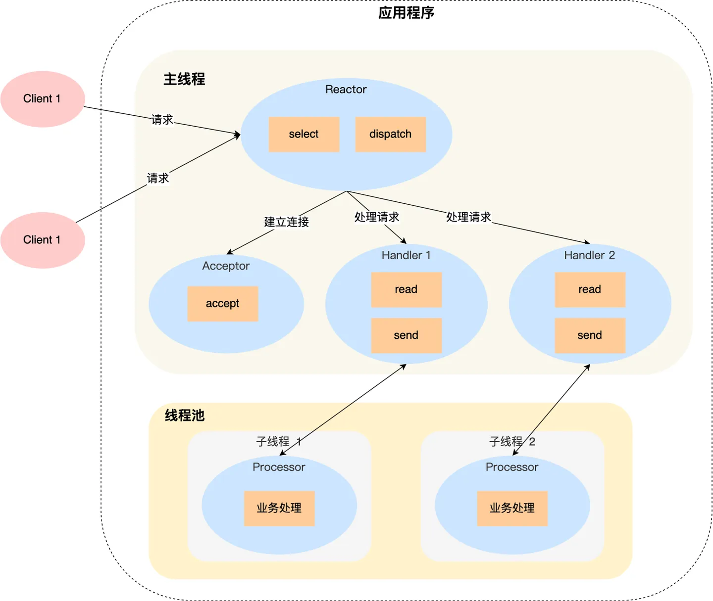

# reactor模式
但是引入了线程池，那么一个线程要处理多个连接的业务，线程在处理某个连接的 read 操作时，如果遇到没有数据可读，就会发生阻塞，那么线程就没办法继续处理其他连接的业务。要解决这一个问题，最简单的方式就是将 socket 改成非阻塞，然后线程不断地轮询调用 read 操作来判断是否有数据，这种方式虽然该能够解决阻塞的问题，但是解决的方式比较粗暴，因为轮询是要消耗 CPU 的，而且随着一个 线程处理的连接越多，轮询的效率就会越低。

I/O 多路复用技术会用一个系统调用函数来监听我们所有关心的连接，也就说可以在一个监控线程里面监控很多的连接。用过 I/O 多路复用接口写网络程序的同学，肯定知道是面向过程的方式写代码的，这样的开发的效率不高。大佬们基于面向对象的思想，对 I/O 多路复用作了一层封装，让使用者不用考虑底层网络 API 的细节，只需要关注应用代码的编写。

Reactor 翻译过来的意思是「反应堆」这里的反应指的是「对事件反应」，也就是来了一个事件，Reactor 就有相对应的反应/响应。事实上，Reactor 模式也叫 Dispatcher 模式，我觉得这个名字更贴合该模式的含义，即 I/O 多路复用监听事件，收到事件后，根据事件类型分配（Dispatch）给某个进程 / 线程。

* 单 Reactor 单进程 / 线程；因为只有一个进程，无法充分利用 多核 CPU 的性能；单 Reactor 单进程的方案不适用计算机密集型的场景，只适用于业务处理非常快速的场景。Redis 是由 C 语言实现的，它采用的正是「单 Reactor 单进程」的方案，因为 Redis 业务处理主要是在内存中完成，操作的速度是很快的，性能瓶颈不在 CPU 上，所以 Redis 对于命令的处理是单进程的方案。
* 单 Reactor 多线程 / 进程；
* 多 Reactor 多进程 / 线程；

## 单reactor多线程


「单 Reactor」的模式还有个问题，因为一个 Reactor 对象承担所有事件的监听和响应，而且只在主线程中运行，在面对瞬间高并发的场景时，容易成为性能的瓶颈的地方。


## 多 Reactor 多进程 / 线程


多 Reactor 多线程的方案虽然看起来复杂的，但是实际实现时比单 Reactor 多线程的方案要简单的多，原因如下：
* 主线程和子线程分工明确，主线程只负责接收新连接，子线程负责完成后续的业务处理。
* 主线程和子线程的交互很简单，主线程只需要把新连接传给子线程，子线程无须返回数据，直接就可以在子线程将处理结果发送给客户端。

采用了「多 Reactor 多进程」方案的开源软件是 Nginx，不过方案与标准的多 Reactor 多进程有些差异。具体差异表现在主进程中仅仅用来初始化 socket，并没有创建 mainReactor 来 accept 连接，而是由子进程的 Reactor 来 accept 连接，通过锁来控制一次只有一个子进程进行 accept（防止出现惊群现象），子进程 accept 新连接后就放到自己的 Reactor 进行处理，不会再分配给其他子进程。


# Proactor

前面提到的 Reactor 是非阻塞同步网络模式，而 Proactor 是异步网络模式。


真正的异步，用户进程调用read立即返回非阻塞，而后等到数据拷贝完毕，内核通知用户继续该处理，期间用户进程可以处理其他事件。

* Reactor 是非阻塞同步网络模式，感知的是就绪可读写事件。在每次感知到有事件发生（比如可读就绪事件）后，就需要应用进程主动调用 read 方法来完成数据的读取，也就是要应用进程主动将 socket 接收缓存中的数据读到应用进程内存中，这个过程是同步的，读取完数据后应用进程才能处理数据。
* Proactor 是异步网络模式， 感知的是已完成的读写事件。在发起异步读写请求时，需要传入数据缓冲区的地址（用来存放结果数据）等信息，这样系统内核才可以自动帮我们把数据的读写工作完成，这里的读写工作全程由操作系统来做，并不需要像 Reactor 那样还需要应用进程主动发起 read/write 来读写数据，操作系统完成读写工作后，就会通知应用进程直接处理数据。

因此，Reactor 可以理解为「来了事件操作系统通知应用进程，让应用进程来处理」，而 Proactor 可以理解为「来了事件操作系统来处理，处理完再通知应用进程」。这里的「事件」就是有新连接、有数据可读、有数据可写的这些 I/O 事件这里的「处理」包含从驱动读取到内核以及从内核读取到用户空间。


介绍一下 Proactor 模式的工作流程：
* Proactor Initiator 负责创建 Proactor 和 Handler 对象，并将 Proactor 和 Handler 都通过 Asynchronous Operation Processor 注册到内核
* Asynchronous Operation Processor 负责处理注册请求，并处理 I/O 操作；
* Asynchronous Operation Processor 完成 I/O 操作后通知 Proactor；
* Proactor 根据不同的事件类型回调不同的 Handler 进行业务处理；Handler 完成业务处理；


# std::function
std::function是一个函数包装器，该函数包装器模板能包装任何类型的可调用实体，如普通函数，函数对象，lamda表达式等。包装器可拷贝，移动等，并且包装器类型仅仅依赖于调用特征，而不依赖于可调用元素自身的类型。std::function是C++11的新特性，包含在头文件<functional>中。

一个std::function类型对象实例可以包装下列这几种可调用实体：函数、函数指针、成员函数、静态函数、lamda表达式和函数对象。std::function对象实例可被拷贝和移动，并且可以使用指定的调用特征来直接调用目标元素。当std::function对象实例未包含任何实际可调用实体时，调用该std::function对象实例将抛出std::bad_function_call异常。

对C语言熟悉的同学应该都知道，C语言中有一种高级技巧叫作函数指针，我们可以让函数指针指向参数类型相同、返回值类型也相同的函数。通过函数指针我们也可以实现C++中的多态。我们来看个例子：

```c++
#include<iostream>
typedef int (*func)();

int print1(){
    printf("hello, print1 \n");
    return 0;
}

int print2(){
    printf("hello, print2 \n");
    return 0;
}

int main(int argc, char * argv[]){
    func fp = print1;  //等价于int (*fp)() = print1;
    fp();

    fp = print2;
    fp();

    return 0;
}
```

```c++
//函数指针的定义方法
bool (*fp)(const string&, const string&);  //定义了函数没初始化而已
bool lengthCompare(...){..}
//函数指针的使用
fp = lengthCompare;   //直接使用函数名不带括号就是函数自动转化为函数的指针，该行即为将函数的指针赋值给fp了。
//关键在于两函数的返回值要是一样的
fp = &lengthCompare  //和上面是同样的意思，&不是必须加
```

那在C++中是否也类似这样的功能呢？没错function就是完成这个任务的。但std::function比C的函数指针功能更强大些或者说更适合C++中使用。下面我们来看一下如何在C++中使用std::function实现指向不同的函数吧。代码如下：

```c++
void print1(){
    std::cout << "hello, print1" << std::endl;
}

void print2(){
    std::cout << "hello, print2" << std::endl;
}

int main(int argc, char *argv[])
{
    std::function<void()> func(&print1); //void表示返回类型为函数指针，func表示类创建的实例名称，
    func();

    func = &print2;
    func();

    return 0;
}
```

# day7关键问题：为什么accepter的回调函数不在accepter类内部定义而在server上定义
新建连接的逻辑就在Acceptor类中。但逻辑上新socket建立后就和之前监听的服务器socket没有任何关系了，所以新的TCP连接应该由Server类来创建并管理生命周期，而不是Acceptor。

观察回调函数中建立新连接的内容：
```c++
void Server::newConnection(Socket *serv_sock){
    InetAddress *clnt_addr = new InetAddress();      //会发生内存泄露！没有delete
    Socket *clnt_sock = new Socket(serv_sock->accept(clnt_addr));       //会发生内存泄露！没有delete
    printf("new client fd %d! IP: %s Port: %d\n", clnt_sock->getFd(), inet_ntoa(clnt_addr->addr.sin_addr), ntohs(clnt_addr->addr.sin_port));
    clnt_sock->setnonblocking();
    Channel *clntChannel = new Channel(loop, clnt_sock->getFd());
    std::function<void()> cb = std::bind(&Server::handleReadEvent, this, clnt_sock->getFd());
    clntChannel->setCallback(cb);
    clntChannel->enableReading();
}
```

new出来的对象应当由server管理生命周期，即便accept不再listen，这些连接服务应当继续存在。

# 关于回调函数
Channel回调函数是在循环等待事件发生时调用的，Accepter的中servchannel的回调函数写在accepter内部，作用为接收new clinet，而Accepter自身也有回调函数，是创建新的Connector，生命周期跟着Server对象走。


# 锁的类型
* 互斥锁（mutex）
```c++
void lock();

锁定互斥锁，若另一线程已锁定互斥锁，则到 lock 的调用将阻塞执行，直至获得锁。

bool try_lock();

尝试锁定互斥锁，成功上锁返回true，若另一线程已锁定互斥锁，则返回false ，不会阻塞

void unlock();

解锁互斥锁。
```

* 定时互斥锁（timed_mutex）
相对于mutex而言，timed_mutex增加了try_lock_for和try_lock_until两个接口，前者在尝试获取锁失败时会等待指定时间，在此期间会不断尝试获取锁；后者会获取锁失败时会等待至指定时刻。如果忽视这两个接口，那么timed_mutex与mutex无异。

* 条件变量 （condition_variable）
```c++
void wait( std::unique_lock<std::mutex>& lock );

等待并阻塞线程，直到别的线程进行通知，wait( )会释放lock。

template< class Predicate >
void wait( std::unique_lock<std::mutex>& lock, Predicate pred );

pred是一个lambda函数，返回值为bool，此时的wait等价于

while (!pred()) {
    wait(lock);
}
wait_for(time)    函数原型太长了，就没有全写出来，wait_until也是。

最多等待time时间，就解除阻塞。

wait_until(time)

最多等待至time时刻，就解除阻塞。

void notify_one( ) noexcept;

通知一个正在wait的线程

void notify_all( ) noexcept;

通知所有正在wait的线程
```
条件变量的作用是用于多线程之间的线程同步。线程同步是指线程间需要按照预定的先后顺序进行的行为，比如我想要线程1完成了某个步骤之后，才允许线程2开始工作，这个时候就可以使用条件变量来达到目的。具体操作就可以是，线程2调用wait函数进行等待，线程1调用notify函数进行通知，这样就能保证线程1和线程2的顺序。

* 读写锁 （shared_mutex）
```c++
<shared_mutex>
接口	
void lock();

排他式锁定互斥。若另一线程已锁定互斥，则到 lock 的调用将阻塞执行，直至获得锁。这里说的“另一线程已锁定互斥”，不仅可能是别的线程提前调用了lock，也可能是别的线程提前调用了shared_lock函数，这也是shared_mutex特殊的地方，有两种上锁方式。

bool try_lock();

尝试排他式锁定互斥。立即返回，成功获得锁时返回 true ，否则返回 false 。

void unlock();

解锁排他式互斥。

void lock_shared();

以共享式锁定互斥。如果另一线程以排他式锁定互斥，则会阻塞，直到获得锁；如果另一线程或者多个线程以共享式锁定了互斥，则调用者同样会获得锁。

bool try_lock_shared();

尝试共享式锁定互斥。立即返回，成功获得锁时返回 true ，否则返回 false 。

void unlock_shared();

解锁共享互斥。
```
shared_mutex有两种上锁方式，一种是排他式，另一种是共享式。排他式上锁同一时间只允许一个线程拥有锁，共享式上锁允许多个线程拥有锁。对于一个线程写，多个线程读的场景，mutex的效率很低。因为不仅读与写之间要加锁，读与读之间也要加锁，但是读与读之间的加锁是不必要的，毕竟它不会改变数据，于是就产生了可以同时读的需求。

* 递归锁（recursive_mutex）
```c++
void lock();

锁定互斥。若另一线程已锁定互斥，则到lock的调用将阻塞执行，直至获得锁。在同一线程中，可以多次调用lock，不会造成死锁，但是要调用相应次数的unlock。

bool try_lock();

尝试锁定互斥。立即返回。成功获得锁时返回 true ，否则返回 false 。

void unlock();

解锁互斥。要与lock调用的次数一致才能完成解锁。
```
想象这样一个场景，函数A调用了函数B，而且函数A和B都访问了一份共享数据，这样就可能造成死锁。


## RAII锁
RAII全称是Resource Acquisition Is Initialization，翻译过来是资源获取即初始化，RAII机制用于管理资源的申请和释放。对于资源，我们通常经历三个过程，申请，使用，释放，这里的资源不仅仅是内存，也可以是文件、socket、锁等等。但是我们往往只关注资源的申请和使用，而忘了释放，这不仅会导致内存泄漏，可能还会导致业务逻辑的错误。c++之父给出了解决问题的方案：RAII，它充分的利用了C++语言局部对象自动销毁的特性来控制资源的生命周期。

简而言之就是，将资源（内存、socket、锁等等）与一个局部变量绑定，这样就可以避免我们忘记释放资源，智能指针也是这样的思想。RAII锁本质上都是模板类，模板类型是这种锁，也可以理解为对锁的进一步封装。

* lock_guard
```c++
template< class Mutex >
class lock_guard;

构造函数	
explicit lock_guard( mutex_type& m );

等于调用 m.lock() 。

析构函数	
~lock_guard();

等效地调用 m.unlock()
```
lock_guard的构造函数需要传入一个锁，我们称这个锁为**关联锁**，然后在构造函数内部进行加锁，在析构函数中进行解锁。

(1) 创建即加锁，作用域结束自动析构并解锁，无需手工解锁

(2) 不能中途解锁，必须等作用域结束才解锁

(3) 不能复制

 ```c++
mutex mt;
void thread_task()
{
    for (int i = 0; i < 10; i++)
    {
        lock_guard<mutex> guard(mt);
        cout << "print thread: " << i << endl;
    }
}
 
int main()
{
    thread t(thread_task);
    for (int i = 0; i > -10; i--)
    {
        lock_guard<mutex> guard(mt);
        cout << "print main: " << i << endl;
    }
    t.join();
    return 0;
}
 ```

 这里说析构函数里解锁，那么到底什么时候调用析构函数呢？构造函数加锁我们好理解，写下这个语句的时候调用lock_guard<mutex> guard(mt)，那么调用析构函数应该是大括号{}结束的时候，也就是说定义lock_guard的时候调用构造函数加锁，大括号解锁的时候调用析构函数解锁。

虽然lock_guard挺好用的，但是有个很大的缺陷，在定义lock_guard的地方会调用构造函数加锁，在离开定义域的话lock_guard就会被销毁，调用析构函数解锁。这就产生了一个问题，如果这个定义域范围很大的话，那么锁的粒度就很大，很大程序上会影响效率。所以为了解决lock_guard锁的粒度过大的原因，unique_lock就出现了。


* unique_lock

unique_lock是lock_guard的加强版，首先在构造函数中可以选择是否与锁关联，以及对锁的操作类型；其次它还可以像锁一样调用lock()，try_lock()，unlock()等函数，这使得unique_lock更加灵活；最后它增加了swap，release，owns_lock这些非常实用的接口。


# day10加入线程池
原代码最大的区别就在于，reactor循环等待事件返回channel时，Channel调用callback是将callack加入线程池，调用线程池的成员函数。线程池类中的成员：
```c++
    std::vector<std::thread> threads;  //线程数组
    std::queue<std::function<void()>> tasks;  //任务队列
    std::mutex tasks_mtx;   //互斥锁和条件变量
    std::condition_variable cv;
    bool stop;
```
